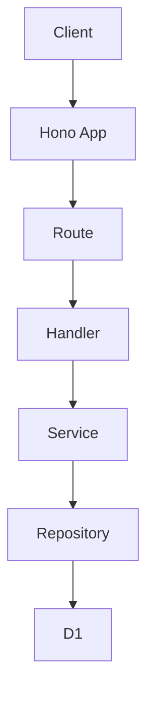
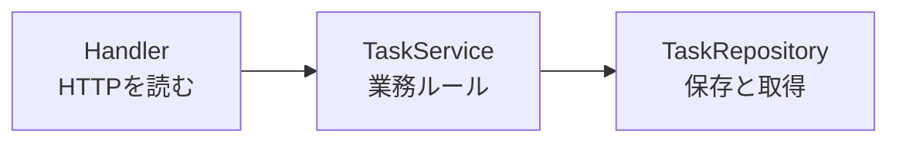
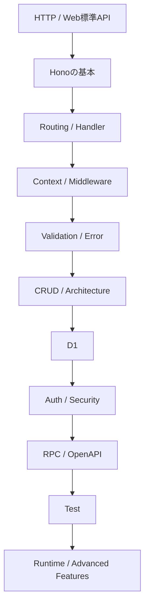

ここまで、HonoでWeb APIを作るための要素を一つずつ学んできました。

Routing、Request、Response、Context、Middleware、Validation、D1、認証、Hono RPC、OpenAPI、テスト、マルチランタイム。別々に見ると、どれも小さな部品です。最後の章では、それらをひとつのタスク管理APIとしてつなぎ直します。

この章での「完成」は、どこかへ公開することではありません。ローカルで起動でき、テストでき、仕様を確認でき、コードの責務を説明できる状態にすることです。

## 完成の条件

まず、この本で目指す完成条件を決めます。

| 分類 | 完成条件 |
|---|---|
| API | タスクの作成、取得、更新、削除ができる |
| 認証 | ユーザー登録、ログイン、JWT認証ができる |
| 認可 | 自分のタスクだけ操作できる |
| 入力値検証 | ZodでRequestを検証し、失敗時の形がそろっている |
| エラー | API全体で共通のエラーレスポンスを返す |
| データ保存 | D1にユーザーとタスクを保存する |
| 型 | Hono RPC / Hono Clientで型を共有できる |
| 仕様 | OpenAPI JSONとドキュメントを確認できる |
| テスト | Handler、Service、Repositoryの主要な振る舞いを検証できる |
| 設計 | Handler、Service、Repositoryの責務が分かれている |

この表を見て分かる通り、完成とは機能の数だけでは決まりません。壊れにくさ、読みやすさ、検証しやすさも完成度の一部です。

## 最終的なエンドポイント

最終的なAPIは、次のエンドポイントを持ちます。

| 分類 | メソッド | パス | 役割 |
|---|---:|---|---|
| Health | GET | `/health` | APIが動作しているか確認する |
| Auth | POST | `/auth/register` | ユーザーを登録する |
| Auth | POST | `/auth/login` | ログインしてJWTを取得する |
| User | GET | `/me` | ログイン中のユーザー情報を取得する |
| Task | GET | `/tasks` | タスク一覧を取得する |
| Task | POST | `/tasks` | タスクを作成する |
| Task | GET | `/tasks/:id` | タスク詳細を取得する |
| Task | PATCH | `/tasks/:id` | タスクを更新する |
| Task | DELETE | `/tasks/:id` | タスクを削除する |
| Spec | GET | `/openapi.json` | OpenAPI仕様を返す |
| Docs | GET | `/docs` | APIドキュメントを表示する |

APIの形はシンプルです。だからこそ、設計の良し悪しが見えやすくなります。

## ディレクトリ構成

完成形の構成は、次のようにします。

```text
hono-task-api/
├─ src/
│  ├─ index.ts
│  ├─ app.ts
│  ├─ config.ts
│  ├─ errors.ts
│  ├─ middleware/
│  │  ├─ auth.ts
│  │  └─ request-id.ts
│  ├─ routes/
│  │  ├─ auth.ts
│  │  ├─ me.ts
│  │  └─ tasks.ts
│  ├─ schemas/
│  │  ├─ auth.ts
│  │  └─ task.ts
│  ├─ services/
│  │  ├─ auth-service.ts
│  │  └─ task-service.ts
│  ├─ repositories/
│  │  ├─ task-repository.ts
│  │  └─ user-repository.ts
│  └─ testing/
│     ├─ create-test-app.ts
│     └─ fakes.ts
├─ migrations/
│  └─ 0001_initial.sql
├─ test/
│  ├─ auth.test.ts
│  ├─ tasks.test.ts
│  └─ task-service.test.ts
├─ package.json
├─ tsconfig.json
├─ vitest.config.ts
└─ wrangler.jsonc
```

この構成では、Honoに直接関係する処理と、業務ルールやデータ保存の処理を分けています。



HandlerはHTTPの入口です。Serviceは業務ルールです。Repositoryはデータ保存です。この3つを混ぜないことが、完成形の一番大事な設計です。

## Appを作る場所

API全体の入口は`src/app.ts`に集めます。

ここでは、共通Middleware、エラー処理、ルート登録、OpenAPI設定をまとめます。

```ts:src/app.ts
import { OpenAPIHono } from '@hono/zod-openapi';
import { HTTPException } from 'hono/http-exception';
import { ZodError } from 'zod';
import { createAuthRoutes } from './routes/auth';
import { createMeRoutes } from './routes/me';
import { createTaskRoutes } from './routes/tasks';
import { createErrorResponse } from './errors';

type Bindings = {
  DB: D1Database;
  JWT_SECRET: string;
};

type Variables = {
  user: {
    id: string;
    email: string;
    role: 'user' | 'admin';
  };
};

export type AppEnv = {
  Bindings: Bindings;
  Variables: Variables;
};

export const createApp = () => {
  const app = new OpenAPIHono<AppEnv>({
    defaultHook: (result, c) => {
      if (result.success) {
        return;
      }

      return c.json(
        createErrorResponse('VALIDATION_ERROR', '入力値が正しくありません', {
          issues: result.error.issues,
        }),
        422,
      );
    },
  });

  app.onError((error, c) => {
    if (error instanceof HTTPException) {
      return c.json(
        createErrorResponse('HTTP_ERROR', error.message),
        error.status,
      );
    }

    if (error instanceof ZodError) {
      return c.json(
        createErrorResponse('VALIDATION_ERROR', '入力値が正しくありません', {
          issues: error.issues,
        }),
        422,
      );
    }

    console.error(error);

    return c.json(
      createErrorResponse('INTERNAL_SERVER_ERROR', '予期しないエラーが発生しました'),
      500,
    );
  });

  app.get('/health', (c) => {
    return c.json({ ok: true });
  });

  app.route('/auth', createAuthRoutes());
  app.route('/me', createMeRoutes());
  app.route('/tasks', createTaskRoutes());

  app.doc('/openapi.json', {
    openapi: '3.0.0',
    info: {
      title: 'Hono Task API',
      version: '1.0.0',
    },
  });

  return app;
};

export type AppType = ReturnType<typeof createApp>;
```

`createApp()`にまとめている理由は、テストで同じアプリケーションを作れるようにするためです。

```ts:src/index.ts
import { createApp } from './app';

export default createApp();
```

`src/index.ts`は薄く保ちます。アプリケーションの中身は`src/app.ts`に寄せます。

## エラーレスポンスを統一する

エラー形式は、APIの使いやすさに直結します。

完成形では、次の形にそろえます。

```json
{
  "error": {
    "code": "VALIDATION_ERROR",
    "message": "入力値が正しくありません",
    "details": {
      "issues": []
    }
  }
}
```

実装は小さな関数にしておきます。

```ts:src/errors.ts
export type ErrorCode =
  | 'VALIDATION_ERROR'
  | 'UNAUTHORIZED'
  | 'FORBIDDEN'
  | 'NOT_FOUND'
  | 'CONFLICT'
  | 'HTTP_ERROR'
  | 'INTERNAL_SERVER_ERROR';

export const createErrorResponse = (
  code: ErrorCode,
  message: string,
  details?: unknown,
) => {
  return {
    error: {
      code,
      message,
      ...(details === undefined ? {} : { details }),
    },
  };
};
```

この形にしておくと、クライアント側は`error.code`を見て分岐できます。人間向けの文言は`message`に置き、機械的な判定は`code`で行います。

## OpenAPIのルートを登録する

OpenAPIを使うルートは、`createRoute()`で定義し、`app.openapi()`で登録します。

```ts:src/routes/tasks.ts
import { OpenAPIHono, createRoute } from '@hono/zod-openapi';
import { z } from 'zod';
import type { AppEnv } from '../app';
import { createTaskSchema, taskSchema } from '../schemas/task';

const createTaskRoute = createRoute({
  method: 'post',
  path: '/',
  request: {
    body: {
      content: {
        'application/json': {
          schema: createTaskSchema,
        },
      },
    },
  },
  responses: {
    201: {
      description: 'Created task',
      content: {
        'application/json': {
          schema: taskSchema,
        },
      },
    },
    422: {
      description: 'Validation error',
    },
  },
});

export const createTaskRoutes = () => {
  const app = new OpenAPIHono<AppEnv>();

  app.openapi(createTaskRoute, async (c) => {
    const input = c.req.valid('json');

    const task = {
      id: crypto.randomUUID(),
      title: input.title,
      completed: false,
      createdAt: new Date().toISOString(),
      updatedAt: new Date().toISOString(),
    };

    return c.json(task, 201);
  });

  return app;
};
```

重要なのは、ルート定義とHandlerを対応させることです。`createRoute()`だけを書いても、APIとして動くわけではありません。`app.openapi(route, handler)`で登録して初めて、実際のルートになります。

## ServiceとRepositoryを確認する

Handlerに業務ルールを書きすぎると、テストが重くなります。

タスク作成の例で、責務を分けて考えます。



Serviceは、HTTPを知りません。RepositoryのInterfaceを通してデータを扱います。

```ts:src/services/task-service.ts
type TaskRepository = {
  create: (input: {
    userId: string;
    title: string;
  }) => Promise<Task>;
};

export const createTaskService = (repo: TaskRepository) => {
  return {
    createTask: async (input: { userId: string; title: string }) => {
      const title = input.title.trim();

      if (title.length === 0) {
        throw new Error('Title is required');
      }

      return repo.create({
        userId: input.userId,
        title,
      });
    },
  };
};
```

この例では短く書いていますが、実際には独自のエラー型やResult型を使って、HandlerでHTTPステータスに変換するとさらに扱いやすくなります。

## D1とマイグレーションを確認する

D1のテーブルは、マイグレーションで管理します。

```sql:migrations/0001_initial.sql
CREATE TABLE users (
  id TEXT PRIMARY KEY,
  email TEXT NOT NULL UNIQUE,
  password_hash TEXT NOT NULL,
  role TEXT NOT NULL DEFAULT 'user',
  created_at TEXT NOT NULL
);

CREATE TABLE tasks (
  id TEXT PRIMARY KEY,
  user_id TEXT NOT NULL,
  title TEXT NOT NULL,
  completed INTEGER NOT NULL DEFAULT 0,
  created_at TEXT NOT NULL,
  updated_at TEXT NOT NULL,
  FOREIGN KEY (user_id) REFERENCES users(id)
);

CREATE INDEX idx_tasks_user_id ON tasks(user_id);
CREATE INDEX idx_tasks_user_id_created_at ON tasks(user_id, created_at);
```

ローカルでは、次のようにマイグレーションを適用します。

```sh
npx wrangler d1 migrations apply hono-task-api-db --local
```

この本では、ローカルD1で動作確認できる状態を完成条件にします。D1を使う章で学んだ通り、データベースの構造はコードと同じくらい大切です。

## 認証と認可を確認する

認証は「誰か」を確認する処理です。認可は「その人が操作してよいか」を確認する処理です。

本書のAPIでは、JWTを使ってユーザーを識別します。そのうえで、タスク操作では`user_id`を必ず条件に含めます。

```ts
const task = await taskRepository.findById({
  id: taskId,
  userId: user.id,
});

if (!task) {
  return c.json(
    createErrorResponse('NOT_FOUND', 'タスクが見つかりません'),
    404,
  );
}
```

ここで大切なのは、`id`だけで取得しないことです。

```ts
// 避けたい例
const task = await taskRepository.findById(taskId);
```

`taskId`だけで取得すると、他のユーザーのタスクにアクセスできる余地が生まれます。自分のデータだけを扱うAPIでは、Repositoryの段階で`userId`を条件に含めます。

## テストを完成させる

完成形では、少なくとも次のテストを用意します。

| 種類 | 確認すること |
|---|---|
| Service Test | 業務ルールがHTTPなしで動く |
| Handler Test | `app.request()`でルートの振る舞いを確認する |
| Validation Test | 不正な入力で422が返る |
| Auth Test | 未認証なら401になる |
| Repository Test | D1への保存と取得ができる |

Service Testでは、Fake Repositoryを使えます。

```ts:test/task-service.test.ts
import { describe, expect, it } from 'vitest';
import { createTaskService } from '../src/services/task-service';

describe('TaskService', () => {
  it('trims title before creating task', async () => {
    const repo = {
      create: async (input: { userId: string; title: string }) => ({
        id: 'task-1',
        completed: false,
        createdAt: '2026-01-01T00:00:00.000Z',
        updatedAt: '2026-01-01T00:00:00.000Z',
        ...input,
      }),
    };

    const service = createTaskService(repo);
    const task = await service.createTask({
      userId: 'user-1',
      title: '  Learn Hono  ',
    });

    expect(task.title).toBe('Learn Hono');
  });
});
```

Handler Testでは、Honoの`app.request()`を使います。

```ts:test/health.test.ts
import { describe, expect, it } from 'vitest';
import { createApp } from '../src/app';

describe('GET /health', () => {
  it('returns ok', async () => {
    const app = createApp();

    const res = await app.request('/health');
    const body = await res.json();

    expect(res.status).toBe(200);
    expect(body).toEqual({ ok: true });
  });
});
```

D1を使うRepository Testでは、`@cloudflare/vitest-pool-workers`を使ってWorkersに近い環境で確認します。第22章で扱った通り、Service TestとRepository Testを分けることで、速いテストと環境に近いテストを両立できます。

## OpenAPIとHono RPCを確認する

OpenAPIとHono RPCは、似た目的を持っていますが、役割が違います。

| 仕組み | 主な目的 |
|---|---|
| Hono RPC | TypeScript同士で型安全に呼び出す |
| OpenAPI | 言語を問わずAPI仕様を共有する |

Hono RPCでは、サーバー側の型をクライアントへ渡します。

```ts
import { hc } from 'hono/client';
import type { AppType } from '../src/app';

const client = hc<AppType>('http://localhost:8787');

const res = await client.health.$get();
```

OpenAPIでは、`/openapi.json`を見ればAPI仕様を確認できます。

```sh
curl http://localhost:8787/openapi.json
```

どちらか一方だけが正解ではありません。TypeScriptのアプリケーション同士ならHono RPCが便利です。外部ツールや他言語のクライアントと共有するならOpenAPIが向いています。

## ローカルで完成確認する

最後に、ローカルで完成状態を確認します。

```sh
npm install
npx wrangler d1 migrations apply hono-task-api-db --local
npm run dev
```

別のターミナルで、ヘルスチェックを確認します。

```sh
curl http://localhost:8787/health
```

ユーザー登録、ログイン、タスク作成も確認します。

```sh
curl -X POST http://localhost:8787/auth/register \
  -H "Content-Type: application/json" \
  -d '{"email":"alice@example.com","password":"Str0ng-example-password!"}'
```

ログインでJWTを取得します。

```sh
curl -X POST http://localhost:8787/auth/login \
  -H "Content-Type: application/json" \
  -d '{"email":"alice@example.com","password":"Str0ng-example-password!"}'
```

取得したトークンを使ってタスクを作ります。

```sh
curl -X POST http://localhost:8787/tasks \
  -H "Content-Type: application/json" \
  -H "Authorization: Bearer <TOKEN>" \
  -d '{"title":"Learn Hono"}'
```

最後にテストを実行します。

```sh
npm test
```

この一連の確認が通るなら、学習用APIとしては十分に完成しています。

## 最終チェックリスト

完成前に、次の表を確認します。

| 観点 | 確認 |
|---|---|
| Routing | ルートが用途ごとに分かれている |
| Validation | 不正な入力で422を返す |
| Error | エラー形式が統一されている |
| Auth | 未認証で保護ルートへ入れない |
| Authorization | 他ユーザーのタスクを操作できない |
| D1 | マイグレーションでテーブルを再現できる |
| Service | 業務ルールがHandlerから分離されている |
| Repository | D1アクセスがRepositoryに閉じている |
| OpenAPI | `/openapi.json`で仕様を確認できる |
| Test | 主要な正常系と異常系をテストしている |
| Runtime | ランタイム固有の処理が入口やInfrastructureに寄っている |

このチェックリストは、次に自分でAPIを作るときにも使えます。

## 改善できる設計

本書のタスク管理APIは、学習用としては完成しています。

ただし、実際のサービスに近づけるなら、まだ改善できる点があります。

- パスワード保存を専用ライブラリや外部認証基盤へ寄せる
- Refresh Tokenを導入する
- Rate Limitを入れる
- 監査ログを設計する
- タスクの共有やチーム機能を追加する
- OpenAPIからクライアントを生成する
- Repositoryのテストデータ作成をFactory化する
- ページネーションをCursor方式にする

ここで全部を入れないのは、手抜きではありません。教科書として大事なのは、どこまでが基本で、どこからが拡張なのかを見分けられることです。

## 本書で学んだこと

最後に、本書全体を振り返ります。



Honoは薄いフレームワークです。薄いからこそ、HTTPやWeb標準APIの考え方がそのまま見えます。

一方で、薄いフレームワークは、アプリケーション全体の設計まで自動で決めてくれるわけではありません。エラー形式、認証、認可、Service、Repository、テストの作り方は、自分たちで決める必要があります。

この本では、その判断をひとつずつ扱いました。

## まとめ

この章では、タスク管理APIを完成形として見直しました。

- 完成条件を、機能だけでなく検証しやすさまで含めて定義しました。
- Handler、Service、Repositoryの責務を整理しました。
- D1、認証、認可、OpenAPI、Hono RPC、テストを一本につなぎました。
- ローカルで起動し、仕様とテストを確認できる状態を完成としました。
- 次に改善できる余地も整理しました。

ここまで読めば、Honoで小さなAPIを作るだけでなく、育てられるAPIとして設計するための土台ができています。

次に別のAPIを作るときも、最初から全部を入れる必要はありません。小さく始め、責務を分け、型とテストで支え、必要になったところを深めていけば大丈夫です。
