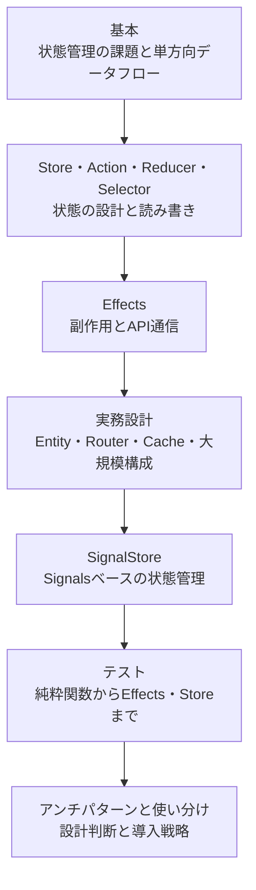
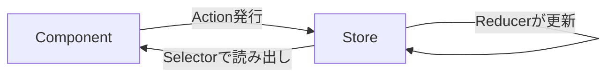
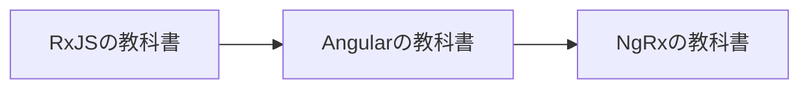

本書は、NgRxを使ってAngularアプリケーションの状態管理を設計できるようになるための教科書です。

状態管理は、アプリケーションが大きくなるほど難しくなります。どこにデータを持たせるか、いつ更新するか、変更をどう追跡するか。こうした判断を場当たり的に続けると、状態がいたるところに散らばり、バグの原因を追えなくなります。

NgRxは、この難しさに「単方向データフロー」という一貫した型で立ち向かうライブラリです。本書では、NgRxのAPIを覚えることより、状態をどう設計し、どの手法を選ぶかという判断ができるようになることを目指します。

## 本書で目指すもの

本書の目的は、NgRxのAPIを暗記することではありません。予測可能な状態管理を、自分で設計できるようになることです。

そのために、次の3つを軸にして進めます。

- **状態を設計する**: 何を状態として持ち、何を持たないかを判断できるようにします。派生値をSelectorに任せ、状態そのものは小さく正規化された形に保つ考え方を身につけます。
- **単方向データフローで予測可能にする**: Action、Reducer、Selector、Effectsがどう連携し、なぜ変更が追いやすくなるのかを、仕組みから理解します。
- **手法を使い分ける**: NgRxには複数の道具があります。Classic Store、SignalStore、ComponentStore、そしてNgRxを使わないという選択まで、状況に応じて選べるようにします。

NgRxは、小さなアプリには重すぎることもある道具です。だからこそ、いつ導入し、どこまで使うかの判断が重要になります。本書では、その判断の根拠も一緒に扱います。

## 対象読者

本書は、次のような読者を想定しています。

- Angularでアプリケーションを作っていて、状態管理に悩んでいる人
- コンポーネント間の状態共有が複雑になり、整理したい人
- NgRxを雰囲気で使っていて、設計の判断基準がほしい人
- Classic StoreとSignalStoreの使い分けを知りたい人

Angularの基本は前提とします。Component、Service、依存性の注入、Signalsを使ったことがあれば読み進められます。

RxJSの知識も前提にします。Observable、`subscribe`、`map`や`switchMap`といったOperatorがわかっている必要があります。とくにEffectsの章では、Flattening Operatorの選択が中心になります。RxJSに不安があれば、シリーズの『RxJSの教科書』を先に読むことをおすすめします。

## 本書の構成

本書は、次の7つの段階を順番に進みます。前半で単方向データフローの仕組みを固め、後半で実務設計・SignalStore・テスト・使い分けへと広げていきます。



各段階で扱う章は次のとおりです。

| 段階 | 扱う内容 |
|---|---|
| 基本 | 「状態管理はなぜ複雑になるのか」「NgRxと単方向データフロー」「NgRxプロジェクトをセットアップする」 |
| 状態の設計と読み書き | 「Stateを設計する」「Actionをイベントとして設計する」「Reducerとイミュータブルな状態更新」「Feature StoreとcreateFeature」「Selectorとメモ化」「Selectorを組み合わせてViewModelを作る」 |
| Effects | 「Effectsの基本」「API通信とFlattening Operatorの選択」「Effectのエラー・キャンセル・状態参照」 |
| 実務設計 | 「Entityによるコレクション管理」「Router Store・Devtools・Meta-Reducer」「Loading・Error・Cacheを設計する」「大規模アプリケーションの構成」 |
| SignalStore | 「SignalStoreの基本」「SignalStoreの非同期処理と拡張」「ComponentStoreとSignalStoreへの移行」 |
| テスト | 「ReducerとSelectorをテストする」「Effects・Component・SignalStoreをテストする」 |
| アンチパターンと使い分け | 「NgRxのアンチパターン」「状態管理手法の使い分けと導入戦略」 |

前半の「基本」と「状態の設計と読み書き」は、NgRxの中心です。ここで単方向データフローが体に入ると、後半の応用が理解しやすくなります。巻末には、APIの早見表、設計のチェックリスト、用語集を付録として用意しています。

## 本書で扱う題材

説明がばらばらにならないよう、本書では1つの題材を通して使います。タスク管理アプリケーションの状態です。

このアプリは、次のような状態を持ちます。

- タスクの一覧
- 表示するタスクの絞り込み条件（すべて・未完了・完了）
- データの読み込み中かどうか
- 通信でエラーが起きたかどうか
- 選択中のタスク

小さな題材ですが、状態管理で悩むポイントがひととおり含まれています。一覧をどう持つか、絞り込みをどう表すか、読み込み状態をどこに置くか。章が進むにつれて、この状態をActionで更新し、Selectorで読み出し、Effectsでサーバーと同期し、Entityで整理していきます。同じ題材が育っていく様子を追うと、部品がどう組み合わさるのかが見えてきます。

## サンプルコードの前提

本書のサンプルコードは、次を前提とします。

- **Angular v22世代**（Standalone API、Signalsが標準）
- **現行の安定版NgRx**（`@ngrx/store`、`@ngrx/effects`、`@ngrx/entity`、`@ngrx/signals` など）
- **TypeScript**（strictモード）

NgRxのモジュールは、機能ごとにパッケージが分かれています。必要なものを、扱う章で導入します。

状態を読み出すときは、`store.select`が返すObservableだけでなく、Signalとして受け取る`store.selectSignal`も使います。Angularの現行世代がSignalsを標準とするため、本書もSignalを主に使い、Observableが必要な場面で使い分けます。

## コードと図の読み方

本書では、文章だけでなく、図とコードで説明します。

状態がどう流れるかは、mermaidの図で示します。Actionが発行され、Reducerが状態を更新し、Selectorが読み出し、コンポーネントが描画される、という流れを、繰り返し図で確認します。



コード例では、状態の変化や出力をコメントで示します。

```ts
store.dispatch(tasksActions.addTask({ title: 'NgRxを学ぶ' }));

// このあと、tasks Selectorが返す一覧に新しいタスクが加わる
```

複数の選択肢を比べるときは表を使います。Flattening Operatorの選択や、状態管理手法の使い分けなど、判断が必要な場面では、比較表と選ぶ基準をセットで示します。

## シリーズ内での位置付け

本書は、Angular開発を学ぶ教科書シリーズの一冊です。シリーズは、次の順番で読むことを想定しています。



『NgRxの教科書』は、その最後にあたります。RxJSでストリームの扱いを学び、Angularでアプリケーションの作り方を学んだうえで、本書で状態管理を設計する。この順に進むと、NgRxが使うRxJSのOperatorも、Angularとの結びつきも、無理なく理解できます。

本書の目標は、NgRxのAPIを覚えることではありません。

**状態をどう設計し、どの手法を選ぶかを、根拠を持って判断できるようになること**を目指します。

## まとめ

この章では、本書の目的、対象読者、構成、題材を確認しました。

- 本書は、予測可能な状態管理を自分で設計できるようになることを目指します。
- 「状態を設計する」「単方向データフローで予測可能にする」「手法を使い分ける」の3つを軸に進めます。
- AngularとRxJSの基本を前提とし、タスク管理アプリの状態を題材に学びます。
- サンプルはAngular v22世代・現行のNgRx・Signalsファーストを前提とします。

次章では、そもそも状態管理はなぜ複雑になるのかを整理します。NgRxが解こうとしている問題を先に見ることで、単方向データフローという解決策の意味がはっきりします。
