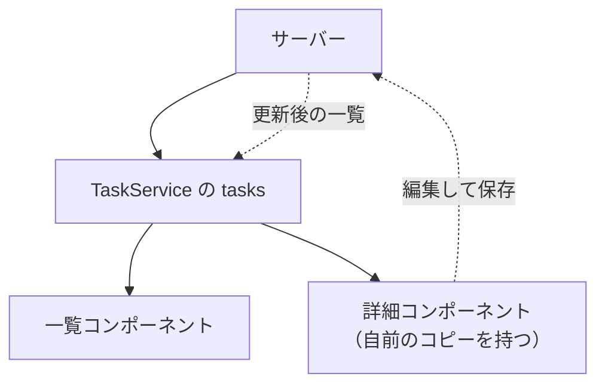

NgRxを学ぶ前に、NgRxが解こうとしている問題を先に見ておきます。道具の使い方を覚える前に「その道具が何のためにあるのか」を知っておくと、あとの学習がぐっと楽になるからです。

NgRxは「状態管理ライブラリ」と呼ばれます。では、そもそも状態管理とは何で、なぜわざわざライブラリが必要になるのでしょうか。実は、状態管理はアプリが小さいうちは、あまり難しく感じません。問題が表面化するのは、状態を複数の場所で共有し始めたときです。

タスク管理アプリの素朴なコードを出発点に、状態管理が複雑になる過程をたどります。問題の正体がわかると、次章で学ぶ「単方向データフロー」がなぜあの形をしているのかも理解しやすくなります。

## そもそも状態とは何か

まず、状態という言葉を整理します。状態とは、アプリケーションが保持していて、時間とともに変化するデータのことです。もう少しかみくだくと、「画面を動かしているあいだ、アプリが覚えておかなければならない情報」です。

タスク管理アプリを思い浮かべてください。このアプリは、いろいろな情報を覚えておく必要があります。いま登録されているタスクの一覧、いま表示しているのは全部かそれとも未完了だけか、データを読み込んでいる最中かどうか。これらはすべて状態です。ユーザーがボタンを押したり、サーバーから返事が返ってきたりするたびに、変化していきます。

状態は、大きく3種類に分けて考えると整理しやすくなります。

| 種類 | 例 | どこから来るか |
|---|---|---|
| サーバーのデータ | タスクの一覧 | 通信で取得・更新する |
| UIの状態 | 絞り込み条件、選択中のタスク | ユーザーの操作で変わる |
| 通信の状態 | 読み込み中か、エラーが起きたか | 通信の進行を表す |

種類は違いますが、どれも「変化する」ことと「画面のあちこちから参照される」ことは共通しています。そして、この2つの性質が組み合わさったときに、複雑さが生まれます。1つずつ見ていきます。

## 小さいうちは問題にならない

状態が1つのコンポーネントの中だけで完結するなら、話はとても単純です。たとえば、タスクの一覧を、コンポーネントのSignalで持つとします。

```ts
@Component({ /* ... */ })
export class TaskListComponent {
  readonly tasks = signal<Task[]>([]);

  addTask(title: string) {
    this.tasks.update((tasks) => [...tasks, createTask(title)]);
  }
}
```

`signal<Task[]>([])`は、空の配列を初期値として、タスク一覧を保持するSignalです。`addTask`が呼ばれると、`update`で新しいタスクを加えた配列に差し替えます。

このコンポーネントだけがタスクを扱うなら、これで何も困りません。状態の置き場所は、この`tasks`ただ1つです。状態を変えるのも、このコンポーネントの中だけです。だから、「いまタスクがどうなっているか」も「誰がそれを変えたのか」も、このファイルを見れば全部わかります。状態が1か所に閉じているうちは、管理はやさしいのです。

## 状態を共有し始めると崩れ始める

問題は、同じ状態を別のコンポーネントも必要としたときに始まります。

たとえば、タスクの一覧を表示するコンポーネントとは別に、画面の上部（ヘッダー）に「未完了タスクが何件あるか」を表示したくなったとします。このヘッダーのコンポーネントも、タスクの一覧を知らなければ、件数を数えられません。つまり、2つのコンポーネントが、同じタスク一覧を必要とするようになりました。

コンポーネントのSignalは、そのコンポーネントの中に閉じています。別のコンポーネントからは読めません。そこで、状態を2つのコンポーネントの共通の親、つまりServiceへ引き上げます。Serviceは、複数のコンポーネントで共有できる置き場所だからです。

```ts
@Injectable({ providedIn: 'root' })
export class TaskService {
  readonly tasks = signal<Task[]>([]);

  addTask(title: string) {
    this.tasks.update((tasks) => [...tasks, createTask(title)]);
  }

  setTasks(tasks: Task[]) {
    this.tasks.set(tasks);
  }

  removeTask(id: string) {
    this.tasks.update((tasks) => tasks.filter((task) => task.id !== id));
  }
}
```

`providedIn: 'root'`としたServiceは、アプリ全体で1つだけ作られ、どのコンポーネントからも注入して使えます。一覧コンポーネントもヘッダーコンポーネントも、この`TaskService`の`tasks`を参照すれば、同じ一覧を共有できます。

ここまでは、まだ整理されています。状態はServiceに1つあり、複数のコンポーネントがそれを見ています。実際、多くのアプリはこの形でも十分に動きます。問題は、ここからさらに育ったときに起こります。

## 二重管理の罠

崩れ始めるのは、同じデータを別の場所にも持ってしまったときです。

たとえば、タスクの詳細を編集する画面を作るとします。この画面は、編集中の値を一時的に保持したいので、対象のタスクを自分の中にコピーして持つことにしました。よかれと思ってやったこの一手が、後で問題になります。



図を見てください。同じタスクのデータが、`TaskService`と詳細コンポーネントの2か所に存在しています。ここで、詳細画面でタイトルを書き換えて保存したとします。詳細コンポーネントが持っているコピーは新しくなりますが、`TaskService`の一覧のほうは、更新の通知が届かなければ古いままです。結果として、一覧画面には古いタイトルが、詳細画面には新しいタイトルが表示される、という食い違いが起きます。

これが二重管理です。同じデータを複数の場所に持つと、片方を更新したときにもう片方が取り残され、表示がずれます。しかも、どちらが「本当に正しい値」なのかが、コードを見てもすぐには判断できなくなります。状態管理でもっともよく起きる不具合の1つであり、規模が大きくなるほど頻発します。

## 誰がいつ変えたのかを追えない

もう1つの深刻な問題は、状態の変更を追えなくなることです。

先ほどの`TaskService`には、`setTasks`、`addTask`、`removeTask`といった更新メソッドがありました。アプリが育つと、こうした更新メソッドはどんどん増え、しかもアプリ中のさまざまなコンポーネントから呼ばれるようになります。

```ts
// アプリのあちこちから、自由に状態が更新される
this.taskService.setTasks(newTasks); //         あるコンポーネントから
this.taskService.addTask(title); //             別のコンポーネントから
this.taskService.tasks.update((t) => /* ... */); // さらに別の場所から直接
```

ここで想像してみてください。ある日、タスクの一覧が思ってもみない状態になっていたとします。原因を突き止めたいのですが、状態を書き換えられる場所がアプリ中に散らばっているため、「どのコンポーネントが、いつ、どのメソッドで一覧を変えたのか」を追うのが、とても大変になります。呼び出し口が10か所あれば、10か所すべてを疑わなければなりません。状態を直接書き換えられる場所が多いほど、この調査は難しくなります。

## 非同期がからむとさらに複雑になる

ここに非同期処理、つまりサーバーとの通信が加わると、複雑さはもう一段上がります。

タスクの一覧をサーバーから読み込む場面を考えます。まず「読み込み中」の表示を出し、通信が成功したら一覧を差し替え、失敗したらエラーを表示します。ここまでなら手順は明快です。ところが、読み込みの途中でユーザーが絞り込み条件を変えたら、どうなるでしょうか。あるいは、古い読み込みの結果が、新しい読み込みの結果より遅れて届いたら。遅れて届いた古い結果が、せっかく表示した新しい状態を上書きしてしまうかもしれません。

- 読み込み中フラグを、いつ立てて、いつ下ろすか
- エラーを、どの状態に、どうやって持たせるか
- 通信中に別の操作が割り込んだとき、どちらを優先するか

これらを、更新メソッドがあちこちに散らばったServiceの中で、もれなく正しく捌くのは、かなり難しくなります。しかも、タイミングによって状態が壊れるバグは、毎回再現するとは限らないため、原因を追うのが特に厄介です。

## 規律のない状態管理の限界

ここまでの問題を、いったん整理します。

- 状態の置き場所が複数になり、二重管理で表示がずれる
- 状態を更新できる場所が散らばり、変更を追えなくなる
- 非同期処理がからむと、タイミングで状態が壊れる

これらに共通しているのは、「状態を、どこからでも、好きなように変えられる」ことです。自由度が高いことは、一見すると便利です。しかし状態管理においては、その自由さこそが、流れを追いにくくする原因になります。

では、どうすればよいのでしょうか。1つの答えが、状態管理にあえて規律を持ち込むことです。具体的には、次のようなルールを設けます。状態の置き場所は1つに定める。状態を更新する入り口は1本に絞る。変更の流れは一方向に固定する。こうすれば、状態がいつ、どのようにして変わったのかを、いつでも追えるようになります。

NgRxは、まさにこの規律を提供するためのライブラリです。素のServiceやSignalでも状態は管理できますが、規律は自分で守らなければなりません。NgRxは、その規律を仕組みとして強制してくれます。次章で見る「単方向データフロー」が、その規律の正体です。

## まとめ

この章では、状態管理が複雑になる理由を確認しました。

- 状態とは、アプリが覚えておく、変化するデータです。サーバーのデータ・UIの状態・通信の状態に分けられます。
- 1つのコンポーネントで完結するうちは単純ですが、複数で共有し始めると崩れます。
- 同じデータを複数の場所に持つ二重管理は、表示のずれを生みます。
- 更新できる場所が散らばると、誰がいつ状態を変えたのかを追えなくなります。
- 非同期処理がからむと、タイミングで状態が壊れるバグが起きます。
- これらは「状態を自由に変えられる」ことに根があり、規律を持ち込むことで解決できます。

次章では、その規律である単方向データフローと、NgRxを構成するStore、Action、Reducer、Selector、Effectsの全体像を見ていきます。
