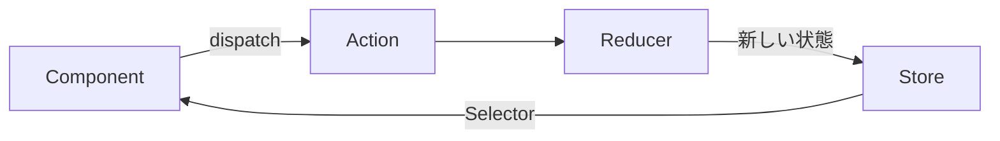
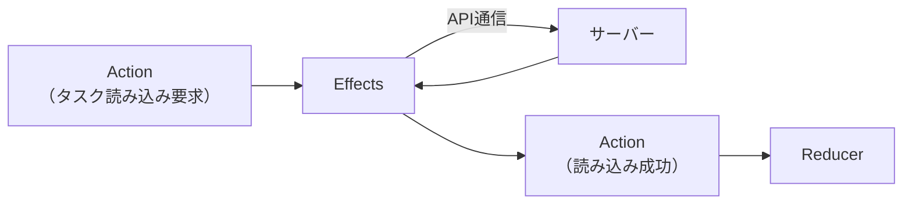
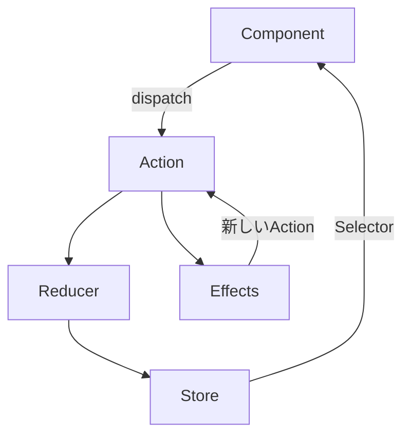

前章で、状態を自由に変えられることが複雑さの源だと確認しました。この章では、その解決策であるNgRxの単方向データフローを見ていきます。

いきなり細かいAPIに入ると、木を見て森を見ずになりがちです。そこで、まずは全体像です。NgRxには、Store、Action、Reducer、Selector、Effectsという5つの登場人物がいます。それぞれの役割と、どう連携するのかを、この章でつかみます。個々の詳しい使い方は、この先の章で1つずつ扱うので、ここではまだ暗記しなくて大丈夫です。データがどちらの向きに流れるのか、その大きな形が頭に入れば十分です。

## NgRxとは

NgRxは、Angular向けの状態管理ライブラリです。もともとは、JavaScriptの世界で広く使われてきた「Redux」という状態管理の考え方があり、それをAngularとRxJSに合わせて作り直したものがNgRxです。ReduxやRxJSを知らなくても問題ありません。必要な考え方は、本書の中で説明します。

NgRxの中心にあるのは、たった1つのシンプルな原則です。「状態は1か所に集める。そして、その状態を変えるときは、決まった手順を必ず通す」。前章で見た二重管理や、変更を追えない問題は、この原則さえ守れば起きません。なぜなら、状態が1か所にしかなく、変更の手順が決まっていれば、いつでも「どこに何があって、どう変わったか」を追えるからです。

## 単方向データフローとは

NgRxでは、データがいつも同じ向きに流れます。これを単方向データフローと呼びます。

言葉だけだと抽象的なので、図で見ます。



流れを言葉にすると、こうです。コンポーネントが「Action」を発行します（この発行のことを`dispatch`と呼びます）。ActionはReducerに渡り、Reducerが新しい状態を作ってStoreに収めます。そして、コンポーネントはSelectorという窓口を通して、Storeから状態を受け取ります。

大事なのは、この流れが一方向にしか進まないことです。コンポーネントが、Storeの中の状態を直接いじって書き換えることはありません。値を変えたいときも、必ずActionを発行して、Reducerを経由します。入り口がこの1本に絞られているからこそ、「状態が変わった＝どこかでActionが発行された」と言い切れます。前章の「誰がいつ変えたのか追えない」問題が、これで解消します。

言い換えれば、単方向データフローは「状態を変える手続きを、あえて1本道にした仕組み」です。回り道に見えて、これが追跡のしやすさを生みます。ここから、登場人物を1人ずつ紹介します。

## Store — 状態の唯一の置き場所

Storeは、アプリケーションの状態を保持する、ただ1つの置き場所です。

前章では、状態がServiceや各コンポーネントに散らばり、二重管理でずれてしまう問題を見ました。Storeは、その反省から、状態を1か所に集めます。信頼できる情報源が1つだけある、この状態を「Single Source of Truth（信頼できる唯一の情報源）」と呼びます。

タスク管理アプリでいえば、タスクの一覧、絞り込み条件、読み込み中フラグ、エラーは、すべてこのStoreの中にあります。詳細画面が別にコピーを持つ、といったことはしません。状態が1か所にしかないので、そもそもずれようがないのです。コンポーネントは、自分でデータを抱え込むのをやめ、必要なときにStoreから受け取ります。

## Action — 何が起きたか

Actionは、アプリケーションで「何が起きたか」を表す、小さなオブジェクトです。

```ts
// 「タスクが追加された」という出来事を表すAction
{ type: '[Task List] Add Task', title: 'NgRxを学ぶ' }
```

`type`が、その出来事の名前です。ここでは「タスク一覧画面でタスクが追加された」ことを表しています。`title`のように、出来事に付随するデータも一緒に持てます。

ここで、初学者がつまずきやすい大事な点があります。Actionが表すのは、命令ではなく出来事だということです。「状態をこう書き換えろ」と指示するものではありません。「タスクが追加された」という、すでに起きた事実を記録します。たとえるなら、これから何をするかの予定表より、何が起きたかを書きとめる日記に近いものです。この考え方は、Actionの設計を扱う章で改めて掘り下げますが、まずは「Actionは出来事の記録」と覚えておけば十分です。

コンポーネントは、ユーザーがボタンを押すなどの操作に応じて、対応するActionを発行（dispatch）します。

## Reducer — 状態を更新する純粋関数

Reducerは、いまの状態とActionの2つを受け取って、新しい状態を返す関数です。

```ts
// 現在の状態 + Action → 新しい状態
(state, action) => newState;
```

たとえば「タスクが追加された」というActionを受け取ったReducerは、いまの一覧に新しいタスクを加えた、新しい一覧を作って返します。

Reducerには、守るべき性質があります。「純粋関数」であることです。純粋関数とは、同じ入力からは必ず同じ出力を返し、外の世界に影響を与えない関数のことです。つまりReducerは、通信をしたり、時刻や乱数を使ったり、外部の変数を書き換えたりしません。ただ、受け取った状態とActionから、次の状態を計算して返すだけです。この性質のおかげで、Reducerは動きが予測しやすく、テストも簡単になります。

そして、もう1つ大事な性質があります。状態を変えられるのは、Reducerだけだということです。コンポーネントもServiceも、状態を直接は変えません。更新の入り口がこのReducer1つに絞られていることが、単方向データフローの心臓部です。

## Selector — 状態を読み出す

Selectorは、Storeから状態を読み出すための窓口となる関数です。

コンポーネントは、Storeの中身を直接のぞき込みません。Selectorを通して、必要な部分だけを受け取ります。しかもSelectorは、生の状態をそのまま渡すこともできますし、状態から計算した値を渡すこともできます。たとえば、タスク一覧をもとに「未完了のタスクだけ」や「タスクの件数」を計算し、画面が使いやすい形にして渡せます。

```ts
// 未完了のタスクだけを読み出すSelector
selectIncompleteTasks;
```

Selectorには、計算した結果を覚えておく「メモ化」という仕組みがあります。元になる状態が変わっていなければ、前回計算した結果を再利用し、無駄な計算をしません。この仕組みのおかげで、Selectorで値を加工しても、パフォーマンスが落ちにくくなっています。メモ化の詳しい話は、Selectorの章で扱います。

## Effects — 副作用を扱う

ここまでのStore、Action、Reducer、Selectorは、すべて同期的で、純粋な世界の話でした。しかし、実際のアプリには、サーバーとの通信のような処理があります。通信は、結果がいつ返るかわからず、失敗することもある「副作用」です。純粋であるべきReducerに、こうした通信を書くわけにはいきません。

そこで登場するのがEffectsです。Effectsは、Actionを受け取り、通信などの副作用を実行し、その結果をまた新しいActionとして発行する仕組みです。



流れを追いましょう。まず「タスクの読み込みが要求された」というActionが発行されます。Effectsはこれを受けて、サーバーにデータを取りにいきます。データが返ってきたら、Effectsは「読み込みに成功した」という新しいActionを発行します。そのActionをReducerが受け取って、一覧の状態を更新します。

副作用をEffectsという決まった場所に閉じ込めることで、Reducerは純粋なまま保てます。前章で難しかった非同期処理の扱いも、Effectsという1か所に集約されます。

## 全体をつなげて見る

5人の登場人物を、1つの図にまとめます。



改めて流れを言葉にします。コンポーネントがActionを発行する。Reducerがそれを受けて状態を更新し、Storeに収める。コンポーネントはSelectorで状態を読み出して画面に映す。もし副作用が必要なら、EffectsがそのActionを受けて通信し、結果を新しいActionとして流し込む。そのActionがまたReducerに届いて、状態が更新される。

注目してほしいのは、すべてのやり取りがActionを介して行われている点です。コンポーネントもEffectsも、直接Storeをいじりません。全員がActionという共通の言葉で会話し、状態を変えるのはReducerだけ。この一貫したルールが、流れを一方向に保っています。

## なぜ予測可能になるのか

この仕組みの最大の利点は、アプリの動きが予測可能になることです。

状態が変わるのは、必ず「Action → Reducer」という経路だけです。だから、もし状態がおかしくなっても、「どんなActionが、どの順番で発行され、Reducerがどう処理したか」をたどれば、必ず原因にたどり着けます。次章で導入するDevToolsという開発ツールを使えば、発行されたActionの一覧と、それぞれによる状態の変化を、時系列で目で見て確認できます。

前章で悩んだ「誰がいつ状態を変えたのか追えない」という問題は、ここで完全に解決します。変更の記録がすべてActionとして残り、更新の経路が1本に固定されているからです。この安心感が、NgRxを導入する最大の理由といえます。

## NgRxを構成するパッケージ

NgRxは、機能ごとにパッケージ（部品）が分かれています。本書で扱う主なものを挙げておきます。いまは、こういう部品があるという程度に眺めてください。

| パッケージ | 役割 |
|---|---|
| `@ngrx/store` | Store・Action・Reducer・Selector |
| `@ngrx/effects` | Effects（副作用） |
| `@ngrx/entity` | コレクション（一覧データ）の管理 |
| `@ngrx/store-devtools` | 開発時のデバッグ |
| `@ngrx/router-store` | ルーティング状態の連携 |
| `@ngrx/signals` | SignalStore |

すべてを最初から使う必要はありません。必要になった章で、順番に導入していきます。

## まとめ

この章では、NgRxの単方向データフローと全体像を確認しました。

- NgRxはReduxの考え方を土台にした、Angular向けの状態管理ライブラリです。
- データはいつも一方向に流れ、コンポーネントは状態を直接書き換えません。
- Storeは状態の唯一の置き場所（Single Source of Truth）です。
- Actionは「何が起きたか」を表す出来事であり、Reducerだけが状態を更新します。
- Selectorで状態を読み出し、Effectsで通信などの副作用を扱います。
- すべてがActionを介して流れるため、変更を追跡でき、動きが予測可能になります。

次章では、いよいよ実際にNgRxをプロジェクトへ導入します。`@ngrx/store`をセットアップし、最小のStoreを動かし、DevToolsで状態の変化を確認します。
