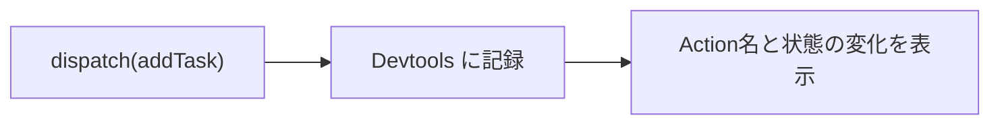

前章で、単方向データフローの全体像をつかみました。この章では、いよいよ実際にNgRxをAngularプロジェクトへ導入します。

頭で理解した仕組みも、実際に動かしてみると、理解がぐっと深まります。ここでは、`@ngrx/store`をインストールし、Storeを登録し、ごく小さなReducerを1つ動かします。さらに、状態の変化を目で追える`@ngrx/store-devtools`も入れます。最初に配線を通しておけば、次章からの設計の話を、動く環境の上で確かめられます。

ActionやReducerの詳しい設計は、この先の章でじっくり扱います。この章の目標は、細部を完璧に理解することではなく、まず「作って、つないで、動かす」流れを一度体験することです。

## インストール

NgRxは、Angular CLIの`ng add`コマンドで導入できます。まずStoreのパッケージを追加します。

```bash
ng add @ngrx/store
```

`ng add`は、ただパッケージをインストールするだけではありません。後述するStoreの登録コードまで、自動で追記してくれます。手動で入れたい場合は、npmでインストールし、登録は自分で書きます。

```bash
npm install @ngrx/store @ngrx/store-devtools
```

本書は、Angularの現行スタイルであるStandalone構成を前提とします。Standalone構成では、以前の`NgModule`のかわりに、`provideXxx`という関数でライブラリを登録します。NgRxもこの流儀に沿って、`provideStore`などの関数で登録します。

## Storeを登録する

Storeの登録は、アプリ全体の設定をまとめる`app.config.ts`で行います。プロバイダーの配列に`provideStore`を加えます。

```ts:src/app/app.config.ts
import { ApplicationConfig } from '@angular/core';
import { provideStore } from '@ngrx/store';

export const appConfig: ApplicationConfig = {
  providers: [
    provideStore(),
  ],
};
```

`provideStore()`を置くと、アプリの中に空のStore（状態の入れ物）が1つ用意されます。この時点では、まだ中身は空です。ここに、機能ごとの状態を`provideState`で1つずつ足していきます。次の節で、最初の状態を登録します。

## 最小のReducerを作る

タスク管理アプリの状態のうち、まずはいちばん基本となる「タスクの一覧」だけを持つ、小さな状態を作ってみます。

最初に、状態がどんな形をしているか（型）と、その初期値を決めます。

```ts:src/app/tasks/tasks.reducer.ts
import { createReducer, on, createAction, props } from '@ngrx/store';

export type Task = {
  id: string;
  title: string;
  completed: boolean;
};

export type TasksState = {
  tasks: Task[];
};

const initialState: TasksState = {
  tasks: [],
};
```

`TasksState`が状態の形です。ここでは、`tasks`というタスクの配列を1つ持つだけの、シンプルな状態にしています。`initialState`は、アプリ起動時の初期値で、まだタスクが1つもない空の配列から始めます。

次に、「タスクが追加された」という出来事を表すActionと、それを受けて状態を更新するReducerを書きます。

```ts:src/app/tasks/tasks.reducer.ts
export const addTask = createAction(
  '[Task List] Add Task',
  props<{ title: string }>(),
);

export const tasksReducer = createReducer(
  initialState,
  on(addTask, (state, { title }) => ({
    ...state,
    tasks: [
      ...state.tasks,
      { id: crypto.randomUUID(), title, completed: false },
    ],
  })),
);
```

`createAction`でActionを定義します。第1引数`'[Task List] Add Task'`がActionの名前、`props<{ title: string }>()`が「このActionはtitleというデータを持つ」という宣言です。

`createReducer`がReducerです。初期状態`initialState`を渡し、`on`で「どのActionが来たら、どう状態を変えるか」を書きます。ここでは`addTask`が来たら、いまの`tasks`配列の末尾に新しいタスクを1つ加えた、新しい配列を作って返しています。

注目してほしいのは、`...state`や`...state.tasks`という書き方です。これは、元の状態を書き換えず、コピーを作って一部だけ差し替える「イミュータブルな更新」です。前章で「Reducerは純粋関数」と説明したとおり、Reducerは元の状態には手を触れません。この書き方の意味は、Reducerの章でじっくり掘り下げます。ここでは、こう書くものだと受け止めてください。

## 状態をStoreに登録する

作ったReducerを、`provideState`でStoreに登録します。機能の名前（ここでは`tasks`）と、その状態を管理するReducerの2つを渡します。

```ts:src/app/app.config.ts
import { ApplicationConfig } from '@angular/core';
import { provideStore, provideState } from '@ngrx/store';
import { tasksReducer } from './tasks/tasks.reducer';

export const appConfig: ApplicationConfig = {
  providers: [
    provideStore(),
    provideState('tasks', tasksReducer),
  ],
};
```

これで、Storeの中に`tasks`という名前で状態が登録されました。アプリ全体の状態は、これから機能が増えるにつれ、`tasks`・`users`・`notifications`といった名前の区画に分かれていきます。いまはその最初の1つを登録した、という状態です。

## コンポーネントから使う

準備ができたので、コンポーネントから状態を読み書きしてみます。まず、Storeを`inject`で取り出します。

```ts:src/app/tasks/task-list.component.ts
import { Component, inject } from '@angular/core';
import { Store } from '@ngrx/store';
import { addTask } from './tasks.reducer';

@Component({ /* ... */ })
export class TaskListComponent {
  private readonly store = inject(Store);

  // Signalとして状態を読み出す
  readonly tasks = this.store.selectSignal((state: any) => state.tasks.tasks);

  add(title: string) {
    this.store.dispatch(addTask({ title }));
  }
}
```

ここで、前章で学んだ流れが2つ登場します。1つは`store.dispatch(addTask({ title }))`です。`dispatch`は、Actionを発行する操作でした。`add`が呼ばれると、「タスクが追加された」というActionが流れ、Reducerが新しい状態を作ります。

もう1つは`store.selectSignal(...)`です。これは、Storeから状態をSignalとして読み出します。状態が変わると、このSignalも自動で新しい値になり、テンプレートの表示も更新されます。`add`を呼ぶたびに、Action→Reducer→Storeと流れ、`tasks`のSignalが増えていきます。前章の図が、そのままコードになっています。

なお、ここでは状態を`(state: any) => state.tasks.tasks`と、少し不格好に読み出しています。`any`を使っているのも、型の安全が効いていない印です。実務では、この読み出しをSelectorという専用の仕組みで、型安全に書きます。Selectorは、この先の章で導入します。

## Devtoolsを導入する

NgRxを使う大きな利点の1つが、Devtoolsによるデバッグです。前章で触れた「誰がいつ状態を変えたのか」を、実際に目で見られるようにします。

`provideStoreDevtools`をプロバイダーに加えます。

```ts:src/app/app.config.ts
import { ApplicationConfig, isDevMode } from '@angular/core';
import { provideStore, provideState } from '@ngrx/store';
import { provideStoreDevtools } from '@ngrx/store-devtools';
import { tasksReducer } from './tasks/tasks.reducer';

export const appConfig: ApplicationConfig = {
  providers: [
    provideStore(),
    provideState('tasks', tasksReducer),
    provideStoreDevtools({
      maxAge: 25, //          保持するAction履歴の件数
      logOnly: !isDevMode(), // 本番ではログのみに制限する
    }),
  ],
};
```

ブラウザに「Redux DevTools」という拡張機能を入れると、Storeの状態と、発行されたActionの履歴を見られます。`maxAge: 25`は、直近25件のActionを覚えておく設定です。`logOnly: !isDevMode()`は、本番環境では機能を制限し、開発中だけフルに使えるようにする指定です。

拡張機能を開いた状態で`add`を呼ぶと、`[Task List] Add Task`というActionが履歴に現れ、その前後で`tasks`がどう変わったかが表示されます。状態の変化が、目に見える記録として残るのです。



## Runtime Checksで守りを固める

最後に、NgRxが持つ安全網、Runtime Checksを有効にしておきます。これは、設計の誤りを開発中に見つけてくれる仕組みです。

たとえば、うっかり状態を直接書き換えてしまうと、前章で説明したイミュータブルの原則が崩れます。Runtime Checksを有効にすると、そうした違反が起きたとき、開発中に警告を出してくれます。

`provideStore`に設定を渡して有効にします。

```ts:src/app/app.config.ts
provideStore(
  {},
  {
    runtimeChecks: {
      strictStateImmutability: true, //     状態を書き換えていないか
      strictActionImmutability: true, //    Actionを書き換えていないか
      strictStateSerializability: true, //  状態が保存可能な形か
      strictActionSerializability: true, // Actionが保存可能な形か
    },
  },
),
```

これらは、状態やActionを直接書き換えていないか、保存や復元ができる素直なデータ構造になっているか、といった点をチェックします。開発の早い段階で有効にしておくと、あとから直しにくい設計ミスを、初期の段階で防げます。守りは、後から足すより最初から入れておくほうが楽です。

## まとめ

この章では、NgRxをプロジェクトへ導入しました。

- `ng add @ngrx/store`、または`npm install`でパッケージを導入します。
- Standalone構成では、`provideStore`と`provideState`でStoreと状態を登録します。
- `createAction`・`createReducer`で、最小のActionとReducerを作りました。
- コンポーネントからは、`store.dispatch`でActionを発行し、`store.selectSignal`で状態を読み出します。
- `provideStoreDevtools`で、Actionと状態の変化を時系列で確認できます。
- Runtime Checksを有効にすると、イミュータブルの違反を開発中に検知できます。

次章からは、状態の設計と読み書きに入ります。まず、何を状態として持つべきかを考える「Stateを設計する」から始めます。
