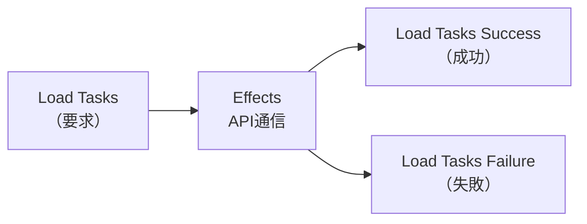

前章で、状態を最小限の形に設計しました。この章では、その状態を変えるきっかけとなるActionを扱います。

Actionは、コードとしては小さなオブジェクトにすぎません。しかし、その設計の良し悪しが、アプリ全体の見通しを大きく左右します。うまく設計すれば、DevToolsのログが読みやすい日記のようになり、状態の変化を追いやすくなります。設計を誤ると、Actionが更新命令の寄せ集めになり、何が起きているのか分からなくなります。

この章では、まず`createAction`と`createActionGroup`という2つの書き方を確認します。そのうえで、Actionを「イベント」として設計するための、命名と粒度の指針を扱います。

## Actionはイベントである

Actionを設計するとき、最初に決めたいのは「これは何のイベント（出来事）か」です。

前章までにも触れたとおり、Actionは「状態をこう変えろ」という命令ではありません。「ユーザーが追加ボタンを押した」「サーバーからの読み込みが成功した」という、起きた出来事を記録するものです。この視点の違いは、地味に見えて、とても大きな差を生みます。

出来事として設計しておくと、1つのActionに対して、複数の担当者がそれぞれの立場で反応できます。たとえば「追加ボタンが押された」という1つの出来事に対して、Reducerは状態に新しいタスクを加え、EffectsはそれをサーバーへPOSTする、というように、別々の処理を独立して起こせます。もしActionが「タスク配列に追加しろ」という命令だったら、この柔軟さは失われます。Actionを出来事にしておくことが、単方向データフローをしなやかに保ちます。

## createActionでActionを定義する

もっとも基本的な定義方法が`createAction`です。第1引数にAction名、必要ならペイロード（付随するデータ）の型を`props`で指定します。

```ts
import { createAction, props } from '@ngrx/store';

export const addTask = createAction(
  '[Task List] Add Task',
  props<{ title: string }>(),
);
```

こう定義すると、`addTask`は関数になります。`addTask({ title: 'NgRxを学ぶ' })`のように呼ぶと、`{ type: '[Task List] Add Task', title: 'NgRxを学ぶ' }`というActionオブジェクトが作られます。`type`が出来事の名前、`title`がペイロードです。ペイロードが不要なActionは、`props`を省いて`createAction('[App] Init')`と書きます。

## createActionGroupでまとめて定義する

関連するActionが増えてくると、`createAction`を1つずつ書くのは冗長になります。現行のNgRxでは、`createActionGroup`を使って、関連するActionをまとめて定義できます。

```ts
import { createActionGroup, emptyProps, props } from '@ngrx/store';

export const tasksActions = createActionGroup({
  source: 'Task List',
  events: {
    'Add Task': props<{ title: string }>(),
    'Toggle Task': props<{ id: string }>(),
    'Remove Task': props<{ id: string }>(),
    'Set Filter': props<{ filter: Filter }>(),
  },
});
```

`source`は、これらのActionがどこから来たか（発生源）を表します。`events`に、出来事の名前とペイロードを並べます。ペイロードのない出来事には`emptyProps()`を指定します。

`createActionGroup`の便利なところは、イベント名から自動でAction作成関数を作ってくれる点です。`'Add Task'`という名前は、`tasksActions.addTask`という関数になります（スペースが取れて、先頭が小文字になります）。

```ts
store.dispatch(tasksActions.addTask({ title: 'NgRxを学ぶ' }));
store.dispatch(tasksActions.setFilter({ filter: 'active' }));
```

関連するActionを1か所にまとめられ、`source`も統一できるので、本書ではこの`createActionGroup`を主に使います。

## Action名の付け方

Action名には、広く使われている慣習があります。`[発生源] 出来事`という形です。

```text
[Task List] Add Task
[Tasks API] Load Tasks Success
[Task Detail] Toggle Task
```

角かっこの中が発生源、つまり「どの画面・どの機能で起きたか」です。続く部分が、起きた出来事です。この形で名前を付けておくと、DevToolsのログを開いたとき、「タスク一覧画面でタスクが追加された」「タスク詳細画面で完了が切り替えられた」と、まるで文章のように読めます。

発生源をわざわざ書くのは、同じような出来事でも、どこで起きたかを区別したいからです。たとえば「タスクの読み込み成功」という出来事は、一覧画面から起こることも、詳細画面から起こることもあります。`[Task List] Load Tasks Success`と`[Task Detail] Load Tasks Success`のように発生源で分けておくと、あとから流れを追うときに、どちらの経路だったのかがわかります。

## Actionをコマンドにしない

ここで、初学者がやりがちな失敗を見ておきます。Actionを、更新命令のように設計してしまうことです。

```ts
// 避けたい設計: 更新処理そのものを名前にしている
createAction('[Tasks] Set Tasks Array', props<{ tasks: Task[] }>());
createAction('[Tasks] Set Loading True');
```

`Set Tasks Array`や`Set Loading True`は、状態をどう書き換えるかを、そのまま名前にしています。これでは、Actionが特定の更新処理と一対一に縛られ、「出来事」としての意味が消えてしまいます。DevToolsで見ても、「配列をセットした」「ローディングをtrueにした」という、機械的な操作の羅列にしかなりません。

出来事として設計すると、こうなります。

```ts
// 良い設計: 起きた出来事を名前にしている
createActionGroup({
  source: 'Tasks API',
  events: {
    'Load Tasks': emptyProps(),
    'Load Tasks Success': props<{ tasks: Task[] }>(),
    'Load Tasks Failure': props<{ error: string }>(),
  },
});
```

`Load Tasks Success`は、「読み込みが成功した」という1つの出来事です。この出来事を受けて、Reducerが`tasks`を差し替え、同時に`loading`を下ろします。「状態をどう変えるか」はReducerが決めることであって、Actionはただ「何が起きたか」を伝えるだけ。この役割分担を守ると、Actionが素直で読みやすくなります。

## 1つの出来事に1つのAction

Actionは、1つの出来事につき1つ用意し、使い回さないようにします。複数の場面で同じActionを共有すると、DevToolsのログを見たときに、どこから発行されたものか区別できなくなります。

とくに、サーバーとの通信では、要求・成功・失敗の3つのActionを分けて用意するのが定番です。

```ts
createActionGroup({
  source: 'Tasks API',
  events: {
    'Load Tasks': emptyProps(), //                       要求（読み込みを始めた）
    'Load Tasks Success': props<{ tasks: Task[] }>(), //  成功（データが返ってきた）
    'Load Tasks Failure': props<{ error: string }>(), //  失敗（エラーが起きた）
  },
});
```



なぜ3つに分けるかというと、通信がいまどの段階にいるのかを、Actionの履歴から追えるようにするためです。「要求は出たが、成功も失敗もまだ来ていない」なら、通信中だとわかります。この3点セットは、Effectsの章で何度も登場する、NgRxの基本パターンです。

## まとめ

この章では、Actionをイベントとして設計する方法を確認しました。

- Actionは更新命令ではなく、「何が起きたか」を表すイベントです。
- `createAction`でActionを、`createActionGroup`で関連Actionをまとめて定義します。
- Action名は`[発生源] 出来事`の形にすると、DevToolsのログが読みやすくなります。
- 更新処理を名前にしたコマンド型のActionは避けます。
- 1つの出来事に1つのActionを用意し、使い回しません。
- 通信は、要求・成功・失敗の3つのActionに分けるのが定番です。

次章では、このActionを受けて、実際に状態を更新するReducerと、イミュータブルな状態更新を扱います。
