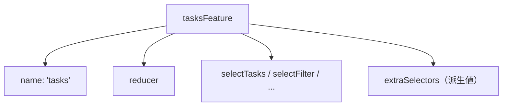

前章までで、State、Action、Reducerを個別に書けるようになりました。この章では、それらを機能ごとに1つにまとめる`createFeature`を扱います。

アプリケーションが育つと、状態は機能ごとに分かれていきます。タスク、ユーザー、通知、といった具合です。このとき、それぞれの機能を1つの単位（Feature）としてまとめておくと、状態の境界がはっきりし、登録も読み出しも簡潔になります。

`createFeature`を使うと、Featureの登録に必要なものと、状態を読み出すSelectorが、まとめて手に入ります。とくに、これまで手で書いていたSelectorを大幅に減らせる、実務で欠かせない道具です。

## Featureという単位

Featureとは、関連する状態をひとまとめにした単位のことです。タスク管理アプリなら、「tasks」というFeatureに、タスクの一覧・絞り込み条件・通信状態をまとめます。

前章までは、状態を`provideState('tasks', tasksReducer)`のように、名前とReducerを個別に指定して登録していました。ここで少し立ち止まって考えてみると、この「tasksという名前」「tasksReducer」「tasksの状態を読み出すSelector」は、どれもtasks機能に属する、ひとかたまりの情報です。バラバラに管理するより、1つにまとめたほうが自然です。`createFeature`は、まさにこれらを1つに束ねてくれます。

## createFeatureでまとめる

`createFeature`には、Featureの名前と、その状態を管理するReducerを渡します。

```ts:src/app/tasks/tasks.feature.ts
import { createFeature, createReducer, on } from '@ngrx/store';

export const tasksFeature = createFeature({
  name: 'tasks',
  reducer: createReducer(
    initialState,
    on(tasksActions.setFilter, (state, { filter }) => ({ ...state, filter })),
    // ... 他のon
  ),
});
```

これだけで、`tasksFeature`という1つのオブジェクトの中に、Featureの名前、Reducer、そして状態を読み出すSelectorが、まとまって収まります。個別に管理していた情報が、1か所に集約されたわけです。

## 登録する

登録も簡単になります。`provideState`に、`createFeature`で作ったFeatureをそのまま渡すだけです。名前とReducerを別々に渡す必要はありません。

```ts:src/app/app.config.ts
import { provideStore, provideState } from '@ngrx/store';
import { tasksFeature } from './tasks/tasks.feature';

export const appConfig: ApplicationConfig = {
  providers: [
    provideStore(),
    provideState(tasksFeature),
  ],
};
```

`createFeature`が名前とReducerを内部に持っているので、`provideState(tasksFeature)`と書くだけで登録が完了します。前章までの`provideState('tasks', tasksReducer)`と比べて、名前の指定ミスなども起きにくくなります。

## Selectorが自動で手に入る

`createFeature`のいちばんの利点が、Selectorの自動生成です。状態の各プロパティに対応するSelectorが、自動で用意されます。

```ts:src/app/tasks/tasks.feature.ts
export const {
  name, //                 'tasks'
  reducer, //              tasksReducer
  selectTasksState, //     Feature全体の状態
  selectTasks, //          state.tasks
  selectFilter, //         state.filter
  selectSelectedTaskId, // state.selectedTaskId
  selectLoading, //        state.loading
  selectError, //          state.error
} = tasksFeature;
```

状態の型が`{ tasks, filter, selectedTaskId, loading, error }`だとすると、そのプロパティ1つずつに対して、`selectTasks`・`selectFilter`のように、頭に`select`が付いたSelectorが生えてきます。これらを手で書く必要が、まったくなくなります。以前は、プロパティが5つあれば5つのSelectorを自分で書いていましたが、その手間が消えるわけです。

コンポーネントからは、こうして得たSelectorを使って状態を読み出します。

```ts
readonly tasks = this.store.selectSignal(tasksFeature.selectTasks);
readonly filter = this.store.selectSignal(tasksFeature.selectFilter);
```

セットアップの章では、状態を`(state: any) => state.tasks.tasks`と、`any`を使って不格好に読み出していました。`createFeature`のSelectorを使うと、型がきちんと効き、記述もすっきりします。前章までの「型が効かない読み出し」が、ここで解消します。

## 派生値のSelectorを足す

自動で生成されるのは、状態のプロパティをそのまま読み出すSelectorです。State設計の章で「派生値はSelectorで計算する」と学びましたが、「絞り込み後の一覧」のような派生値のSelectorは、自動では作られません。こうした派生値は、`extraSelectors`で足します。

```ts:src/app/tasks/tasks.feature.ts
export const tasksFeature = createFeature({
  name: 'tasks',
  reducer: tasksReducer,
  extraSelectors: ({ selectTasks, selectFilter }) => ({
    selectVisibleTasks: createSelector(
      selectTasks,
      selectFilter,
      (tasks, filter) => applyFilter(tasks, filter),
    ),
  }),
});
```

`extraSelectors`は、自動生成されたSelector（`selectTasks`や`selectFilter`）を受け取り、それらを組み合わせた新しいSelectorを返す関数です。ここで作った`selectVisibleTasks`も、`tasksFeature`から取り出せるようになります。自動生成のSelectorを土台に、派生値のSelectorを積み上げていくイメージです。Selectorの組み合わせ方そのものは、次章と、その次のViewModelの章で詳しく扱います。

## Featureで状態の境界を作る

`createFeature`を使うと、1つのFeatureが、状態・Reducer・Selectorを自分の内側に持つ、自己完結した単位になります。



新しい機能を追加するときは、新しいFeatureを1つ作り、`provideState`で登録するだけです。既存のFeatureには手を触れずに済むので、変更の影響が、そのFeatureの内側に収まります。状態の境界がFeature単位で明確になるので、アプリが大きくなっても見通しを保てます。この分割の考え方は、大規模アプリケーションの構成を扱う章で、あらためて掘り下げます。

## まとめ

この章では、Featureという単位と`createFeature`を確認しました。

- Featureは、関連する状態・Reducer・Selectorをまとめた単位です。
- `createFeature`に名前とReducerを渡すと、これらが1つのオブジェクトにまとまります。
- 登録は`provideState(feature)`だけで済みます。
- 状態のプロパティに対応するSelectorが、自動で生成されます。
- 派生値のSelectorは`extraSelectors`で足します。
- Featureで状態の境界を作ると、機能追加の影響が内側に収まり、見通しを保てます。

次章では、状態を読み出すSelectorそのものを深掘りします。Selectorが持つメモ化という仕組みと、その効果を扱います。
