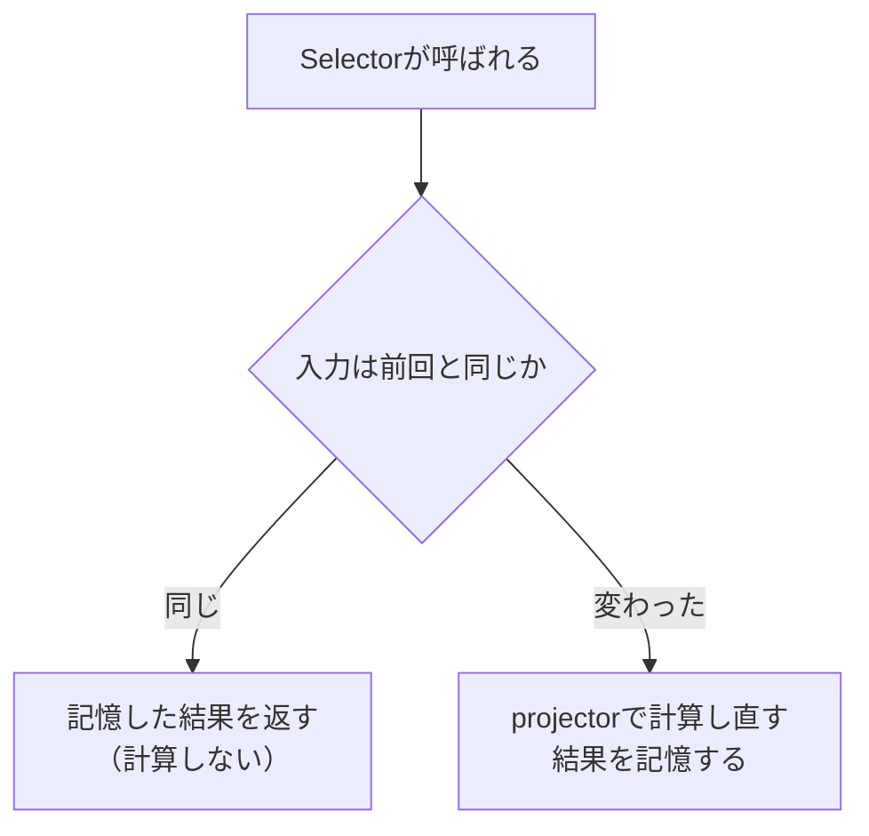

前章で、`createFeature`がSelectorを自動生成してくれると学びました。この章では、そのSelectorの仕組みそのものを深掘りします。

Selectorは、Storeから状態を読み出す関数です。ただ読み出すだけなら単純ですが、Selectorには「メモ化」という、少し賢い仕組みが備わっています。このメモ化があるおかげで、派生値の計算が効率よく保たれ、Angularの再描画も無駄なく抑えられます。初学者にはやや踏み込んだ話ですが、ここを理解すると、Selectorを安心して使えるようになります。

Selectorの作り方、メモ化がどう働くのか、そしてSignalとして読み出す方法を、順に見ていきます。

## Selectorとは

Selectorは、状態の一部を取り出したり、状態から値を計算したりする関数です。`createSelector`で作ります。

```ts
import { createSelector } from '@ngrx/store';
import { tasksFeature } from './tasks.feature';

export const selectIncompleteCount = createSelector(
  tasksFeature.selectTasks,
  (tasks) => tasks.filter((task) => !task.completed).length,
);
```

`createSelector`は、入力となるSelectorをいくつか受け取り、最後の関数でそれらを組み合わせて結果を計算します。この最後の計算関数を、projectorと呼びます。この例では、`selectTasks`を入力に取り、その一覧から未完了の件数を計算しています。

State設計の章で学んだ「派生値は状態に持たず、Selectorで計算する」という原則が、ここで具体的な形になります。未完了件数を状態に持たなくても、このSelectorが、いつ呼んでも正しい件数を返してくれます。

## メモ化の仕組み

ここからが本題のメモ化です。メモ化とは、一度計算した結果を覚えておき、入力が前回と変わっていなければ、計算をやり直さずに前回の結果を再利用する仕組みです。

Selectorは、内部で「前回の入力」と「前回の結果」を記憶しています。次に呼ばれたとき、まず入力が前回と同じかどうかを確認します。同じなら、projectorを実行せず、覚えておいた結果をそのまま返します。入力が変わっていたときだけ、あらためて計算します。



先ほどの`selectIncompleteCount`でいえば、`tasks`が変わらないかぎり、`filter`で件数を数える処理は動きません。1回数えたら、その結果を覚えておき、何度読み出しても、覚えた件数をそのまま返します。

## なぜメモ化が効くのか

メモ化のありがたみは、それがなかったらどうなるかを考えると見えてきます。

もしメモ化がなければ、Selectorを読み出すたびに、毎回計算が走ります。状態のどこかが変わるたびに、関係のない派生値まで計算し直され、Angularの再描画も余計に起きてしまいます。

具体例で見ます。絞り込み後の一覧を計算するSelectorは、`filter`をかける処理を含みます。もし、絞り込みとは無関係な`loading`フラグが変わっただけで、この絞り込みが毎回やり直されたら、無駄です。

```ts
export const selectVisibleTasks = createSelector(
  tasksFeature.selectTasks,
  tasksFeature.selectFilter,
  (tasks, filter) => {
    switch (filter) {
      case 'active':
        return tasks.filter((task) => !task.completed);
      case 'completed':
        return tasks.filter((task) => task.completed);
      default:
        return tasks;
    }
  },
);
```

このSelectorの入力は、`tasks`と`filter`の2つです。`loading`だけが変わったとき、この2つは変わっていません。だからメモ化が働き、絞り込みは再計算されず、前回の結果がそのまま返ります。扱う一覧が大きいほど、この節約の効果は大きくなります。

## 入力は参照で比較される

メモ化で1つだけ気をつけたいのが、「入力が前回と同じか」をどう判断しているか、です。Selectorは、これを参照の等価性（JavaScriptの`===`）で判断します。中身が同じかどうかではなく、「まったく同じオブジェクトか」を見ます。

ここで、前章までに徹底してきたイミュータブルな更新が効いてきます。Reducerが状態を変えていなければ、同じオブジェクト（同じ参照）が保たれるので、Selectorは「入力は変わっていない」と判断し、メモ化した結果を返します。ところが、状態を変えていないのに、うっかり毎回新しいオブジェクトを作ってしまうと、参照が変わり、メモ化が効かなくなります。

```ts
// 避けたい: 状態を変えていないのに、毎回新しい配列を作っている
on(someAction, (state) => ({
  ...state,
  tasks: [...state.tasks], // 中身は同じなのに、参照だけが変わってしまう
}));
```

これをやると、`tasks`を入力にするすべてのSelectorが、毎回計算し直しになってしまいます。イミュータブルな更新は、状態管理の正しさのためだけでなく、このメモ化を効かせるためにも重要なのです。「変えないなら、同じ参照のまま返す」を守ってください。

## SignalとしてSelectorを読み出す

コンポーネントからSelectorを読み出す方法は2つあります。`store.select`はObservableを返し、`store.selectSignal`はSignalを返します。

```ts
// Observableとして読み出す
readonly visibleTasks$ = this.store.select(selectVisibleTasks);

// Signalとして読み出す
readonly visibleTasks = this.store.selectSignal(selectVisibleTasks);
```

Angularの現行世代はSignalsを標準とするため、本書では`selectSignal`を主に使います。Signalなら、テンプレートで`async`パイプを使わず、そのまま呼び出して読めます。

```html
@for (task of visibleTasks(); track task.id) {
  <li>{{ task.title }}</li>
}
```

`visibleTasks()`と呼ぶだけで、現在の値が取れます。使い分けの目安はこうです。RxJSのストリームと組み合わせて加工したい場面では`select`を、テンプレートに値を渡して表示するだけなら`selectSignal`を使います。

## projectorはテストしやすい

Selectorのもう1つの良さが、テストのしやすさです。Selectorの計算ロジックは、projectorという純粋関数に閉じています。この関数は、Storeを起動しなくても、単体で呼び出してテストできます。

```ts
// projectorだけを直接呼んでテストする
const result = selectVisibleTasks.projector(tasks, 'active');
```

`selectVisibleTasks.projector`と書くと、計算関数だけを取り出せます。状態全体やStoreを用意しなくても、入力（一覧と絞り込み条件）を直接渡して、結果を確かめられます。派生ロジックをSelectorに寄せておくと、単体テストが書きやすくなる、という利点もあります。Selectorのテストは、テストの章で詳しく扱います。

## まとめ

この章では、Selectorとメモ化を確認しました。

- Selectorは`createSelector`で作り、入力Selectorとprojector（計算関数）で値を計算します。
- メモ化により、入力が変わらなければ計算をやり直さず、前回の結果を返します。
- 関係のない状態が変わっても再計算されないため、再描画を無駄なく抑えられます。
- 入力は参照（`===`）で比較されるため、イミュータブルな更新がメモ化を支えます。
- `selectSignal`でSignalとして、`select`でObservableとして読み出します。
- projectorは純粋関数として、Storeなしで単体テストできます。

次章では、複数のSelectorを組み合わせて、画面が必要とする形のViewModelを作る方法を扱います。
