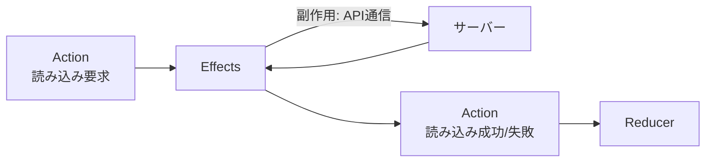

ここからは、副作用を扱うEffectsに入ります。

前章までのReducerとSelectorは、すべて純粋で同期的な世界の話でした。渡された入力から、決まった出力を計算するだけの、予測しやすい世界です。しかし、実際のアプリには、サーバーとの通信という、予測しきれない処理があります。通信は、いつ返ってくるかわからず、失敗することもあります。純粋であるべきReducerに、こうした通信を書くわけにはいきません。この、純粋な世界の外側にある処理を引き受けるのがEffectsです。

この章では、Effectsが何をするのか、アプリ中のActionをどう受け取るのか、`createEffect`でどう書くのかを見ていきます。ここからはRxJSの知識が本格的に必要になるので、不安があれば『RxJSの教科書』を横に置いておくとよいでしょう。

## Effectsとは

Effectsは、Actionを受けて副作用を実行し、その結果をまた新しいActionとして発行する仕組みです。

「副作用」という言葉を、もう一度確認しておきます。副作用とは、純粋関数の外で起きることの総称です。API通信、タイマー、ローカルストレージへの保存などが、これにあたります。これらをReducerに書いてしまうと、Reducerが純粋でなくなり、動きが予測しにくく、テストも難しくなります。そこで、副作用はすべてEffectsという1か所に集めます。こうすれば、Reducerは純粋なまま保てます。



図のとおり、Effectsは、Actionを入り口にして、Actionを出口にします。あいだで通信などの副作用を行いますが、Storeとのやり取りは、あくまでActionを介して行います。だからEffectsは、単方向データフローの流れを乱さずに、その一部としてきれいに収まります。

## ActionsストリームとofType

Effectsは、アプリ内で発行された「すべてのAction」が流れてくるストリームを購読します。このストリームは、`Actions`という名前で注入して受け取ります。

```ts
import { inject } from '@angular/core';
import { Actions, ofType } from '@ngrx/effects';

const actions$ = inject(Actions);
```

`actions$`には、アプリのあらゆるActionが流れてきます。しかし、1つのEffectが反応したいのは、たいてい特定のActionだけです。そこで、目的のActionだけを取り出す必要があります。それを担うのが`ofType`です。

```ts
actions$.pipe(
  ofType(tasksActions.loadTasks), // loadTasksだけを通す
);
```

`ofType`は、RxJSの`filter`によく似ています。すべてのActionが流れてくるストリームから、指定したAction（ここでは`loadTasks`）だけを通し、それ以外は無視します。これで、「`loadTasks`が発行されたときだけ動くEffect」の入り口ができます。

## createEffectでEffectを定義する

Effectは`createEffect`で定義します。Actionを受けて、副作用を実行し、新しいActionを流すストリームを組み立てます。少し長いですが、1行ずつ追えば難しくありません。

```ts:src/app/tasks/tasks.effects.ts
import { inject } from '@angular/core';
import { Actions, createEffect, ofType } from '@ngrx/effects';
import { switchMap, map, catchError, of } from 'rxjs';
import { TaskApi } from './task-api';
import { tasksActions } from './tasks.actions';

export const loadTasks = createEffect(
  (actions$ = inject(Actions), api = inject(TaskApi)) => {
    return actions$.pipe(
      ofType(tasksActions.loadTasks),
      switchMap(() =>
        api.getTasks().pipe(
          map((tasks) => tasksActions.loadTasksSuccess({ tasks })),
          catchError((error) =>
            of(tasksActions.loadTasksFailure({ error: error.message })),
          ),
        ),
      ),
    );
  },
  { functional: true },
);
```

流れを言葉で追います。まず`ofType`で`loadTasks`だけを受け取ります。それが来たら、`switchMap`の中でAPIを呼びます（`api.getTasks()`）。通信が成功したら、`map`で結果を`loadTasksSuccess`というActionに変換して流します。失敗したら、`catchError`で`loadTasksFailure`というActionに変えて流します。こうして流れたActionが、Reducerに届いて状態を更新します。

この書き方は、Effectを関数として定義する「Functional Effects」です。`{ functional: true }`を指定し、必要な依存（`Actions`や`TaskApi`）は`inject`で受け取ります。現行のNgRxで推奨される書き方です。

`switchMap`をなぜここで使うのか、`catchError`をどこに置くべきか、といった話は、この章では立ち入りません。API通信でのOperatorの選び方は次章で、エラー処理の詳細は、その次の章で、じっくり扱います。いまは全体の形をつかんでください。

## Effectsを登録する

定義したEffectは、`provideEffects`で登録します。

```ts:src/app/app.config.ts
import { provideEffects } from '@ngrx/effects';
import * as tasksEffects from './tasks/tasks.effects';

export const appConfig: ApplicationConfig = {
  providers: [
    provideStore(),
    provideState(tasksFeature),
    provideEffects(tasksEffects),
  ],
};
```

`import * as tasksEffects`で、そのファイルのEffectをまとめて読み込み、`provideEffects`に渡しています。登録すると、EffectがActionsストリームの購読を始めます。あとは、対象のActionが発行されるたびに、そのEffectが自動で反応します。一度登録すれば、こちらから呼び出す必要はありません。

## Effectを起点にする流れ

Effectを使うと、コンポーネントは通信の詳細を知らずに済みます。これは大きな利点です。コンポーネントは、ただ「読み込んで」という要求のActionを発行するだけでよくなります。

```ts
// コンポーネント: 読み込みを要求するだけ
ngOnInit() {
  this.store.dispatch(tasksActions.loadTasks());
}
```

あとは、EffectがAPIを呼び、結果のActionを流し、Reducerが状態を更新し、Selectorがコンポーネントへ届けます。コンポーネントは、通信がどう行われるかを一切意識せず、ただ状態の変化を受け取るだけです。「どうやって取ってくるか」と「どう表示するか」の関心が、きれいに分かれます。

## Non-dispatching Effect

多くのEffectは、処理の結果として新しいActionを流します。しかし中には、Actionを流さない副作用もあります。たとえば、ログをコンソールに出すだけ、あるいはローカルストレージに保存するだけ、といった処理です。

こうしたEffectには、`{ dispatch: false }`を指定します。

```ts
export const logActions = createEffect(
  (actions$ = inject(Actions)) => {
    return actions$.pipe(
      tap((action) => console.log('action:', action.type)),
    );
  },
  { functional: true, dispatch: false },
);
```

なぜこの指定が必要かというと、NgRxは既定で、Effectが流す値をActionとして扱い、自動でdispatchしようとするからです。Actionを流さないEffectで`dispatch: false`を付け忘れると、Action以外のもの（この例ではログの戻り値）をdispatchしようとして、エラーになります。「Actionを流さないEffectには`dispatch: false`」と、セットで覚えておいてください。

## まとめ

この章では、Effectsの基本を確認しました。

- Effectsは、Actionを受けて副作用を実行し、新しいActionを流します。
- 副作用をEffectsに集約することで、Reducerを純粋なまま保てます。
- `Actions`ストリームからは、`ofType`で目的のActionだけを取り出します。
- `createEffect`と`{ functional: true }`で、Functional EffectとしてEffectを定義します。
- 登録は`provideEffects`で行い、対象のActionに自動で反応します。
- Actionを流さないEffectには、`{ dispatch: false }`を指定します。

次章では、Effectの中心であるAPI通信を掘り下げます。`switchMap`・`concatMap`・`mergeMap`・`exhaustMap`のどれを選ぶかを、通信の性質から考えます。
