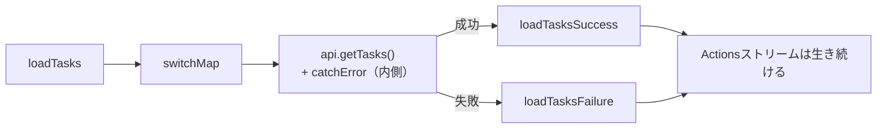

前章で、Effect内のAPI通信とOperatorの選択を見ました。この章では、Effectを実務で正しく動かすために欠かせない3つのテーマを扱います。エラー処理、キャンセル、そして状態の参照です。

とくにエラー処理には、初学者がほぼ必ずはまる落とし穴があります。`catchError`を置く位置を1つ間違えるだけで、Effectが二度と動かなくなるのです。しかも、その症状は「なぜか2回目以降ボタンが効かない」という分かりにくい形で現れます。ここは仕組みから理解して、確実に書けるようにしておきましょう。

## Effectが止まる問題

まず、なぜEffectが止まるのかを理解します。前章までにも触れたとおり、Effectは、Actionsストリームをずっと購読し続けることで動いています。ここに、RxJSの重要な性質がかかわってきます。ストリームにエラーが流れると、そのストリームは終了する、という性質です。

Effectも同じで、内側のAPI通信で起きたエラーを処理しないまま、それが外側のActionsストリームまで伝わると、購読が終わってしまいます。購読が終われば、Effectは以降どんなActionが来ても、二度と反応しません。

```ts
// 危険な例: catchErrorがない
export const loadTasks = createEffect(
  (actions$ = inject(Actions), api = inject(TaskApi)) =>
    actions$.pipe(
      ofType(tasksActions.loadTasks),
      switchMap(() =>
        api.getTasks().pipe(
          map((tasks) => tasksActions.loadTasksSuccess({ tasks })),
          // エラーを処理していない
        ),
      ),
    ),
  { functional: true },
);
```

このEffectは、通信が一度でも失敗すると止まります。ネットワークが一瞬切れただけでも、以降`loadTasks`をdispatchしても、まったく反応しなくなります。ユーザーからは「さっきは動いたのに、急に読み込みボタンが効かなくなった」という、原因の見えない不具合として現れます。

## catchErrorはInnerに置く

止めないための答えは、`catchError`を「API通信のInner Observableの内側」に置くことです。エラーを内側で捕まえて失敗Actionに変えてしまえば、外側のActionsストリームにはエラーが伝わりません。

```ts
// 正しい例: catchErrorをInnerの内側に置く
switchMap(() =>
  api.getTasks().pipe(
    map((tasks) => tasksActions.loadTasksSuccess({ tasks })),
    catchError((error) =>
      of(tasksActions.loadTasksFailure({ error: error.message })),
    ),
  ),
);
```



ここがこの章のいちばんの勘どころです。`catchError`を内側に置くと、失敗は`loadTasksFailure`という「正常な値」に変換されて、外側のストリームへ流れます。外側から見れば、それはエラーではなく普通のActionなので、ストリームは終わりません。だから、何度失敗しても、Effectは動き続けます。

逆に、`catchError`を`switchMap`の外側、つまりActionsストリームのすぐ横に置くと、内側のエラーがそこまで伝わってしまい、その時点でEffect全体が終わります。位置が1つずれるだけで、結果が正反対になるのです。「`catchError`はInnerの内側へ」。この一言を、しっかり覚えてください。

## tapResponseでエラー処理を強制する

エラー処理の書き忘れそのものを防ぐ助けとして、`@ngrx/operators`が`tapResponse`というOperatorを提供しています。

```ts
import { tapResponse } from '@ngrx/operators';
```

`tapResponse`は、成功時の処理と失敗時の処理を、必ず両方書かせる形になっています。しかも、内部でエラーを捕まえてくれるので、ストリームを止めません。書き忘れを、仕組みとして防いでくれるわけです。この`tapResponse`は、ComponentStoreやSignalStoreの非同期処理でとくに活躍します。具体的な使い方は、SignalStoreを扱う章で改めて示します。ここでは、`@ngrx/operators`にエラー処理を助ける道具がある、と知っておいてください。

## 状態を参照する

Effectの中で、いまの状態を参照したいことがあります。たとえば「すでにタスクを読み込み済みなら、もう一度は読み込まない」といった判断をしたい場合です。この判断には、現在の状態を知る必要があります。

このとき使うのが、`@ngrx/operators`の`concatLatestFrom`です。Actionに、Selectorで読み出した現在の状態を添えてくれます。

```ts
import { concatLatestFrom } from '@ngrx/operators';

export const loadTasksIfNeeded = createEffect(
  (actions$ = inject(Actions), store = inject(Store), api = inject(TaskApi)) =>
    actions$.pipe(
      ofType(tasksActions.loadTasks),
      concatLatestFrom(() => store.select(tasksFeature.selectTasks)),
      filter(([, tasks]) => tasks.length === 0), // すでにあれば読み込まない
      switchMap(() =>
        api.getTasks().pipe(
          map((tasks) => tasksActions.loadTasksSuccess({ tasks })),
          catchError((error) =>
            of(tasksActions.loadTasksFailure({ error: error.message })),
          ),
        ),
      ),
    ),
  { functional: true },
);
```

`concatLatestFrom`は、Selectorが返す現在の値を、Actionとペアにして流します。ここでは、`filter`で「タスクがまだ0件のときだけ通す」としているので、すでに読み込み済みなら通信は走りません。無駄な再取得を防げます。

RxJSに詳しい人は「`withLatestFrom`でも代用できるのでは」と思うかもしれません。しかし`withLatestFrom`は、購読を始めるタイミングに癖があり、Effectでは意図しない動きをすることがあります。そのため、Effectで状態を参照するときは、`concatLatestFrom`を使うのが安全とされています。

## Effectをキャンセルする

長い通信や、途中でやめたい処理は、キャンセルできるようにします。実は、読み込みのように`switchMap`を使うEffectは、新しい要求が来ると前の通信を自動で解除するので、それ自体がキャンセルの働きをしています。

そのうえで、明示的な「キャンセル」Actionで止めたいときは、`takeUntil`を使います。

```ts
switchMap(() =>
  api.getTasks().pipe(
    map((tasks) => tasksActions.loadTasksSuccess({ tasks })),
    catchError((error) =>
      of(tasksActions.loadTasksFailure({ error: error.message })),
    ),
    takeUntil(actions$.pipe(ofType(tasksActions.cancelLoad))),
  ),
);
```

`takeUntil`は、指定したストリーム（ここでは`cancelLoad`というActionの流れ）が値を流したら、進行中の処理を打ち切ります。ユーザーが「キャンセル」ボタンを押して`cancelLoad`が発行されると、読み込みが途中で止まります。この購読解除は、内部ではHTTPリクエストそのものの中断につながります。

## エラーの粒度を分ける

最後に、エラー処理の設計について補足します。すべてのエラーを一律に「失敗しました」とだけ扱うと、ユーザーは何が起きたのか、次に何をすればよいのか分かりません。

エラーの種類によって、対応を変えるのが親切です。

- 通信そのものの失敗（ネットワークエラー）なら、再試行を促す
- 入力が不正な業務エラー（HTTPの400番台）なら、何が悪かったかを具体的に伝える
- 認証切れ（401）なら、再ログインへ誘導する

失敗Actionのペイロードに、エラーの種類や内容を含めておくと、Reducerでそれを状態に反映し、画面で適切なメッセージを出せます。エラー処理は、ただ握りつぶさないというだけでなく、ユーザーに次の行動を示すところまで設計する、と考えてください。

## まとめ

この章では、Effectのエラー・キャンセル・状態参照を確認しました。

- Actionsストリームにエラーが伝わると、Effectは止まり、以降のActionに反応しなくなります。
- `catchError`はAPI通信のInner Observableの内側に置き、失敗を失敗Actionに変えます。
- `@ngrx/operators`の`tapResponse`は、エラー処理の書き忘れを防ぐ助けになります。
- 状態を参照するには、`@ngrx/operators`の`concatLatestFrom`を使います。
- `takeUntil`と専用のActionで、進行中のEffectをキャンセルできます。
- 失敗Actionにエラーの種類を含め、ユーザーに次の行動を示せるよう設計します。

次章からは、実務設計に入ります。まず、コレクションを効率よく扱う`@ngrx/entity`を扱います。
