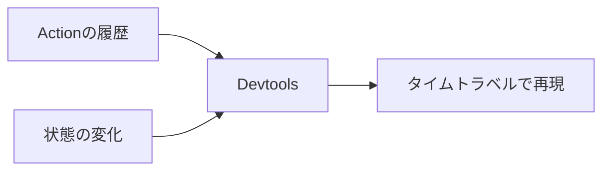

この章では、実務でNgRxをより強く支える、3つの仕組みを扱います。ルーティングの状態を連携させるRouter Store、開発を助けるDevtools、そしてReducer全体に横断的な処理を差し込むMeta-Reducerです。

どれも、それ単体で1章になるほど大きなテーマではありません。しかし、知っておくと、アプリの設計とデバッグがぐっと楽になる道具です。1つずつ、何のためのものかから見ていきます。

## Router Store — ルーティングを状態に取り込む

まず、少し発想の転換から始めます。Angularのルーティング、つまり「いまどのURLにいるか」も、実は一種の状態だと考えられます。現在のURL、ルートのパラメータ（`/tasks/:id`の`:id`など）、クエリパラメータは、時間とともに変化し、画面から参照される情報です。まさに状態です。

`@ngrx/router-store`は、このルーティングの情報を、Storeに取り込んでくれます。登録は、`provideRouterStore`をプロバイダーに加えるだけです。

```ts:src/app/app.config.ts
import { provideRouterStore } from '@ngrx/router-store';

export const appConfig: ApplicationConfig = {
  providers: [
    provideStore(),
    provideRouterStore(),
    // ...
  ],
};
```

これを入れると、ルーティングの状態がStoreに入り、ページを移動するたびに、その遷移を表すActionが自動で発行されるようになります。

## ルート情報をSelectorで読み出す

取り込んだルート情報は、ほかの状態と同じく、Selectorで読み出せます。`getRouterSelectors`が、URLやパラメータを読み出すSelectorを、まとめて提供してくれます。

```ts:src/app/router.selectors.ts
import { getRouterSelectors } from '@ngrx/router-store';

export const {
  selectCurrentRoute, // 現在のルート
  selectUrl, //          現在のURL
  selectRouteParams, //  ルートパラメータ
  selectQueryParams, //  クエリパラメータ
} = getRouterSelectors();
```

これが便利なのは、ルートの情報を、ほかの状態と組み合わせられる点です。たとえば、URLの`/tasks/:id`から`id`を取り出し、そのIDを使ってタスクを引くSelectorを、次のように組み立てられます。

```ts
export const selectTaskFromRoute = createSelector(
  tasksFeature.selectEntities,
  selectRouteParams,
  (entities, params) => entities[params['id']] ?? null,
);
```

こうすると、コンポーネントが自分でURLから値を取り出して、Serviceを呼んでタスクを探す、といった手作業が要らなくなります。「いまどの画面にいて、どのタスクを見ているか」が、すべて状態として一貫して扱えます。

## Devtoolsで状態の変化を追う

セットアップの章で導入したDevtoolsは、実務でとても強力なデバッグ手段になります。あらためて、その使いどころを見ておきましょう。

Devtoolsを使うと、次の操作が行えます。

- 発行されたActionの履歴を、時系列で一覧する
- 各Actionの前後で、状態がどう変わったかを見比べる
- 過去の状態に巻き戻して、そのときの画面を再現する（タイムトラベルと呼ばれます）



状態管理の章の冒頭で、「誰がいつ状態を変えたのか追えない」という問題を挙げました。Devtoolsは、この問題を完全に解決します。すべての変更がActionとして履歴に残り、それぞれの前後の状態も見られるからです。Action設計の章で、Action名を`[発生源] 出来事`の形にこだわったのは、まさにこの履歴を読みやすくするためでした。ここで、その工夫が報われます。

## Meta-Reducer — Reducerを横断する処理

最後は、Meta-Reducerです。少し高度な仕組みなので、こういうものがある、という理解でかまいません。

Meta-Reducerは、Reducerを包んで、すべてのActionに対して横断的な処理を差し込む仕組みです。通常のReducerが「特定のActionに反応する」のに対し、Meta-Reducerは「すべてのActionが必ず通る関所」に立ちます。

コードとしては、Reducerを受け取って、新しいReducerを返す関数です。

```ts:src/app/meta-reducers.ts
import { ActionReducer } from '@ngrx/store';

export function loggerMetaReducer(
  reducer: ActionReducer<AppState>,
): ActionReducer<AppState> {
  return (state, action) => {
    console.log('action:', action.type);
    console.log('前の状態:', state);
    const next = reducer(state, action); // 本来のReducerを呼ぶ
    console.log('次の状態:', next);
    return next;
  };
}
```

この`loggerMetaReducer`は、本来のReducerを呼ぶ前後に、ログ出力をはさんでいます。どんなActionが来ても、この関所を通るので、すべての状態遷移がログに残ります。登録は、`provideStore`の設定で行います。

```ts
provideStore({}, { metaReducers: [loggerMetaReducer] });
```

## Meta-Reducerの使いどころ

Meta-Reducerが向くのは、特定のActionではなく、状態全体やすべてのActionにかかわる処理です。代表的なものを挙げます。

- **ログの記録**: すべてのActionと状態遷移を記録する（先ほどの例）
- **状態の保存と復元**: 状態をローカルストレージに保存し、次回の起動時に復元する
- **ログアウト時のリセット**: ログアウトのActionで、状態全体をまるごと初期値に戻す

とくにログアウト時のリセットは、よく使うパターンです。

```ts
export function resetOnLogoutMetaReducer(
  reducer: ActionReducer<AppState>,
): ActionReducer<AppState> {
  return (state, action) => {
    // ログアウトActionのときは、状態をundefinedにして初期化させる
    return reducer(action.type === authActions.logout.type ? undefined : state, action);
  };
}
```

仕組みはこうです。Reducerに状態として`undefined`を渡すと、各Reducerは初期値から始まります。この性質を利用して、ログアウトActionのときだけ`undefined`を渡し、状態全体をリセットしています。もしMeta-Reducerがなければ、個々のReducerすべてに「ログアウトされたら初期化する」処理を書く必要があります。横断的な関心事は、こうしてMeta-Reducerに集約すると、1か所で済み、見通しがよくなります。

## まとめ

この章では、Router Store・Devtools・Meta-Reducerを確認しました。

- `@ngrx/router-store`は、URLやパラメータを状態として取り込みます。
- `getRouterSelectors`で、ルート情報をSelectorとして読み出し、ほかの状態と組み合わせられます。
- Devtoolsは、Action履歴・状態変化・タイムトラベルで、状態管理を可視化します。
- Meta-Reducerは、Reducerを包み、すべてのActionに横断的な処理を差し込みます。
- ログ記録、状態の保存と復元、ログアウト時のリセットに向いています。

次章では、実務で頻出する、読み込み中・エラー・キャッシュの状態を、どう設計するかを扱います。
