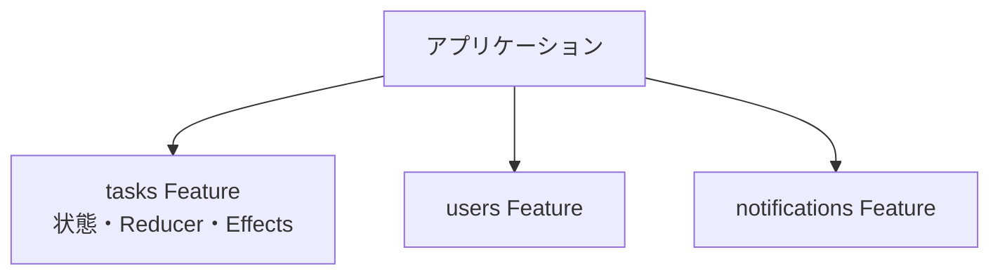

実務設計の締めくくりとして、これまでの部品を、大規模なアプリケーションでどう構成するかを扱います。

アプリが大きくなると、状態もEffectsもファイルも、どんどん増えていきます。何も考えずにすべてを1か所へ集めてしまうと、全体を見通せなくなり、どこを触れば何が変わるのかが分からなくなります。そこで、機能ごとに状態を分け、必要になったときだけ読み込む、という構成にします。

Featureの分割、遅延読み込みとの連携、状態の境界の保ち方を通じて、ここまで学んだ部品を実際のアプリの骨格へ組み上げます。

## Featureで分割する

`createFeature`の章で、Featureが「状態・Reducer・Selectorをまとめた、自己完結の単位」だと確認しました。大規模化への基本は、この単位でアプリを分けることです。

タスク、ユーザー、通知、といった機能ごとに、それぞれFeatureを作ります。各Featureは、自分の状態とEffectsを持ち、ほかのFeatureのことは知りません。



こうしておくと、新しい機能を追加するときは、新しいFeatureを1つ足すだけで済みます。既存のFeatureに手を入れる必要がないので、変更の影響が、追加したFeatureの内側に収まります。「1か所を直したら、思わぬ別の場所が壊れた」という事故が起きにくくなります。

## ルート単位で状態を登録する

大規模アプリでは、すべての機能を最初から読み込むと、初期表示が重くなります。そこでAngularには、画面に必要になったときだけコードを読み込む「遅延読み込み」という仕組みがあります。NgRxの状態も、これに合わせて登録できます。

ルートの`providers`に`provideState`と`provideEffects`を置くと、そのルートが読み込まれたタイミングで、Featureの状態とEffectsが登録されます。

```ts:src/app/tasks/tasks.routes.ts
import { Routes } from '@angular/router';
import { provideState } from '@ngrx/store';
import { provideEffects } from '@ngrx/effects';
import { tasksFeature } from './tasks.feature';
import * as tasksEffects from './tasks.effects';

export const tasksRoutes: Routes = [
  {
    path: '',
    providers: [
      provideState(tasksFeature),
      provideEffects(tasksEffects),
    ],
    // component または children
  },
];
```

ここが、これまでと違う点です。セットアップの章では、状態を`app.config.ts`（アプリ全体の設定）に登録していました。それに対してここでは、tasks機能のルートに登録しています。こうすると、ユーザーがタスク画面を開くまで、tasksの状態とEffectsは読み込まれません。

使い分けの目安は、こうです。アプリ全体で常に必要な状態（ログイン中のユーザー情報など）は、`app.config.ts`のルートに。特定の機能でだけ使う状態は、その機能のルートに登録します。

## rootの状態とfeatureの状態

いま出てきた使い分けを、もう少し整理します。状態には、アプリ全体で共有するもの（rootと呼びます）と、特定の機能に閉じたもの（featureと呼びます）があります。

| 種類 | 例 | 登録場所 |
|---|---|---|
| root | 認証情報、全体の設定 | `app.config.ts` |
| feature | タスク一覧、通知一覧 | 各機能のルート |

実際には、多くの状態はfeature側で足ります。rootに置くのは、本当にアプリ全体で必要なものだけに絞ります。なぜなら、rootの状態が増えると、アプリ起動時に読み込む量が増えて初期表示が重くなり、状態全体の見通しも悪くなるからです。「これは本当に全体で必要か」を、rootに置く前に一度考える習慣をつけるとよいでしょう。

## フォルダ構成

ファイルの並べ方にも、方針を持っておきましょう。基本は、機能ごとにまとめることです。1つの機能に関するファイルを、1つのフォルダに集めます。

```text
src/app/tasks/
  tasks.actions.ts
  tasks.reducer.ts
  tasks.feature.ts
  tasks.effects.ts
  tasks.selectors.ts
  tasks.routes.ts
```

別の並べ方として、種類ごと（すべてのactionsを1つのフォルダに、すべてのreducersを別のフォルダに）に分ける方法もあります。しかし、機能ごとにまとめるほうが、その機能を触るときに、関連ファイルが1か所に集まっていて探しやすくなります。機能を丸ごと削除するときも、フォルダごと消せば済みます。

## 状態の境界を守る

大規模化でとくに大事なのが、状態の境界を守ることです。あるFeatureが、別のFeatureの状態を直接いじり始めると、せっかくFeatureに分けた意味が薄れてしまいます。

境界を守るための指針を、3つ挙げます。

- **他のFeatureの状態は、公開されたSelectorを通して読む**。内部の構造に直接触れない。
- **他のFeatureの状態を変えたいときは、Actionを通す**。他のReducerを直接呼ばない。
- **どうしても複数の機能で共有したい状態は、共有用のFeatureを1つ作る**。

たとえば、通知機能が「未完了タスクの件数」を表示したいとします。このとき、通知機能は、タスクFeatureが公開している`selectTotal`のようなSelectorを読みます。通知機能が、タスクの状態を直接書き換えることはしません。関わり方をSelectorとActionだけに限ると、Featureどうしのつながりがゆるく保たれ、片方の変更がもう片方に波及しにくくなります。

## 増えたときに見直す観点

構成は、最初から完璧を目指す必要はありません。むしろ、小さいうちは1つのFeatureで始め、アプリが育つにつれて分割していく、という進め方が現実的です。見直しの合図になる観点を挙げておきます。

- 1つのFeatureの状態が、大きくなりすぎていないか
- 複数の機能が、同じ状態を奪い合っていないか
- rootの状態に、特定の機能だけのものが混ざっていないか

こうした兆候に気づいたら、Featureを分けたり、境界を引き直したりします。状態の構成は、一度決めて終わりではなく、アプリの成長に合わせて育てていくものです。そして、そもそも「どこまでをNgRxで管理するか」という、より大きな判断については、本書の最終章であらためて扱います。

## まとめ

この章では、大規模アプリケーションの構成を確認しました。

- 機能ごとにFeatureで分割し、変更の影響をFeatureの内側に収めます。
- ルートの`providers`に`provideState`・`provideEffects`を置き、遅延読み込みと連携します。
- root（全体共有）とfeature（機能に閉じる）を意識し、rootの肥大化を避けます。
- ファイルは機能ごとのフォルダにまとめると、探しやすく、削除もしやすくなります。
- 他のFeatureへはSelectorとActionを通して関わり、状態の境界を守ります。
- 構成は最初から完璧を目指さず、アプリの成長に合わせて見直します。

次章からは、Signalsをベースにした新しい状態管理、SignalStoreに入ります。
