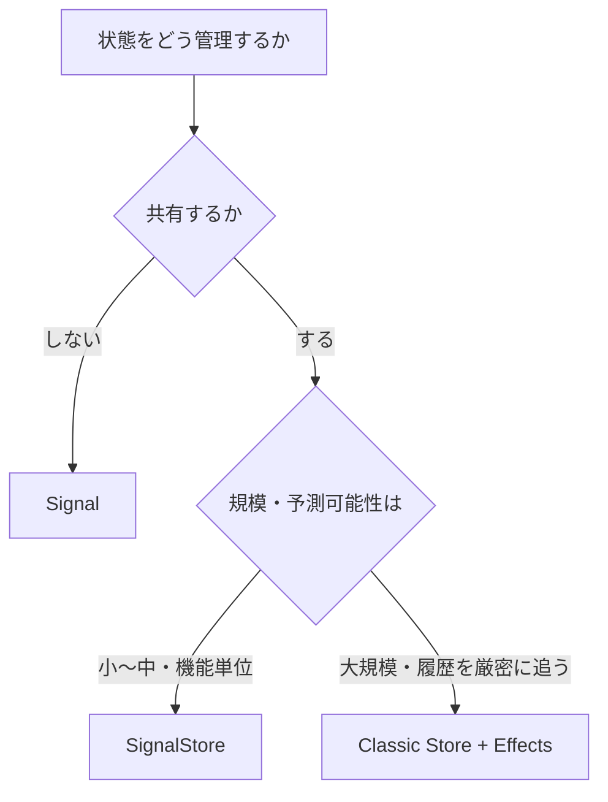

本書の締めくくりとして、状態管理手法の使い分けと、NgRxの導入戦略を扱います。

ここまで、Classic Store、SignalStore、ComponentStoreと、いくつもの手法を学んできました。しかし、忘れてはいけないことがあります。状態管理は、NgRxがすべてではありません。Angular標準のSignalやServiceで足りる場面も、たくさんあります。学んだ道具を、いつでも使うのが正解というわけではありません。目の前の状態に、どの手法が見合うかを判断できることが、何より重要です。

この章では、選択肢を並べ、使い分けの基準を整理し、導入と縮小の判断を考えます。本書で身につけた知識を、実際のプロジェクトでどう活かすか、という総まとめです。

## 状態管理の選択肢

Angularで状態を扱う手段を、軽いものから順に並べてみます。

| 手法 | 向く範囲 | 特徴 |
|---|---|---|
| Signal（コンポーネント内） | 1つのコンポーネント | もっとも軽い。共有しない状態に |
| Service ＋ Signal | いくつかのコンポーネント | 手軽に共有できる。規律は自前で守る |
| SignalStore | 機能単位・局所 | 記述が少なく、状態をまとめられる |
| Classic Store ＋ Effects | アプリ全体・大規模 | 予測可能性が高い。記述は多い |

上にいくほど軽く、下にいくほど規律と機能が増えます。状態の性質に応じて、この中から選びます。表の上下は、優劣の順位ではありません。それぞれに向き不向きがあるだけです。小さな状態にClassic Storeを使うのは重すぎますし、アプリ全体の複雑な状態をSignalだけで捌くのは無理があります。

## 使い分けの基準

では、どれを選べばよいのでしょうか。いくつかの問いを立てると、判断できます。

- **共有範囲**: その状態は、1つのコンポーネントで完結するか、複数で共有するか、アプリ全体か
- **規模**: 状態の種類はいくつあるか、更新の経路は複雑か
- **予測可能性**: 変更の履歴を、DevToolsで厳密に追う必要があるか
- **非同期の複雑さ**: 通信の競合やキャンセルを、きちんと制御する必要があるか

これらの答えから、おおよその対応が見えてきます。共有しない小さな状態はSignalで。いくつかのコンポーネントで共有するならServiceかSignalStoreで。機能単位でまとまった状態はSignalStoreで。アプリ全体で予測可能性が重要ならClassic Storeで、という具合です。

## 迷ったら軽いほうから

判断に迷ったときの、実践的な指針があります。軽いほうから始める、ということです。

最初からClassic Storeを入れると、小さなアプリには記述が重く、かえって開発が遅くなります。まずSignalやServiceで書いてみて、共有や複雑さが増えて手に負えなくなってきたら、SignalStoreへ、さらに必要ならClassic Storeへと、段階的に引き上げていきます。

なぜこの順番がよいかというと、状態管理は、あとから強い手法へ移すのは比較的やさしい一方、過剰に導入してしまった仕組みを外すのは、手間がかかるからです。足りなくなってから足すほうが、余ってから削るより楽なのです。「必要になったら強くする」を基本方針にしてください。

## 段階的に導入する

すでにあるアプリに、新しくNgRxを入れるときも、一度に全部を置き換えたりはしません。段階的に進めます。

1. もっとも状態管理に困っている機能を、1つ選ぶ
2. その機能だけを、FeatureとしてNgRx化する
3. 効果を確かめ、ほかの機能へ広げるかどうかを判断する

大規模アプリケーションの構成の章で見たとおり、NgRxはFeature単位で導入できます。だから、1つの機能ずつ移していけます。こうすると、影響範囲を小さく抑えられ、チームも新しいやり方に少しずつ慣れていけます。アプリ全体を一気に書き換えるのは、リスクが大きく、途中で頓挫しがちです。小さく始めて、効果を確かめながら広げる、という進め方が現実的です。

## 既存Serviceから移行する

`BehaviorSubject`を使ったServiceで状態を管理している既存コードは、実によく見かけます。これをNgRxへ移すときの、負担の少ない道筋を示します。

状態管理の章で見たような、更新メソッドがあちこちに散らばったServiceは、まずSignalStoreに置き換えるのがおすすめです。ServiceのメソッドをSignalStoreの`withMethods`に、`BehaviorSubject`が持っていた値を`withState`に移します。ComponentStoreとの対応を見た章と同じ要領で、機械的に進められます。

そして、さらに予測可能性が必要になったら、そこからClassic Storeへ引き上げます。Serviceから、いきなり全面的にClassic Storeへ移すより、いったんSignalStoreを経由するほうが、1段ずつ進められて安全です。急がば回れ、というわけです。

## NgRxを縮小する判断

導入する判断だけでなく、縮小する判断も、設計の一部です。ここは見落とされがちなので、あえて触れておきます。

NgRxを入れてみたものの、実際にはほとんど共有されていない状態や、単純なCRUD（作成・読み取り・更新・削除）だけの機能があるかもしれません。そうした場所は、SignalStoreやServiceへ戻すことで、記述を減らせます。Classic Storeは強力ですが、その規律が不要な場所では、重さだけが残ってしまいます。

見直しの合図は、こうです。ActionとReducerが、単に値を出し入れするだけになっていないか。Effectが、通信を右から左へ受け流すだけの、薄いものになっていないか。もし予測可能性という利点を活かせていないなら、より軽い手法で足りるかもしれません。「入れたものを、そのままにしない」勇気も、良い設計につながります。

## 手法は組み合わせられる

最後に、大事なことを1つ。これらの手法は、どれか1つを選んだら、ほかを使ってはいけない、というものではありません。1つのアプリの中で、組み合わせて使えます。

アプリ全体の中核的な状態はClassic Storeで、ある画面に閉じた複雑な状態はSignalStoreで、小さなUIの状態はSignalで、というように使い分けられます。すべてを1つの手法で統一する必要はありません。むしろ、それぞれの状態に見合った手法を選ぶことが、結果として、いちばん保守しやすい構成になります。

本書で身につけたのは、NgRxのAPIの知識だけではありません。状態をどう設計し、どの手法をどこまで使うかを、根拠を持って判断する力です。その判断力は、NgRxを使うときも、あえて使わないと決めるときも、同じように役立ちます。それこそが、本書がいちばん伝えたかったことです。

## まとめ

この章では、状態管理手法の使い分けと導入戦略を確認しました。

- 状態管理には、Signal・Service・SignalStore・Classic Storeという段階があります。
- 共有範囲・規模・予測可能性・非同期の複雑さで、どれを選ぶかを判断します。
- 迷ったら軽いほうから始め、必要になったら強い手法へ引き上げます。
- 既存アプリへはFeature単位で段階的に導入し、全面的な書き換えは避けます。
- 既存Serviceは、まずSignalStoreへ移すと負担が少なくなります。
- 手法は組み合わせて使え、状態に見合った選択が、最も保守しやすくなります。

これで本書の本編は終わりです。状態管理の課題から始め、単方向データフロー、Store・Action・Reducer・Selector、Effects、Entity、SignalStore、テスト、そして使い分けまでを見てきました。巻末の付録には、APIの早見表、設計のチェックリスト、用語集を用意しています。設計に迷ったときは、いつでも戻ってきてください。
