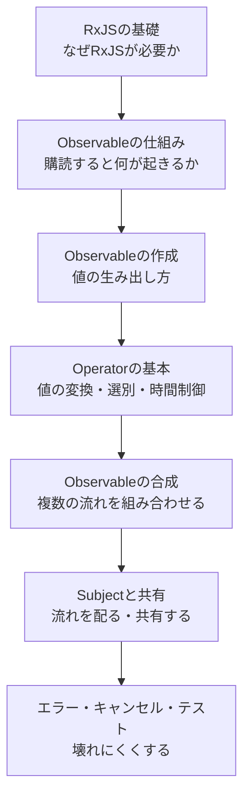
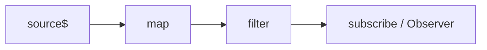
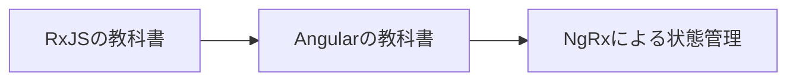

本書は、RxJSを使って非同期処理を「時間とともに流れる値」として設計できるようになるための教科書です。

RxJSの使い方だけを短く知りたいなら、公式ドキュメントやサンプルコードを読むだけでも足ります。けれども、実際の開発では「このOperatorで合っているのか」「なぜ`subscribe`しないと動かないのか」「Subjectを使うべきか、使わずに済むのか」といった判断が何度も出てきます。名前や書き方を覚えるだけでは、この判断ができるようになりません。

Operatorの一覧を暗記することは、本書の目標ではありません。Observableの仕組みから始めて、値がどこで生まれ、どう変換され、どこで消えるのかを追う。そうやって、非同期処理をストリームとして組み立てる力を養います。

## 本書で目指すもの

本書が目指すのは、APIを覚えることではありません。非同期処理をストリームとして捉え、目的に合ったOperatorを選び、保守しやすい処理を設計できるようになることです。

そのために、次の3つを軸にして進めます。

- **仕組みから理解すること**: Operatorの名前や使い方を覚える前に、「なぜObservableは購読するまで動かないのか」「なぜ`switchMap`は古い処理を捨てられるのか」を仕組みから説明します。仕組みがわかれば、はじめて見るOperatorでも動きを予測できます。
- **subscribeの位置を意識すること**: Observableは、作っただけでは何も起きません。どこで購読が始まり、どこで購読が終わるのか。この2点を、図とコードで繰り返し確認します。RxJSのつまずきの多くは、この意識が抜けたときに起きます。
- **選べるようになること**: RxJSには、よく似たOperatorがいくつもあります。`mergeMap`と`switchMap`、`combineLatest`と`withLatestFrom`、`share`と`shareReplay`。本書では、似たものを必ず並べて比較し、「いつ・どれを選ぶか」を示します。

RxJSは強力なライブラリです。だからこそ、仕組みを曖昧にしたまま書くと、動いているのか止まっているのかわからないコードになりがちです。その曖昧さを、一つずつ減らしていきます。

## 対象読者

本書は、次のような読者を想定しています。

- RxJSをこれから学び始める人
- 一度RxJSを触ったが、Operatorの選び方に自信が持てない人
- `subscribe`の中で`subscribe`を書いてしまうのをやめたい人
- Angular学習の前提として、RxJSの土台を固めておきたい人
- 非同期処理を、命令的なコードから宣言的なストリームへ書き換えたい人

RxJSの経験は前提にしません。最初は`of`のような小さなObservableから始め、少しずつ複雑な処理へ進みます。

ただし、JavaScriptとTypeScriptの基本文法は知っているものとして進めます。変数、関数、アロー関数、オブジェクト、配列の`map`や`filter`、そして`Promise`と`async` / `await`がわかっていれば読み進められます。特に`Promise`の考え方は、Observableと比べる場面で何度も登場します。

## 本書の構成

本書は、次の7つの段階を順番に進みます。前の段階が次の段階の土台になるため、はじめて学ぶ場合は順番に読むことをおすすめします。



各段階で扱う章は次のとおりです。

| 段階 | 扱う内容 |
|---|---|
| RxJSの基礎 | 「非同期処理とリアクティブプログラミング」「ストリームとRxJSの全体像」「はじめてのRxJS」 |
| Observableの仕組み | 「Observable・Observer・subscribeの仕組み」「Subscription・購読解除・Observableの自作」「ColdとHot・同期と非同期」 |
| Observableの作成 | 「Observableを作る」「特殊なObservableとPromise相互変換」 |
| Operatorの基本 | 「Operatorとpipe・Marble Diagramの読み方」「値を変換・選別・蓄積する」「件数と時間を制御する」 |
| Observableの合成 | 「最新値を組み合わせる」「完了待ちと到着順」「Higher-order ObservableとNested Subscribe」「Flattening Operator」 |
| Subjectと共有 | 「SubjectとMulticast」「shareとshareReplay・Subjectによる状態管理」 |
| エラー・キャンセル・テスト | 「エラー処理・再試行・キャンセル」「テストとデバッグ」 |

前半は、Observableという「処理の設計図」がどう動くのかを丁寧に見ます。ここを飛ばすと、後半のOperatorが「なんとなく動く道具」になってしまいます。中盤からOperatorとObservableの合成に入り、後半でSubjectによる共有、エラー処理、テストへ進みます。

本書の巻末には、Operatorの早見表、古い書き方からの移行ガイド、用語集を付録として用意しています。学習中の索引として使ってください。

## 本書で扱う題材

RxJSの学習では、Operatorごとに例が変わりがちです。話がばらばらにならないよう、小さな題材をいくつか繰り返し使います。

- **カウンターとタイマー**: `interval`や`scan`で、時間とともに増える値を扱います。
- **ボタンのクリック**: `fromEvent`でDOMイベントをObservableにし、Hotな流れや時間制御を学びます。
- **インクリメンタル検索**: 入力を受け取り、APIへ問い合わせ、結果を表示する流れです。`debounceTime`、`distinctUntilChanged`、`switchMap`が一度に必要になる、RxJSらしい題材です。
- **擬似的なHTTP通信**: `timer`と`map`で、通信の遅延を模したObservableを作ります。外部のサーバーがなくても、通信に近い挙動を試せます。

同じ題材が章をまたいで少しずつ洗練されていきます。たとえばインクリメンタル検索は、時間制御を学ぶ章で登場し、Flattening Operatorの章で完成します。そのつながりを追うことで、Operatorが単独の道具ではなく、設計の部品であることが見えてきます。

## サンプルコードの前提

本書のサンプルコードは、次を前提とします。

- **RxJS 7.8系**（Angularが依存している現行の安定バージョン）
- **TypeScript**（strictモード）

RxJS 7系では、Creation関数もOperatorも`rxjs`からまとめてimportします。本書はこの形に統一します。

```ts
import { of, interval, fromEvent } from 'rxjs';
import { map, filter, switchMap } from 'rxjs';
```

古いコードでは、Operatorを`rxjs/operators`からimportしていることがあります。これは6系までの書き方です。読み替えられるように、移行の詳しい内容は付録で扱います。

```ts
// 古い書き方（本書では使いません）
import { map } from 'rxjs/operators';
```

Observableを入れる変数には、末尾に`$`を付ける慣習に従います。`clicks$`や`result$`のように書くと、その変数がObservableであることがひと目でわかります。

```ts
const clicks$ = fromEvent(button, 'click');
```

実際に手を動かす環境の準備は、「はじめてのRxJS」の章で説明します。ここでは、コードがどのような前提で書かれているかだけ押さえておけば十分です。

## コードと図の読み方

本書では、文章だけで説明せず、要所で図を使います。RxJSで使う図は、大きく2種類あります。

1つは、処理の構造や流れを表す図です。Observableがどのようにつながっているか、値が誰に配られるか。こうした「仕組み」を表すときに使い、mermaidで描きます。



もう1つは、値が時間とともにどう流れるかを表す図です。RxJSではこれをMarble Diagram（マーブルダイアグラム）と呼びます。時間を左から右への流れとして表し、次の記号を使います。

| 記号 | 意味 |
|---|---|
| 左→右 | 時間の経過 |
| `-` | 時間の経過（値なし） |
| `1` `a` | その時刻に流れた値 |
| `|` | complete（完了） |
| `X` | error（エラー） |

たとえば、値を10倍する`map`は、次のように表せます。上段が入力、下段が出力です。

```text
source: --1--2--3--|
             map(x => x * 10)
output: --10-20-30-|
```

Marble Diagramの詳しい読み方は、「Operatorとpipe・Marble Diagramの読み方」の章で改めて説明します。ここでは、こうした図が値の流れを表すものだと知っておけば十分です。

また、コード例では、`subscribe`で受け取った値をコメントで示します。

```ts
import { of } from 'rxjs';

of(1, 2, 3).subscribe((value) => console.log(value));

// 出力:
// 1
// 2
// 3
```

## 公式ドキュメントとの付き合い方

本書は、公式ドキュメントの代わりではありません。すべてのOperatorを網羅するリファレンスではなく、仕組みから理解して選べるようになるための本です。

個々のOperatorの引数や細かい挙動を確認したいときは、公式ドキュメント（rxjs.dev）もあわせて参照してください。特に、Operatorのページに載っているMarble Diagramは、動きを確認するのに役立ちます。仕組みは本書でつかみ、細部は公式ドキュメントで当たる。この行き来ができるようになると、学習の速度が上がります。

## シリーズ内での位置付け

本書は、Web開発を学ぶための教科書シリーズの一冊です。シリーズのうち、フロントエンド開発に向かう本は、次の順番で読むことを想定しています。



本書『RxJSの教科書』は、その土台にあたります。RxJSはAngular開発の多くの場面で登場し、NgRxではさらに深く使われます。ここで仕組みを固めておくと、後続の本が格段に読みやすくなります。

そのため本書では、RxJSそのものの仕組みに集中します。AngularでのRxJSの使い方（`HttpClient`、テンプレートでの購読、Signalsとの連携）や、NgRx EffectsでのOperator選択は、シリーズの後続の本で扱います。

## 仕組みを理解し、Operatorを選べることが本書の目標

本書の目的、対象読者、構成、コードと図の読み方を整理します。

- 非同期処理をストリームとして設計できるようになることを目指します。
- 「仕組みから理解する」「subscribeの位置を意識する」「似たOperatorを選べるようにする」の3つを軸に進めます。
- 7つの段階を順番に進み、Observableの仕組みから、合成、共有、エラー処理、テストまでを扱います。
- サンプルはRxJS 7.8・TypeScriptを前提とし、値の流れはMarble Diagramで、構造はmermaidで図示します。

次章では、そもそもなぜ非同期処理は複雑になるのかを見ていきます。コールバックやPromiseで感じる難しさを整理し、RxJSがどんな問題を解こうとしているのかを明らかにします。
