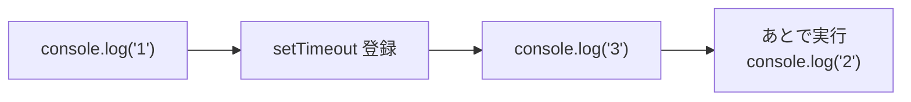
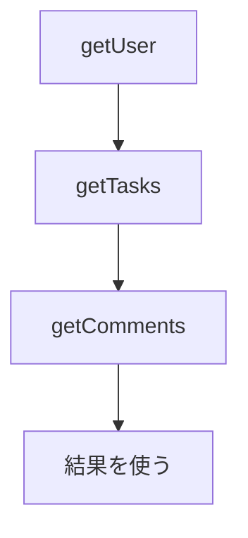
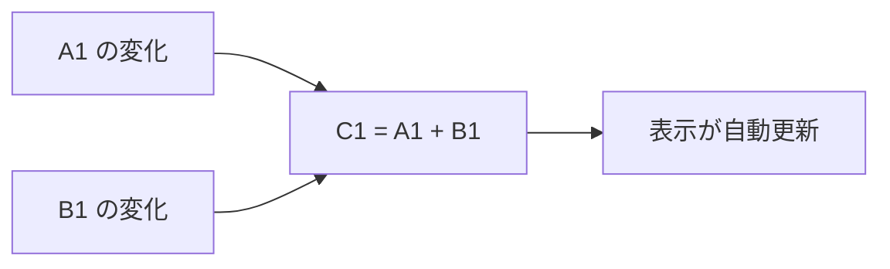
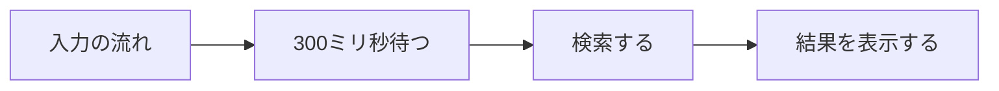

この章では、そもそもなぜ非同期処理が複雑になるのかを整理します。

非同期処理とは、ひとことでいえば「結果がすぐには返ってこない処理」のことです。ボタンがクリックされるのを待つ、サーバーからデータを取ってくる、一定時間後に何かを実行する。こうした「いつ終わるか、いつ起きるかが前もってわからない処理」は、書き方を少し誤るだけで、とたんに追いにくくなります。

RxJSを学び始める前に、RxJSが解こうとしている問題を先に見ておきます。道具の使い方から入るより、その道具が何のためにあるのかを先に知っておくほうが、あとの理解が深まるからです。コールバックや`Promise`で感じる難しさがどこから来るのかがわかると、Observableという仕組みが「なぜこういう形なのか」を、納得しながら読めるようになります。

前半では、非同期処理の種類と、コールバックや`Promise`では表現しにくい場面を確認します。後半では、その問題に別の角度から向き合う「リアクティブプログラミング」という考え方を紹介します。

## 同期処理と非同期処理

まず、同期処理と非同期処理の違いを確認します。

同期処理は、上から順番に実行され、ひとつの処理が終わるまで次へ進みません。処理が終わるのを「待つ」動き方です。

```ts
const a = 1 + 2;
const b = a * 10;
console.log(b); // 30
```

このコードは、上から順に実行されます。結果を予測するのは難しくありません。

一方、非同期処理は、結果がすぐには手に入りません。処理を始めたあと、いったん先へ進み、結果が用意できたときに続きを実行します。

```ts
console.log('1');
setTimeout(() => {
  console.log('2');
}, 0);
console.log('3');

// 出力:
// 1
// 3
// 2
```

`setTimeout`に渡した関数は、待ち時間を`0`にしても、すぐには実行されません。いまの処理をすべて終えてから実行されます。そのため、出力は`1`、`3`、`2`の順になります。

コードの見た目の順番と、実際に実行される順番が一致しない。これが、非同期処理を難しく感じる最初の原因です。



## 非同期処理はどこにあるか

Webアプリケーションでは、非同期処理はあらゆる場所に現れます。代表的なものを整理します。

| 種類 | 例 | 値は何回来るか | いつ来るか |
|---|---|---|---|
| ユーザー操作 | クリック、入力、スクロール | 何回も | わからない |
| HTTP通信 | APIからのデータ取得 | 基本は1回 | しばらく後 |
| タイマー | `setTimeout`、`setInterval` | 1回または繰り返し | 指定した時間後 |
| WebSocket | サーバーからの通知 | 何回も | 継続的に |

種類によって違うのは、値が何回来るか、そして、いつ来るかです。

HTTP通信は、基本的に1回だけ結果が返ります。これは`Promise`が得意な形です。しかし、クリックやWebSocketは、値が何回も、しかもいつ来るかわからないタイミングで届きます。この違いが、あとで効いてきます。

## コールバックによる処理

非同期処理を扱う最も古い方法が、コールバックです。「処理が終わったら、この関数を呼んでください」と、関数を渡しておく書き方です。

```ts
setTimeout(() => {
  console.log('1秒たちました');
}, 1000);
```

イベントの購読も、同じ考え方です。

```ts
button.addEventListener('click', () => {
  console.log('クリックされました');
});
```

ひとつの非同期処理を扱うだけなら、コールバックで十分です。問題が起きるのは、複数の非同期処理を組み合わせたときです。

## 複数の非同期処理が組み合わさる問題

たとえば、ユーザーを取得し、そのユーザーのタスクを取得し、さらに最初のタスクのコメントを取得する、という処理を考えます。前の結果を使って次の処理を呼ぶため、コールバックが入れ子になります。

```ts
getUser(userId, (user) => {
  getTasks(user.id, (tasks) => {
    getComments(tasks[0].id, (comments) => {
      console.log(comments);
    });
  });
});
```

処理が増えるほど、右へ右へと深くなっていきます。この入れ子は「コールバック地獄」と呼ばれ、読みにくさの代名詞になりました。



図にすれば一直線の流れですが、コードでは入れ子で表現されます。さらに、それぞれの処理でエラーが起きる可能性があるため、エラー処理を各段階に書くと、コードはますます複雑になります。

## Promiseによる処理

この入れ子を平らにするために登場したのが`Promise`です。`Promise`は「いまはまだないが、あとで手に入る1つの値」を表します。

`Promise`を返す関数なら、`.then()`をつなげて書けます。

```ts
getUser(userId)
  .then((user) => getTasks(user.id))
  .then((tasks) => getComments(tasks[0].id))
  .then((comments) => console.log(comments))
  .catch((error) => console.error(error));
```

入れ子が消え、上から下へ読めるようになりました。エラー処理も、最後の`.catch()`にまとめられます。

さらに`async` / `await`を使うと、同期処理のような見た目で書けます。

```ts
try {
  const user = await getUser(userId);
  const tasks = await getTasks(user.id);
  const comments = await getComments(tasks[0].id);
  console.log(comments);
} catch (error) {
  console.error(error);
}
```

`Promise`は、非同期処理を大きく書きやすくしました。1回の結果を待つ処理なら、これで十分です。

## Promiseだけでは表現しにくい処理

しかし、`Promise`には苦手な場面があります。3つ挙げます。

第一に、`Promise`が扱えるのは**1つの値だけ**です。一度`resolve`すると、それで終わりです。クリックのように何回も発生するものは、`Promise`では表現できません。結局、コールバックである`addEventListener`に戻ることになります。

```ts
// クリックは何回も起きるので、Promiseでは表せない
button.addEventListener('click', () => {
  console.log('クリックされました');
});
```

第二に、`Promise`は**キャンセルできません**。一度始めた処理を途中でやめる仕組みが、`Promise`そのものにはありません。

第三に、`Promise`は**作った時点で実行が始まります**。次の節で見るように、これは処理を組み立て直したいときに不便です。

表にすると、次のとおりです。

| 観点 | `Promise` |
|---|---|
| 扱える値の数 | 1つだけ |
| キャンセル | 標準ではできない |
| 実行のタイミング | 作った時点ですぐ始まる |
| 複数回の値 | 表現できない（コールバックに戻る） |

## キャンセル可能な非同期処理

キャンセルの難しさを、もう少し具体的に見ます。

検索フォームを考えます。ユーザーが文字を入力するたびにAPIへ問い合わせると、古い問い合わせの結果があとから返ってきて、新しい結果を上書きしてしまうことがあります。これを防ぐには、新しい入力が来た時点で、古い問い合わせをキャンセルしたくなります。

`Promise`とfetchでこれを行うには、`AbortController`を自分で管理します。

```ts
const controller = new AbortController();

fetch('/api/search?q=rxjs', { signal: controller.signal })
  .then((response) => response.json())
  .then((data) => console.log(data))
  .catch((error) => {
    if (error.name === 'AbortError') {
      console.log('キャンセルされました');
    }
  });

// 新しい入力が来たら、前の問い合わせを止める
controller.abort();
```

できないわけではありません。ただし、コントローラーの生成、`signal`の受け渡し、`AbortError`の判定を、そのつど手作業で書く必要があります。「新しい値が来たら古い処理をやめる」という、よくある要求を、毎回組み立て直すことになります。

RxJSでは、このキャンセルが購読を解除するという1つの考え方に統一されます。詳しくは「Subscription・購読解除・Observableの自作」の章で扱います。

## 時間とともに複数の値を受け取る処理

ここまでの話を、1枚の表にまとめます。値が「1つか、複数か」と、「すぐ手に入るか、あとで手に入るか」で分けると、次の4つに整理できます。

| | 単一の値 | 複数の値 |
|---|---|---|
| 同期（すぐ手に入る） | 関数の戻り値 | 配列・Iterable |
| 非同期（あとで手に入る） | `Promise` | ？ |

この表は、非同期処理を理解するうえでとても役に立ちます。関数の戻り値は「すぐ手に入る、1つの値」。配列は「すぐ手に入る、複数の値」。`Promise`は「あとで手に入る、1つの値」。では、右下、つまり「あとで手に入る、複数の値」はどうでしょうか。ここが空いています。クリックの連続、WebSocketの通知、一定間隔のタイマー。これらはすべて、この空欄に入ります。

```text
クリック: ---c--c-----c--c--------c-->
```

時間とともに、いつ来るかわからないタイミングで、値が何度も届く。この形を素直に扱う道具が、これまでのJavaScriptには標準でありませんでした。この空欄を埋めるのが、RxJSのObservableです。

## リアクティブプログラミングの考え方

ここで、問題への向き合い方を変えます。

これまでは「値を取りにいく」発想でした。関数を呼んで結果を受け取り、`Promise`を`await`して値を得る。いずれも、こちらから値を取りにいっています。

リアクティブプログラミングは、逆の発想です。値の変化に「反応する」ことを中心に考えます。データを時間とともに流れるものとして捉え、流れが変わったら、それにつながる処理が自動的に反応します。

身近な例が表計算ソフトです。セルC1に`=A1+B1`と書くと、A1やB1を変更したとき、C1は自動的に計算し直されます。私たちはC1に「A1とB1の合計である」という関係を宣言しただけで、再計算を命令していません。



リアクティブプログラミングは、この「関係を宣言しておくと、変化が自動で伝わる」という考え方を、プログラムの非同期処理に持ち込んだものです。

## 命令型プログラミングと宣言型プログラミング

この違いは、命令型と宣言型という言葉で説明できます。

命令型は、「どうやるか」を手順として書きます。宣言型は、「何が欲しいか」を書き、手順は道具側に任せます。

先ほどの検索フォームを、命令型で書くと次のようになります。入力を待ち、タイマーで一定時間待ってから検索し、結果を表示する、という手順を自分で組み立てています。

```ts
let timerId;

input.addEventListener('input', (event) => {
  clearTimeout(timerId);
  timerId = setTimeout(() => {
    const keyword = (event.target as HTMLInputElement).value;
    fetch(`/api/search?q=${keyword}`)
      .then((response) => response.json())
      .then((data) => render(data));
  }, 300);
});
```

`timerId`という状態を自分で持ち、前のタイマーを消し、新しいタイマーを設定しています。動きますが、手順が絡まり合っていて、意図を読み取るのに時間がかかります。

宣言型では、この処理を「入力の流れを作り、300ミリ秒待ってから、検索して、結果を流す」という変換の連なりとして表します。手順ではなく、流れの形を宣言します。

| | 命令型 | 宣言型 |
|---|---|---|
| 書くもの | どうやるか（手順） | 何が欲しいか（流れの形） |
| 状態管理 | 自分で持つ | 道具側に任せる |
| 読み方 | 手順を追う | 流れをたどる |

## データの流れを組み立てる

宣言型で非同期処理を書くと、コードは「流れを組み立てる」形になります。値がどこから来て、どう変換され、どこへ届くのか。この一連の流れを、部品をつないで表現します。



RxJSでは、この「流れ」をObservableで表し、「待つ」「検索する」といった変換をOperatorで表します。先ほどの命令型のコードは、RxJSでは1本のストリームとして書けます。実際のコードは「はじめてのRxJS」の章で書きます。

RxJSは、新しい魔法を持ち込むわけではありません。これまで手作業で組み立てていた「複数の値」「キャンセル」「時間の制御」を、流れの部品として扱えるようにする。していることは、それだけです。だからこそ、まずObservableの仕組みそのものを理解する価値があります。

## 非同期処理は、時間とともに変わる流れとして捉える

非同期処理の難しさと、リアクティブプログラミングの考え方を整理します。

- 非同期処理では、コードの見た目の順番と実行の順番が一致しません。
- `Promise`は1回の結果を扱うのが得意ですが、複数回の値、キャンセル、遅延実行は苦手です。
- クリックやWebSocketのような「時間とともに複数の値が届く」処理には、`Promise`とは別の道具が必要です。
- リアクティブプログラミングは、値の変化に反応する宣言型の考え方で、データを流れとして組み立てます。
- RxJSは、その流れをObservableとOperatorで表現するライブラリです。

次章では、この「流れ」をもう少し具体的に見ます。ストリームとは何かを整理し、RxJSを構成するObservable、Observer、Operator、Subjectといった登場人物の全体像をつかみます。
