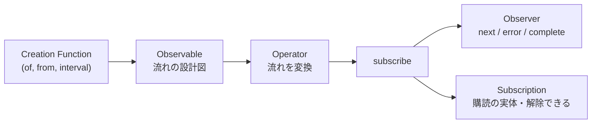
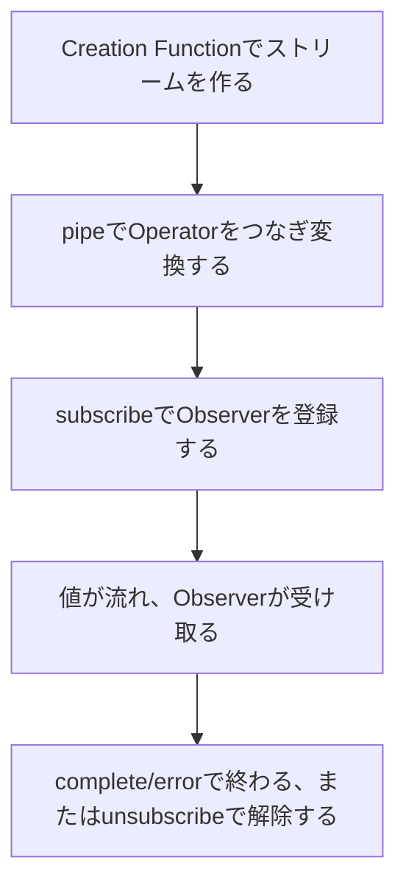

前章では、時間とともに複数の値が届くPush型の処理は、1つの値で完了する`Promise`だけでは表現できないと確認しました。

この章では、その「時間とともに流れる値」を、ストリームという言葉で捉え直します。まず、ストリームとは何かをはっきりさせ、ストリームがどんな種類の通知を運ぶのかを整理します。そのうえで、身のまわりの非同期処理を、ストリームとして見る練習をします。

後半では、RxJSを構成する登場人物を、一通り紹介します。Observable、Observer、Operatorといった名前を、実際にコードを書く前に、地図として頭に入れておきます。まだ細かい使い方は覚えなくてかまいません。それぞれが何の役割を持つのか、大きな見取り図をつかむことが目標です。

## ストリームとは何か

ストリームとは、時間とともに流れる値の連なりのことです。この一言だけだとピンとこないので、身近な配列と比べてみます。

配列は、複数の値が「空間」に並んだものです。`[1, 2, 3]`と書けば、3つの値がその場にすべてそろっています。いつでも、好きな要素を取り出せます。

```ts
const numbers = [1, 2, 3];
```

一方、ストリームは、複数の値が「時間」に並んだものです。値は、その場にすべてそろっているとは限りません。少し時間をおいて、1つずつ届くこともあります。

```text
配列:     [1, 2, 3]      すべて同時に、そこにある
ストリーム: --1--2--3-->   時間をおいて、1つずつ届く
```

「空間に並ぶ」か「時間に並ぶ」か。この違いが、ストリームの本質です。そして、時間に並ぶと捉えると、いろいろなものが同じように扱えるようになります。1秒ごとに届く値も、ユーザーがクリックするたびに届く値も、どちらも「時間に並んだ値の連なり」、つまり同じストリームとして考えられるのです。

## ストリームが運ぶ3種類の通知

ストリームは、ただ値を流すだけではありません。実は、3種類の「通知」を運びます。この3つは、RxJS全体を理解するうえでの、いちばん基本的な部品です。

| 通知 | 意味 | 回数 | その後 |
|---|---|---|---|
| next | 値が1つ届いた | 何回でも | 続く |
| error | 異常が起きて終了した | 最大1回 | 止まる |
| complete | 正常に終了した | 最大1回 | 止まる |

`next`は、値が届いたことを伝える通知です。ストリームが続くかぎり、何回でも起こります。ストリームの主役といえます。

`error`と`complete`は、どちらもストリームの「終わり」を伝えます。この2つは一度しか起こらず、そのあとに`next`は流れません。正常に終われば`complete`、途中で異常が起きれば`error`です。

```text
正常に終わる: --1--2--3--|
途中で失敗:   --1--2--X
```

`|`が`complete`、`X`が`error`を表します。この2つが同時に起こることはありません。ストリームは、どちらか一方で終わるか、終わらずに流れ続けます。

初学者のうちは、この「終わったら二度と値が流れない」という決まりを、意外に感じるかもしれません。しかし、この決まりがあるおかげで、あとで見るように、後片付けを安全に行えます。この3種類の通知は、この先どのOperatorを学ぶときも、必ず土台になります。

## 身のまわりのものをストリームとして見る

では、前章で挙げた非同期処理を、この3種類の通知にあてはめて見てみましょう。ストリームとして見る、という感覚をつかむ練習です。

**DOMイベント**、たとえばクリックは、ユーザーがクリックするたびに`next`が流れます。ページを開いているあいだ、ずっと続くので、ふつうは`complete`しません。

```text
クリック: --c--c-----c--c-->
```

**HTTP通信**は、レスポンスが返ったときに`next`が1回流れ、そのあとすぐ`complete`します。もし通信に失敗すれば、`error`です。

```text
成功: -----response--|
失敗: --------X
```

**タイマー**（一定間隔のもの）は、決まった間隔で`next`が流れ続けます。止めないかぎり、終わりません。

```text
interval: --0--1--2--3-->
```

こうして並べてみると、面白いことに気づきます。種類のまったく違う非同期処理が、どれも同じ3種類の通知で説明できるのです。「何回`next`が流れるか」「`complete`するかどうか」に注目すれば、クリックもHTTP通信もタイマーも、同じ枠組みで扱えます。これこそが、ストリームで考えることの最大の利点です。バラバラだったものが、1つの見方で統一されます。

## RxJSの登場人物

ここからは、ストリームを扱うためのRxJSの部品を紹介します。まず、全体像を図で示します。



登場人物が多く見えるかもしれませんが、心配いりません。1つずつ役割を表で確認します。

| 名前 | 役割 |
|---|---|
| Observable | ストリームの設計図。値をどう流すかを定義する |
| Observer | 流れてくる値を受け取る側。`next`・`error`・`complete`を持つ |
| Subscription | 購読の実体。`unsubscribe`で購読を解除できる |
| Operator | 流れを変換する関数。`map`や`filter`など |
| Creation Function | ストリームを作る関数。`of`や`interval`など |
| Subject | ObservableとObserverの両方を兼ね、複数へ値を配れる |
| Scheduler | 通知をいつ実行するかを制御する（発展的な仕組み） |

いちばんの主役は、Observableです。`of`や`interval`など、本書の前半で使うObservableは「値をこう流す」という設計図であり、Observerを渡して購読（subscribe）すると実行が始まります。このように購読をきっかけにProducerを作るものを、Cold Observableと呼びます。一方、DOMイベントのように購読とは別に発生するProducerへ接続するObservableもあります。ColdとHotの違いは、後の章で切り分けます。

残りの登場人物は、この主役を支える脇役です。ObserverとSubscriptionは、購読にまつわる部品です。Observerは値を受け取る側、Subscriptionは購読を管理して、あとで解除するためのものです。OperatorとCreation Functionは、ストリームを組み立てる部品です。Creation Functionでストリームを作り、Operatorで変換します。本書の中盤は、このOperatorの使い分けが中心になります。

Subjectは、少し特別な存在です。Observableでありながら、外から値を流すこともできます。複数の購読者へ同じ値を配りたいときに使います。「SubjectとMulticast」の章で詳しく扱うので、いまは名前だけ覚えておけば十分です。Schedulerは、通知をいつ実行するかを制御する仕組みで、アプリ開発で直接触る場面は多くありません。テストで仮想時間を使うときに、その一端に触れます。

## RxJSの処理の流れ

登場人物がわかったところで、処理の流れを、通して見てみましょう。RxJSのコードは、おおむね次の順序で組み立てます。



言葉にすると、こうなります。まずCreation Functionで、ストリームの元を作ります。次に`pipe`でOperatorをつなぎ、流れを目的の形に変換します。そして`subscribe`でObserverを登録すると、いよいよ値が流れ始めます。最後は、`complete`または`error`で自然に終わるか、`unsubscribe`で購読を解除して終わります。

この「作る→変換する→購読する→受け取る→終わる」という一連の流れが、RxJSの基本の骨格です。次章の「はじめてのRxJS」では、この流れを、実際に手を動かして体験します。そこで、`of`でストリームを作り、`map`と`filter`で変換し、`subscribe`で受け取るところまでを、コードで確かめます。

## RxJSはストリームを作り、変換し、購読する

ストリームの考え方とRxJSの全体像を整理します。

- ストリームは、時間とともに流れる値の連なりです。配列が空間に並ぶのに対し、ストリームは時間に並びます。
- ストリームは`next`・`error`・`complete`の3種類の通知を運びます。`error`と`complete`は一度きりで、ストリームを終わらせます。
- クリック、HTTP通信、タイマーは、いずれもこの3種類の通知で説明でき、同じ枠組みで扱えます。
- RxJSは、Observable（設計図）、Observer（受け取る側）、Subscription（購読の管理）、Operator（変換）、Creation Function（生成）、Subject、Schedulerで構成されます。
- 本書の前半で使うCold Observableは、購読をきっかけに実行されます。処理は「作る→変換する→購読する→受け取る→終わる」の順に組み立てます。

次章では、この流れを実際のコードで書きます。RxJSをインストールし、最初のObservableを作って購読するところから始めます。
