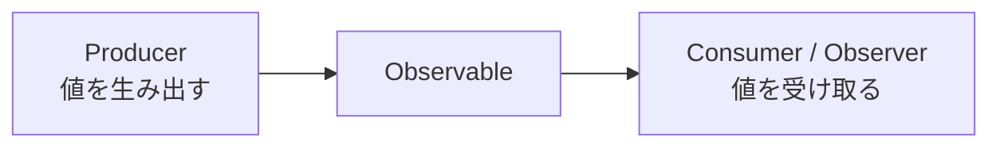
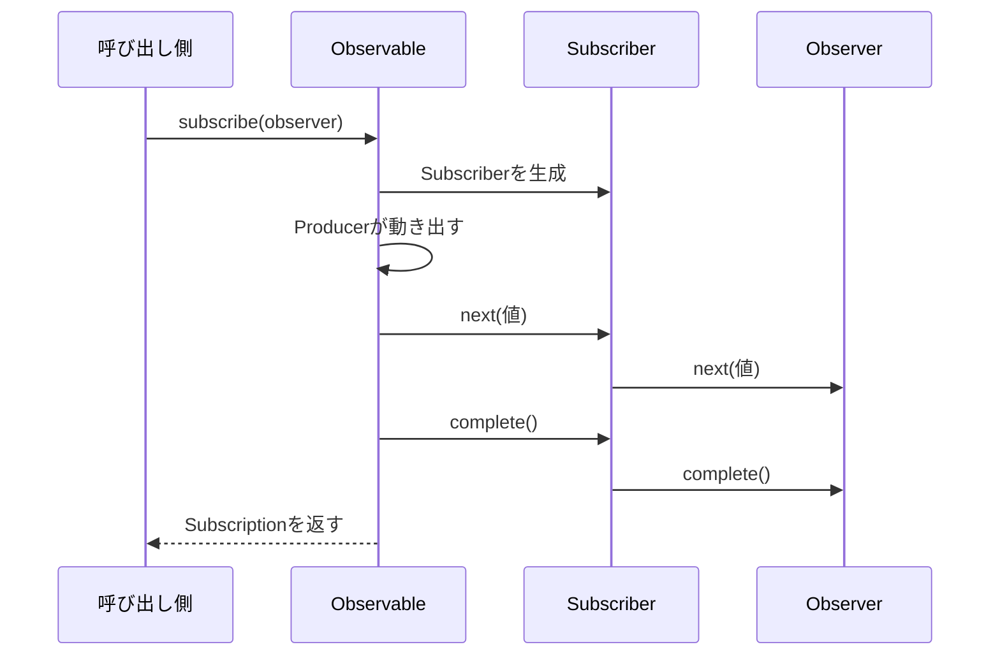

前章では、Observableを作って購読し、値を受け取るところまでを体験しました。

この章では、その裏側を見ます。Observableとは何を表すものなのか、Observerはどんな役割を持つのか、そして`subscribe`を呼んだとき内部で何が起きるのか。この3つを順番に解き明かします。

ここはRxJS全体の土台になる章です。急がず、一つずつ確かめていきます。仕組みがわかると、この先のOperatorが「なんとなく動く道具」ではなく、理由のある部品として見えてきます。

## Observableは処理の設計図

Observableは、値そのものではありません。値をどう流すかを書いた設計図です。

料理のレシピを思い浮かべると近いかもしれません。レシピには手順が書かれていますが、レシピを持っているだけでは料理はできません。誰かが実際に作って、はじめて料理になります。

Observableも同じです。`of(1, 2, 3)`は「1、2、3をこの順に流す」という手順を持っているだけで、それ自体は何もしません。`subscribe`という「作る」操作があって、はじめて値が流れ始めます。

この「購読するまで動かない」という性質を、RxJSでは遅延実行と呼びます。本章の後半で、あらためて確認します。

## ProducerとConsumer

Observableの内側には、値を生み出す存在がいます。これをProducerと呼びます。タイマー、DOMイベント、HTTPリクエストなどが、Producerの正体です。

一方、流れてくる値を受け取る側をConsumerと呼びます。RxJSでは、Observerがその役割を担います。



Observableは、ProducerとConsumerをつなぐ管のようなものです。この管をどうつなぐかによって、値が「取りにいく」ものになるか、「送られてくる」ものになるかが変わります。次の節で見ます。

## Pull型とPush型

値のやり取りには、2つの方式があります。Pull型とPush型です。

Pull型は、受け取る側が「値をください」と要求したときに値が返る方式です。ふつうの関数呼び出しがこれにあたります。呼んだ側が主導権を持ち、いつ値を受け取るかを決めます。

```ts
function getValue() {
  return 42;
}

const value = getValue(); // 受け取る側が要求したときに値が返る
```

Push型は、生み出す側が「はい、値ですよ」と送りつける方式です。いつ値が来るかは、送る側が決めます。受け取る側は、来たときに反応するだけです。`Promise`やObservableがこれにあたります。

身近なものにたとえると、Pull型は自動販売機です。こちらがボタンを押した（要求した）ときにだけ、商品が出てきます。Push型は新聞配達です。こちらが要求しなくても、配達員が決まったタイミングで届けてくれます。RxJSが扱うのは、この「届けてくれる」Push型のほうです。

この2つを、値の数と組み合わせると、4つに整理できます。

| | 単一の値 | 複数の値 |
|---|---|---|
| Pull型（要求して受け取る） | 関数 | Iterator・Generator |
| Push型（送られてくる） | `Promise` | Observable |

Observableは、右下です。Push型で、複数の値を扱えます。前章までに見た「時間とともに複数の値が届く」処理は、まさにここに入ります。

## 関数・Iterable・Promiseとの違い

Observableの位置づけを、身近な仕組みと比べて確かめます。

関数は、呼ぶと1つの値を返して終わります。値を返すのは一度きりです。

```ts
function getOne() {
  return 1;
}
```

Generatorを使うと、複数の値を順番に取り出せます。ただし、取り出すのは受け取る側の要求（`next()`の呼び出し）に応じてです。

```ts
function* getMany() {
  yield 1;
  yield 2;
  yield 3;
}

const iterator = getMany();
iterator.next(); // { value: 1, done: false }
```

`Promise`は、1つの値を非同期に送ってきます。ただし、`Promise`は作った時点で処理が始まり、値を送れるのは一度だけです。

Observableは、これらの性質を1つにまとめた存在です。複数の値を、非同期にも同期にも送れます。しかも、購読するまで動きません。次の表にまとめます。

| 仕組み | 値の数 | 方式 | 実行のタイミング |
|---|---|---|---|
| 関数 | 1つ | Pull | 呼んだとき |
| Generator | 複数 | Pull | 要求したとき |
| `Promise` | 1つ | Push | 作ったとき（すぐ） |
| Observable | 複数 | Push | 購読したとき |

この表の右下、複数・Push・購読時という組み合わせが、Observableの居場所です。

## Observerとは

Observerは、流れてくる通知を受け取るオブジェクトです。3種類の通知に対応して、3つのメソッドを持ちます。

```ts
const observer = {
  next: (value) => console.log('next:', value),
  error: (error) => console.error('error:', error),
  complete: () => console.log('complete'),
};

of(1, 2, 3).subscribe(observer);

// 出力:
// next: 1
// next: 2
// next: 3
// complete
```

`next`は値が届いたとき、`error`は異常が起きたとき、`complete`は正常に終わったときに呼ばれます。

3つすべてを用意する必要はありません。関心のあるものだけを持つObserverを、Partial Observerと呼びます。前章で`next`だけを関数で渡したのも、Partial Observerの一種です。

```ts
// nextとcompleteだけに関心があるObserver
of(1, 2, 3).subscribe({
  next: (value) => console.log(value),
  complete: () => console.log('done'),
});
```

## errorとcompleteのあとに値が流れない理由

ストリームは、`error`または`complete`で終わります。そして、一度終わったストリームからは、二度と`next`が流れません。

これを確かめます。`map`の中でエラーを投げると、その時点でストリームは`error`で終わります。

```ts
import { of, map } from 'rxjs';

of(1, 2, 3)
  .pipe(
    map((value) => {
      if (value === 2) {
        throw new Error('2は扱えません');
      }
      return value;
    }),
  )
  .subscribe({
    next: (value) => console.log('next:', value),
    error: (error) => console.log('error:', error.message),
  });

// 出力:
// next: 1
// error: 2は扱えません
```

1は流れましたが、2でエラーが起きた時点でストリームは終わり、3は流れませんでした。

この決まりには理由があります。ストリームが終わったら、内部のProducer（タイマーやイベントリスナー）を後片付けできます。「もう値は来ない」と保証されるからこそ、リソースを安全に解放でき、受け取る側も終わったあとの処理を安心して書けます。

## subscribeすると何が起きるのか

いよいよ本題です。`subscribe`を呼ぶと、内部で次の流れが起きます。



`subscribe`にObserverを渡すと、まずSubscriberが作られます。次に、Observableの内側のProducerが動き出します。Producerが値を生むたびに、通知がSubscriberを経由してObserverへ届きます。そして`subscribe`は、購読を管理するためのSubscriptionを返します。

前章で`interval(...).subscribe(...)`の戻り値を`subscription`として受け取ったのは、このSubscriptionです。

## SubscriberとSubscription

ここで、名前の似た2つを区別します。

Subscriberは、Observerを包んだ内部の存在です。「終わったストリームからは`next`を流さない」という決まりを守らせる役目を持ちます。先ほどエラーのあとに3が流れなかったのは、Subscriberがこの決まりを守ったからです。私たちがSubscriberを直接触ることは、ほとんどありません。

Subscriptionは、購読そのものを表すオブジェクトです。`unsubscribe`を持ち、購読を解除できます。終わらないストリームを止めるときに使うのは、こちらです。

| 名前 | 役割 | 直接触るか |
|---|---|---|
| Subscriber | 通知の決まりを守り、Observerへ届ける | ほぼ触らない |
| Subscription | 購読を管理し、解除できる | よく触る |

## 複数回subscribeするとどうなるか

同じObservableを2回購読すると、どうなるでしょうか。答えは、購読するたびにProducerが動き直します。それぞれの購読は、独立して実行されます。

`interval`で確かめます。2つの購読は、それぞれ自分のカウントを0から始めます。

```ts
import { interval } from 'rxjs';

const timer$ = interval(1000);

timer$.subscribe((value) => console.log('A:', value));

// 2.5秒後にもう1つ購読する
setTimeout(() => {
  timer$.subscribe((value) => console.log('B:', value));
}, 2500);

// 出力:
// A: 0
// A: 1
// A: 2
// B: 0   ← Bは自分のカウントを0から始める
// A: 3
// B: 1
```

Bは、Aの続きからではなく、0から数え始めています。同じ`timer$`でも、購読ごとに別々の実行が生まれるからです。

この「購読ごとに独立して実行される」という性質は、次章のCold ObservableとHot Observableの話につながります。ここでは、購読が実行のきっかけであり、購読の数だけ実行が起きると押さえてください。

## Observableの遅延実行

最後に、遅延実行をあらためて確認します。Observableは、購読するまで何もしません。

`Promise`と比べると違いがはっきりします。`Promise`は、作った瞬間に処理が始まります。

```ts
new Promise(() => {
  console.log('Promiseの処理が始まった');
});

console.log('この行の前に、上のログが出る');

// 出力:
// Promiseの処理が始まった
// この行の前に、上のログが出る
```

`Promise`は、`then`で受け取る前に、もう動いています。一方、Observableは購読するまで動きません。`of(1, 2, 3)`と書いただけでは、値は流れません。

この違いは、実務で効いてきます。Observableなら、処理を組み立ててから購読するまで、実行を遅らせられます。組み立てと実行を分けられるので、同じ設計図を必要なときに何度でも動かせます。この柔軟さが、RxJSの土台になっています。

## subscribeが設計図を実行へ変える

Observable、Observer、`subscribe`の関係を整理します。

- Observableは値そのものではなく、値をどう流すかを書いた設計図です。
- 値を生み出すProducerと、受け取るObserver（Consumer）を、Observableがつなぎます。
- Observableは、複数の値を扱えるPush型で、購読するまで動きません。
- Observerは`next`・`error`・`complete`を持ちます。一部だけのPartial Observerも使えます。
- `error`と`complete`はストリームを終わらせ、そのあとに`next`は流れません。
- `subscribe`するとSubscriberが作られProducerが動き出し、Subscriptionが返ります。購読ごとに実行は独立します。

次章では、この「購読ごとに独立して実行される」性質を出発点に、Cold ObservableとHot Observable、そして同期実行と非同期実行の違いを見ていきます。
