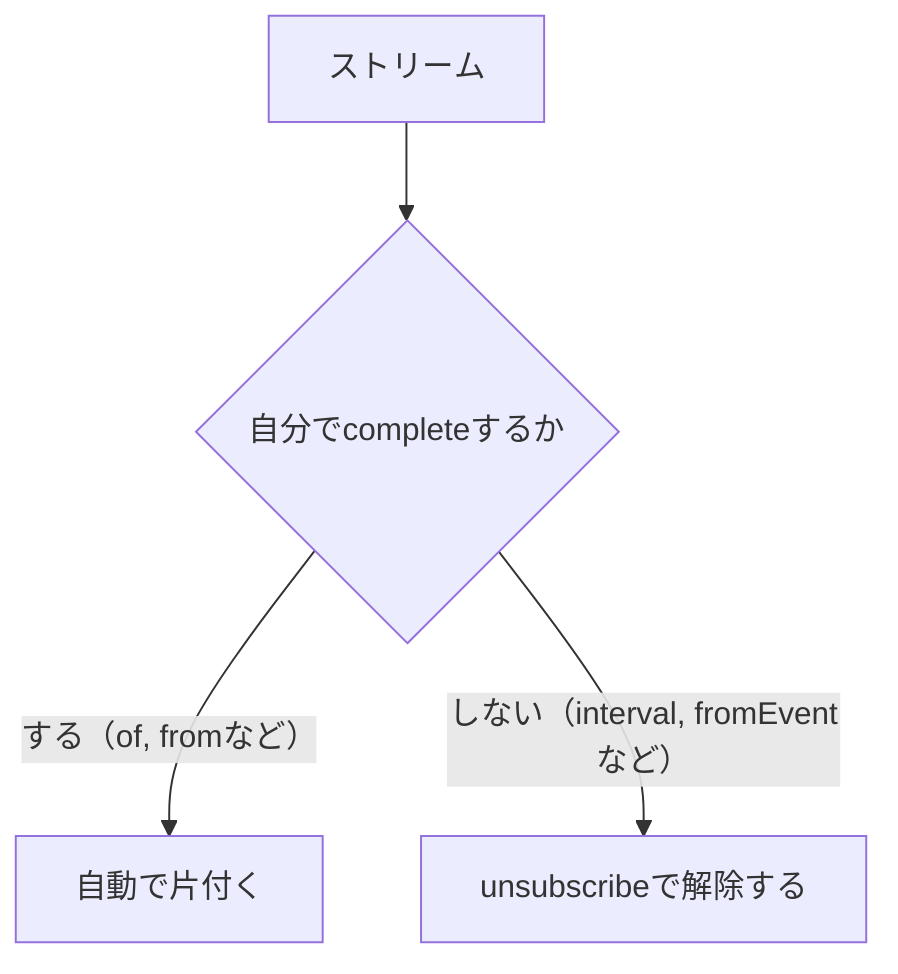

前章で、`subscribe`するとSubscriptionが返ると確認しました。

この章では、そのSubscriptionを使った購読解除を詳しく見ます。なぜ購読を解除する必要があるのか、解除すると内部で何が起きるのか、複数の購読をどうまとめるのか。ここを理解すると、メモリリークを避けられるようになります。

後半では、`new Observable`を使ってObservableを自作します。自作を通して、これまで設計図と呼んできたものの中身が、実は自分で書ける普通のコードだと見えてきます。

## Subscriptionとは

Subscriptionは、購読を表すオブジェクトです。`subscribe`の戻り値として受け取ります。

```ts
import { interval } from 'rxjs';

const subscription = interval(1000).subscribe((value) => {
  console.log(value);
});
```

Subscriptionが持つ主なメソッドは`unsubscribe`です。これを呼ぶと、購読が解除され、値が流れなくなります。

## 購読を解除する

終わらないストリームは、必要がなくなったら解除します。解除しないと、値を流し続けたり、内部のProducerが動き続けたりします。

```ts
import { interval } from 'rxjs';

const subscription = interval(1000).subscribe((value) => {
  console.log(value);
});

setTimeout(() => {
  subscription.unsubscribe();
  console.log('解除しました');
}, 3500);

// 出力:
// 0
// 1
// 2
// 解除しました
```

`of(1, 2, 3)`のように`complete`するストリームは、流し終えると自動的に片付きます。この場合、手動での解除は要りません。解除を意識するのは、`interval`やDOMイベントのように、放っておくと終わらないストリームです。



## Teardown Logicとリソースの解放

`unsubscribe`を呼ぶと、購読の後片付けが実行されます。この後片付けの処理を、Teardown Logicと呼びます。

ここでいうリソースとは、プログラムが動くために確保している、限りある資源のことです。動き続けているタイマー、登録されたイベントリスナー、進行中の通信などが、それにあたります。使い終わったら返さないと、少しずつ資源が食いつぶされていきます。Teardown Logicは、Producerが確保したこうしたリソースを解放します。具体的には、次のようなものです。

- `interval`が使っていたタイマーを止める
- `fromEvent`が登録したイベントリスナーを外す
- 進行中の通信を中断する

つまり`unsubscribe`は、ただ値を受け取るのをやめるだけではありません。値を生み出していた仕組みそのものを止めます。だからこそ、解除がメモリリークの防止につながります。

## 不要な購読が残るとどうなるか

購読を解除し忘れると、どうなるでしょうか。値を受け取る側がもう画面にいなくても、Producerは動き続けます。

たとえば、画面を表示しているあいだだけ動くタイマーを考えます。画面を閉じたのに`unsubscribe`しないと、タイマーは裏で動き続けます。同じ画面を開くたびに購読が増え、そのぶんタイマーも積み重なっていきます。

```text
画面を開く → 購読1（タイマー動作中）
画面を閉じる → 解除し忘れ → 購読1はまだ動いている
もう一度開く → 購読2 → タイマーが2つ動く
```

この状態がメモリリークです。使われないはずの処理がメモリ上に残り、動き続けます。RxJSを安全に使うには、「作った購読は、いつ解除されるのか」を常に意識します。

## 複数のSubscriptionをまとめる

購読が増えてくると、1つずつ`unsubscribe`を書くのは手間ですし、書き忘れも起きます。Subscriptionには、子のSubscriptionをまとめる`add`があります。

```ts
import { interval } from 'rxjs';

const subscription = interval(1000).subscribe((value) => {
  console.log('A:', value);
});

const child = interval(2000).subscribe((value) => {
  console.log('B:', value);
});

subscription.add(child);

// 親をunsubscribeすると、addした子もまとめて解除される
setTimeout(() => {
  subscription.unsubscribe();
}, 5000);
```

親のSubscriptionを`unsubscribe`すると、`add`でまとめた子も一緒に解除されます。1つの窓口で複数の購読を管理できるので、解除の書き忘れを減らせます。

複数の購読を1つにまとめて、画面を閉じるときにまとめて解除する。この形は、実務でよく使う定石です。

## Observableを自作する

ここからは、Observableを自分で作ります。これまで`of`や`interval`が作ってくれていたものを、`new Observable`で手書きします。

`new Observable`には、購読されたときに実行される関数を渡します。この関数は、値を届ける相手であるSubscriberを引数に受け取ります。

```ts
import { Observable } from 'rxjs';

const hello$ = new Observable<string>((subscriber) => {
  subscriber.next('こんにちは');
  subscriber.next('RxJS');
  subscriber.complete();
});

hello$.subscribe({
  next: (value) => console.log(value),
  complete: () => console.log('完了'),
});

// 出力:
// こんにちは
// RxJS
// 完了
```

`subscriber.next(...)`で値を流し、`subscriber.complete()`で完了を伝えます。前章で見た「購読するとProducerが動き出す」という流れが、そのまま関数の中身になっています。この関数は、購読されるたびに呼ばれます。

## next・error・completeを自分で通知する

自作すると、3種類の通知を自分の判断で出せます。エラーを通知するには`error`を使います。

```ts
import { Observable } from 'rxjs';

const numbers$ = new Observable<number>((subscriber) => {
  subscriber.next(1);
  subscriber.next(2);
  subscriber.error(new Error('ここで失敗'));
  subscriber.next(3); // これは届かない
});

numbers$.subscribe({
  next: (value) => console.log('next:', value),
  error: (error) => console.log('error:', error.message),
});

// 出力:
// next: 1
// next: 2
// error: ここで失敗
```

`error`を呼んだあとの`next(3)`は届いていません。前章で確認したとおり、終わったストリームからは値が流れないからです。この決まりは、Subscriberが自動的に守ってくれます。

## Teardown処理を書く

自作Observableでは、後片付けの処理も自分で書けます。購読関数の戻り値として、後片付けの関数を返します。この関数が、`unsubscribe`されたときやストリームが終わったときに呼ばれます。

タイマーをObservableにする例で見ます。

```ts
import { Observable } from 'rxjs';

const timer$ = new Observable<number>((subscriber) => {
  let count = 0;
  const id = setInterval(() => {
    subscriber.next(count);
    count += 1;
  }, 1000);

  // 後片付け: 購読解除時にタイマーを止める
  return () => {
    clearInterval(id);
    console.log('タイマーを止めました');
  };
});

const subscription = timer$.subscribe((value) => console.log(value));

setTimeout(() => subscription.unsubscribe(), 3500);

// 出力:
// 0
// 1
// 2
// タイマーを止めました
```

`return () => { clearInterval(id); }`が、Teardown Logicです。`unsubscribe`したときに`setInterval`を止めています。この後片付けを書かないと、`unsubscribe`してもタイマーが動き続け、メモリリークになります。

## イベントをObservableにする

同じ要領で、DOMイベントをObservableにできます。購読時にリスナーを登録し、後片付けでリスナーを外します。

```ts
import { Observable } from 'rxjs';

function fromClick(element: HTMLElement) {
  return new Observable<MouseEvent>((subscriber) => {
    const handler = (event: MouseEvent) => subscriber.next(event);
    element.addEventListener('click', handler);

    return () => {
      element.removeEventListener('click', handler);
    };
  });
}
```

これは、RxJSが用意している`fromEvent`と同じ考え方です。購読でリスナーを付け、解除でリスナーを外す。この対応を自分で書くと、`fromEvent`の中で何が起きているのかが腑に落ちます。実際の開発では、こうした定番の処理は`fromEvent`を使えば十分です。次章の「Observableを作る」で扱います。

## 自作するときの注意点

Observableを自作するときは、後片付けを忘れないことが何より大切です。タイマーやリスナーを確保したら、必ずTeardown Logicで解放します。

もう1つ、購読関数の中でエラーが起きる可能性があるなら、`error`で通知します。例外を投げっぱなしにせず、ストリームの通知として扱うと、受け取る側が`error`で処理できます。

実務では、Observableをゼロから自作する場面はそれほど多くありません。`of`、`from`、`fromEvent`、`interval`といったCreation Functionが、よくある生成をカバーしているからです。それでも一度自作しておくと、それらの内部を理解した状態でCreation Functionを使えます。

## まとめ

この章では、購読解除とObservableの自作を確認しました。

- Subscriptionは購読を表し、`unsubscribe`で解除できます。
- `unsubscribe`はTeardown Logicを実行し、タイマーやリスナーなどのリソースを解放します。
- 終わらないストリームの解除を忘れると、Producerが動き続けメモリリークになります。
- `add`で複数のSubscriptionをまとめ、一度に解除できます。
- `new Observable`で自作でき、`next`・`error`・`complete`を自分で通知します。
- 購読関数の戻り値としてTeardown Logicを返し、後片付けを書きます。

次章では、購読ごとに実行が独立するかどうかに着目して、Cold ObservableとHot Observable、そして同期実行と非同期実行の違いを見ていきます。
