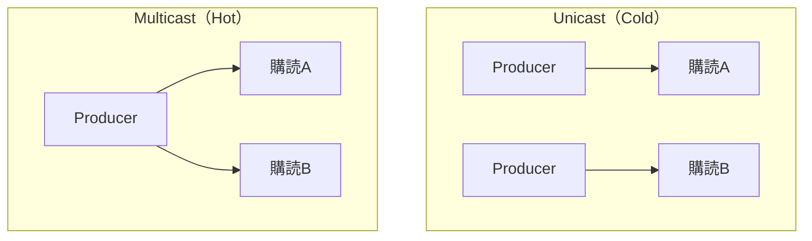

前章の終わりで、同じObservableを2回購読すると、それぞれが独立して実行される、と確認しました。

実は、この性質を持つObservableには名前があります。Cold Observableです。そして、これとは対照的に、実行を共有するHot Observableもあります。この章では、まずColdとHotの違いを、じっくり観察します。

後半では、もう1つのよくある誤解を解きます。「Observableは常に非同期だ」と思われがちですが、そうとは限りません。`of`のように、購読した瞬間に値を流し切ってしまう、同期的なObservableもあるのです。この同期と非同期の違いを、実行順序とイベントループの視点から確かめます。

## Cold Observable

Cold Observableは、購読するたびに、新しい実行が始まるObservableです。値を生み出すProducerが、購読のたびに、あらためて作られます。

前章で見た`interval`が、まさにこれでした。2つの購読は、それぞれ自分のカウントを0から始めましたね。

```text
購読A: --0--1--2--3-->
購読B:       --0--1--2-->   （Bは自分の0から始まる）
```

Cold Observableでは、購読者ごとにProducerが独立します。身近なものにたとえると、動画のオンデマンド配信に似ています。誰がいつ再生ボタンを押しても、その人のために、動画は最初から再生されます。視聴者どうしは、まったく独立しています。

## Hot Observable

Hot Observableは、購読者どうしが、1つの実行を共有するObservableです。Producerは購読とは別に存在していて、そこへ複数の購読者が相乗りします。

DOMのクリックイベントが、その代表です。クリックは、購読者が何人いようと関係なく発生します。複数の購読者は、同じ1回のクリックを、一緒に受け取ります。

```ts
import { fromEvent } from 'rxjs';

const clicks$ = fromEvent<MouseEvent>(document, 'click');

clicks$.subscribe(() => console.log('A: クリック'));
clicks$.subscribe(() => console.log('B: クリック'));

// 1回クリックすると:
// A: クリック
// B: クリック
```

1回のクリックで、AとBの両方が反応しています。同じ実行を共有しているからです。

こちらも、たとえてみましょう。Hot Observableは、テレビの生放送です。放送は、視聴者がいようといまいと進んでいきます。そして、途中からチャンネルを合わせた人は、それより前の場面を見られません。Hot Observableも同じで、遅れて購読した人は、それまでに流れた値を受け取れないのです。

```text
Producer: --a--b--c--d--e-->
購読A:    ^（最初から）  a  b  c  d  e
購読B:          ^（cから購読）  c  d  e
```

## ColdとHotの違いを整理する

2つの違いを、表にまとめます。

| 観点 | Cold Observable | Hot Observable |
|---|---|---|
| Producerの位置 | Observableの内側 | Observableの外側 |
| 購読したとき | 新しい実行が始まる | 進行中の実行に相乗りする |
| 購読者どうし | 独立している | 共有している |
| 遅れて購読すると | 最初から受け取る | 途中から受け取る |

見分ける鍵は、Producerがどこにあるかです。Producerが購読のたびに作られるならCold、購読とは別に外で動いているならHotです。オンデマンド配信（Cold）か、生放送（Hot）か、と考えると区別しやすくなります。

## 身近な例を分類する

代表的な非同期処理を、ColdとHotで分類してみましょう。

| 例 | 分類 | 理由 |
|---|---|---|
| HTTPリクエスト | Cold | 購読するたびに新しいリクエストが飛ぶ |
| `interval`・`timer` | Cold | 購読するたびに新しいタイマーが始まる |
| DOMイベント | Hot | イベントは購読とは無関係に発生する |
| WebSocket | Hotに近い | 接続は共有され、メッセージは購読と無関係に届く |

とくにHTTPリクエストがColdである点は、実務でとても重要です。RxJSでHTTP通信を表すObservableは、購読するたびにリクエストを送ります。ということは、うっかり同じObservableを複数回購読すると、そのぶんリクエストが飛んでしまうのです。この落とし穴は、共有を扱う「shareとshareReplay・Subjectによる状態管理」の章で解決します。いまは「HTTPはCold、つまり購読の数だけ通信が飛ぶ」と覚えておいてください。

## UnicastとMulticast

ColdとHotは、UnicastとMulticastという言葉でも説明できます。用語が増えて申し訳ないのですが、どちらもよく使われるので、対応を押さえておきましょう。

Unicastは、購読者ごとに専用の実行を届けることです。Cold Observableは、Unicastです。Multicastは、1つの実行を複数の購読者へ配ることです。Hot Observableは、Multicastです。



この章では、ColdとHotを「観察する」だけにとどめます。Cold Observableを共有して、Multicastに変える方法もあるのですが、それにはSubjectやOperatorを使います。その話は「SubjectとMulticast」の章で扱います。ここでは、Producerが専用か共有かで見分けられる、と押さえておけば十分です。

## ColdとHotを二択だけで考えない

ここまで、きれいに2つに分けて説明してきました。しかし、注意してほしいことがあります。現実のObservableは、いつもきれいに二分できるわけではありません。

同じ`interval`でも、Operatorで共有すればHotのように振る舞います。逆に、Hotなイベントも、購読の仕方によっては途中で切り出せます。ColdかHotかは、そのObservableに最初から刻まれた固定の属性ではなく、Producerがどこにあり、どう共有されているかで決まる、動的なものなのです。

ですから、大事なのは、ラベルを貼って安心することではありません。「この購読で、新しい実行が始まるのか。それとも、既存の実行に相乗りするのか」を、そのつど考えられることです。この問いは、多重リクエストやメモリリークを見抜くときに、実際に役立ちます。

## Observableは常に非同期とは限らない

ここから、話題を変えます。ここまでObservableを「非同期処理のための道具」として説明してきましたが、Observableそのものは、必ずしも非同期ではありません。これは、多くの初学者が意外に思う点です。

`of`は、購読したその場で、値を流し切ります。つまり、同期的に動きます。次のコードの出力順を、予想してみてください。

```ts
import { of } from 'rxjs';

console.log('前');
of(1, 2, 3).subscribe((value) => console.log(value));
console.log('後');

// 出力:
// 前
// 1
// 2
// 3
// 後
```

`1`、`2`、`3`は、「後」よりも先に出力されます。`of`は、購読した瞬間に、すべての値を同期的に流し切り、それから次の行へ進むからです。「非同期だから、あとで流れるはず」と予想していると、この順番は意外に見えるでしょう。

## of・from・intervalの実行タイミング

Creation Functionによって、同期か非同期かが分かれます。

| Creation Function | 実行 |
|---|---|
| `of(...)` | 同期 |
| `from(配列)` | 同期 |
| `from(Promise)` | 非同期 |
| `interval` / `timer` | 非同期 |

`of`と、配列からの`from`は、同期です。渡された値はその場にすべてあるので、待つ必要がないからです。一方、`interval`や`timer`は、時間を扱うので非同期です。`from`は、渡すものによって変わります。配列なら同期、`Promise`なら（Promiseの完了を待つので）非同期になります。

## 同期通知の注意点

同期Observableには、気をつけたい点があります。購読のすぐ後ろに書いたコードが、値をすべて受け取ったあとに実行される、という順序です。この順序を忘れると、思わぬバグになります。

```ts
import { of } from 'rxjs';

let result = 0;
of(1, 2, 3).subscribe((value) => {
  result += value;
});
console.log(result); // 6（ofは同期なので、ここでは合計が出そろっている）
```

この例は、うまくいきます。`of`が同期だからです。購読が終わった時点で、`result`にはすでに合計の6が入っています。しかし、もし同じコードを非同期のObservableに変えたら、どうなるでしょうか。`console.log`のほうが先に走り、`result`はまだ`0`のままです。値がまだ流れていないからです。この違いは、初学者がはまりやすい落とし穴です。購読の外で結果を使うときは、そのObservableが同期か非同期かを意識してください。より安全なのは、結果を使う処理も、購読の中に書いてしまうことです。

## JavaScriptのイベントループとの関係

同期と非同期の違いは、JavaScriptのイベントループという仕組みと関係しています。少し発展的な話ですが、順序を予測する助けになります。

同期の`of`は、いま動いているコードと同じタイミングで値を流します。`Promise`からの`from`は、マイクロタスクという扱いで、いまのコードが終わった直後に流します。`setTimeout`を使う`timer`や`interval`は、マクロタスクという扱いで、さらにあとに流します。実行される順番には、この優先順位があるのです。

```ts
import { of, from } from 'rxjs';

console.log('1: 同期');
from(Promise.resolve('3: マイクロタスク')).subscribe((v) => console.log(v));
of('2: 同期').subscribe((v) => console.log(v));

// 出力:
// 1: 同期
// 2: 同期
// 3: マイクロタスク
```

同期の通知（1と2）が先に出そろい、`Promise`由来の通知（3）は、そのあとに回っています。RxJSは、この実行タイミングを、Schedulerという仕組みで制御しています。アプリ開発でSchedulerを直接指定する場面は多くありませんが、「同期のObservableもある」と知っておくと、実行順序で迷ったときに、原因を探しやすくなります。

## まとめ

この章では、ColdとHot、そして同期と非同期の違いを確認しました。

- Cold Observableは購読ごとに新しい実行が始まり、購読者どうしは独立します（オンデマンド配信のイメージ）。
- Hot Observableは1つの実行を共有し、遅れて購読すると途中から受け取ります（生放送のイメージ）。
- 見分ける鍵はProducerの位置です。HTTPやタイマーはCold、DOMイベントはHotです。
- ColdはUnicast、HotはMulticastに対応しますが、二択で固定的に考えないようにします。
- Observableは常に非同期とは限りません。`of`や配列からの`from`は同期的に値を流します。
- 実行順序はイベントループと関係し、同期・マイクロタスク・マクロタスクの順に流れます。

次章からは、Observableの作り方を体系的に見ていきます。まず`of`、`from`、`fromEvent`、`interval`、`timer`という、もっともよく使うCreation Functionを扱います。
