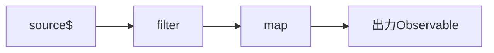

ここまでで、Observableの作り方を身につけました。ここからは、流れてくる値を変換したり選別したりする、Operatorを扱います。RxJSの本領は、このOperatorにあります。

この章では、Operatorを使いこなすための土台を、2つ用意します。1つは`pipe`の仕組みです。Operatorをどうつなぐのか、なぜ元のObservableが変わらないのかを確認します。もう1つはMarble Diagramです。値が時間とともにどう流れるかを表す図で、この先の章で、新しいOperatorが出てくるたびに登場します。

Operatorそのものの使い方は、次章から扱います。この章は、いわばOperatorを読み解くための「道具の準備」の章です。ここをしっかり固めておくと、この先がずっと楽になります。

## Operatorとは

本書では、Observableを新しく作る`of`や`from`をCreation Function、既存のObservableを変換する`map`や`filter`をPipeable Operatorと呼び分けます。

Pipeable Operatorは、入力Observableを受け取り、変換後の新しいObservableを返す関数です。値の変換・選別・合成など、目的に応じたOperatorがあります。この章と次章以降で単に「Operator」と書く場合は、原則としてPipeable Operatorを指します。

## Pipeable Operatorとpipe

Pipeable Operatorは、その名のとおり、`pipe`の中で使うOperatorです。`map`や`filter`がこれにあたります。

`pipe`は、Operatorを左から順に適用し、新しいObservableを返すメソッドです。

```ts
import { of, map, filter } from 'rxjs';

of(1, 2, 3, 4)
  .pipe(
    filter((n) => n % 2 === 0),
    map((n) => n * 10),
  )
  .subscribe((value) => console.log(value));

// 出力:
// 20
// 40
```

`pipe`に渡したOperatorは、書いた順に適用されます。ここでは、まず`filter`で偶数（2と4）だけを通し、次に`map`でそれを10倍しています。値は、上から下へ、Operatorを通り抜けていくイメージです。工場のベルトコンベアで、製品が加工装置を順に通過していく様子を思い浮かべると、わかりやすいかもしれません。

## 入力と出力、そして元は変わらない

それぞれのOperatorは、入力のObservableを受け取り、出力のObservableを返します。Operatorをつなぐとは、この入出力を数珠つなぎにすることです。



ここで、初学者が誤解しやすい大事な性質があります。Operatorは、元のObservableを変更しません。`pipe`は、変換した「新しいObservable」を返すだけで、元のObservableはそのまま残ります。

だからこそ、1つのObservableから、別々の変換を作れます。

```ts
import { of, map, filter } from 'rxjs';

const numbers$ = of(1, 2, 3, 4);

const doubled$ = numbers$.pipe(map((n) => n * 2));
const evens$ = numbers$.pipe(filter((n) => n % 2 === 0));

// numbers$ 自身は変わらない。doubled$ と evens$ は別々のObservable
```

`numbers$`から、2倍する`doubled$`と、偶数だけを通す`evens$`という2つのObservableを作りました。それでも`numbers$`自体は、まったく変わっていません。これは、配列の`map`や`filter`が元の配列を変えないのと、同じ発想です。この性質のおかげで、Observableを安心して使い回せます。

## Operator Chain

複数のOperatorをつないだものを、Operator Chain（オペレーターチェーン）と呼びます。チェーンでは、Operatorを並べる順番が、結果を左右します。

先ほどの例で、`filter`と`map`の順番を入れ替えてみましょう。

```ts
import { of, map, filter } from 'rxjs';

// map を先にすると、10倍してから偶数を選ぶ
of(1, 2, 3, 4)
  .pipe(
    map((n) => n * 10),
    filter((n) => n % 2 === 0),
  )
  .subscribe((value) => console.log(value));

// 出力:
// 10
// 20
// 30
// 40
```

先ほど（`filter`が先）は、2つの値（20, 40）だけが流れました。今回（`map`が先）は、4つとも流れています。なぜでしょうか。`map`で10倍すると、すべての値（10, 20, 30, 40）が偶数になります。だから、そのあとの`filter`（偶数を通す）を、全部が通り抜けるのです。同じOperatorを使っても、順番が違えば結果が変わる。これは、Operatorを組むうえで、いつも意識したい点です。

## 読みやすいOperatorの並べ方

Operator Chainでは、順番そのものが処理の意味になります。まず、必要な結果になる順番を選んでください。そのうえで、結果が変わらない範囲なら、早めに不要な値を除くと後続処理を減らせます。

1. まず選別する（`filter`など）
2. 次に変換する（`map`など）
3. 副作用は必要な場所に置く（`tap`など）

たとえば、元の値だけで判定できる`filter`は、重い`map`より前に置けます。一方、変換後の値を条件にする場合は、当然`map`が先です。固定の型を覚えるのではなく、「このOperatorは何を入力として受け取るか」を上から追います。

書き方にもコツがあります。Operatorは、1行に1つずつ書くと、チェーンの流れが縦に読めて見やすくなります。そして、チェーンが長くなりすぎたら、意味のまとまりで変数に分けます。1つの`pipe`に10個も20個も詰め込むより、区切ったほうが、ずっと読みやすくなります。

## Marble Diagramとは

ここからは、値の流れを図で表す、Marble Diagram（マーブルダイアグラム）を扱います。

なぜこの図が必要なのでしょうか。文章だけでは、「いつ、どの値が流れたか」を正確に伝えるのが、とても難しいからです。とくに時間がからむOperatorは、言葉で説明されても、動きがイメージしにくいものです。Marble Diagramは、時間を左から右への線として表し、その線の上に値を置くことで、この「時間と値」を目に見える形にします。RxJSの公式ドキュメントでも、各Operatorの動きが、この図で説明されています。読めるようになっておくと、公式ドキュメントもぐっと理解しやすくなります。

## Marble Diagramの記法

Marble Diagramで使う記号を、整理します。ここは、この先ずっと使う記法なので、しっかり押さえてください。

| 記号 | 意味 |
|---|---|
| 左→右 | 時間の経過 |
| `-` | 時間の経過（値なし） |
| `1` `a` | その時刻に流れた値 |
| `\|` | complete（正常終了） |
| `X` | error（異常終了） |
| `(ab)` | 同じ時刻に複数の値 |

`-`1つが、時間のひと区切りを表します。値（`1`や`a`）は、その時刻に流れたことを示します。`|`で正常終了、`X`で異常終了です。`(ab)`のように括弧でくくると、同じ時刻に複数の値が流れたことを表します。

Operatorの動きを示すときは、上に入力、下に出力を置き、あいだにOperator名を書きます。ここが大事なのですが、時間の位置（横のそろえ）が意味を持ちます。同じ桁は、同じ時刻を表すのです。だから、桁をそろえて読むのがコツです。

## Marble DiagramでOperatorの動きを読む

実際に、`map`と`filter`をMarble Diagramで読んでみましょう。

`map`は、それぞれの値を変換します。値が流れる位置（時刻）は変わらず、中身だけが変わります。

```text
入力:  --1--2--3--|
           map(n => n * 10)
出力:  --10-20-30-|
```

同じ桁を縦に見てください。入力の`1`の位置に、出力では`10`があります。位置はそのままで、値が10倍になっているのがわかります。

`filter`は、条件に合わない値を取り除きます。通らなかった値の場所は、空き（`-`）になります。

```text
入力:  --1--2--3--4--|
           filter(n => n % 2 === 0)
出力:  -----2-----4--|
```

`1`と`3`は条件（偶数）に合わないので、その位置は空きになっています。`2`と`4`だけが、同じ位置に残っています。

2つをつなぐと、上から順に適用される様子も、図で追えます。

```text
入力:  --1--2--3--4--|
           filter(偶数)
中間:  -----2-----4--|
           map(n => n * 10)
出力:  -----20----40-|
```

まず`filter`で2と4だけになり（中間）、それを`map`で10倍して20と40になっています（出力）。Marble Diagramを使うと、Operatorが値をどう扱うかが、ひと目でわかります。次章からは、新しいOperatorを紹介するたびに、この図を添えて動きを確認していきます。

なお、テストの章では、より厳密なMarble記法を使います。購読の開始を表す`^`や、購読解除を表す`!`など、記号が増えます。それは「RxJSのテストとデバッグ」の章で扱います。本書の説明では、ここで示した読みやすい記法を基本とします。

## pipeで処理をつなぎ、Marble Diagramで流れを読む

Operatorをつなぐ`pipe`と、値の流れを表すMarble Diagramの要点を整理します。

- 本書ではCreation FunctionとPipeable Operatorを区別し、Operatorは入力Observableから新しいObservableを作ります。
- `pipe`はOperatorを左から順に適用し、元のObservableは変更しません。
- Operator Chainでは、並べる順番で結果が変わります。必要な意味を優先し、結果が同じなら不要な値を早めに除きます。
- Marble Diagramは、時間を左から右に表し、`-`・値・`|`・`X`で流れを描きます。
- 入力・Operator・出力を、桁をそろえて並べると、Operatorの動きを図で読めます。

次章では、いよいよ具体的なOperatorに入ります。値を変換・選別・蓄積する`map`、`tap`、`filter`、`distinctUntilChanged`、`scan`、`reduce`を扱います。
