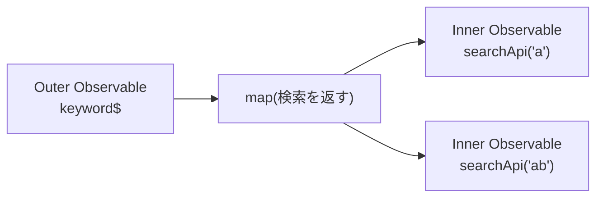

前章までで、複数のObservableを組み合わせる方法を見てきました。この章では、少し違う組み合わさり方を扱います。Observableの中に、別のObservableが入れ子になっている状態です。

この状態はHigher-order Observable（高階Observable）と呼ばれ、RxJSでもっともつまずきやすい場所の1つです。名前からして難しそうですが、順を追えば大丈夫です。ここを乗り越えると、次章の主役であるFlattening Operatorが、「なぜ必要なのか」を心から納得して読めるようになります。この章は、そのための重要な準備です。

まず、どうやって入れ子ができてしまうのかを確認し、それを素直に購読しようとしたときに起きる問題を、じっくり見ていきます。

## Observableの中にObservableがある状態

`map`を思い出してください。`map`は、値を別の値に変換するOperatorでした。では、`map`の中で「Observableを返す」と、どうなるでしょうか。ここが出発点です。

具体例で考えます。検索キーワードを受け取り、そのキーワードで検索するObservableを返す、という場合です。

```ts
import { fromEvent, map } from 'rxjs';

const keyword$ = fromEvent<InputEvent>(input, 'input').pipe(
  map((e) => (e.target as HTMLInputElement).value),
);

const result$ = keyword$.pipe(
  map((keyword) => searchApi(keyword)), // searchApiはObservableを返す
);
```

ここで、`searchApi(keyword)`はObservableを返します。ということは、`map`が流すのは「検索結果」そのものではなく、「検索結果を流すObservable」です。検索結果の型を`SearchResult[]`とすると、`result$`の型は`Observable<Observable<SearchResult[]>>`です。外側と内側の2層になっていることが、型にも表れます。

## Higher-order ObservableとInner・Outer

値としてObservableを流すObservableを、Higher-order Observable（高階Observable）と呼びます。

登場する2つのObservableには、それぞれ名前が付いています。外側のObservable、つまり値を出すきっかけになるほうを、Outer Observableと呼びます。内側の、値として流れてくるほうを、Inner Observableと呼びます。この2つの呼び名は、この先ずっと使うので、ここで押さえておきましょう。



先ほどの例でいえば、キーワードを流す`keyword$`がOuter、`searchApi(keyword)`が返すそれぞれのObservableがInnerです。キーワードが変わるたびに、新しいInner Observableが生まれます。「a」で1つ、「ab」でもう1つ、という具合です。

## mapでObservableを返すとどうなるか

問題は、このままでは検索結果が受け取れないことです。`result$`を購読しても、流れてくるのはObservableオブジェクトそのものです。

```ts
result$.subscribe((value) => {
  console.log(value); // 検索結果ではなく、Observableオブジェクトが流れてくる
});
```

なぜでしょうか。ここで`searchApi(...)`が返すのは、購読をきっかけにリクエストを始めるCold Observableだとします。ところが、`result$`を購読しても、その中のInner Observableは購読されないままです。だから、検索結果ではなく、Observableオブジェクトがそのまま流れます。検索結果を受け取るには、このInnerも購読する必要があります。

## Nested Subscribeの問題

そこで、多くの人が最初に思いつくのが、「購読の中で、さらに購読する」という書き方です。これをNested Subscribe（ネストした購読）と呼びます。

```ts
keyword$.subscribe((keyword) => {
  searchApi(keyword).subscribe((result) => {
    console.log(result); // ここで検索結果が受け取れる
  });
});
```

たしかに、これで結果は受け取れます。動くには動きます。しかし、この書き方には、いくつも問題があります。

まず、読みにくくなります。購読が入れ子になると、「非同期処理とリアクティブプログラミング」の章で見た「コールバック地獄」と、まったく同じ形に逆戻りしてしまいます。せっかくRxJSを使っているのに、これでは意味がありません。

次に、購読の管理が難しくなります。内側の購読を、いつ、どうやって解除するのか。外側の購読と合わせて、どう後片付けするのか。とたんに複雑になります。

そして何より、Inner Observableどうしの調整ができません。これがいちばんの問題です。新しいキーワードが来たとき、前の検索結果をもう受け取りたくなくても、Nested Subscribeでは、前の内側の購読が、そのまま生き残ってしまいます。

## Observableを平坦化する

これらの問題は、入れ子を「平らにする」ことで、まとめて解決できます。

平らにする、とはどういうことか。Outer Observableが流すInner Observableを、自動的に購読し、その値をそのまま1本の流れに乗せる。この操作を、平坦化（Flattening）と呼びます。


平坦化すると、Inner Observableの購読は自動で行われ、その結果だけが流れてきます。Nested Subscribeのように、購読の中で購読を書く必要はありません。購読は、いちばん外側で1回するだけで済みます。入れ子だった箱が、開かれて中身だけが取り出される、というイメージです。

## Flattening Operator

この平坦化を担うのが、Flattening Operatorです。代表的なものが4つあります。

| Operator | 平坦化のしかた |
|---|---|
| `mergeMap` | すべてのInnerを並行して購読する |
| `concatMap` | Innerを順番に、前の完了を待って購読する |
| `switchMap` | 新しいInnerが来たら、前のInnerを解除する |
| `exhaustMap` | Innerの処理中は、新しいInnerを無視する |

「4つもあるのか」と思うかもしれません。しかし、心配いりません。どれも「Outerの値をInner Observableに変えて平坦化する」という点は、まったく同じです。違うのは、たった1点。「Innerの処理中に、次のOuterの値が来たとき、どう振る舞うか」だけです。この1点の違いが、実務での使い分けを決めます。詳しくは次章で、1つずつ扱います。

## 非同期処理の競合

なぜ4つも種類が必要なのでしょうか。その答えは、非同期処理の「競合」にあります。

検索の例で考えてみましょう。ユーザーが「a」「ab」「abc」と、続けて素早く入力したとします。すると、3つの検索が始まります。ここで問題です。もし「ab」の検索結果が、「abc」の検索結果よりも「遅れて」返ってきたら、どうなるでしょうか。

```text
入力:     a      ab       abc
検索開始: |------>|------->|------>
結果到着:      abcの結果      abの結果（遅れて到着）
```

何も考えずに、返ってきた結果をすべて表示すると、最後に画面に残るのは、遅れて届いた「ab」の結果です。ユーザーが最後に入力したのは「abc」なのに、その結果が、古い「ab」の結果に上書きされてしまうのです。これが、非同期処理の競合です。通信の速さは毎回違うので、こうした逆転は、実際によく起こります。

## 処理順序とキャンセル

この競合を、どう扱うか。ここで、Flattening Operatorの違いが効いてきます。

- すべての検索を並行して行い、来た順に表示する → `mergeMap`
- 検索を順番に行い、前の結果を待ってから次へ → `concatMap`
- 新しい入力が来たら、前の検索の購読を解除する → `switchMap`
- 検索中は、新しい入力を無視する → `exhaustMap`

検索のように「最新の結果だけがほしい」場合は、前のInnerの購読を解除する`switchMap`が向いています。古いInnerからの通知を受け取らなくなるので、新しい結果が上書きされません。通信自体も中断できるかどうかは、Inner ObservableがTeardown Logicを実装しているかに依存します。

つまり、Flattening Operatorを選ぶことは、「非同期処理の競合を、どう解決するか」を選ぶことなのです。処理順序を保ちたいのか、最新だけがほしいのか、二重実行を防ぎたいのか。目的によって、選ぶOperatorが変わります。次章では、その4つのOperatorを、Marble Diagramと具体例で、じっくり見比べていきます。

## Nested Subscribeは平坦化して1本の流れに戻す

Higher-order ObservableとNested Subscribeの関係を整理します。

- `map`の中でObservableを返すと、Observableを流すObservable（Higher-order Observable）になります。
- 外側をOuter、内側をInner Observableと呼びます。
- Innerを受け取ろうと購読の中で購読するNested Subscribeは、読みにくく、管理も調整も難しくなります。
- 入れ子を平坦化すると、Innerが自動で購読され、結果が1本の流れになります。
- 平坦化を担うのがFlattening Operatorで、Innerの処理中に次が来たときの振る舞いで4つに分かれます。
- Operatorの選択は、非同期処理の競合をどう解決するかの選択です。

次章では、その4つのFlattening Operator、`mergeMap`・`concatMap`・`switchMap`・`exhaustMap`を、1つずつ見比べていきます。
