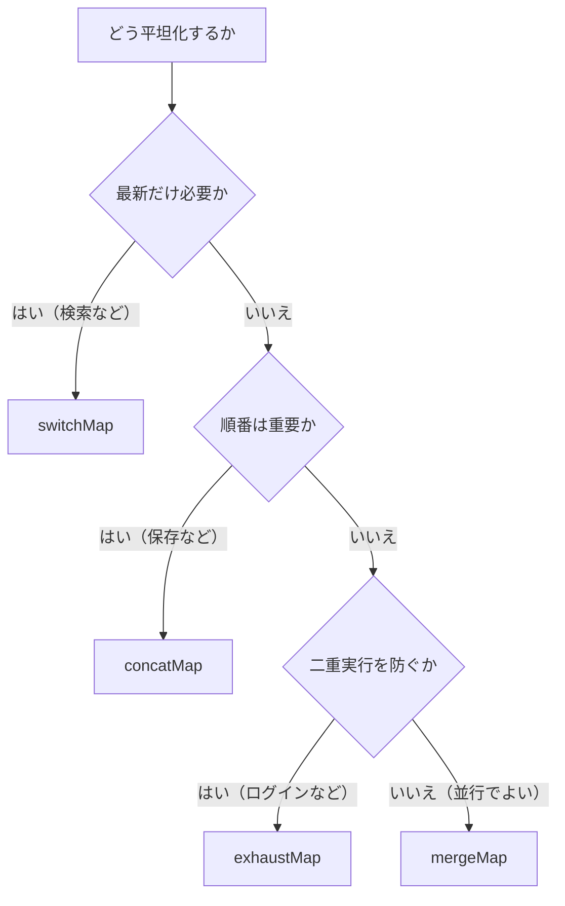

前章で、Higher-order Observableと、それを平坦化するFlattening Operatorの存在を確認しました。この章では、その4つを、1つずつ、じっくり見比べます。

`mergeMap`、`concatMap`、`switchMap`、`exhaustMap`。名前は違いますが、前章で見たとおり、どれも「Outerの値をInner Observableに変えて平坦化する」という点は同じです。違うのは、ただ1点。「Innerの処理中に、次のOuterの値が来たとき、どう振る舞うか」だけです。

この章は、本書の山場です。4つの違いをMarble Diagramで見比べ、「どの場面で、どれを選ぶか」を、自分で判断できるようになることを目指します。ここを押さえれば、RxJSでの非同期処理の組み立てが、ぐっと自由になります。

## 4つに共通する形

まず、4つに共通する形を確認しておきましょう。どのOperatorも、次のように書きます。

```ts
outer$.pipe(
  mergeMap((value) => createInner(value)), // ここをconcatMap等に変えるだけ
);
```

Outerの値を受け取り、Inner Observableを返す関数を渡します。この形は、4つとも完全に同じです。だから、いったんこの形で書けば、あとは`mergeMap`の部分を`concatMap`などに書き換えるだけで、振る舞いを切り替えられます。

以降の説明では、動きを見比べやすいよう、共通の例を使います。Outerが値`a`、`b`を流し、それぞれが「少し時間のかかるInner Observable」（`a`なら結果`aR`を流す）になる、という設定です。そして、`b`は`a`の処理が終わる前に届く、とします。このとき4つがどう振る舞うかを、順に見ていきます。

## mergeMapで並行して実行する

`mergeMap`は、Innerをすべて並行して購読します。前のInnerが終わるのを待たず、Outerの値が来るたびに、新しいInnerをどんどん始めます。

```text
outer:    --a--b---------|
              mergeMap(x => 少し遅れて xR)
inner-a:    -----aR|
inner-b:       -----bR|
出力:      --------aR-bR--|
```

`a`のInnerと`b`のInnerが、同時に走っています。そして、結果が出そろった順に流れます。

`mergeMap`には、性質が2つあります。1つは、実行順序が保証されないことです。先に始めたInnerが、あとから始めたInnerより、遅く終わることもあります。もう1つは、Innerが増えれば、そのぶん同時に走る処理も増えることです。

同時に走る数を制限したいときは、第2引数で上限を指定できます。

```ts
import { from, mergeMap } from 'rxjs';

from(fileList)
  .pipe(mergeMap((file) => uploadFile(file), 2)) // 同時に最大2つまで
  .subscribe((result) => console.log(result));
```

`mergeMap`が向くのは、複数ファイルのアップロードのように、順番を問わず、並行して進めてよい処理です。

## concatMapで順番に実行する

`concatMap`は、Innerを1つずつ、順番に購読します。前のInnerが`complete`してから、次のInnerを始めます。

```text
outer:    --a--b---------|
              concatMap(x => 少し遅れて xR)
inner-a:    -----aR|
inner-b:           -----bR|
出力:      -----aR----bR--|
```

`b`は`a`の処理中に届きましたが、すぐには始まりません。`a`のInnerが終わってから、`b`のInnerが始まっています。だから、結果は必ず、Outerの値の順（`aR`→`bR`）に流れます。

順番が保証される代わりに、注意点があります。Outerの値が、Innerの完了より速いペースで届くと、待ち行列がたまっていきます。処理が追いつかないと、実行待ちがどんどん増えてしまうのです。

`concatMap`が向くのは、保存処理のように、順番が重要で、確実に1つずつ処理したいときです。

```ts
import { concatMap } from 'rxjs';

saveRequests$
  .pipe(concatMap((data) => saveToServer(data))) // 前の保存を待って次を保存
  .subscribe();
```

## switchMapで最新の処理だけを残す

`switchMap`は、新しいOuterの値が来ると、前のInnerの購読を解除して、新しいInnerに乗り換えます。「切り替える（switch）」という名前のとおりです。

```text
outer:    --a--b---------|
              switchMap(x => 少し遅れて xR)
inner-a:    ---x            （bが来た時点で解除）
inner-b:       -----bR|
出力:      ----------bR---|
```

`b`が来た時点で、まだ処理中だった`a`のInnerは、解除されます。だから、`a`の結果`aR`は流れません。つねに、最新のInnerだけが生き残ります。

ここで、前章で見た「検索の競合」を思い出してください。`switchMap`は、あの問題を自然に解決します。新しいキーワードが来たら、前のInnerの購読が解除されるため、古い結果は下流へ届きません。

**インクリメンタル検索 2/4: 最新の検索へ切り替える**

```ts
import { fromEvent, map, debounceTime, switchMap } from 'rxjs';

fromEvent<InputEvent>(input, 'input')
  .pipe(
    map((e) => (e.target as HTMLInputElement).value),
    debounceTime(300),
    switchMap((keyword) => searchApi(keyword)), // 前のInnerの購読を解除する
  )
  .subscribe((results) => render(results));
```

インクリメンタル検索は、`switchMap`の代表的な使いどころです。ユーザーが求めているのは、最新の入力に対する結果だけだからです。なお、購読解除によって通信そのものも止まるのは、`searchApi`が`fromFetch`などのキャンセル可能なObservableを返す場合です。Promiseを包んだだけのObservableでは、通知は止まっても通信が続くことがあります。

## exhaustMapで処理中の新しい値を無視する

`exhaustMap`は、Innerの処理中に来たOuterの値を、無視します。処理が終わるまでは、新しい値を受け付けません。

```text
outer:    --a--b---------|
              exhaustMap(x => 少し遅れて xR)
inner-a:    -----aR|
出力:      --------aR-----|
              （bはaの処理中なので無視される）
```

`b`は、`a`のInnerが走っている最中に来たので、無視されました。「処理中の割り込みは受け付けない」という動きです。

これが役立つのが、二重送信の防止です。ログインボタンを連打しても、最初のログイン処理が終わるまで、あとのクリックはすべて無視されます。

```ts
import { fromEvent, exhaustMap } from 'rxjs';

fromEvent(loginButton, 'click')
  .pipe(exhaustMap(() => login())) // ログイン中の連打は無視
  .subscribe((result) => console.log(result));
```

## 4つのFlattening Operatorの使い分け

4つの違いを、表にまとめます。違いは、くり返しになりますが、「Innerの処理中に、新しいOuterの値が来たときの振る舞い」です。

| Operator | 新しい値が来たとき | 主な用途 |
|---|---|---|
| `mergeMap` | 並行して実行する | 独立した複数処理（アップロードなど） |
| `concatMap` | 順番待ちにする | 順序が重要な処理（保存など） |
| `switchMap` | 前のInnerの購読を解除する | 最新の結果だけ必要なとき（検索など） |
| `exhaustMap` | 新しい処理を無視する | 二重実行を防ぎたいとき（ログインなど） |

選ぶときは、次のように考えます。

- 順番も最新も気にせず、とにかく全部実行したい → `mergeMap`
- 1つずつ順番に、もれなく実行したい → `concatMap`
- 最新の1つだけがほしい → `switchMap`
- 実行中は追加を受け付けたくない → `exhaustMap`

## 書き込み処理での注意

使い分けで、とくに気をつけたいのが、書き込み処理です。ここは、初学者が事故を起こしやすいポイントなので、強調しておきます。

検索のように「最新の結果だけを表示する」処理では、`switchMap`が合います。一方、保存や送信で`switchMap`を使うと、前のInnerの購読が解除されます。サーバー側の処理はすでに完了している可能性もあり、購読解除が書き込みを取り消すとは限りません。その結果、書き込みは行われたのに応答だけ受け取れない、といった不整合が起こり得ます。

すべての書き込みを順番に完了させるなら`concatMap`、処理中の重複送信を無視するなら`exhaustMap`が候補です。自動保存のように「最新状態だけを送ればよい」と明確に設計され、APIの冪等性も確保されているなら、書き込みで`switchMap`を選ぶ場合もあります。読み取り・書き込みという分類だけでなく、「途中の値を捨ててよいか」で判断してください。



この判断フローを頭に入れておけば、実務で「どれを使うべきか」で迷ったとき、上から順にたどるだけで、答えにたどり着けます。

## 4つを選べるか確認する

1. 画像を最大3件まで並行アップロードしたい。
2. 編集履歴を到着順に、1件ずつ保存したい。
3. ログイン中のボタン連打を無視したい。
4. 検索語が変わったら、古い結果を表示したくない。

:::details 解答
1. `mergeMap(project, 3)`です。すべて処理しつつ、同時実行数を制限します。
2. `concatMap`です。前の保存の完了を待って次へ進みます。
3. `exhaustMap`です。実行中に届いた新しい値を無視します。
4. `switchMap`です。前のInnerの購読を解除し、最新の結果だけを下流へ流します。
:::

## Inner Observableの扱い方で4つのOperatorを選ぶ

4つのFlattening Operatorの違いを整理します。

- 4つとも、Outerの値をInner Observableに変えて平坦化します。違いはInnerの処理中の振る舞いです。
- `mergeMap`は並行して実行し、順序は保証されません。同時実行数を制限できます。
- `concatMap`は順番に実行しますが、速く届くと待ち行列がたまります。
- `switchMap`は前のInnerの購読を解除し、最新だけを残します。最新結果だけを使う検索に向きます。
- `exhaustMap`は処理中の新しい値を無視します。二重送信の防止に向きます。
- 書き込みかどうかだけで決めず、すべて処理するか、順番を守るか、途中の値を捨ててよいかで選びます。

次章からは、1つの実行を複数の購読者へ配るSubjectと、Multicastの仕組みを扱います。
