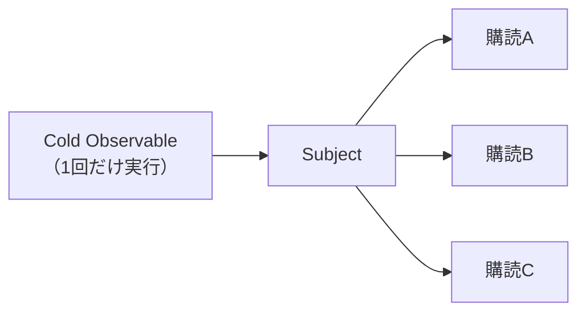

ここからは、1つの実行を複数の購読者で共有する仕組みを扱います。

その中心にあるのが、Subjectです。Subjectは、これまで見てきたObservableとは、少し違う性質を持ちます。外から値を流し込めて、しかも複数の購読者へ、同じ値を配れるのです。

この章では、Subjectの基本と、4つの種類、そしてSubjectがどうやってMulticast（複数への配信）を実現するのかを見ていきます。あわせて、Subjectを使うべき場面と、使わずに済ませたほうがよい場面を整理します。Subjectは便利ですが、使いどころを誤ると、かえって流れを追いにくくする道具でもあるので、そこも押さえます。

## SubjectはObservableでありObserverでもある

Subjectのいちばんの特徴は、ObservableとObserverの、両方の顔を持つ点にあります。ここが、ふつうのObservableと違うところです。

Observableとしての顔があるので、購読できます。同時に、Observerとしての顔もあるので、`next`・`error`・`complete`を持ち、外から値を流し込めます。

```ts
import { Subject } from 'rxjs';

const subject = new Subject<number>();

// Observableとして購読する
subject.subscribe((value) => console.log('A:', value));

// Observerとして外から値を流す
subject.next(1);
subject.next(2);

// 出力:
// A: 1
// A: 2
```

注目してほしいのは、`subject.next(1)`のように、購読関数の「外」から値を流している点です。これは、これまでのObservableにはなかった動きです。`of`や`interval`は、値を流すタイミングを、自分の内側に持っていました。ところがSubjectには、外部から通知を渡せます。複数の受信先へつながる、入力端子のような存在です。

## 複数の購読者へ配信する

Subjectは、複数の購読者へ同じ値を配ります。`of`や`interval`のようなUnicastのCold Observableが、購読ごとに独立していたのとは対照的です。

```text
              subject.next(1)  next(2)
購読A（先に購読）:    1        2
購読B（先に購読）:    1        2
```

```ts
import { Subject } from 'rxjs';

const subject = new Subject<number>();

subject.subscribe((value) => console.log('A:', value));
subject.subscribe((value) => console.log('B:', value));

subject.next(1);

// 出力:
// A: 1
// B: 1
```

たった1回の`next(1)`で、AとBの両方が値を受け取っています。1つの通知を複数へ配る。この動きが、Multicastです。`share`などの共有機能も、内部ではSubjectに似た分配役を使います。

ただし、注意点があります。Subjectは、購読したあとの値しか受け取れません。`next`のあとに購読した人は、それより前に流れた値を受け取れないのです。生放送に途中から参加するのと同じです。この弱点を補うのが、次に見る種類ちがいのSubjectです。

## Subjectの4つの種類

RxJSには、4種類のSubjectがあります。値の配り方が、少しずつ違います。用途に応じて使い分けます。

まず`Subject`。これは基本形で、購読したあとに流れた値だけを配ります。

`BehaviorSubject`は、初期値を持ち、つねに「最新の値」を覚えています。だから、新しく購読した人には、まず現在の値をすぐに配ります。

```ts
import { BehaviorSubject } from 'rxjs';

const subject = new BehaviorSubject<number>(0); // 初期値0

subject.next(1);
subject.subscribe((value) => console.log(value)); // 購読した瞬間に最新値1を受け取る
subject.next(2);

// 出力:
// 1
// 2
```

`ReplaySubject`は、過去に流れた値を覚えておき、新しい購読者に配り直します。いくつ覚えておくかを指定できます。

```ts
import { ReplaySubject } from 'rxjs';

const subject = new ReplaySubject<number>(2); // 直近2件を覚える

subject.next(1);
subject.next(2);
subject.next(3);
subject.subscribe((value) => console.log(value)); // 直近2件（2と3）を受け取る

// 出力:
// 2
// 3
```

`AsyncSubject`は、`complete`したときに、最後の値だけを配ります。完了するまでは、何も流しません。

これらの違いを、表にまとめます。

| 種類 | 初期値 | 新しい購読者が受け取るもの |
|---|---|---|
| `Subject` | なし | 購読後に流れた値だけ |
| `BehaviorSubject` | あり | 現在の最新値＋その後の値 |
| `ReplaySubject` | なし | 過去の指定件数＋その後の値 |
| `AsyncSubject` | なし | 完了時の最後の値だけ |

## どのSubjectを選ぶか

選ぶ基準は、「新しい購読者に、何を届けたいか」です。

- 購読後の値だけでよい → `Subject`
- つねに現在の状態を持ち、購読者にすぐ渡したい → `BehaviorSubject`
- 直近の履歴を渡したい → `ReplaySubject`
- 完了時の結果だけを渡したい → `AsyncSubject`

状態を表す場面では、`BehaviorSubject`がよく使われます。「いまの値」がいつでもあり、新しい購読者にもすぐ渡せるからです。ただし、履歴や完了時の値が必要なら、別の種類を選びます。`BehaviorSubject`を使った小規模な状態管理は、次章で扱います。

## UnicastとMulticastの仕組み

「Observableの実行タイミング」の章では、Cold / HotとUnicast / Multicastを別の軸として整理しました。Subjectは、1つのsource購読から届く通知を複数へ配ることで、UnicastなsourceをMulticastとして扱う橋渡しができます。

仕組みは、こうです。1つのCold Observableを、Subjectに1回だけ購読させます。そして、本当の購読者たちには、そのSubjectのほうを購読してもらいます。すると、Cold Observableの「1回の実行」を、Subjectが複数の購読者へ配ってくれます。



Cold Observableの実行は1回だけ、その結果をSubjectが3人へ配る、という形です。Subjectが、1対多の分配役になっているわけです。

## Cold Observableを共有する

コードで見てみましょう。Cold ObservableをSubjectに流し込み、購読者はSubjectを購読します。

```ts
import { Subject, interval, take } from 'rxjs';

const source$ = interval(1000).pipe(take(3));
const subject = new Subject<number>();

subject.subscribe((v) => console.log('A:', v));
subject.subscribe((v) => console.log('B:', v));
source$.subscribe(subject); // 2人の準備後、sourceを1回だけ購読する

// AとBは同じ3つの値を共有する（intervalは1つだけ動く）
```

`source$`（`interval`）の実行は1つだけで、AとBは同じ値を共有します。Subjectは過去の値を再配信しないため、先にAとBを購読してからsourceへ接続しています。終わらないsourceを手作業で接続する場合は、source側のSubscriptionも保持して解除しなければなりません。この接続管理まで簡単に書けるのが、次章の`share`や`shareReplay`です。

## HTTP通信の多重実行を防ぐ

共有がとくに効くのが、購読ごとにHTTPリクエストを始めるCold Observableです。ここでは、`defer`を使ってその性質を明示します。

```ts
import { defer, from } from 'rxjs';

// 悪い例: 同じObservableを3回購読 → リクエストが3回飛ぶ
const tasks$ = defer(() =>
  from(fetch('/api/tasks').then((response) => response.json())),
);

tasks$.subscribe(renderList);
tasks$.subscribe(updateCount);
tasks$.subscribe(cacheResult);
```

`defer`の関数は購読ごとに呼ばれるので、このコードは同じデータを3回取りにいきます。Subjectで共有すれば、リクエストは1回で済み、3つの購読者が同じ結果を受け取れます。なお、`from(fetch(...))`とだけ書くと、`fetch`はObservableを作った時点で1回始まります。同じPromiseを3回購読しても、リクエストは3回にはなりません。

## 共有による副作用

共有するときには、意味が少し変わる点に注意してください。Cold Observableでは、副作用は購読ごとに実行されました。共有すると、副作用は1回だけになります。

たとえば、`tap`でログを出していた場合を考えます。共有する前は、購読の数だけログが出ます。しかし共有したあとは、ログは1回だけです。共有とは「実行を1つにまとめる」ことなので、実行に伴う副作用も、1回にまとまるのです。この違いを理解しておかないと、「ログの回数が想定と違う」「初期化処理が1回しか走らない」と戸惑うことがあります。

## Subjectを使うべき場面と使わなくてよい場面

最後に、大事な心構えです。Subjectは強力ですが、なんでもSubjectで解決しようとすると、かえって流れが追いにくくなります。外から自由に値を流せるということは、裏を返せば、どこで値が流れたかを追いにくい、ということでもあるからです。

Subjectが向くのは、次のような場面です。

- 外から明示的に値を流したいとき（イベントの発信など）
- 1つの実行を複数の購読者で共有したいとき
- 現在の状態を保持して配りたいとき（`BehaviorSubject`）

逆に、Creation FunctionやOperatorで書けるなら、そちらを優先します。たとえば、DOMイベントを配るだけなら`fromEvent`で足りますし、共有だけなら`share`で書けます。まず「Observableだけで書けないか」を考え、それでも必要なときにだけSubjectを使う。この順番を守ると、コードが読みやすく保てます。

## Subjectは外部から値を流す必要がある場所に限って使う

SubjectとMulticastの要点を整理します。

- Subjectは、Observableであり、Observerでもあります。外から値を流せます。
- 1回の`next`で複数の購読者に配れます。これがMulticastです。
- `Subject`・`BehaviorSubject`・`ReplaySubject`・`AsyncSubject`は、新しい購読者に配るものが違います。
- Cold ObservableをSubjectに流し込むと、1回の実行を複数で共有できます。
- HTTPの多重リクエストは、共有で防げます。ただし副作用も1回にまとまります。
- Subjectは必要なときにだけ使い、まずObservableとOperatorで書けないかを考えます。

次章では、共有を簡単に書ける`share`と`shareReplay`、そして`BehaviorSubject`を使った状態管理を扱います。
