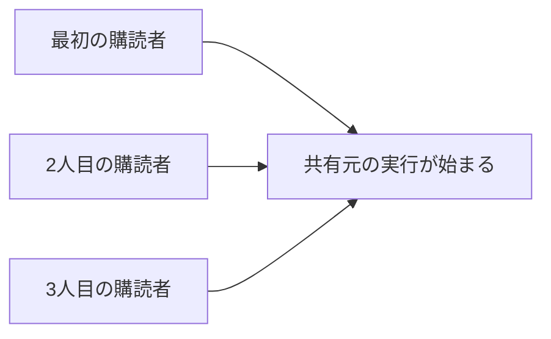

前章では、SubjectでCold Observableを共有する、手作業のパターンを見ました。この章では、それをずっと簡単に書けるOperator、`share`と`shareReplay`を扱います。

さらに、`BehaviorSubject`を使った、小規模な状態管理も見ます。現在の状態を保持し、その変化を配信する、という状態管理の基本形です。あわせて、Subjectを安全に使うための作法と、状態管理ライブラリに切り替えるべき境界も確認します。

## 実行を共有する

### shareで実行を共有する

「Cold ObservableをSubjectに流し込む」という、前章で書いたパターンは、手作業では少し面倒でした。これを、`share`Operatorは1行にまとめてくれます。

```ts
import { interval, share } from 'rxjs';

const shared$ = interval(1000).pipe(share());

shared$.subscribe((v) => console.log('A:', v));
shared$.subscribe((v) => console.log('B:', v));

// AとBは同じintervalを共有する（タイマーは1つだけ）
```

`share()`を付けるだけで、複数の購読者が1つの実行を共有します。Subjectへの接続と購読者数の管理は、`share`が内部で行います。

### 購読者数とrefCount

`share`は、購読者の数を数えています。この仕組みを、refCount（参照カウント）と呼びます。

動きは、こうです。最初の購読者が現れたとき、共有元のObservableの実行を始めます。以降の購読者は、その実行に相乗りします。購読者が増えても、実行は1つのままです。



### 最後の購読者が解除された場合

refCountは、購読者が減ったときも、数えています。すべての購読者が解除されて、購読者数が0になると、共有元の実行を止めます。

そして、そのあとに新しい購読者が現れると、実行はもう一度、最初から始まります。つまり`share`は、「誰かが見ているあいだだけ実行し、誰も見なくなったら止める」という、賢い動きをします。この性質のおかげで、誰も使っていない処理が動き続ける、という無駄を避けられます。

### shareReplayで最新値を再配信する

`share`には、1つ弱点があります。前章のSubjectと同じで、あとから購読した人は、それまでに流れた値を受け取れないのです。共有はしても、過去は配り直しません。

過去の値も、新しい購読者へ配りたいときは、`shareReplay`を使います。指定した数だけ過去の値を覚えておき、新しい購読者に配り直してくれます。

```ts
import { defer, from, shareReplay } from 'rxjs';

const tasks$ = defer(() =>
  from(fetch('/api/tasks').then((response) => response.json())),
).pipe(
  shareReplay({ bufferSize: 1, refCount: true }),
);

tasks$.subscribe(renderList);
// あとから購読しても、再取得せずにキャッシュ済みの結果を受け取れる
setTimeout(() => tasks$.subscribe(updateCount), 3000);
```

### レスポンスのキャッシュ

この例の`shareReplay`は、HTTPレスポンスを共有し、直近1件を再配信します。最初の購読でリクエストを送り、その結果を、あとから購読した人にも配ります。

前章で見たColdな`tasks$`をそのまま2回購読すれば、リクエストは2回始まります。この例では、購読が重なる間の実行を共有し、完了後も最後のレスポンスを再配信するため、同じ`tasks$`インスタンスから受け取る購読者には1回の結果を渡せます。変更頻度の低いマスターデータなどに向く形です。

### 意図しない永続購読

便利な`shareReplay`ですが、大きな落とし穴があります。使い方によっては、すべての購読者が解除されても、共有元の購読が残り続けてしまうのです。

これは、`shareReplay`が既定では、購読者数が0になっても共有元を解除しないためです。終わらないObservableでは、不要なタイマーやイベントリスナーが動き続け、保持した参照によってはメモリリークにもつながります。

防ぐには、購読者数に連動する設定を、明示的に指定します。

```ts
import { shareReplay } from 'rxjs';

source$.pipe(
  shareReplay({ bufferSize: 1, refCount: true }), // 購読者が0になったら止める
);
```

`refCount: true`を指定すると、購読者が0になったときに、共有元の購読を解除します。終わらないObservableでは、この設定が必要かを必ず検討してください。キャッシュを接続後も維持したい場合など、意図して`false`を選ぶ設計もあります。

### 再取得のきっかけは別に設計する

`shareReplay`によるキャッシュには、もう1つ知っておきたい点があります。`shareReplay`自体には、有効期限や再取得の予定を決める機能がありません。

データを取り直したいときは、再取得のきっかけを別に用意します。たとえば、更新ボタンのクリックを起点に新しいリクエストへ切り替え、その結果を共有します。`shareReplay`は通知の共有と再配信を担いますが、いつ最新化するかはアプリ側の設計です。

## 小規模な状態を管理する

### BehaviorSubjectで状態を保持する

ここからは、状態管理に話を移します。`BehaviorSubject`は、前章で見たとおり、現在の値を保持できるので、小規模な状態管理に向いています。

```ts
import { BehaviorSubject } from 'rxjs';

const count$ = new BehaviorSubject(0);

count$.subscribe((value) => console.log('現在の値:', value));

count$.next(count$.value + 1); // 1
count$.next(count$.value + 1); // 2
```

`BehaviorSubject`は、現在の値を`value`で読め、`next`で更新できます。そして、購読すると、まず現在の値がすぐに届きます。「状態を保持し、変化を配信する」という、状態管理の基本形が、これだけで作れます。

### Subjectを外部へ公開しない

状態管理でSubjectを使うときには、守るべき作法があります。Subjectそのものを、外部へ公開しないことです。

なぜでしょうか。Subjectを公開してしまうと、どこからでも`next`で値を流せてしまい、状態の変化を追えなくなるからです。「外から自由に流せる」という、前章で触れた性質が、ここでは裏目に出ます。そこで、外へは「読み取り専用のObservable」だけを公開し、更新は「決められたメソッド」を通してのみ行えるようにします。

```ts
import { BehaviorSubject } from 'rxjs';

class CounterStore {
  private readonly state$ = new BehaviorSubject(0);

  // 外へは読み取り専用のObservableだけを公開する
  readonly count$ = this.state$.asObservable();

  increment() {
    this.state$.next(this.state$.value + 1);
  }

  reset() {
    this.state$.next(0);
  }
}
```

`asObservable`でSubjectをObservableに変えて公開すると、外からは購読できても、`next`は呼べません。状態を変えられるのは、`increment`や`reset`といったメソッドだけになります。こうして、状態を変える経路が1本にまとまり、変化を追いやすくなります。

### scanによる状態更新

もう1つの書き方が、`scan`を使う方法です。操作（アクション）のストリームを`scan`に通し、前の状態と操作から、新しい状態を作ります。

```ts
import { Subject, scan, shareReplay, startWith } from 'rxjs';

type Action = { type: 'increment' } | { type: 'reset' };

const action$ = new Subject<Action>();

const count$ = action$.pipe(
  scan((state, action) => {
    switch (action.type) {
      case 'increment':
        return state + 1;
      case 'reset':
        return 0;
    }
  }, 0),
  startWith(0),
  shareReplay({ bufferSize: 1, refCount: true }),
);
```

「操作を流すと、状態が更新されて流れてくる」という形です。`shareReplay`を加えたので、購読者がいる間は同じ状態計算を共有し、あとから加わった購読者も現在値を受け取れます。「値を変換・選別・蓄積する」の章で見た`scan`のイミュータブルな更新が、ここで生きます。

この例は`refCount: true`なので、購読者が0になると状態計算も破棄されます。次の購読では0から始まり、誰も購読していない間のActionも反映されません。画面の有無にかかわらず状態を保持する必要があるなら、ライフサイクルを持つStore内の`BehaviorSubject`や専用の状態管理ライブラリを使います。

### Subjectを乱用しない、状態管理ライブラリの境界

`BehaviorSubject`による状態管理は、小さな範囲では十分に使えます。1つの画面の中の状態や、いくつかのコンポーネントで共有する程度の状態なら、これで足ります。

しかし、状態が増え、更新の経路が複雑になってくると、手作りのSubject管理では、だんだん追いにくくなります。状態の変化を記録したい、複数の状態を組み合わせたい、といった要求が出てきたら、専用の状態管理ライブラリを検討する時期です。Angularなら、シリーズ後続で扱うNgRxが、その選択肢になります。「RxJSでどこまで状態を扱い、どこからライブラリに任せるか」。その境界を意識すると、コードを健全に保てます。

Subjectは、状態管理でも便利な道具ですが、乱用は禁物です。前章でも触れたとおり、まずObservableとOperatorで書けないかを考え、状態の保持や共有が本当に必要なときにだけ、Subjectを使ってください。

## 共有だけならshare、過去の値も渡すならshareReplay

共有のOperatorと小規模な状態管理の要点を整理します。

- `share`は、複数の購読者で1つの実行を共有します。refCountで購読者数を数えます。
- `share`は購読者が0になると実行を止め、次の購読で最初からやり直します。
- `shareReplay`は過去の値を配り直し、HTTPレスポンスのキャッシュに向きます。
- `shareReplay`の既定では購読者数0で共有元を解除しません。終わらないsourceでは`refCount: true`を検討します。
- `BehaviorSubject`で状態を保持し、`asObservable`で読み取り専用にして公開します。
- 小規模ならSubjectで足りますが、複雑になったら状態管理ライブラリを検討します。

次章からは、ストリームを壊れにくくするための仕組みを扱います。まず、エラー処理・再試行・キャンセルです。
