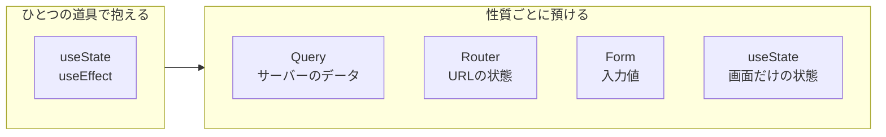
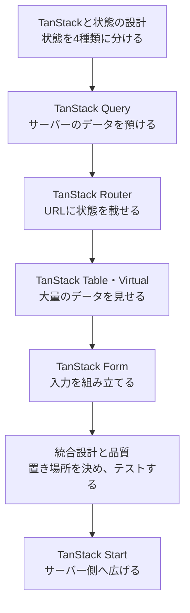
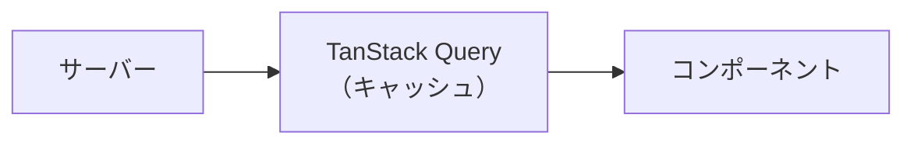
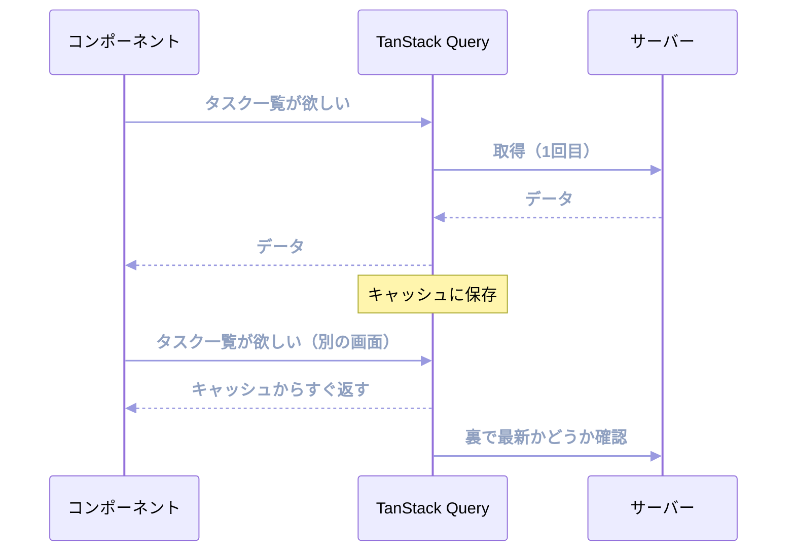
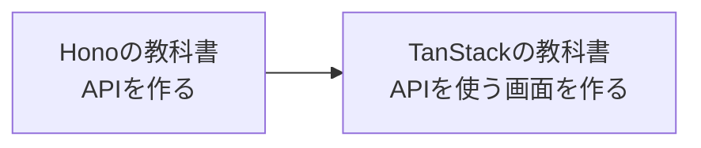

本書は、TanStackのライブラリ群を使って、Reactアプリケーションのデータまわりを設計できるようになるための教科書です。

TanStackという名前は、TanStack QueryやTanStack Routerといったライブラリの総称です。それぞれ単体でも使えますが、根っこには共通する考え方があります。アプリが抱える状態を性質ごとに分け、それぞれにふさわしい置き場所を用意する、という考え方です。

## TanStackの6つの道具を先に見渡す

TanStackは、1つの大きなライブラリではありません。役割の異なる道具が集まったシリーズです。本書では、Query、Router、Table、Virtual、Form、Startの6つを扱います。名前だけでは違いがわかりにくいので、最初に「何に困ったときに使うのか」を見ておきましょう。

### Queryはサーバーのデータを預かる

タスク一覧をAPIから取得すると、読み込み中、失敗、再取得、キャッシュといった管理が必要になります。同じ一覧を複数の画面で使うなら、通信の重複も避けたいところです。**TanStack Query**は、サーバーから取得したデータと通信状態をまとめて管理します。

QueryがAPIそのものを作るわけではありません。`fetch`やServer Functionで取得した結果を預かり、いつ再取得するか、どの画面で共有するかを判断します。

### RouterはURLと画面を結びつける

一覧、詳細、ログインと画面が増えると、URLとコンポーネントの対応が必要になります。検索条件やページ番号をURLへ残せば、再読み込みや共有にも耐えられます。**TanStack Router**は、画面遷移、パス、検索パラメーター、Loaderを型安全につなぎます。

存在しないパスや足りないパラメーターは、TypeScriptが実行前に見つけます。URLを単なる文字列ではなく、アプリの状態を置く場所として扱うための道具です。

### Tableは表の計算を引き受ける

表には、列、行、並び替え、絞り込み、ページ送り、選択など、多くの状態と計算があります。**TanStack Table**は、その計算を引き受ける表のエンジンです。

完成した表の見た目は付いてきません。HTMLやスタイルは自分で書きます。その代わり、デザインを変えても、並び替えや絞り込みの仕組みはそのまま使えます。

### Virtualは見える範囲だけを描く

数千件の行をすべてDOMへ置くと、ブラウザの描画が重くなります。**TanStack Virtual**は、スクロール位置をもとに、画面に見えている項目とその周辺だけを描画します。

Virtualはデータの取得件数を減らすものではありません。大量のデータをすでに持っているときに、同時に作るDOMの数を減らす道具です。Tableと組み合わせることもできます。

### Formは入力と検証をまとめる

フォームが大きくなると、入力値、エラー、変更済みかどうか、送信中かどうかを項目ごとに管理する必要が出てきます。**TanStack Form**は、これらのフォーム状態と検証、送信処理をまとめます。

入力欄の見た目は自分で作ります。Formは、どの項目にどの値が入り、いつ検証し、いま送信できるかを管理します。項目名と値の型がつながるため、入力項目の書き間違いも型検査で見つかります。

### Startはブラウザとサーバーをつなぐ

ここまでの5つは、必要な場所へ追加するライブラリです。**TanStack Start**は役割が異なり、Reactアプリ全体の実行方法を決めるフルスタックフレームワークです。

TanStack Routerを土台に、サーバーでHTMLを作るSSR、サーバー処理を呼ぶServer Functions、外部向けのHTTP APIを作るServer Routesなどを加えます。Query、Table、Virtual、FormをStartの中で使うこともできます。Startはほかの道具を置き換えるのではなく、ブラウザとサーバーの両方で使えるアプリの土台を作ります。

6つの関係を、タスク管理アプリに当てはめると次のようになります。

| やりたいこと | 選ぶ道具 |
|---|---|
| APIからタスクを取得し、キャッシュする | Query |
| `/tasks/1`のようなURLと画面を結ぶ | Router |
| タスクを並び替え、絞り込み、表にする | Table |
| 長いタスク一覧を軽く描画する | Virtual |
| タスクの入力と検証を管理する | Form |
| HTML生成やサーバー処理まで同じアプリで扱う | Start |

すべてを同時に入れる必要はありません。困りごとが生まれた場所に、その仕事を担当する道具を置きます。この本では、タスク管理アプリへ1つずつ加えながら、役割の違いを確かめます。

## 苦しいコードはどこから生まれるか

Reactでアプリを作っていると、こんな場面に出会います。`useEffect`でAPIを呼んだら、読み込み中フラグとエラー用の`useState`が増えていく。同じデータを2つの画面で使いたくて、グローバルなストアに入れる。検索条件を`useState`で持っていたら、ページをリロードした瞬間に消えてしまった。どれも動きはします。ただ、書いている本人がいちばん「なんとなく苦しい」と感じるコードです。

苦しさの正体は、性質の違うものを同じ道具で扱っていることにあります。サーバーから借りてきたデータと、モーダルが開いているかどうかのフラグは、性質がまるで違います。前者は自分が何もしなくても古くなり、他の誰かに書き換えられます。後者は勝手に古くなりません。この2つを同じ`useState`で持とうとすると、片方のために書いた仕組みがもう片方の邪魔をします。

TanStackは、状態の違いに合わせて道具を分けます。サーバーのデータはTanStack Queryに、URLに残したい条件はTanStack Routerに、フォームの入力値はTanStack Formに預ける。道具を分けると、それぞれのコードは短くなり、消えていたはずのバグが最初から起きなくなります。



## 本書で目指すもの

本書が目指すのは、APIの一覧を覚えることではありません。目の前の状態がどの種類なのかを見分け、ふさわしい置き場所を選び、型に守られたコードを書けるようになることです。

そのために、3つを軸にして進めます。

- **状態の置き場所から考えること**: どのライブラリを説明するときも、「この状態はなぜここに置くのか」から入ります。`useQuery`の書き方より先に、そのデータが誰のものかを考えます。この判断ができるようになると、はじめて使うライブラリでも置き場所の見当がつきます。
- **素朴なコードが壊れる場面を見ること**: 各章は、まず素朴な書き方から始めます。そして、それがどこで壊れるかを実際に確かめてから、TanStackの解決策に移ります。壊れ方を知らないまま便利な道具を使うと、道具が何を守ってくれているのかがわかりません。
- **型に導かれて書くこと**: TanStackのライブラリは、TypeScriptの型推論を土台に設計されています。ルートのパス、URLの検索条件、フォームの項目名までが型検査の対象になります。型エラーを面倒な障害物として避けるのをやめ、実行前にバグを教えてくれる仕組みとして使い倒します。

## 対象読者

本書は、次のような読者を想定しています。

- Reactでコンポーネントを書いたことがある人
- `useEffect`によるデータ取得に手応えの悪さを感じている人
- 管理画面やダッシュボードのような、データ中心の画面を作る人
- TanStack Queryだけは使っているが、他のライブラリには触っていない人
- Next.js以外の選択肢を、体系的に知っておきたい人

TanStackの経験は前提にしません。最初のライブラリは、インストールから順を追って導入します。

ただし、Reactの基本は知っているものとして進めます。コンポーネント、props、`useState`、`useEffect`、カスタムフックの書き方がわかっていれば読み進められます。TypeScriptについても、型注釈と`interface`が読める程度を前提にします。ジェネリクスや型推論の細かい話は、必要になった箇所でそのつど補足します。

## 本書の構成

本書は、7つの段階を順番に進みます。前の段階が次の段階の土台になるため、はじめて学ぶ場合は順番に読むことをおすすめします。



各段階で扱う章は次のとおりです。

| 段階 | 扱う章 |
|---|---|
| TanStackと状態の設計 | 「TanStackとは」「フロントエンドの状態を分類する」「開発環境の準備」 |
| サーバー状態 | 「TanStack Queryの導入」「useQueryによるデータ取得」「キャッシュとデータの鮮度」「Mutationによるデータ更新」「Optimistic Update」「ページネーションと無限スクロール」「Queryの設計パターン」「エラー処理とSuspense」 |
| URL状態と画面遷移 | 「TanStack Routerの導入」「型安全なルーティングとナビゲーション」「Search ParamsとURL状態」「Loaderによるデータ取得」「QueryとRouterの連携」「認証とアクセス制御」 |
| 大量データの表示 | 「TanStack Tableの導入」「ソート・フィルタ・ページネーション」「サーバーサイドテーブル」「TanStack Virtualによる仮想化」 |
| フォーム状態 | 「TanStack Formの導入」「バリデーションと送信処理」 |
| 統合設計と品質 | 「状態の置き場所を設計する」「テスト戦略」 |
| フルスタック | 「TanStack Startの導入とSSR」「Server FunctionsとフルスタックQuery」 |

前半のQueryとRouterが、本書のいちばん厚い部分です。この2つはTanStackの中核であり、しかも互いに深く関わります。TableやFormから読み始めたくなるかもしれませんが、Queryのキャッシュの考え方を知っていると、後半の章が一気に読みやすくなります。

巻末には、目的別のAPI早見表、まだ扱っていないTanStackライブラリの紹介、用語集を付録として用意しています。学習中の索引として使ってください。

## 本書で扱う題材

章ごとに題材が変わると、覚えることばかり増えて話がつながりません。そこで本書は、ひとつの題材を最初から最後まで育てます。タスク管理アプリです。

- タスクの一覧と、1件ずつの詳細
- タスクの作成・更新・削除
- 絞り込み、並び替え、ページ送り
- 一覧を表として見せる画面
- タスクを入力するフォーム

素朴な一覧画面から始めて、キャッシュを効かせ、URLに検索条件を持たせ、表に組み替え、フォームをつなぎ、最後はサーバーサイドレンダリングまで到達します。同じ画面が章をまたいで少しずつ変わるので、ひとつの機能を足したときに何が良くなったのかを、比較しながら確認できます。

APIはモックを用意します。バックエンドの準備は不要で、フロントエンドだけで動きます。

## サンプルコードの前提

本書のサンプルコードは、次を前提とします。

- **React 19**
- **TypeScript**（`strict`モード）
- **Vite**（ビルドツール）

本書で採用した完成コードは、[サンプルコードのリポジトリ](https://github.com/nagahara-naoki/tanstack-textbook-samples)に置いています。第4章なら`chapter-04`、第12章なら`chapter-12`というように、章を読み終えた時点のコードをGitタグで固定しています。各章の冒頭から、その章の完成コードと前章との差分を開けます。

本文のコードには、次の4種類があります。

| 表示 | 読み方 |
|---|---|
| 新規作成 | 見出しに表示したパスへファイルを作る |
| 追記 | 既存ファイルの指定した場所へ足す |
| 置き換え | 指定した関数やファイルを入れ替える |
| 説明用 | 仕組みの比較や失敗の再現に使う。完成コードには含めない |

ファイルパスが付いていても、コードブロックがファイル全体とは限りません。部分的なコードでは、直前の文章で追記先や置き換える範囲を示します。迷ったときは、章の完成コードか前章との差分を確認してください。

各ライブラリのバージョンは次のとおりです。TanStackのパッケージ名には、`@tanstack/react-query`のようにフレームワーク名が入ります。同じ機能がVueやSolid向けにも提供されているためです。

| ライブラリ | バージョン | 担当する範囲 |
|---|---|---|
| TanStack Query | v5系 | サーバーから借りたデータ |
| TanStack Router | v1系 | 画面遷移とURLに載せる状態 |
| TanStack Table | v8系 | 表の並び替え・絞り込み・ページ送り |
| TanStack Form | v1系 | 入力値とバリデーション |
| TanStack Virtual | v3系 | 数万行の描画 |
| TanStack Start | v1系（RC） | サーバーサイドレンダリングとサーバー関数 |

:::message
6つのうち、TanStack Startだけが正式な安定版の宣言前です。リリース候補（Release Candidate）として、機能は揃いAPIも固まった状態が公式にアナウンスされています。バージョン番号が1系なのは、土台であるTanStack Routerと番号を揃えているためです。本書では最終部で扱い、実務に投入する判断材料もあわせて示します。

TanStack Tableについては、2026年8月にv9の安定版が公開されました。内部の作りが大きく変わり、メモリ使用量や再描画の制御が改善されています。ただし出たばかりで、実務のコードもネット上の記事も、まだv8が大半です。本書は普及しているv8で解説し、v9で何が変わるのかは該当の章で補足します。
:::

TanStack Queryは、v4以前は「React Query」という名前でした。ネット上の記事にはv4時代のコードが多く残っており、`isLoading`や`cacheTime`のように名前が変わったオプションもあります。古い記事を読むときは、現在のAPI名に読み替えてください。

## コードと図の読み方

本書では、文章だけで押し切らず、要所で図を使います。使う図は大きく2種類です。

1つは、**構造や流れを表す図**です。データがどこからどこへ渡るのか、どの部品がどこに属するのかを示します。



もう1つは、**時間の流れを表す図**です。何が先に起き、何が後に起きるのか。キャッシュの動きやデータ取得の順番は、時間軸で見ないとつかめません。



この図が読めれば、本書の山場のひとつは越えています。同じデータを2回要求されたとき、TanStack Queryは1回目の結果をすぐ返し、そのあと裏側で最新かどうかを確かめます。「キャッシュとデータの鮮度」の章で、この動きを詳しく分解します。

コード例では、注目してほしい行にコメントを添えます。長いコードは、まず全体を見せてから部分ごとに解説するか、逆に部分を積み上げて全体を組み立てるか、そのつど読みやすい順序を選びます。

```tsx
const { data, isPending } = useQuery({
  queryKey: ['tasks'], // このデータを識別する名前
  queryFn: fetchTasks, // 実際に取得する処理
});
```

なお、紙面の都合で`import`文を省略する場合があります。省略するのは、直前の例と同じ`import`が続くときだけです。新しく登場するものは必ず示します。

## 公式ドキュメントとの付き合い方

本書は、公式ドキュメントの代わりを目指していません。TanStackのライブラリは開発が活発で、オプションは今も増え続けています。すべてを網羅した本は、書き終えた時点で古くなります。

そこで本書は、核となる概念と設計判断に紙面を割きます。`staleTime`と`gcTime`が何を制御しているのか、データ取得をLoaderとキャッシュのどちらに任せるのか、といった話です。ここを押さえておけば、はじめて見るオプションの意味も、公式ドキュメントを読んで自分で判断できます。

細かい引数や最新の追加機能を確認したいときは、[TanStackの公式サイト](https://tanstack.com/)をあわせて参照してください。仕組みは本書でつかみ、細部は公式ドキュメントで当たる。この行き来ができるようになった状態が、本書のゴールです。

## シリーズ内での位置付け

本書は、Web開発を学ぶための教科書シリーズの一冊です。単体で完結しますが、シリーズの他の本とは次のようにつながります。



『Honoの教科書』でAPIを作れるようになった読者は、本書でそのAPIを消費する側を学べます。本書のモックAPIを実際のHonoアプリに差し替えれば、フロントエンドとバックエンドが両方そろいます。

シリーズには、RxJS・Angular・NgRxを扱う本もあります。対象のフレームワークは違いますが、「状態を分類し、ふさわしい道具に預ける」という設計の考え方は共通です。特にNgRxを扱う本とは、サーバーのデータをどこに置くべきかという問題意識が重なります。Angularを使う読者は、本書のQueryの章を読んでからそちらへ進んでも学びがあります。

## まとめ

本書を貫く軸は、状態を性質ごとに分け、ふさわしい場所へ置くことです。

- 苦しいコードは、性質の違う状態を同じ道具で扱うところから生まれます。
- TanStackは状態を種類ごとに分け、それぞれにふさわしい置き場所を与えるライブラリ群です。
- 「置き場所から考える」「素朴なコードが壊れる場面を見る」「型に導かれて書く」の3つを軸に進めます。
- タスク管理アプリという1つの題材を、7つの段階を通して育てます。
- 構造は`flowchart`、時間の流れは`sequenceDiagram`で図示します。

次章では、6つの道具をもう一段深く見ます。なぜ役割が分かれているのか、なぜ完成した見た目を提供しないのか。Headlessと型安全という共通の思想を確認します。
