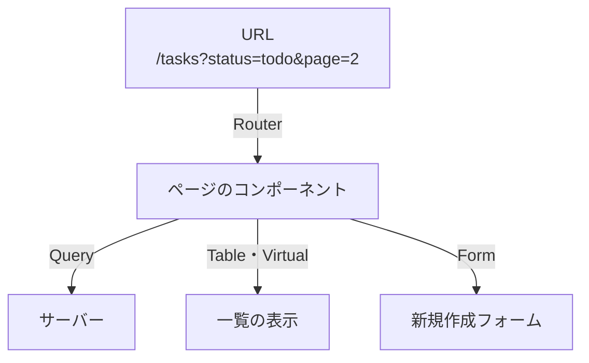
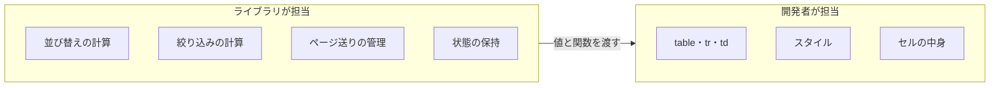
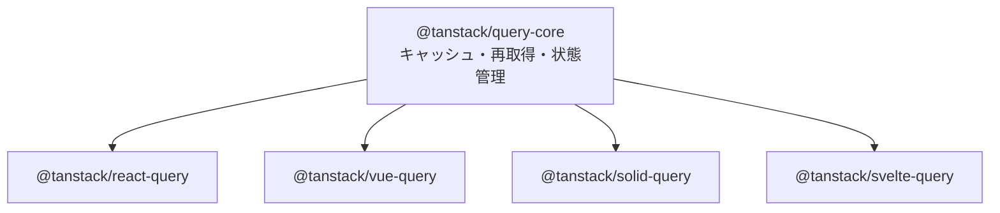

前章で、状態には性質の違いがあり、それぞれにふさわしい置き場所があるという話をしました。その置き場所を提供するのがTanStackのライブラリ群です。

この章では、まず全体像をつかみます。どんなライブラリがあり、それぞれ何を担当するのか。そして、ばらばらに作られたように見えるこれらのライブラリを貫く、2つの共通した思想を見ます。個々の使い方はこの先の章で1つずつ扱うので、ここで暗記する必要はありません。地図を眺めるように読んでください。

## TanStackという名前

TanStackは、Tanner Linsleyという開発者が中心となって作っているライブラリ群です。名前は「Tanner」と「Stack」を組み合わせた造語で、特定の会社の製品ではありません。

起点はテーブルでした。React Tableという、表を作るためのライブラリです。その後、データ取得を担うReact Queryが登場し、こちらが爆発的に広まりました。`useEffect`でのデータ取得に苦しんでいた開発者が、一斉に乗り換えたのです。

2022年、これらのライブラリは大きな転換点を迎えます。React以外のフレームワークにも対応するため、中身をフレームワークに依存しない形へ書き直し、名前をTanStackブランドへ統一しました。React QueryはTanStack Queryに、React TableはTanStack Tableになりました。パッケージ名も`@tanstack/react-query`のような形に変わっています。

主なライブラリが安定版に到達した時期を並べると、この数年の広がり方が見えてきます。

| 時期 | 出来事 |
|---|---|
| 2022年6月 | TanStack Table v8（React Table v7からの全面書き直し） |
| 2022年7月 | TanStack Query v4（React Queryから改名、複数フレームワーク対応） |
| 2023年10月 | TanStack Query v5 |
| 2023年12月 | TanStack Router v1、TanStack Virtual v3 |
| 2025年3月 | TanStack Form v1 |
| 2025年9月 | TanStack Start v1 リリース候補 |
| 2026年8月 | TanStack Table v9（内部を全面的に書き直し） |

データ取得と表から始まり、ルーティング、フォーム、そしてフルスタック開発へと領域を広げてきました。歴史の浅いライブラリもありますが、土台にあるQueryとTableは何年も実務で使われ続けています。

## ライブラリの全体像

本書で扱う6つのライブラリを、担当する範囲とともに並べます。

| ライブラリ | 担当する範囲 | ひとことで言うと |
|---|---|---|
| TanStack Query | サーバーから借りたデータ | 取得・キャッシュ・更新の管理役 |
| TanStack Router | 画面遷移とURL | 型で守られた道案内 |
| TanStack Table | 表の並び替え・絞り込み・ページ送り | 見た目なしの表エンジン |
| TanStack Virtual | 大量の行やカードの描画 | 見えている分だけ描く仕組み |
| TanStack Form | 入力値とバリデーション | 型で守られた入力管理 |
| TanStack Start | サーバーサイドレンダリングとサーバー関数 | Routerを土台にしたフレームワーク |

これらは、ひとつの画面の中で役割を分担します。タスク一覧の画面を思い浮かべてください。



URLから絞り込み条件とページ番号を受け取るのがRouter、その条件でサーバーからデータを取ってくるのがQuery、取ってきたデータを表として並べるのがTableとVirtual、新しいタスクを入力するのがForm。1つの画面が、4つのライブラリの協調で成り立ちます。

大事なのは、全部を一度に導入する必要はないことです。Queryだけ、Tableだけという使い方もできます。実際、多くのプロジェクトはQueryから始めます。

## Headlessという思想

TanStack TableとVirtual、そしてFormには、共通した際立った特徴があります。見た目を提供しないのです。

`<Table>`のようなコンポーネントは用意されていません。代わりに、並び替えや絞り込みの計算結果と、それを操作する関数が渡されます。`<table>`や`<tr>`をどう組むか、どんなスタイルを当てるかは、すべて開発者が決めます。

この設計をHeadless（ヘッドレス）と呼びます。頭、つまり目に見える部分がない、という意味です。公式ドキュメントでは「ロジック、状態、処理、APIは提供するが、マークアップ、スタイル、作り込まれた実装は提供しないもの」と定義されています。



車にたとえると、エンジンだけが届く状態です。車体は自分で作ります。面倒に聞こえますが、エンジンは自作がもっとも難しい部分で、車体は自社の要件に合わせたい部分です。難しいところを任せ、こだわりたいところを手元に残す。この分担がHeadlessの狙いです。

### なぜ見た目を提供しないのか

公式ドキュメントは、3つの理由を挙げています。

1つめは、部品として再利用しやすくなること。表の難しさは、状態管理とデータ処理に集中しています。そこをマークアップから切り離せば、どんな画面にも同じロジックを持ち込めます。

2つめは、カスタマイズの自由度です。プロジェクトごとにブランドもデザイン要件も違います。ロジックとUIが分かれていれば、デザイナーの指定どおりのマークアップを、そのまま書けます。

3つめは、開発者が判断すべきことに集中できること。データの処理や状態の保持はライブラリが引き受けます。開発者は、どの列を見せるか、どんな操作を許すかといった、そのアプリ固有の判断に時間を使えます。

### 完成品のコンポーネントとの比較

Headlessは万能ではありません。完成品のテーブルコンポーネントと比べると、得意なところと不得意なところがはっきりしています。

| | 完成品のコンポーネント | Headless |
|---|---|---|
| 導入の速さ | 速い。貼れば動く | 遅い。マークアップを書く |
| 見た目の自由度 | 用意されたテーマの範囲 | 完全に自由 |
| デザインシステムへの適合 | スタイルの上書きとの戦いになりやすい | 最初から自社の部品で組める |
| バンドルサイズ | 大きめ | 小さめ |
| 学ぶこと | 設定オプションの書き方 | 仕組みそのもの |

社内の管理画面をとにかく早く立ち上げたいなら、完成品のほうが合っています。一方、デザインが作り込まれている、独自の操作が必要、既存のデザインシステムに合わせたい、といった要件があるならHeadlessが効いてきます。

:::message
Headlessの弱点である「導入に手間がかかる」は、最初の1つを作るまでの話です。自分のプロジェクト用に`<DataTable>`を一度組んでしまえば、2つめ以降はそれを使い回せます。本書のテーブルの章では、この使い回せる形まで組み立てます。
:::

## 型安全へのこだわり

もう1つの共通した思想は、TypeScriptの型を最大限に働かせることです。

フロントエンド開発には、文字列で書いた瞬間に型の保護が切れる場所がいくつもあります。ルートのパス、URLの検索条件、フォームの項目名。どれも書き間違えても動いてしまい、実行するまで気づけません。

```tsx
// 従来のリンク。書き間違えても何も言われない
<a href="/taks/1">タスク詳細</a>

// TanStack Routerのリンク。存在しないパスは型エラーになる
<Link to="/taks/$taskId" params={{ taskId: '1' }}>タスク詳細</Link>
//        ^^^^^^^^^^^^^^ 型エラー: そんなルートは定義されていない
```

TanStackのライブラリは、こうした文字列に型を与えます。ルートを定義すると、そのパスの一覧が型として使えるようになる。検索条件のスキーマを書くと、`useSearch`が返す値に型がつく。フォームの初期値を渡すと、項目名の候補が補完される。書き間違いが、実行前に赤い波線として現れます。

しかも、この型は自分で書くものではありません。ほとんどが推論されます。ジェネリクスを手で埋める作業はほぼ発生せず、値を渡すだけで型が流れていきます。

## コアとアダプタ

TanStackのライブラリは、内側と外側の2層に分かれています。フレームワークに依存しない中身がコアで、その上にReactやVue向けの薄い層が乗ります。



キャッシュをいつ捨てるか、いつ再取得するかといった判断は、すべてコアの中にあります。Reactのアダプタがやっているのは、コアの状態を`useState`のような仕組みに橋渡しし、変化があったら再描画を促すことです。

この構造には、学習する側にとっての利点があります。本書で身につける考え方は、Reactを離れても通じます。VueやSolidに移っても、`staleTime`の意味は変わりません。フックの名前が少し変わるだけです。

## 本書で扱う範囲

TanStackには、本書で扱う6つ以外にもライブラリがあります。クライアント側にデータベースのような層を持つTanStack DB、フレームワーク非依存の状態管理コアであるTanStack Store、デバウンスやレート制御をまとめたTanStack Pacer、AI連携のTanStack AIなどです。

これらは、まだベータ段階のものや、扱う範囲が特殊なものが混ざっています。本書は、実務で使われている6つに集中し、残りは付録で紹介します。名前と役割を知っておけば、必要になったときに調べられます。

学習を進めるうえで、手を動かすことをおすすめします。特にキャッシュの動きは、文章と図だけでは実感が湧きにくい部分です。TanStackの各ライブラリには開発者ツール（Devtools）が用意されていて、キャッシュの中身やルートの状態を目で見て確認できます。本書でも、導入した直後にこのツールを開きます。

## まとめ

TanStackの各ライブラリには、Headlessと型安全という2つの思想が通底しています。

- TanStackは、Tanner Linsleyを中心に作られているライブラリ群です。データ取得と表から始まり、ルーティング、フォーム、フルスタック開発へと広がってきました。
- 本書で扱うのはQuery、Router、Table、Virtual、Form、Startの6つです。ひとつの画面の中で役割を分担します。
- Table・Virtual・FormはHeadlessで、ロジックだけを提供します。マークアップとスタイルは開発者が書きます。
- Headlessは導入に手間がかかる代わりに、見た目の自由度とバンドルサイズで有利です。
- ルートのパスや検索条件、フォームの項目名まで型で守るのが、もう1つの共通した思想です。
- 中身はフレームワークに依存しないコアにあり、本書で学ぶ考え方はReact以外でも通じます。

次章では、いよいよ本書の背骨に入ります。フロントエンドの状態を4種類に分け、それぞれをどこに置くべきかを整理します。ここが決まると、どのライブラリをいつ使うかが自然に見えてきます。
