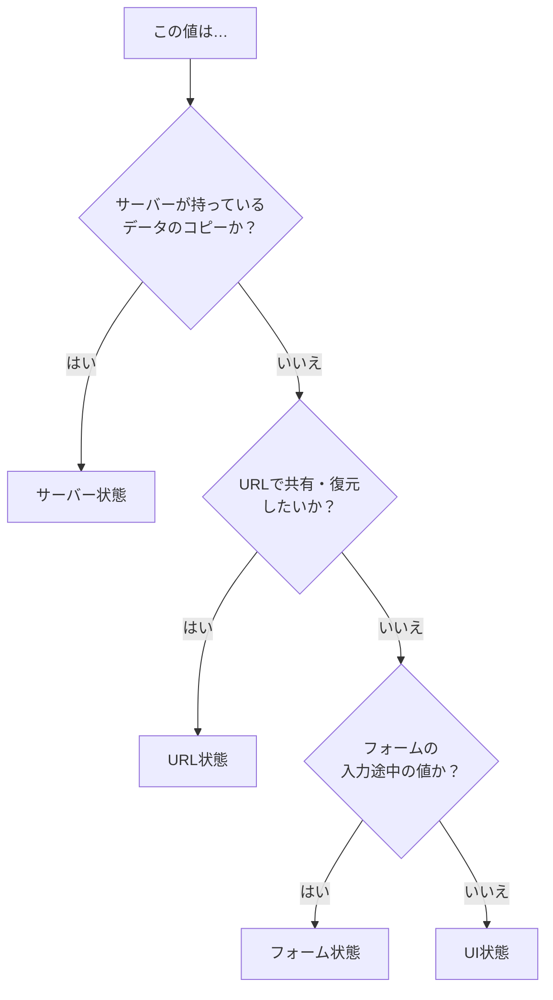
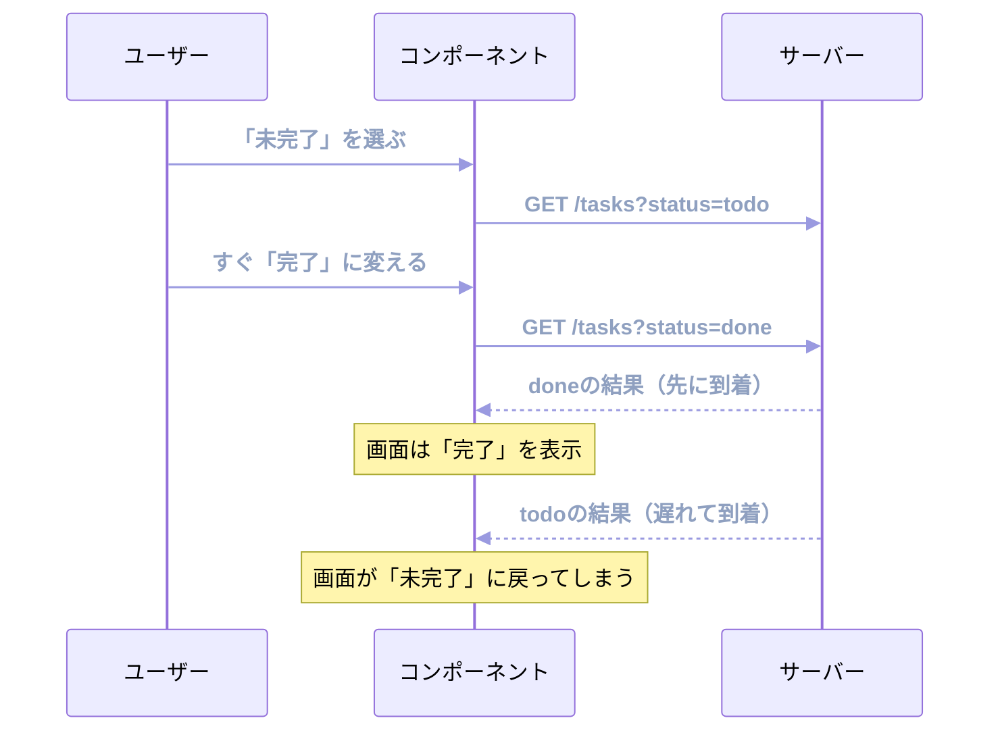

この章が、本書でいちばん大事な章です。

扱うのはライブラリの使い方ではありません。目の前の状態を見て、それがどの種類なのかを見分ける方法です。この見分けができるようになると、以降の章に出てくるライブラリが「なぜそこにあるのか」がわかります。逆に、ここを曖昧にしたまま進むと、便利なフックを覚えただけで終わってしまいます。

## 「状態管理が難しい」の正体

Reactの学習でよく聞くのが「状態管理が難しい」という言葉です。ただ、状態を保持すること自体は難しくありません。`useState`を呼べば値は保持できます。

難しさが生まれるのは、性質の違うものを同じ箱に入れたときです。

たとえば、タスク一覧の画面には次のような値が同居します。

- サーバーから取ってきたタスクの配列
- 「未完了だけ表示」という絞り込み条件
- いま見ているページ番号
- 新規作成モーダルが開いているかどうか
- モーダルの中で入力中のタスク名

全部`useState`で持てます。しかし、この5つはまったく違う性質を持っています。タスクの配列は、自分が何もしなくても古くなります。他のメンバーがタスクを追加したら、手元の配列は事実と食い違います。一方、モーダルが開いているかどうかは、勝手に変わったりしません。自分のブラウザの中だけの話です。

絞り込み条件はまた違います。この条件は、同僚に「この画面を見て」とURLを送りたい値です。リロードしても消えてほしくありません。しかし`useState`に入れていると、リロードのたびに初期値へ戻ります。

性質が違うものを同じ道具で扱うと、片方のために書いた仕組みが、もう片方の邪魔をします。「状態管理が難しい」の正体は、この取り違えです。

## 3つの問いで見分ける

状態の種類を見分けるには、3つ問いかければ足ります。



先ほどの5つを流してみます。タスクの配列はサーバーのコピーなのでサーバー状態。絞り込み条件とページ番号はURLで共有したいのでURL状態。入力中のタスク名はフォーム状態。モーダルの開閉はUI状態です。

1つの画面に、4種類が同居していました。それぞれの性質を順に見ていきます。

## サーバー状態

サーバー状態は、自分のアプリが所有していないデータです。持ち主はサーバーで、手元にあるのは借りてきた写しにすぎません。

この「借り物である」という性質から、4つの特徴が生まれます。

- **非同期でしか手に入らない**: 欲しいと思った瞬間には手元にありません。待ち時間があり、失敗もします。
- **勝手に古くなる**: 取ってきた瞬間は正しくても、次の瞬間には誰かが更新しているかもしれません。
- **自分だけのものではない**: 他のユーザー、他のタブ、他の画面も同じデータを見ています。
- **捨ててもまた取れる**: 手元から消えても、サーバーに聞けば復元できます。

タスクの一覧、ユーザーのプロフィール、商品の在庫数。アプリが扱うデータの大半がここに入ります。

### useEffectで取得するとどうなるか

サーバー状態を素朴に扱うと、こんなコードになります。

```tsx
function TaskList({ status }: { status: string }) {
  const [tasks, setTasks] = useState<Task[]>([]);
  const [isLoading, setIsLoading] = useState(false);
  const [error, setError] = useState<Error | null>(null);

  useEffect(() => {
    setIsLoading(true);
    fetch(`/api/tasks?status=${status}`)
      .then((res) => res.json())
      .then((result) => setTasks(result.items))
      .catch((err) => setError(err))
      .finally(() => setIsLoading(false));
  }, [status]);

  if (isLoading) return <p>読み込み中...</p>;
  if (error) return <p>エラーが発生しました</p>;
  return <ul>{tasks.map((t) => <li key={t.id}>{t.title}</li>)}</ul>;
}
```

動きます。ただし、いくつも穴があります。

1つめは、リクエストの**追い越し**です。ユーザーが絞り込みを「未完了」にしてすぐ「完了」に変えたとき、2本のリクエストが飛びます。この2本のどちらが先に返ってくるかは、誰も保証してくれません。



画面には「完了」と表示されているのに、中身は未完了のタスク。ユーザーには理不尽なバグに見えます。この現象を競合状態（Race Condition）と呼びます。`useEffect`のクリーンアップ関数で古い結果を捨てれば防げますが、その処理を毎回手で書く必要があります。

2つめは、**キャッシュがない**ことです。一覧から詳細へ移り、また一覧へ戻ってきたとき、このコードはもう一度サーバーへ取りにいきます。1秒前に取ったばかりのデータでも、無条件です。読み込み中の表示がそのたびに出るので、アプリが遅く感じられます。

3つめは、リクエストの**重複**です。同じタスク一覧を、ヘッダーの件数表示とメインの一覧が両方必要とする場合、コンポーネントごとに`useEffect`が動いて2回叩きます。データを共有しようとすると、今度はもっと上のコンポーネントへ状態を持ち上げる作業が始まります。

4つめは、**状態が3つに増える**ことです。データ、読み込み中、エラー。この3つ組が、データ取得のある画面すべてにコピーされます。そして更新処理を書くと、さらに増えます。

:::message
ここでつまずきやすいのは、これらが「書き方が下手だから起きる問題」に見えてしまうことです。実際には、どれだけ丁寧に書いても、`useState`と`useEffect`の組み合わせでは構造的に解決できません。キャッシュも、重複の排除も、鮮度の管理も、コンポーネントの外に置き場所がないからです。
:::

### グローバルストアに入れてもうまくいかない

「共有したいならグローバルストアだ」と考えて、取得したデータをReduxやZustandのようなストアへ入れる方法もあります。重複は減りますが、新しい仕事が増えます。

このデータはいつまで有効なのか。どの操作のあとに再取得するのか。同じデータを2つの画面が同時に要求したらどうするか。画面を離れたらいつ捨てるのか。サーバー状態を正しく扱うために必要なこれらの判断を、すべて自分で実装することになります。

そもそもサーバー状態でやりたいのは、値を保管することではありません。目的はサーバーとの**同期**です。手元の写しをできるだけ事実に近づけ、古くなったら静かに更新する。この仕事は、汎用のストアが得意とする領域から外れています。

TanStack Queryは、まさにこの同期に専念したライブラリです。キャッシュ、鮮度の判定、再取得、重複の排除、競合状態の処理をすべて引き受けます。

## URL状態

URL状態は、URLの中に書かれている状態です。

```text
/tasks?status=todo&page=2&sort=dueDate
```

絞り込み条件、ページ番号、並び替えのキー、選択中のタブ。これらをURLに置くと、3つの利点が手に入ります。

- **共有できる**: URLを送るだけで、相手にまったく同じ画面を見せられます。
- **リロードに耐える**: ページを再読み込みしても、条件は失われません。
- **戻るボタンが効く**: ブラウザの履歴に残るので、直前の条件へ戻れます。

`useState`で持った条件には、この3つがすべてありません。「絞り込んだ結果を共有したい」という要望が来てから慌てて移植するくらいなら、最初からURLに置くほうが楽です。

ただ、URLの検索条件は文字列です。素朴に読み取ると、こんな作業が待っています。

```tsx
// 文字列から取り出して、自分で変換して、値の妥当性も確かめる
const params = new URLSearchParams(location.search);
const page = Number(params.get('page') ?? '1'); // NaNになる可能性
const status = params.get('status') ?? 'all';    // 想定外の値が入る可能性
```

TanStack Routerは、この検索条件にスキーマと型を与えます。`page`は数値、`status`は決められた3つのうちどれか、と宣言しておけば、あとは型のついた値として受け取れます。URLを直接いじられて壊れた値が入ってきても、宣言した既定値へ倒せます。

## フォーム状態

フォーム状態は、入力の途中にある値です。

一見、UI状態と同じに見えます。ただ、フォームには固有の関心事があります。

- 入力された値そのもの
- その項目に一度でも触ったか（touched）
- 初期値から変わっているか（dirty）
- 検証に通っているか、通っていないなら理由は何か
- 送信中かどうか、送信に失敗したか

これらを`useState`で組み立てると、項目ごとに複数の状態が生まれ、検証のタイミングも自分で管理することになります。項目が10個ある画面を想像すると、規模の見当がつきます。

TanStack Formは、この一式を引き受けます。しかも項目名は型で守られるので、`tilte`のような打ち間違いはその場で赤くなります。

なお、フォームの中身は基本的に画面を離れたら消えてよい値です。ただし「下書きを保存したい」という要件が出た瞬間、その値はサーバー状態へ引っ越します。同じ入力欄でも、要件によって置き場所が変わる例です。

## UI状態

最後に残るのがUI状態です。その画面の見せ方だけに関わる、自分のブラウザの中で完結する値です。

- モーダルやドロワーが開いているか
- アコーディオンが展開されているか
- ホバー中の行はどれか
- トーストを表示しているか

これらはサーバーと関係なく、URLで共有する必要もなく、リロードで消えても困りません。ここは`useState`の出番です。TanStackのライブラリを持ち出す必要はありません。

複数のコンポーネントで共有したい場合は、Contextか小さな状態管理ライブラリを使います。UI状態は量が少ないので、それで足ります。

:::message
UI状態のつもりでも、URLに置いたほうがよいものがあります。開いているタブ、サイドバーの選択、表示中のモーダル。たとえばタブを`/tasks?tab=archived`のようにURLへ出しておくと、「アーカイブ済みの画面を見て」という依頼をURL1本で伝えられます。「その状態のままリロードされたい」「その状態のURLを共有されたい」と感じたら、URL状態への昇格を検討してください。
:::

## 4種類の比較

4つの性質を並べて比べます。

| 種類 | 持ち主 | 勝手に古くなるか | リロードで消えていいか | 置き場所 |
|---|---|---|---|---|
| サーバー状態 | サーバー | 古くなる | 消えてよい（また取れる） | TanStack Query |
| URL状態 | URL（＝ユーザー） | 古くならない | 消えてはいけない | TanStack Router |
| フォーム状態 | 入力中のユーザー | 古くならない | 消えてよい | TanStack Form |
| UI状態 | そのコンポーネント | 古くならない | 消えてよい | `useState`など |

この表が、本書の設計図です。以降の章は、この表の行を1つずつ掘り下げていく構成になっています。

そして、分類がはっきりすると、避けるべきことも見えてきます。

- サーバー状態を`useState`へコピーしない。写しの写しを作ると、ずれの原因になります。
- サーバー状態をグローバルストアに入れない。同期の仕組みを自作することになります。
- 共有したい条件を`useState`に閉じ込めない。URLへ出します。
- フォームの入力値を、送信前からサーバー状態と混ぜない。

これらは「状態の置き場所を設計する」の章で、実例つきで改めて総点検します。

## まとめ

この章では、フロントエンドの状態を4種類に分けました。

- 状態管理が難しくなるのは、性質の違う値を同じ道具で扱うからです。
- 「サーバーのコピーか」「URLで共有したいか」「入力途中の値か」の3つを問えば、種類が決まります。
- サーバー状態は借り物で、非同期・古くなる・共有される・捨ててもまた取れるという性質を持ちます。
- `useEffect`によるデータ取得は、競合状態・キャッシュ不在・リクエストの重複・状態の増殖を抱えます。丁寧に書いても構造的に残ります。
- サーバー状態でやりたいのは保管より同期であり、汎用のストアとは相性が良くありません。
- URL状態は共有・リロード・戻るに耐え、フォーム状態は検証まで含む一式、UI状態は`useState`で足ります。

次章では、この分類を実際のコードで確かめるための準備をします。Viteでプロジェクトを作り、本書を通して使うタスク管理APIのモックを用意します。
