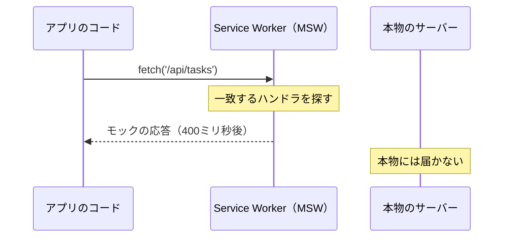

前章で、状態を4種類に分けました。ここからは実際に手を動かせるよう、プロジェクトを用意します。

この章でやることは3つです。Reactプロジェクトを作り、本書を通して使うタスク管理APIのモックを組み、ディレクトリ構成の方針を決めます。作ったものは最後の章まで育て続けるので、ここでの土台づくりは無駄になりません。

コードを写すのが面倒なら、読み飛ばしてもかまいません。次章から本題のTanStack Queryに入ります。

## Viteでプロジェクトを作る

ビルドツールにはViteを使います。設定がほとんど不要で、起動が速く、TanStack Startの土台にもなっているツールです。

```sh
npm create vite@latest tanstack-tasks -- --template react-ts
cd tanstack-tasks
npm install
npm run dev
```

`http://localhost:5173`が開いて、Viteの初期画面が表示されれば成功です。生成されたのは、次のような構成です。

```text
tanstack-tasks/
├── index.html
├── package.json
├── tsconfig.json          … 2つの設定ファイルを束ねるだけの入口
├── tsconfig.app.json      … src配下のための設定
├── tsconfig.node.json     … 設定ファイル自身のための設定
├── vite.config.ts
├── public/
└── src/
    ├── main.tsx           … アプリの起点
    ├── App.tsx
    └── index.css
```

`package.json`を見ると、ReactとTypeScriptのバージョンが確認できます。本書の執筆時点ではReact 19系、TypeScript 6系、Vite 8系が入りました。

## TypeScriptの設定を確認する

`tsconfig.app.json`を開くと、見慣れない設定がいくつかあります。本書のコードに関わるものを説明します。

まず、`"strict": true`という行がありません。TypeScript 6から`strict`が既定で有効になったため、書かなくても厳格な検査が働きます。試しに型注釈のない引数を書けば、`implicitly has an 'any' type`と怒られます。本書のコードは、この状態を前提としています。

次に`verbatimModuleSyntax`です。これが有効だと、型だけをimportするときに`import type`と明記する必要があります。

```ts
// 値としてのimport
import { useQuery } from '@tanstack/react-query';

// 型としてのimport。type を付ける
import type { Task } from './types';
```

もう1つ、`erasableSyntaxOnly`も有効になっています。TypeScript固有の実行時コードを生む構文、たとえば`enum`が使えません。本書では`enum`の代わりに、文字列のユニオン型を使います。

```ts
// enumは使わず、ユニオン型で表す
export type TaskStatus = 'todo' | 'doing' | 'done';
```

## 本書で使うAPI

題材はタスク管理アプリです。タスクの型を、次のように決めます。

```ts:src/features/tasks/types.ts
export type TaskStatus = 'todo' | 'doing' | 'done';

export type TaskPriority = 'low' | 'medium' | 'high';

export type Task = {
  id: string;
  title: string;
  description: string;
  status: TaskStatus;
  priority: TaskPriority;
  assignee: string;
  dueDate: string;
  createdAt: string;
};

/** 作成・更新で送る値。id と createdAt はサーバーが決める */
export type TaskInput = Partial<Omit<Task, 'id' | 'createdAt'>> & { title: string };
```

APIのエンドポイントを、次の6本用意します。

| メソッドとパス | 役割 |
|---|---|
| `GET /api/tasks` | 一覧（ページ番号方式） |
| `GET /api/tasks/feed` | 一覧（カーソル方式・無限スクロール用） |
| `GET /api/tasks/:id` | 1件取得 |
| `POST /api/tasks` | 作成 |
| `PATCH /api/tasks/:id` | 部分更新 |
| `DELETE /api/tasks/:id` | 削除 |

一覧は、絞り込みと並び替えのパラメータを受け取ります。`status`、`priority`、`q`（キーワード）、`sort`、`order`、`page`、`perPage`です。返ってくるのは配列そのものではなく、件数を含むオブジェクトにします。

```json
{
  "items": [{ "id": "1", "title": "ログイン画面を設計する", "status": "todo" }],
  "total": 137,
  "page": 1,
  "perPage": 20
}
```

総件数が入っているので、ページ数の計算ができます。テーブルの章で、この`total`が効いてきます。

タスク用はこの6本です。あとで認証を扱う章に入ったところで、ログイン用のエンドポイントを3本足します。

## APIモックを用意する

バックエンドを立てるかわりに、MSW（Mock Service Worker）を使います。

MSWは、ブラウザのService Workerとしてネットワーク通信を横取りし、用意した応答を返すライブラリです。`fetch`関数そのものを差し替える方式ではないので、アプリのコードは本物のAPIを呼ぶときと1文字も変わりません。開発者ツールのNetworkタブにもリクエストが並びます。



差し替えているのはサーバーの手前だけです。あとから本物のAPIをつなぐときは、モックの起動をやめるだけで済みます。

さらに都合がよいのは、同じモックの定義をテストでも使えることです。テストの章で、この定義をそのまま流用します。

```sh
npm i -D msw
npx msw init public --save
```

2つめのコマンドは、`public`ディレクトリにService Workerのファイルを置きます。ブラウザで通信を横取りするために必要な部品です。

### データを用意する

まず、メモリ上のデータを作ります。137件あると、ページ送りの挙動が確かめやすくなります。

```ts:src/mocks/db.ts
import type { Task, TaskPriority, TaskStatus } from '../features/tasks/types';

const statuses: TaskStatus[] = ['todo', 'doing', 'done'];
const priorities: TaskPriority[] = ['low', 'medium', 'high'];
const assignees = ['佐藤', '鈴木', '高橋', '田中', '伊藤'];
const actions = ['を設計する', 'を実装する', 'をレビューする', 'をテストする', 'を調査する'];
const targets = ['ログイン画面', '検索機能', '通知メール', '権限管理', 'CSV出力', '一覧のページ送り'];

function createTasks(count: number): Task[] {
  return Array.from({ length: count }, (_, i) => {
    const n = i + 1;
    return {
      id: String(n),
      title: `${targets[i % targets.length]}${actions[i % actions.length]}`,
      description: `タスク${n}の説明です。担当者と期限を確認してから着手します。`,
      status: statuses[i % statuses.length],
      priority: priorities[i % priorities.length],
      assignee: assignees[i % assignees.length],
      dueDate: `2026-${String((i % 9) + 1).padStart(2, '0')}-${String((i % 28) + 1).padStart(2, '0')}`,
      createdAt: new Date(2026, 0, 1 + (i % 180), 9, 0).toISOString(),
    };
  });
}

export const db = {
  tasks: createTasks(137),
  nextId: 138,
  reset() {
    this.tasks = createTasks(137);
    this.nextId = 138;
  },
};
```

規則的に値を割り振っているので、何度実行しても同じデータになります。ステータスは3種類が順番に、担当者は5人が順番に割り当たります。`reset`は、テストで毎回きれいな状態に戻すために使います。

### ハンドラを書く

次に、リクエストへの応答を定義します。先に、一覧が使う絞り込みと並び替えの共通処理を書きます。

```ts:src/mocks/handlers.ts
import { delay, http, HttpResponse } from 'msw';
import { db } from './db';
import type { Task, TaskInput } from '../features/tasks/types';

const LATENCY_MS = 400;

/** `?__fail=500` が付いていたら、そのステータスで失敗させる */
function forcedFailure(request: Request) {
  const status = new URL(request.url).searchParams.get('__fail');
  if (!status) return null;
  return HttpResponse.json({ message: 'わざと失敗させています' }, { status: Number(status) });
}

/** 並び替えに使える列。想定外の値は dueDate に倒す */
const sortKeys = ['title', 'status', 'assignee', 'dueDate'] as const;

function toSortKey(value: string | null) {
  return sortKeys.find((key) => key === value) ?? 'dueDate';
}

/** 絞り込みと並び替えを適用する。db.tasks は書き換えない */
function filterTasks(url: URL): Task[] {
  const status = url.searchParams.get('status');
  const priority = url.searchParams.get('priority');
  const q = url.searchParams.get('q');

  const filtered = db.tasks.filter((task) => {
    if (status && status !== 'all' && task.status !== status) return false;
    if (priority && priority !== 'all' && task.priority !== priority) return false;
    if (q && !`${task.title} ${task.assignee}`.includes(q)) return false;
    return true;
  });

  const key = toSortKey(url.searchParams.get('sort'));
  const direction = url.searchParams.get('order') === 'desc' ? -1 : 1;

  return filtered.sort((a, b) => a[key].localeCompare(b[key], 'ja') * direction);
}
```

`toSortKey`で、並び替えの対象を4つの列に限定しています。URLに`?sort=password`と書かれても`dueDate`に倒れます。型のキャストではなく`find`で絞っているので、`a[key]`が文字列であることも型として確定します。

`filter`が新しい配列を返すため、そのあとの`sort`は`db.tasks`を壊しません。ここを`db.tasks.sort()`と書くと、一度並び替えただけでモックのデータそのものが並び替わってしまいます。

続いて、取得系の3本です。

```ts:src/mocks/handlers.ts
export const handlers = [
  // 一覧（ページ番号方式）
  http.get('/api/tasks', async ({ request }) => {
    await delay(LATENCY_MS);
    const failure = forcedFailure(request);
    if (failure) return failure;

    const url = new URL(request.url);
    const page = Number(url.searchParams.get('page') ?? '1');
    const perPage = Number(url.searchParams.get('perPage') ?? '20');
    const items = filterTasks(url); // 絞り込みと並び替え
    const start = (page - 1) * perPage;

    return HttpResponse.json({
      items: items.slice(start, start + perPage),
      total: items.length,
      page,
      perPage,
    });
  }),

  // 一覧（カーソル方式・無限スクロール用）
  http.get('/api/tasks/feed', async ({ request }) => {
    await delay(LATENCY_MS);
    const failure = forcedFailure(request);
    if (failure) return failure;

    const url = new URL(request.url);
    const cursor = url.searchParams.get('cursor');
    const limit = Number(url.searchParams.get('limit') ?? '20');
    const items = filterTasks(url);
    const start = cursor ? items.findIndex((item) => item.id === cursor) + 1 : 0;
    const slice = items.slice(start, start + limit);
    const hasMore = start + limit < items.length;

    return HttpResponse.json({
      items: slice,
      // 続きがあるときだけ、最後の1件のIDを次のカーソルとして返す
      nextCursor: hasMore ? (slice.at(-1)?.id ?? null) : null,
    });
  }),

  // 1件取得
  http.get('/api/tasks/:id', async ({ request, params }) => {
    await delay(LATENCY_MS);
    const failure = forcedFailure(request);
    if (failure) return failure;

    const task = db.tasks.find((item) => item.id === params.id);
    if (!task) {
      return HttpResponse.json({ message: 'タスクが見つかりません' }, { status: 404 });
    }
    return HttpResponse.json(task);
  }),
];
```

3つ、意図があります。

`delay(400)`で、わざと400ミリ秒待たせています。応答が即座に返ってくると、読み込み中の表示やキャッシュの効き目が体感できません。通信の遅さは、本書では観察対象です。

`forcedFailure`は、URLに`?__fail=500`を付けたときだけ失敗させる仕掛けです。エラー処理や再試行を学ぶ章で、失敗を意図的に起こすために使います。

そして、`/api/tasks/feed`を`/api/tasks/:id`より**前**に置いています。MSWは登録順にパターンを照合するため、後ろに置くと`feed`という文字列が`:id`として拾われてしまいます。

残りは更新系の3本です。同じ配列に続けて書きます。

```ts:src/mocks/handlers.ts
  // 作成
  http.post('/api/tasks', async ({ request }) => {
    await delay(LATENCY_MS);
    const failure = forcedFailure(request);
    if (failure) return failure;

    const input = (await request.json()) as TaskInput;
    if (!input.title) {
      return HttpResponse.json({ message: 'タイトルは必須です' }, { status: 422 });
    }

    const created: Task = {
      id: String(db.nextId++),
      title: input.title,
      description: input.description ?? '',
      status: input.status ?? 'todo',
      priority: input.priority ?? 'medium',
      assignee: input.assignee ?? '未割り当て',
      dueDate: input.dueDate ?? '2026-12-31',
      createdAt: new Date().toISOString(),
    };
    db.tasks.unshift(created);
    return HttpResponse.json(created, { status: 201 });
  }),

  // 部分更新
  http.patch('/api/tasks/:id', async ({ request, params }) => {
    await delay(LATENCY_MS);
    const failure = forcedFailure(request);
    if (failure) return failure;

    const index = db.tasks.findIndex((item) => item.id === params.id);
    if (index === -1) {
      return HttpResponse.json({ message: 'タスクが見つかりません' }, { status: 404 });
    }

    const patch = (await request.json()) as Partial<TaskInput>;
    const updated: Task = { ...db.tasks[index], ...patch };
    db.tasks[index] = updated;
    return HttpResponse.json(updated);
  }),

  // 削除
  http.delete('/api/tasks/:id', async ({ request, params }) => {
    await delay(LATENCY_MS);
    const failure = forcedFailure(request);
    if (failure) return failure;

    const index = db.tasks.findIndex((item) => item.id === params.id);
    if (index === -1) {
      return HttpResponse.json({ message: 'タスクが見つかりません' }, { status: 404 });
    }
    db.tasks.splice(index, 1);
    return new HttpResponse(null, { status: 204 });
  }),
```

作成では、`title`が空なら422を返します。サーバー側にしかない検証を再現するためで、フォームの章でこのエラーを画面に出します。送られてこなかった項目には既定値を入れ、`id`は`db.nextId`から採番します。配列の先頭に足すので、作ったタスクは一覧の1ページ目にすぐ現れます。

更新と削除は、存在しないIDなら404です。`patch`を`Partial<TaskInput>`として受け取っているのは、`id`と`createdAt`を外部から上書きされないようにするためです。この2つはサーバーが決める値です。

削除の応答は、本文のない204です。`response.json()`は本文の無い応答で失敗するため、この扱いは「エラー処理とSuspense」の章で改めて出てきます。

### ブラウザで起動する

ハンドラをService Workerに登録します。

```ts:src/mocks/browser.ts
import { setupWorker } from 'msw/browser';
import { handlers } from './handlers';

export const worker = setupWorker(...handlers);
```

そして、アプリの起点でモックを立ち上げます。本番のビルドに混ざらないよう、開発時だけ動かします。

```tsx:src/main.tsx
import { StrictMode } from 'react';
import { createRoot } from 'react-dom/client';
import './index.css';
import App from './App.tsx';

async function enableMocking() {
  if (!import.meta.env.DEV) return;
  const { worker } = await import('./mocks/browser');
  return worker.start({ onUnhandledRequest: 'bypass' });
}

enableMocking().then(() => {
  createRoot(document.getElementById('root')!).render(
    <StrictMode>
      <App />
    </StrictMode>,
  );
});
```

`import.meta.env.DEV`が開発時だけ`true`になるVite固有の値です。動的な`import`を使っているので、本番ビルドにモックのコードは含まれません。`onUnhandledRequest: 'bypass'`は、ハンドラのないリクエスト（画像やCSSなど）をそのまま通す設定です。

`npm run dev`で起動し、ブラウザのコンソールに`[MSW] Mocking enabled.`と出れば準備完了です。

## ディレクトリ構成

本書は、機能ごとにまとめる構成を採ります。

```text
src/
├── main.tsx
├── App.tsx
├── mocks/              … APIモック
│   ├── db.ts
│   ├── handlers.ts
│   └── browser.ts
└── features/
    └── tasks/          … タスク機能のすべて
        ├── types.ts    … 型
        ├── api.ts      … 通信する関数
        └── components/ … 画面の部品
```

種類ごと（`components/`、`hooks/`、`types/`）に分ける構成もよく見かけます。ただ、種類で分けると、1つの機能を直すたびに複数のディレクトリを行き来することになります。機能ごとにまとめておけば、タスク周りの変更はほぼ`features/tasks/`の中で完結します。

この構成は章が進むにつれて育ちます。Queryの定義を置く`queries.ts`、ルートを置く`routes/`が、あとから加わります。最終形は「状態の置き場所を設計する」の章で示します。

まず、通信する関数を用意しておきます。

```ts:src/features/tasks/api.ts
import type { Task } from './types';

export type TaskListResult = {
  items: Task[];
  total: number;
  page: number;
  perPage: number;
};

export async function fetchTasks(): Promise<TaskListResult> {
  const response = await fetch('/api/tasks');
  if (!response.ok) {
    throw new Error('タスクの取得に失敗しました');
  }
  return response.json();
}

export async function fetchTask(id: string): Promise<Task> {
  const response = await fetch(`/api/tasks/${id}`);
  if (!response.ok) {
    throw new Error('タスクの取得に失敗しました');
  }
  return response.json();
}
```

`response.ok`の確認を忘れないでください。`fetch`は、404や500が返ってきても例外を投げません。ここで自分で例外に変えておかないと、TanStack Queryはエラーを検知できず、HTMLのエラーページをデータとして扱ってしまいます。

:::message alert
`fetch`が例外を投げるのは、通信そのものが失敗したとき（オフライン、DNS解決の失敗など）だけです。HTTPステータスが400番台・500番台でも、`fetch`は正常に解決します。TanStack Queryを使うときの定番のつまずきなので、`queryFn`の中では必ずステータスを確認します。
:::

## Lintの設定

Viteのテンプレートには、oxlintというLinterが入っています。Rustで書かれた高速なLinterで、`npm run lint`で動きます。

TanStackは、ESLint向けの公式プラグインを提供しています。ESLintを使うプロジェクトなら、入れておく価値があります。

```sh
npm i -D eslint @tanstack/eslint-plugin-query
```

```js:eslint.config.js
import pluginQuery from '@tanstack/eslint-plugin-query';

export default [
  ...pluginQuery.configs['flat/recommended'],
];
```

目玉は`@tanstack/query/exhaustive-deps`というルールです。`queryKey`に書き忘れた依存を指摘してくれます。この書き忘れは、キャッシュが混ざるという厄介なバグを生みます。理由は「useQueryによるデータ取得」の章で説明します。

Routerを使い始めたら、`@tanstack/eslint-plugin-router`も同じように追加できます。

## Devtoolsの位置付け

TanStackの各ライブラリには、専用の開発者ツールがあります。

| パッケージ | 見えるもの |
|---|---|
| `@tanstack/react-query-devtools` | キャッシュの中身、各Queryの状態、再取得の履歴 |
| `@tanstack/react-router-devtools` | ルートの一覧、いま合致しているルート、Loaderの状態 |

これらは、学習中はとくに手放せません。`staleTime`を変えたときにキャッシュがどう振る舞うか、画面を離れたデータがいつ捨てられるか。目で見て確かめられます。

導入は次章で行います。TanStack Queryを入れるのと同時に、Devtoolsも開きます。

:::message
`@tanstack/react-devtools`という、複数のライブラリのDevtoolsを1つのパネルにまとめるパッケージも登場しています。まだ0系のバージョンなので、本書では個別のDevtoolsを使います。
:::

## まとめ

この章では、本書を通して使う開発環境を用意しました。

- ViteでReactとTypeScriptのプロジェクトを作りました。React 19系、TypeScript 6系が入ります。
- TypeScript 6では`strict`が既定で有効です。`import type`の明記と、`enum`を使わないユニオン型が前提になります。
- 題材はタスク管理アプリで、6本のエンドポイントを持つAPIを想定します。
- APIモックにはMSWを使います。ネットワーク層で横取りするので、アプリのコードは本物のAPIと同じです。
- モックには400ミリ秒の遅延と、`?__fail=500`で失敗させる仕掛けを入れました。
- 絞り込みと並び替えは`filterTasks`に集約しました。`filter`で新しい配列を作ってから並び替えるので、元のデータは壊れません。
- `/api/tasks/feed`は`/api/tasks/:id`より前に登録します。MSWは登録順にパターンを照合するためです。
- ディレクトリは機能ごとにまとめます。タスク関連は`features/tasks/`に集約します。
- `queryFn`で使う関数では、`response.ok`の確認を忘れないようにします。

次章から本題です。TanStack Queryを導入し、`useEffect`で書いていたデータ取得を置き換えます。前章で見た4つの穴が、どう埋まるのかを確かめます。
