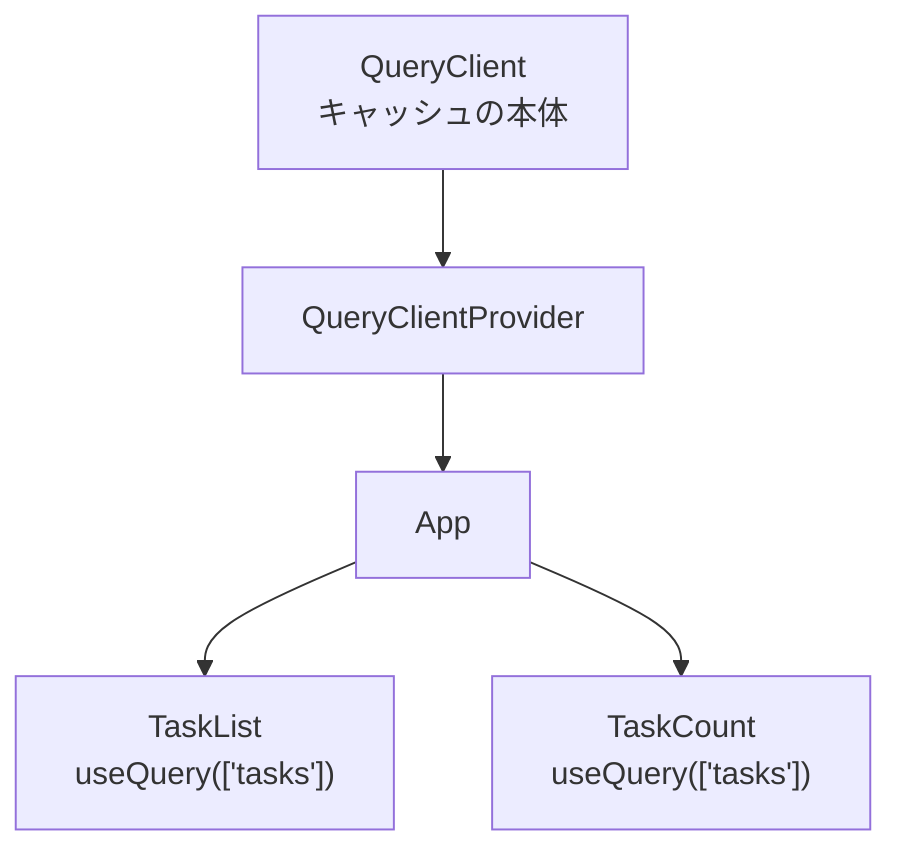
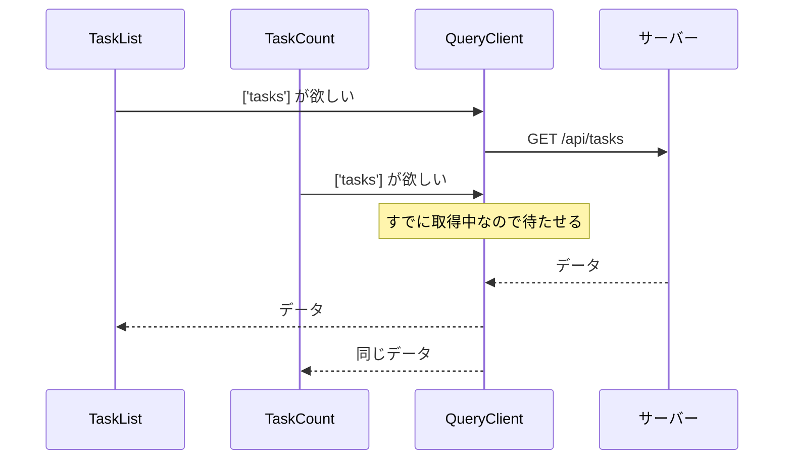

準備が整いました。ここからTanStack Queryを導入します。

この章のゴールは、`useEffect`で書いていたデータ取得を`useQuery`に置き換え、何が消えて何が手に入ったのかを確かめることです。コードは短くなりますが、短くなること自体が目的ではありません。手放した仕事が、そのままキャッシュや競合状態の解決になっているところを見てください。

## 素朴なコードを振り返る

「フロントエンドの状態を分類する」の章で見たコードを、もう一度置きます。

```tsx
function TaskList({ status }: { status: string }) {
  const [tasks, setTasks] = useState<Task[]>([]);
  const [isLoading, setIsLoading] = useState(false);
  const [error, setError] = useState<Error | null>(null);

  useEffect(() => {
    setIsLoading(true);
    fetch(`/api/tasks?status=${status}`)
      .then((res) => res.json())
      .then((result) => setTasks(result.items))
      .catch((err) => setError(err))
      .finally(() => setIsLoading(false));
  }, [status]);

  if (isLoading) return <p>読み込み中...</p>;
  if (error) return <p>エラーが発生しました</p>;
  return <ul>{tasks.map((t) => <li key={t.id}>{t.title}</li>)}</ul>;
}
```

抱えている問題は4つでした。リクエストの追い越し、キャッシュの不在、リクエストの重複、状態の増殖です。

## インストールする

```sh
npm i @tanstack/react-query
```

導入に必要な部品は2つです。QueryClientとQueryClientProviderです。

QueryClientが、キャッシュの本体です。どのデータをどのキーで保持しているか、それがいつ取得されたか、いま通信中かどうか。すべての情報がこのオブジェクトの中にあります。

QueryClientProviderは、そのQueryClientをReactのContextでアプリ全体に配る役です。

```tsx:src/main.tsx
import { StrictMode } from 'react';
import { createRoot } from 'react-dom/client';
import { QueryClient, QueryClientProvider } from '@tanstack/react-query';
import './index.css';
import App from './App.tsx';

// コンポーネントの外で1つだけ作る
const queryClient = new QueryClient();

async function enableMocking() {
  if (!import.meta.env.DEV) return;
  const { worker } = await import('./mocks/browser');
  return worker.start({ onUnhandledRequest: 'bypass' });
}

enableMocking().then(() => {
  createRoot(document.getElementById('root')!).render(
    <StrictMode>
      <QueryClientProvider client={queryClient}>
        <App />
      </QueryClientProvider>
    </StrictMode>,
  );
});
```



QueryClientは、コンポーネントの外で作ります。ここでつまずきやすいのは、コンポーネントの中で`new QueryClient()`と書いてしまうことです。再レンダリングのたびに新しいインスタンスが生まれ、キャッシュが毎回まっさらになります。データが取れているのに読み込み中の表示が続く、という不思議な症状の原因になります。

コンポーネントの中で作る必要がある場合（サーバーサイドレンダリングでは、リクエストごとに分ける必要があります）は、`useState`の初期値として1度だけ生成します。この話は、TanStack Startを扱う章で改めて出てきます。

## はじめてのuseQuery

置き換えたコードが、これです。

```tsx:src/features/tasks/components/TaskList.tsx
import { useQuery } from '@tanstack/react-query';
import { fetchTasks } from '../api';

export function TaskList() {
  const { data, isPending, isError, error } = useQuery({
    queryKey: ['tasks'],
    queryFn: fetchTasks,
  });

  if (isPending) return <p>読み込み中...</p>;
  if (isError) return <p>エラー: {error.message}</p>;

  return (
    <ul>
      {data.items.map((task) => (
        <li key={task.id}>
          {task.title}（{task.assignee}）
        </li>
      ))}
    </ul>
  );
}
```

`useState`が3つ消え、`useEffect`が消えました。渡しているのは2つだけです。

`queryKey`は、そのデータのキャッシュ上の住所です。配列で書きます。`['tasks']`と指定したデータは、アプリのどこからでも同じキーで呼び出せます。住所が同じなら、同じキャッシュを見ます。

住所が配列なのは、階層を表せるようにするためです。

```ts
['tasks']                          // 一覧
['tasks', '3']                     // ID:3の1件
['tasks', { status: 'todo' }]      // 絞り込んだ一覧
```

配列の前のほうが大きな分類、後ろが細かい条件になります。この形にしておくと、「`tasks`で始まるキャッシュをまとめて無効化する」といった操作ができます。更新のあとに一覧も詳細もまとめて最新化する場面で活躍します。キーの設計は「Queryの設計パターン」の章でじっくり扱うので、いまは配列の前から順に絞り込むという形だけ覚えてください。

`queryFn`は、実際にデータを取ってくる関数です。Promiseを返す関数であれば何でもよく、`fetch`でもaxiosでもかまいません。成功したら値を返し、失敗したら例外を投げる。この約束だけ守ればよいので、前章で`response.ok`を確認しておいたことが効いてきます。

`queryFn`は、呼び出されるときに情報を受け取れます。

```ts
queryFn: async ({ queryKey, signal }) => {
  // queryKey … このQuery自身のキー。条件をキーから取り出せる
  // signal  … 中断を伝えるAbortSignal。fetchに渡せば通信を打ち切れる
},
```

`signal`を`fetch`へ渡しておくと、必要がなくなったリクエストが本当に中断されます。画面を離れたときや、検索条件が変わって古い問い合わせが不要になったときです。この扱いは「エラー処理とSuspense」の章で、`queryKey`から条件を取り出す書き方は設計パターンの章で扱います。

### 戻り値を読む

`useQuery`は多くの値を返しますが、まずは4つで足ります。

| 名前 | 意味 |
|---|---|
| `data` | 取得したデータ。まだ無いときは`undefined` |
| `isPending` | データがまだ1度も揃っていない状態 |
| `isError` | 取得に失敗した状態 |
| `error` | 失敗したときの例外 |

この3つの状態は同時にひとつだけ成立します。だから`isPending`と`isError`を先に返してしまえば、残った場所では`data`が必ず存在します。

TypeScriptもそう理解します。`if (isPending) return ...`と`if (isError) return ...`を通過したあとの`data`は、型から`undefined`が外れます。だから`data.items`と直接書けます。`data?.items`のような書き方は要りません。

:::message
`isPending`は、v5で名前が変わりました。v4までは`isLoading`と呼ばれていた値です。v5の`isLoading`も残っていますが、意味が違います。`isPending`かつ通信中、つまり「初回の読み込み中」を表します。ネット上の記事を読むときは、どちらのバージョンの話かに気をつけてください。
:::

## 何が手に入ったのか

行数が減っただけには見えないよう、消えた仕事を並べます。

| 仕事 | 素朴な実装 | TanStack Query |
|---|---|---|
| 状態の保持 | `useState`が3つ | 不要 |
| 取得の起動 | `useEffect` | 不要 |
| リクエストの追い越し対策 | クリーンアップ関数を自分で書く | 自動 |
| キャッシュ | なし | あり |
| 同じデータの重複リクエスト | 起きる | まとめられる |
| 失敗時の再試行 | 自分で書く | 既定で3回 |
| 画面復帰時の更新 | 自分で書く | 自動 |

追い越しの対策が自動になる理由は、キャッシュの住所で管理しているからです。`queryKey`が同じなら同じQueryとして扱われ、新しい取得が始まった時点で古い結果は破棄されます。到着順に振り回されません。

## 同じデータを2か所で使う

キャッシュの効き目がわかりやすいのは、同じデータを2つのコンポーネントが必要とする場面です。

```tsx
export function TaskCount() {
  const { data } = useQuery({
    queryKey: ['tasks'],
    queryFn: fetchTasks,
  });

  return <p>全{data?.total ?? 0}件</p>;
}
```

`TaskList`と`TaskCount`を並べて置きます。それぞれが`useQuery`を呼んでいるので、リクエストは2回飛びそうに見えます。実際には1回です。



`queryKey`が同じなら、QueryClientは同じQueryとして扱います。すでに取得中なら、新しいリクエストは飛ばさず、終わるのを待って同じ結果を配ります。

この仕組みのおかげで、「データを共有するために状態を上のコンポーネントへ持ち上げる」という作業から解放されます。必要なコンポーネントが、それぞれ必要なタイミングで`useQuery`を呼べばよくなります。propsのバケツリレーも、そのために作ったContextも要りません。

なお、`TaskCount`では`data?.total ?? 0`と書いています。`isPending`で早期リターンしていないため、`data`が`undefined`になりうるからです。型が守ってくれるので、書き忘れるとその場で気づけます。

## Devtoolsでキャッシュを覗く

ここまで「キャッシュに入る」と繰り返してきましたが、目に見えないものは信じにくいものです。開発者ツールを入れて、実物を見ます。

```sh
npm i @tanstack/react-query-devtools
```

```tsx:src/main.tsx
import { ReactQueryDevtools } from '@tanstack/react-query-devtools';

// ...

<QueryClientProvider client={queryClient}>
  <App />
  <ReactQueryDevtools initialIsOpen={false} />
</QueryClientProvider>
```

画面の隅にTanStackのロゴが出ます。クリックすると、キャッシュの一覧が開きます。

見えるのは、こうした情報です。

- 保持しているQueryの一覧（`queryKey`で表示されます）
- それぞれの状態（fresh、stale、fetching、inactive）
- 最後に取得した時刻
- データの中身（JSONとして展開できます）

このパネルは本番のビルドには含まれません。開発時だけ動くように作られています。

### 観察してみる

3つ試してください。発見があります。

1つめ。ブラウザの別のタブに移り、また戻ってきます。Networkタブを見ると、リクエストが1本飛んでいます。画面に復帰したとき、TanStack Queryは「表示しているデータは古いかもしれない」と考えて確認しにいきます。

2つめ。Devtoolsで`['tasks']`の状態を見ます。取得が終わった直後から`stale`（古い）と表示されているはずです。取ってきたばかりなのに古い扱いなのは、既定の設定がそうなっているからです。

3つめ。`TaskList`だけをアンマウントする（たとえば表示を切り替える）と、そのQueryが`inactive`になります。誰も見ていない状態です。しばらく放置すると、一覧から消えます。

この3つは、すべてキャッシュの既定の設定から来ています。

| 設定 | 既定値 | 意味 |
|---|---|---|
| `staleTime` | 0 | 取得直後から「古い」扱いになる |
| `gcTime` | 5分 | 誰も見ていない状態が5分続いたら捨てる |
| `retry` | 3 | 失敗したら3回まで再試行する |

なぜ取得直後から「古い」のか。それを変えるとどうなるのか。次章のテーマです。

:::message
`?__fail=500`を思い出してください。`api.ts`の`fetch`先を一時的に`/api/tasks?__fail=500`に変えると、失敗時の動きが観察できます。Devtoolsで、3回まで再試行してからエラーになる様子が見えます。再試行の間隔は少しずつ延びていきます。
:::

## まとめ

この章では、TanStack Queryを導入し、`useEffect`によるデータ取得を置き換えました。

- QueryClientがキャッシュの本体で、QueryClientProviderがそれをアプリ全体へ配ります。
- QueryClientはコンポーネントの外で1つだけ作ります。中で作るとキャッシュが毎回消えます。
- `useQuery`には`queryKey`（キャッシュ上の住所）と`queryFn`（Promiseを返す関数）を渡します。
- `isPending`と`isError`で早期リターンすると、残りの場所で`data`の型が確定します。
- `queryKey`が同じなら同じQueryとして扱われ、リクエストは1本にまとまります。状態の持ち上げが不要になります。
- Devtoolsでキャッシュの中身と状態を観察できます。既定では取得直後から`stale`です。

次章では、そのキャッシュの中身を掘ります。`staleTime`と`gcTime`という2つの時間を理解すると、再取得のタイミングを自分で設計できるようになります。
