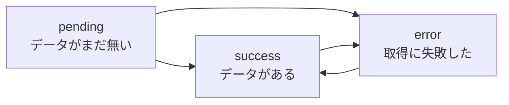
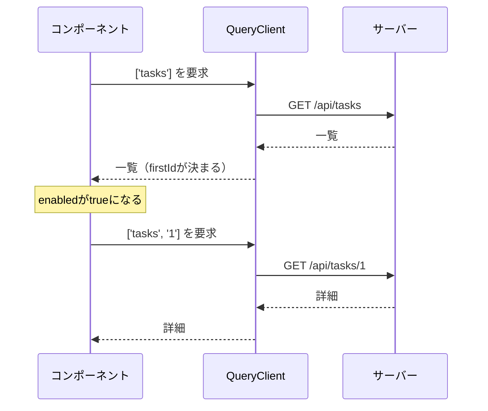

前章で、一覧を取得する`useQuery`を書きました。ここでは、その`useQuery`をもう少し詳しく見ます。

扱うのは4つです。Queryが取りうる状態の読み方、`queryKey`に変数を入れて詳細画面を作る方法、条件が揃うまで取得を待つ方法、そして数が決まらない並列取得です。実務で使う`useQuery`の書き方は、だいたいこの章で出そろいます。

## Queryの3つの状態

`useQuery`が返す`status`は、3つのうちどれかです。



`pending`は、まだ1度もデータが揃っていない状態です。`success`はデータがある状態、`error`は失敗した状態です。

ここで大事なのは、`success`と`error`が行き来することです。1度成功したあと、再取得で失敗すれば`error`に移ります。そのとき、前回のデータは`data`に残ったままです。この振る舞いのおかげで「更新に失敗したが、古いデータは見せ続ける」という表示が作れます。

### statusとfetchStatusは別物

`useQuery`には、もう1つ`fetchStatus`という値があります。混乱しやすいので、対比して覚えるのが早道です。

| | 何を表すか | 取りうる値 |
|---|---|---|
| `status` | データを持っているか | `pending` / `success` / `error` |
| `fetchStatus` | いま通信しているか | `fetching` / `paused` / `idle` |

2つが独立しているのは、両方が同時に起こるからです。データを持っていて（`success`）、なおかつ裏で最新版を取りにいっている（`fetching`）状態は、ごく普通に発生します。1つの値では表現できません。

そして、この2つから作られた便利な値が用意されています。

| 名前 | 中身 | 使いどころ |
|---|---|---|
| `isPending` | `status === 'pending'` | 初回の骨組み表示（スケルトン） |
| `isFetching` | `fetchStatus === 'fetching'` | 更新中の控えめな表示 |
| `isLoading` | `isPending && isFetching` | 初回の読み込み中だけを狙う |

使い分けの目安は、画面をどう見せたいかです。データがまだ無いなら、画面の骨組みだけを出す`isPending`。データはあって裏で更新しているだけなら、小さなスピナーや薄い色で伝える`isFetching`。

```tsx
const { data, isPending, isFetching } = useQuery({
  queryKey: ['tasks'],
  queryFn: fetchTasks,
});

if (isPending) return <TaskListSkeleton />;

return (
  <div>
    {isFetching && <span>更新中...</span>}
    <TaskItems items={data.items} />
  </div>
);
```

`isPending`のときに全画面を読み込み中に差し替え、`isFetching`のときは既存の表示を残したまま印だけ出す。この組み合わせが、体感の速さを大きく変えます。

:::message
`isFetching`で画面全体を差し替えてしまうと、再取得のたびにデータが消えて骨組みに戻ります。キャッシュがあるのに毎回ちらつく、という残念な実装になりがちです。全画面の切り替えは`isPending`、部分的な合図は`isFetching`と覚えてください。
:::

## queryKeyに変数を含める

詳細画面を作ります。表示するタスクはIDで決まるので、`queryKey`にそのIDを混ぜます。

```tsx:src/features/tasks/components/TaskDetail.tsx
import { useQuery } from '@tanstack/react-query';
import { fetchTask } from '../api';

export function TaskDetail({ taskId }: { taskId: string }) {
  const { data, isPending, isError, error } = useQuery({
    queryKey: ['tasks', taskId],
    queryFn: () => fetchTask(taskId),
  });

  if (isPending) return <p>読み込み中...</p>;
  if (isError) return <p>エラー: {error.message}</p>;

  return (
    <article>
      <h2>{data.title}</h2>
      <p>{data.description}</p>
    </article>
  );
}
```

`['tasks', taskId]`と書いたので、IDごとに別のキャッシュができます。ID:3を見たあとID:7を開き、また3に戻ってくると、3のデータはキャッシュから即座に出てきます。

`queryFn`が`() => fetchTask(taskId)`という形になっているのに注目してください。前章では`queryFn: fetchTasks`と関数をそのまま渡せました。引数が必要な場合は、アロー関数で包んで渡します。

### キーに入れ忘れると何が起きるか

`queryKey`を`['tasks']`のまま、`queryFn`だけ`() => fetchTask(taskId)`にしたら、どうなるでしょうか。

```tsx
// 間違い: IDをキーに含めていない
useQuery({
  queryKey: ['tasks'],
  queryFn: () => fetchTask(taskId),
});
```

すべてのIDが同じ住所を共有します。ID:3を開いたあとID:7を開くと、キャッシュにはすでに`['tasks']`のデータ（ID:3の中身）があるため、それが表示されます。IDが変わっても再取得が起きません。

これは、初学者がもっともよくはまる落とし穴です。前章で紹介したESLintプラグインの`exhaustive-deps`ルールは、まさにこれを検出します。`queryFn`の中で使っている値が`queryKey`に入っていないと警告してくれます。

覚え方は単純です。**`queryFn`の結果を左右する値は、すべて`queryKey`に入れる**。`useEffect`の依存配列と同じ発想です。

## 条件が揃うまで待つ

一覧で選択されたタスクの詳細を出す画面を考えます。何も選ばれていないときは、取得する必要がありません。

`enabled`オプションで、実行の条件を指定できます。

```tsx
export function SelectedTaskDetail({ selectedId }: { selectedId: string | null }) {
  const { data, isPending } = useQuery({
    queryKey: ['tasks', selectedId],
    queryFn: () => fetchTask(selectedId!),
    enabled: selectedId !== null,
  });

  if (selectedId === null) return <p>タスクを選んでください</p>;
  if (isPending) return <p>読み込み中...</p>;
  return <h2>{data?.title}</h2>;
}
```

`enabled: false`の間、`queryFn`は呼ばれません。だから`selectedId!`と断言して渡せます。TypeScriptには「`enabled`が`false`なら関数は呼ばれない」という事情がわからないため、ここは人間が保証する箇所です。

:::message
`enabled: false`のQueryは、`status`が`pending`のまま止まります。データも無く、通信もしていない状態です。`isPending`で読み込み中の表示を出していると、永遠に「読み込み中」と表示され続けます。上の例で`selectedId === null`の判定を`isPending`より先に置いているのは、そのためです。
:::

### 前のクエリの結果を使って次を取る

`enabled`のもう1つの使い道が、依存クエリです。1つめの結果が出てから、それを材料に2つめを取ります。

```tsx
export function FirstTaskDetail() {
  const { data: list } = useQuery({ queryKey: ['tasks'], queryFn: fetchTasks });
  const firstId = list?.items[0]?.id;

  const { data: detail } = useQuery({
    queryKey: ['tasks', firstId],
    queryFn: () => fetchTask(firstId!),
    enabled: firstId !== undefined,
  });

  return <p>先頭のタスク: {detail?.title ?? '取得待ち'}</p>;
}
```



通信が順番に発生するので、表示までの時間は2本分かかります。避けられるなら避けたい形です。サーバー側で1回のリクエストにまとめられるなら、そのほうが速くなります。依存クエリは、どうしても2段階になる場合の道具だと考えてください。

## 並列に取得する

複数のデータを同時に取りたいときは、`useQuery`を並べるだけです。

```tsx
const tasks = useQuery({ queryKey: ['tasks'], queryFn: fetchTasks });
const members = useQuery({ queryKey: ['members'], queryFn: fetchMembers });
```

依存関係がないので、2本のリクエストは同時に飛びます。それぞれのローディングとエラーを個別に扱えるため、片方だけ先に表示することもできます。

### 数が決まらない場合

取得したいデータの数が実行時に決まる場合、`useQuery`を並べる方法は使えません。フックの呼び出し回数を変えられないからです。そのために`useQueries`があります。

```tsx
import { useQueries } from '@tanstack/react-query';

export function TaskSummaries({ ids }: { ids: string[] }) {
  const results = useQueries({
    queries: ids.map((id) => ({
      queryKey: ['tasks', id],
      queryFn: () => fetchTask(id),
    })),
  });

  if (results.some((result) => result.isPending)) return <p>読み込み中...</p>;

  return (
    <ul>
      {results.map((result) => (
        <li key={result.data?.id}>{result.data?.title}</li>
      ))}
    </ul>
  );
}
```

`useQueries`は、渡した配列と同じ順番で結果の配列を返します。全体の読み込み状況を知りたいときは、`some`や`every`で集約します。

キャッシュの住所は`['tasks', id]`なので、詳細画面で取得済みのタスクがあれば、そのぶんはリクエストが飛びません。個別のQueryとして扱われる点が、まとめて1本のリクエストにするのとの違いです。

## 一定間隔で取り直す

在庫数や処理の進捗のように、放っておいても変わるデータは、定期的に取り直したくなります。`refetchInterval`を指定します。

```tsx
useQuery({
  queryKey: ['tasks'],
  queryFn: fetchTasks,
  refetchInterval: 10_000, // 10秒ごと
});
```

これで10秒ごとに再取得が走ります。既定では、ブラウザのタブが裏に回っている間は止まります。見ていない画面のために通信を続けない配慮です。裏でも動かしたい場合は`refetchIntervalInBackground: true`を足します。

間隔を動的に変えることもできます。関数を渡すと、そのQueryの状態を見て次の間隔を決められます。目的の状態に達したらポーリングを止める、という書き方です。

```tsx
refetchInterval: (query) =>
  query.state.data?.items.every((task) => task.status === 'done') ? false : 3_000,
```

`false`を返した時点で、繰り返しが止まります。`query.state.data`には型が付いているので、判定の条件も補完されます。

## フォーカス時の再取得を体験する

前章の最後で、タブを離れて戻るとリクエストが飛ぶことを確認しました。あの動きの正体が`refetchOnWindowFocus`です。既定で有効になっています。

なぜこれが既定なのか。少し離席して戻ってきたユーザーが見ている画面は、たいてい古くなっています。そのまま操作させると、消えたはずのタスクを編集する、といった事故が起きます。復帰したときに静かに確認しにいくのは、事故を減らすための設計です。

ただし、この再取得は無条件ではありません。データが「古い」と判定されている場合にだけ起こります。前章で見たとおり、既定ではデータは取得直後から古い扱いです。だから毎回リクエストが飛んで見えます。

この「古い」の基準を自分で決められるようになると、通信の回数を意図どおりに設計できます。次章のテーマです。

## まとめ

この章では、`useQuery`の実践的な書き方を扱いました。

- `status`はデータの有無（`pending` / `success` / `error`）、`fetchStatus`は通信の有無（`fetching` / `paused` / `idle`）を表します。
- 全画面の切り替えは`isPending`、更新中の控えめな合図は`isFetching`で出します。
- `queryFn`の結果を左右する値は、すべて`queryKey`に入れます。入れ忘れると、条件を変えても再取得されません。
- `enabled`で実行の条件を指定できます。`false`の間は`pending`のまま止まるため、表示の分岐に注意します。
- 依存クエリは通信が直列になります。サーバー側でまとめられるなら、そのほうが速くなります。
- 数が決まらない並列取得には`useQueries`を使います。
- `refetchInterval`でポーリングできます。関数を渡せば、完了時に止められます。

次章では、キャッシュの中身と鮮度の判定を掘り下げます。`staleTime`と`gcTime`を理解すると、ここまで「既定でそうなっている」と流してきた動きが、すべて説明できるようになります。
