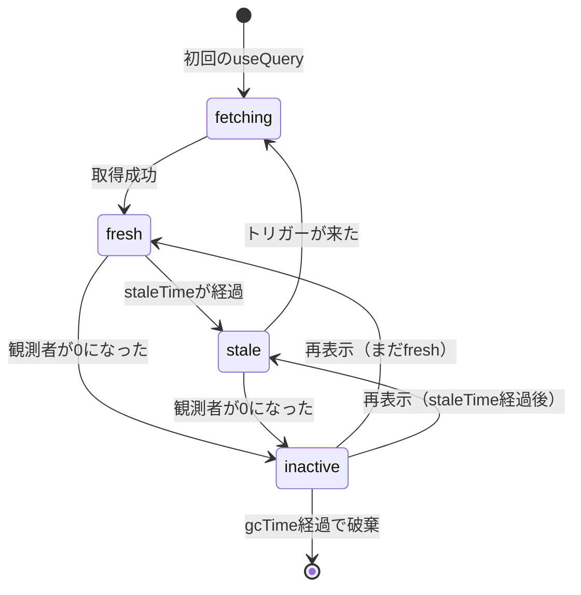
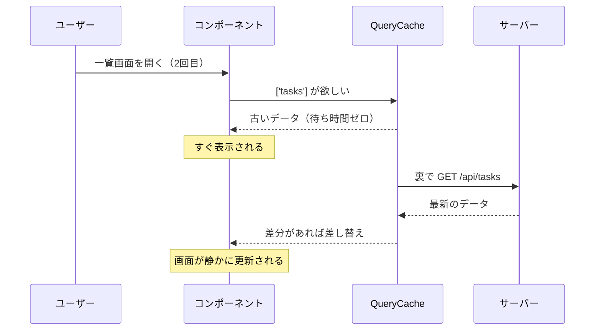
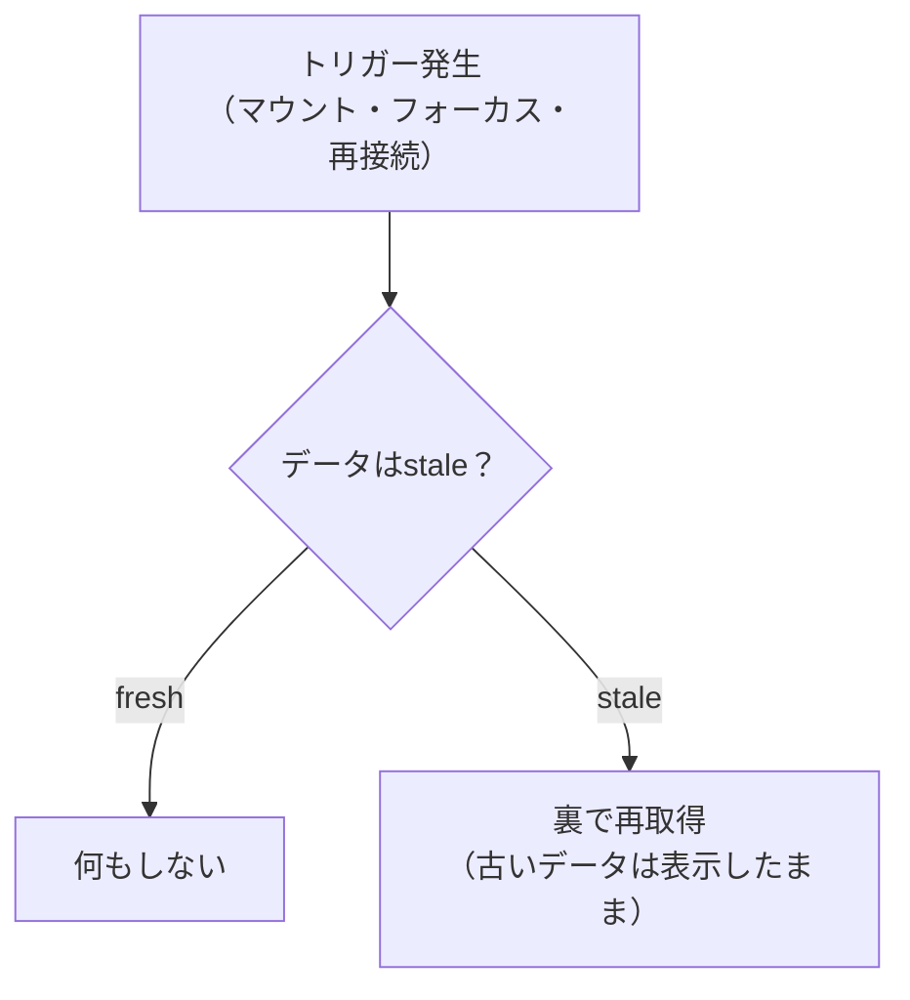

TanStack Queryの中心にあるのはキャッシュです。そして、そのキャッシュを制御する設定は、実質2つしかありません。`staleTime`と`gcTime`です。

この2つを理解すると、ここまで「既定でそうなっている」と流してきた動きが、すべて説明できるようになります。逆に、ここを曖昧にしたままだと、「なぜか毎回リクエストが飛ぶ」「なぜか古いデータが出る」という状態から抜け出せません。この章は、本書でいちばん時間をかけて読む価値があります。

## なぜキャッシュが必要なのか

サーバー状態は借り物のデータです。手元にあるのは写しにすぎません。

写しをすぐ捨ててしまえば、常に最新のデータを扱えます。ただし、画面を開くたびに待ち時間が発生します。逆に写しを持ち続ければ表示は速いものの、事実と食い違ったままになります。

キャッシュの設計は、この2つのあいだで折り合いをつける作業です。TanStack Queryは、折り合いのつけ方を`staleTime`という1つの数値で表現できるようにしました。

## キャッシュの構造

QueryClientの中には、QueryCacheという入れ物が1つあります。中身は、`queryKey`をキーにした辞書です。

```text
QueryCache
├── ['tasks']               → { data, dataUpdatedAt, status, 観測者の数 }
├── ['tasks', '3']          → { data, dataUpdatedAt, status, 観測者の数 }
├── ['tasks', '7']          → { data, dataUpdatedAt, status, 観測者の数 }
└── ['members']             → { data, dataUpdatedAt, status, 観測者の数 }
```

エントリごとに、データ本体、最後に取得した時刻、状態、そして観測者の数が入っています。

観測者とは、その`queryKey`で`useQuery`を呼んでいるコンポーネントです。前章の`TaskList`と`TaskCount`は、どちらも`['tasks']`の観測者でした。観測者が0になったエントリを、TanStack Queryは`inactive`（誰も見ていない）と見なします。この数え上げが、あとで出てくる`gcTime`の起点になります。

`dataUpdatedAt`（最後に取得した時刻）が、鮮度の判定に使われます。「いま何時か」と引き算して、`staleTime`を超えていれば古い、というだけの計算です。

## freshとstale

キャッシュのデータは、2つの状態を行き来します。

| 状態 | 意味 | 再取得のトリガーが来たとき |
|---|---|---|
| fresh（新鮮） | 取得してから`staleTime`が経っていない | 何もしない |
| stale（古い） | `staleTime`を過ぎた | 再取得する |

`stale`は「使えないデータ」ではありません。表示には使われます。違いは、再取得のきっかけが来たときに動くかどうかだけです。

Devtoolsで見えるラベルも、この2つに`fetching`と`inactive`を加えた4つでした。関係を図にすると、こうなります。



## stale-while-revalidateという戦略

`stale`なデータに再取得のトリガーが来たとき、TanStack Queryは2つのことを同時に行います。

1. キャッシュにある古いデータを、そのまま画面に見せる
2. 裏でサーバーに問い合わせ、返ってきたら差し替える

この戦略をstale-while-revalidate（古いものを見せながら、検証する）と呼びます。HTTPのキャッシュ制御にも同じ名前の仕組みがあり、考え方は共通です。



ユーザーから見ると、画面は瞬時に表示されます。そして、気づかないうちに最新化されます。読み込み中の表示は出ません。データが手元にあるので、`isPending`は`false`のままです（`isFetching`だけが`true`になります）。

前章で「`isFetching`で画面全体を差し替えるな」と書いた理由が、ここにあります。せっかく待ち時間ゼロで見せられるのに、わざわざ骨組みに戻してしまうからです。

## staleTimeで鮮度を設計する

`staleTime`は、取得したデータを何ミリ秒fresh扱いにするかの設定です。既定値は0です。

```tsx
useQuery({
  queryKey: ['tasks'],
  queryFn: fetchTasks,
  staleTime: 30_000, // 30秒間は再取得しない
});
```

既定が0である理由は、安全側に倒しているからです。ライブラリはアプリのデータがどれくらいの速さで変わるかを知りません。古いデータを見せ続ける事故より、余分な通信のほうがましだという判断です。

ただ、実際のアプリで0が最適な場面は多くありません。タスク一覧を開いて詳細を見て戻る、この操作で毎回リクエストが飛ぶのは過剰です。データの性質に応じて、自分で決めるべき値です。

| データの例 | 変わる頻度 | `staleTime`の目安 |
|---|---|---|
| カテゴリ一覧、都道府県マスタ | ほぼ変わらない | `Infinity`または数時間 |
| ログイン中のユーザー情報 | まれに変わる | 5〜10分 |
| タスク一覧（複数人が編集する） | 数分単位 | 30秒〜1分 |
| 在庫数、入札額 | 秒単位 | 0＋ポーリング |

判断の目安は、「このデータが1分古かったとして、ユーザーは困るか」です。困らないなら、そのぶんは`staleTime`に入れられます。

`staleTime: Infinity`にすると、自動では二度と古くなりません。マスタデータに向いています。もちろん、更新したときは明示的にキャッシュを無効化します。その方法は次章で扱います。

## gcTimeでキャッシュの寿命を決める

もう1つの`gcTime`は、**誰も見ていないデータをいつ捨てるか**の設定です。既定値は5分です。

観測者が0になった（画面から消えた）時点でタイマーが始まり、5分間だれも見に来なければ、キャッシュからそのエントリが削除されます。

```text
                  観測者が0になった
                        │
  ┌── 表示中 ───────────┤
  │  gcTimeは動かない   │
  │                     ├── gcTime（5分）のカウント開始 ──→ 削除
  │                     │
  │                     └── 途中で再表示されたらカウント中止
```

タスク一覧から詳細に移り、1分後に戻ってきた場合を考えます。一覧のエントリは`inactive`ですが、まだ削除されていません。だから戻った瞬間にデータが表示されます（そして`stale`なら裏で更新されます）。

もし6分後に戻ってきたら、エントリは削除済みです。データが無い状態からのやり直しになり、`isPending`が`true`になって読み込み中の表示が出ます。

### 2つの時間の違い

混同しやすいので、並べて確認します。

| | `staleTime` | `gcTime` |
|---|---|---|
| 何を決めるか | データを再取得するかどうか | キャッシュを捨てるかどうか |
| 起点 | データを取得した時刻 | 観測者が0になった時刻 |
| 表示中のデータへの影響 | あり（再取得の判断） | なし（表示中は捨てられない） |
| 既定値 | 0 | 5分 |
| 超えると | `stale`になる | エントリが消える |

ひとことで言えば、`staleTime`は鮮度、`gcTime`は寿命です。

:::message
`gcTime`は、v4までは`cacheTime`という名前でした。v5で「キャッシュの保持時間」ではなく「ガベージコレクションまでの時間」だと明確にするために改名されています。古い記事で`cacheTime`を見かけたら、`gcTime`に読み替えてください。
:::

:::message alert
`gcTime`を`staleTime`より短くすると、おかしな動きになります。たとえば`staleTime: 60秒`・`gcTime: 10秒`の場合、画面を離れて15秒後に戻るとデータは削除済みです。fresh扱いにするつもりだったのに、毎回取り直しになります。`gcTime`は`staleTime`より長く保つのが原則です。
:::

## 再取得が起こる4つのトリガー

`stale`なデータが再取得される契機は、4つあります。

| トリガー | オプション | 既定 |
|---|---|---|
| コンポーネントがマウントされた | `refetchOnMount` | `true` |
| ブラウザのタブに戻ってきた | `refetchOnWindowFocus` | `true` |
| ネットワークが復帰した | `refetchOnReconnect` | `true` |
| 一定時間が経った | `refetchInterval` | 無効 |

上の3つには共通の性質があります。**データが`stale`のときにだけ動く**ことです。`fresh`なら何も起きません。

つまり、通信の回数を減らしたいときに触るべきは、これらのオプションではなく`staleTime`です。ここを取り違えて`refetchOnWindowFocus: false`を並べる実装をよく見かけますが、それでは「復帰時に確認する」という有益な仕組みを捨てることになります。



どうしても常に取り直したい場合は、`'always'`を指定できます。`refetchOnMount: 'always'`とすると、`fresh`でもマウント時に取りにいきます。

## 設定はどこに書くか

`staleTime`をQueryごとに書いていくと、書き漏れが出ます。アプリ全体の既定値は、QueryClientを作るときに指定できます。

```tsx:src/main.tsx
const queryClient = new QueryClient({
  defaultOptions: {
    queries: {
      staleTime: 60_000, // 既定を1分に
      gcTime: 5 * 60_000,
      retry: 2,
    },
  },
});
```

そのうえで、個別のQueryで上書きします。

```tsx
// マスタデータは変わらないので、自動では古くしない
useQuery({
  queryKey: ['categories'],
  queryFn: fetchCategories,
  staleTime: Infinity,
});
```

おすすめは、既定を「そのアプリでいちばん多いデータの性質」に合わせることです。管理画面なら1分程度が扱いやすい値です。そして、性質の違うデータだけを個別に上書きします。

Queryの定義を1か所にまとめておけば、この上書きも散らばりません。その方法は「Queryの設計パターン」の章で扱います。

## 確かめてみる

Devtoolsを開いて、`staleTime`の効果を観察してください。

`staleTime: 30_000`を指定した`['tasks']`は、取得後30秒間`fresh`と表示されます。この間、タブを離れて戻ってもリクエストは飛びません。30秒を過ぎるとラベルが`stale`に変わり、次にタブへ戻ったときに再取得が走ります。

そして、再取得中も一覧が消えないことを確かめてください。画面はそのまま、データだけが静かに入れ替わります。これがstale-while-revalidateの体感です。

## まとめ

この章では、キャッシュの仕組みと2つの時間を扱いました。

- QueryCacheは`queryKey`をキーにした辞書で、データ本体・取得時刻・観測者の数を保持します。
- データは`fresh`と`stale`を行き来します。`stale`でも表示には使われます。
- `stale`なデータは、古いものを見せながら裏で更新されます（stale-while-revalidate）。
- `staleTime`は鮮度の設定です。既定は0で、安全側に倒した値です。データの性質に応じて自分で決めます。
- `gcTime`は寿命の設定です。観測者が0になってから数え始め、既定は5分です。
- 再取得のトリガーはマウント・フォーカス・再接続・一定間隔の4つで、上3つは`stale`のときだけ動きます。
- 通信を減らしたいときは、トリガーを止めるより`staleTime`を延ばします。
- 既定値はQueryClientに、例外は個別のQueryに書きます。

次章では、データを更新する側に移ります。作成・更新・削除を行ったあと、キャッシュをどう最新化するのか。`useMutation`と、キャッシュの無効化を扱います。
