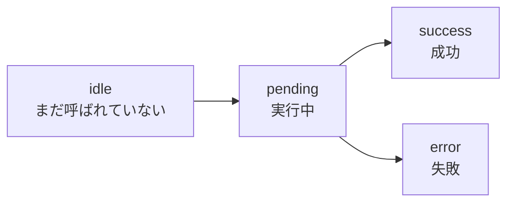
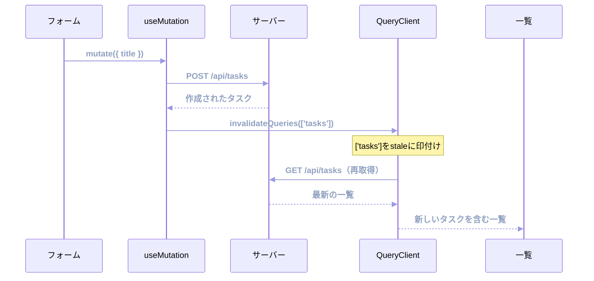

ここまでは、データを読む話でした。この章から、書く話に移ります。

タスクを作る、状態を完了にする、削除する。こうした更新のあとには、必ず宿題が残ります。手元のキャッシュが古くなるのです。一覧に新しいタスクが並ばない、完了にしたのに未完了のまま表示される。この食い違いを解消するところまでが、更新処理の仕事です。

## 取得と更新は別物

`useQuery`と`useMutation`は、名前が似ているだけで役割が違います。

| | `useQuery` | `useMutation` |
|---|---|---|
| 何をするか | データを取得する | データを変更する |
| いつ動くか | 自動（マウント時など） | 呼び出したときだけ |
| 何度も動くか | 再取得される | 1回ずつ明示的に |
| キャッシュ | する | しない |
| 失敗時の再試行 | 既定で3回 | 既定でしない |

違いの根っこは、副作用の有無です。取得は何度実行しても結果が変わりません。だから自動でも安全です。更新はそうではありません。2回実行すればタスクが2つ作られます。だから、明示的に呼んだときだけ動き、勝手に再試行もしません。

## 更新系のAPI関数を用意する

`api.ts`には、まだ取得の関数しかありません。この章から使う3本を足します。

```ts:src/features/tasks/api.ts
import type { Task, TaskInput } from './types';

export async function createTask(input: TaskInput): Promise<Task> {
  const response = await fetch('/api/tasks', {
    method: 'POST',
    headers: { 'Content-Type': 'application/json' },
    body: JSON.stringify(input),
  });
  if (!response.ok) {
    throw new Error('タスクの作成に失敗しました');
  }
  return response.json();
}

export async function updateTask(id: string, patch: Partial<TaskInput>): Promise<Task> {
  const response = await fetch(`/api/tasks/${id}`, {
    method: 'PATCH',
    headers: { 'Content-Type': 'application/json' },
    body: JSON.stringify(patch),
  });
  if (!response.ok) {
    throw new Error('タスクの更新に失敗しました');
  }
  return response.json();
}

export async function deleteTask(id: string): Promise<void> {
  const response = await fetch(`/api/tasks/${id}`, { method: 'DELETE' });
  if (!response.ok) {
    throw new Error('タスクの削除に失敗しました');
  }
}
```

作成は`TaskInput`、更新は`Partial<TaskInput>`を受け取ります。作成では`title`が必須で、更新では触った項目だけを送るからです。モックのハンドラと同じ約束にしてあります。

削除だけ`response.json()`を呼んでいません。応答が本文の無い204だからです。ここで`json()`を呼ぶと、解析に失敗して例外になります。

3本とも同じ`response.ok`の確認を書いています。この重複は「エラー処理とSuspense」の章で共通処理にまとめるので、いまはこのままで進めます。

## useMutationの基本

タスクを作成するフォームを書きます。

```tsx:src/features/tasks/components/CreateTaskForm.tsx
import { useState } from 'react';
import { useMutation } from '@tanstack/react-query';
import { createTask } from '../api';

export function CreateTaskForm() {
  const [title, setTitle] = useState('');

  const { mutate, isPending, isError, error } = useMutation({
    mutationFn: createTask,
  });

  return (
    <form
      onSubmit={(event) => {
        event.preventDefault();
        mutate({ title });
      }}
    >
      <input value={title} onChange={(event) => setTitle(event.target.value)} />
      <button type="submit" disabled={isPending || title === ''}>
        {isPending ? '作成中...' : '作成'}
      </button>
      {isError && <p role="alert">{error.message}</p>}
    </form>
  );
}
```

渡すのは`mutationFn`だけです。`useQuery`と違って`queryKey`はありません。キャッシュに保存しないので、住所が要らないのです。

返ってきた`mutate`を呼ぶと、`mutationFn`が実行されます。引数はそのまま`mutationFn`へ渡ります。

### 4つの状態

Mutationの`status`は4つです。



`isPending`は、この`pending`を表します。送信ボタンを`disabled`にする条件として使えば、二重送信を防げます。上の例で`disabled={isPending || title === ''}`と書いているのがそれです。

二重送信の防止は、自分で書く必要がある部分です。`useMutation`は連続で呼べば連続で実行します。ボタンの無効化を忘れると、ユーザーが素早く2回押しただけでタスクが2つできます。

## 更新後にキャッシュを最新化する

上のコードには、まだ肝心なものが足りません。作成は成功しますが、一覧が変わりません。

キャッシュにある`['tasks']`は、作成前に取得したデータです。TanStack Queryは、サーバー側で何が起きたかを知りません。「いま作ったから、あの一覧は古くなったよ」と教える必要があります。

その伝達手段が`invalidateQueries`です。

```tsx
import { useMutation, useQueryClient } from '@tanstack/react-query';

export function CreateTaskForm() {
  const queryClient = useQueryClient();
  const [title, setTitle] = useState('');

  const { mutate, isPending, isError, error } = useMutation({
    mutationFn: createTask,
    onSuccess: () => {
      setTitle('');
      return queryClient.invalidateQueries({ queryKey: ['tasks'] });
    },
  });

  // ... 以下は同じ
}
```

`useQueryClient`で、Providerに渡したQueryClientを取り出します。`invalidateQueries`は、指定したキーのキャッシュを`stale`（古い）に印付けし、いま表示されているものはその場で再取得します。



無効化を「キャッシュを消す」と理解すると、動きを読み違えます。消すのではなく、印を付けるだけです。データは残っているので、再取得の間も一覧は表示され続けます。前章のstale-while-revalidateがそのまま働きます。

:::message
`onSuccess`の中で`invalidateQueries`の戻り値を`return`しているのに注目してください。`invalidateQueries`はPromiseを返します。それを返すと、再取得が終わるまでMutationは`pending`のままになります。

つまり、`isPending`が`false`になった時点で一覧も最新になっています。ボタンの無効化が解除されるタイミングと、画面が最新になるタイミングが揃うので、ユーザーから見て自然です。`return`を書かない場合、Mutationは先に完了し、一覧の更新は少し遅れて届きます。
:::

### 無効化の範囲は前方一致

`invalidateQueries({ queryKey: ['tasks'] })`は、`['tasks']`だけを対象にするのではありません。前方一致で、`['tasks']`で始まるすべてのキーが対象です。

```text
invalidateQueries({ queryKey: ['tasks'] })

  ['tasks']                        → 対象
  ['tasks', '3']                   → 対象
  ['tasks', { status: 'todo' }]     → 対象
  ['members']                      → 対象外
```

`queryKey`を階層構造にしておく理由が、ここで効いてきます。タスクに関わるキャッシュをまとめて最新化したいなら、`['tasks']`と指定するだけで済みます。

一覧だけに絞りたい場合は`exact: true`を付けます。

```tsx
// ['tasks'] だけ。詳細のキャッシュは触らない
queryClient.invalidateQueries({ queryKey: ['tasks'], exact: true });
```

## キャッシュを直接書き換える

更新のレスポンスに、更新後のデータがまるごと入っていることがあります。本書のAPIも、`PATCH`の応答として更新後のタスクを返します。

このとき、再取得は無駄になります。手元に最新のデータがあるのだから、キャッシュに直接入れてしまえばよいのです。それが`setQueryData`です。

```tsx
export function TaskStatusToggle({ task }: { task: Task }) {
  const queryClient = useQueryClient();

  const { mutate, isPending } = useMutation({
    mutationFn: (status: TaskStatus) => updateTask(task.id, { status }),
    onSuccess: (updated) => {
      // 詳細のキャッシュはレスポンスで置き換える（通信なし）
      queryClient.setQueryData(['tasks', updated.id], updated);
      // 一覧は件数や並び順が変わりうるので再取得に任せる
      return queryClient.invalidateQueries({ queryKey: ['tasks'], exact: true });
    },
  });

  return (
    <button type="button" disabled={isPending} onClick={() => mutate('done')}>
      完了にする
    </button>
  );
}
```

`onSuccess`の第1引数には、`mutationFn`が返した値が入ります。ここでは更新後のタスクです。

### どちらを使うか

2つの手段を、使い分けの基準で整理します。

| | `invalidateQueries` | `setQueryData` |
|---|---|---|
| やること | 古い印を付けて再取得 | キャッシュを直接置き換える |
| 追加の通信 | 発生する | 発生しない |
| 正確さ | サーバーの答えがそのまま反映される | 書き換えた内容を信じることになる |
| 向く場面 | 一覧、集計値、他のデータへの影響がある更新 | 単体のデータで、レスポンスに最新形が含まれる |

迷ったら`invalidateQueries`を選んでください。通信は1回増えますが、サーバーの答えが正しいという前提が崩れません。

`setQueryData`が輝くのは、影響範囲がはっきりしている場面です。1件の詳細を更新した、その1件だけをキャッシュに反映する。この用途なら、余分な通信を省けます。

:::message alert
`setQueryData`で一覧を書き換えるときは注意が必要です。一覧は、絞り込み条件・並び順・ページ番号によって中身が変わります。「未完了だけ」の一覧でタスクを完了にしたら、その行は一覧から消えるべきです。それを`setQueryData`で正しく再現するには、絞り込みの条件をクライアント側でもう一度実装することになります。

サーバー側のロジックをクライアントに二重実装するのは、ずれの原因です。一覧は`invalidateQueries`に任せるのが安全です。
:::

## 作成・更新・削除で何を最新化するか

3種類の更新では、後片付けの内容が少し違います。削除を例に見ます。

```tsx
export function DeleteTaskButton({ taskId }: { taskId: string }) {
  const queryClient = useQueryClient();

  const { mutate, isPending } = useMutation({
    mutationFn: deleteTask,
    onSuccess: () => {
      // 消えたものの詳細キャッシュは、印付けではなく破棄する
      queryClient.removeQueries({ queryKey: ['tasks', taskId] });
      return queryClient.invalidateQueries({ queryKey: ['tasks'], exact: true });
    },
  });

  return (
    <button type="button" disabled={isPending} onClick={() => mutate(taskId)}>
      削除
    </button>
  );
}
```

削除したタスクの詳細を`invalidateQueries`で無効化すると、再取得が走って404になります。存在しないものを取りにいくのだから当然です。エラー表示が一瞬出るような、締まらない挙動になります。

消えたデータには`removeQueries`を使います。印を付けるのではなく、エントリごと捨てる操作です。

| 操作 | 詳細のキャッシュ | 一覧のキャッシュ |
|---|---|---|
| 作成 | 何もしない（まだ誰も見ていない） | `invalidateQueries` |
| 更新 | `setQueryData`で置き換え | `invalidateQueries` |
| 削除 | `removeQueries`で破棄 | `invalidateQueries` |

一覧はどの操作でも`invalidateQueries`です。件数、並び順、絞り込みの結果が変わるため、サーバーに聞き直すのが確実です。

## mutateとmutateAsync

`mutate`には、`mutateAsync`という兄弟がいます。違いは、Promiseを返すかどうかです。

```tsx
// mutate: Promiseを返さない。結果はコールバックで受け取る
mutate({ title });

// mutateAsync: Promiseを返す。失敗すると例外を投げる
const created = await mutateAsync({ title });
```

`mutate`は例外を投げません。失敗しても`onError`が呼ばれるだけで、呼び出し側は素通りします。だから、`try`で囲む必要がありません。ふだんはこちらで足ります。

`mutateAsync`が必要になるのは、結果を待って次の処理に進みたいときです。

```tsx
async function handleClick() {
  try {
    const created = await mutateAsync({ title: '新しいタスク' });
    navigate(`/tasks/${created.id}`); // 作成したタスクの詳細へ移動する
  } catch {
    window.alert('作成に失敗しました');
  }
}
```

`mutateAsync`を使うときは、`try` / `catch`を忘れないでください。書き忘れると、失敗が処理されないPromiseとしてコンソールに警告が出ます。

## コールバックを書く場所

`onSuccess`などのコールバックは、2か所に書けます。`useMutation`のオプションと、`mutate`の第2引数です。

```tsx
const { mutate } = useMutation({
  mutationFn: createTask,
  onSuccess: () => {
    // ①どこから呼ばれても必ず実行される
    return queryClient.invalidateQueries({ queryKey: ['tasks'] });
  },
});

mutate(
  { title },
  {
    onSuccess: () => {
      // ②この呼び出しのときだけ実行される
      closeModal();
    },
  },
);
```

使い分けの基準は、「そのMutationに常に必要な処理か」です。キャッシュの無効化は常に必要なので①に書きます。モーダルを閉じる、特定の画面へ移動するといった呼び出し側の事情は②に書きます。

:::message
②のコールバックには落とし穴があります。コンポーネントがアンマウントされていると呼ばれません。「作成が終わったらモーダルを閉じる」処理をモーダル自身の中で②に書いていて、閉じるより先に画面が切り替わると、処理が実行されないままになります。

キャッシュの無効化のように、絶対に実行されなければならない処理は①に書いてください。①はコンポーネントの生死に関係なく実行されます。
:::

なお、`onSettled`は成功でも失敗でも呼ばれます。読み込み表示の後片付けなど、どちらでも必要な処理に使います。

## まとめ

この章では、データの更新とキャッシュの最新化を扱いました。

- 更新系のAPI関数（`createTask`・`updateTask`・`deleteTask`）を`api.ts`に足しました。削除は204を返すので`response.json()`を呼びません。
- `useMutation`は明示的に呼んだときだけ動きます。キャッシュもせず、既定では再試行もしません。
- 渡すのは`mutationFn`だけです。`mutate`の引数がそのまま渡ります。
- `isPending`でボタンを無効化して、二重送信を防ぎます。この対策は自分で書きます。
- 更新後は`invalidateQueries`でキャッシュに古い印を付けます。消すのではなく印付けなので、表示は途切れません。
- 無効化は前方一致です。`['tasks']`を指定すると詳細のキャッシュまで対象になります。絞るなら`exact: true`です。
- `onSuccess`で`invalidateQueries`の戻り値を返すと、再取得の完了までMutationが`pending`のままになります。
- レスポンスに最新形が含まれる単体データは`setQueryData`で直接置き換えられます。一覧は`invalidateQueries`に任せます。
- 結果を待って次へ進みたいときは`mutateAsync`を使い、`try` / `catch`で囲みます。
- 必ず実行したい処理は`useMutation`側のコールバックに書きます。`mutate`側はアンマウントで実行されません。

次章では、更新の体感速度を上げる手法に進みます。サーバーの応答を待たずに画面を書き換えるOptimistic Updateです。
