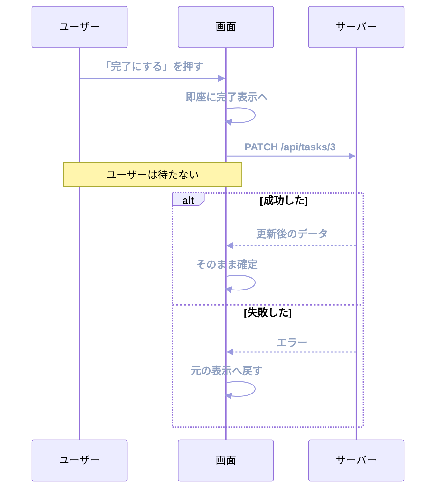
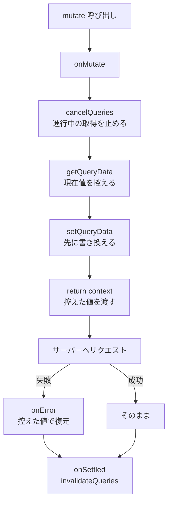

:::message
[この章の完成コード](https://github.com/nagahara-naoki/tanstack-textbook-samples/tree/chapter-09/tanstack-tasks-spa)と[第8章からの差分](https://github.com/nagahara-naoki/tanstack-textbook-samples/compare/chapter-08...chapter-09)を確認できます。完成コードでは、前章の`TaskStatusToggle.tsx`を楽観的更新へ置き換えます。
:::

前章の更新処理には、待ち時間がありました。ボタンを押してから画面が変わるまで、サーバーの応答を待つ必要があります。本書のモックは400ミリ秒の遅延を入れているので、その間ボタンは「作成中...」のままです。

チェックボックスを1つ入れるだけの操作で毎回0.4秒待たされると、アプリは鈍く感じられます。この章では、待ち時間を体感からなくす手法を扱います。Optimistic Update（楽観的更新）です。

## 楽観的更新とは

考え方は単純です。**成功するだろうと見込んで、先に画面を書き換える**。

サーバーへのリクエストは投げますが、応答は待ちません。ユーザーがチェックを入れた瞬間にチェックが付き、失敗したときだけ元に戻します。



「楽観的」という名前は、成功を前提に振る舞うところから来ています。裏を返せば、失敗したときに取り消す責任を負う手法です。

なぜこれが成立するのか。ほとんどの更新は成功するからです。バリデーションはクライアント側で済ませてあり、ネットワークもふだんは通ります。1000回に1回の失敗のために、999回の操作を待たせる必要はありません。

## 方法1: 送信中の内容を仮表示する

実装には2つの水準があります。まず簡単なほうから見ます。

`useMutation`は、送信中の引数を`variables`として返します。これを使えば、キャッシュに触らずに仮の表示を作れます。次の`TaskListWithPendingRow`は方法1を説明する独立した例で、完成コードでは方法2を採用します。

```tsx
export function TaskListWithPendingRow() {
  const queryClient = useQueryClient();
  const { data } = useQuery({ queryKey: ['tasks'], queryFn: fetchTasks });

  const { mutate, variables, isPending } = useMutation({
    mutationFn: createTask,
    onSettled: () => queryClient.invalidateQueries({ queryKey: ['tasks'] }),
  });

  return (
    <>
      <ul>
        {data?.items.map((task) => (
          <li key={task.id}>{task.title}</li>
        ))}
        {isPending && <li style={{ opacity: 0.5 }}>{variables.title}（送信中）</li>}
      </ul>
      <button type="button" onClick={() => mutate({ title: '新しいタスク' })}>
        追加
      </button>
    </>
  );
}
```

送信中だけ、薄い色の行が一覧の末尾に現れます。サーバーから応答が返ると`onSettled`で一覧が再取得され、仮の行は本物の行に置き換わります。

この方法の良さは、後始末が要らないことです。キャッシュは書き換えていないので、失敗しても仮の行が消えるだけです。ロールバックの処理を書く必要がありません。

弱点は、表示している場所が1か所に限られることです。一覧と件数表示の両方に反映したいなら、それぞれで`variables`を参照する必要があります。

## 方法2: キャッシュを先に書き換える

複数の画面に反映したい場合や、詳細画面の値そのものを変える場合は、キャッシュに手を入れます。前章で作った`TaskStatusToggle.tsx`を、次のコードへ置き換えます。

```tsx:src/features/tasks/components/TaskStatusToggle.tsx
export function TaskStatusToggle({ task }: { task: Task }) {
  const queryClient = useQueryClient();

  const { mutate, isPending } = useMutation({
    mutationFn: (status: TaskStatus) => updateTask(task.id, { status }),

    onMutate: async (status) => {
      // ①進行中の再取得を止める
      await queryClient.cancelQueries({ queryKey: ['tasks', task.id] });

      // ②いまの値を控えておく
      const previous = queryClient.getQueryData<Task>(['tasks', task.id]);

      // ③応答を待たずに書き換える
      queryClient.setQueryData<Task>(['tasks', task.id], (old) =>
        old ? { ...old, status } : old,
      );

      // ④控えた値を、あとの処理へ渡す
      return { previous };
    },

    onError: (_error, _status, context) => {
      // ⑤失敗したら元に戻す
      if (context?.previous) {
        queryClient.setQueryData(['tasks', task.id], context.previous);
      }
    },

    onSettled: () => {
      // ⑥成否にかかわらずサーバーに聞き直す
      return queryClient.invalidateQueries({ queryKey: ['tasks'] });
    },
  });

  return (
    <button type="button" disabled={isPending} onClick={() => mutate('done')}>
      完了にする
    </button>
  );
}
```

6つの手順それぞれに、はっきりした役割があります。

### ①なぜ再取得を止めるのか

`cancelQueries`を忘れると、厄介な競合が起きます。

ちょうど裏で再取得が走っていたとします。その応答は、こちらが書き換えるより後に到着します。到着した応答は当然、更新前のデータです。せっかく書き換えたキャッシュが、古いデータで上書きされてしまいます。

画面上では、チェックが付いた直後に外れる、という不気味な動きになります。進行中の取得を止めておけば、これを防げます。

### ②③控えて、書き換える

`getQueryData`で現在の値を取り出し、`setQueryData`で新しい値を入れます。

`setQueryData`には、値そのものではなく関数を渡しています。こうすると、書き換え時点のキャッシュを引数として受け取れます。`(old) => old ? { ...old, status } : old`という形は、キャッシュが空だった場合に何もしない、という意味です。

書き換えは必ず新しいオブジェクトを作ってください。`old.status = status`のように直接書き換えると、Reactが変化を検知できません。

### ④コンテキストで受け渡す

`onMutate`が返した値は、`onError`と`onSettled`の第3引数に届きます。TanStack Queryでは、これをコンテキストと呼びます。

型は`onMutate`の戻り値から推論されます。`{ previous: Task | undefined }`を返しているので、`context?.previous`と書けます。`context`自体が`undefined`になりうるのは、`onMutate`の中で例外が起きた場合があるためです。

### ⑤失敗したら戻す

控えた値をキャッシュに戻します。これで画面は元の表示に戻ります。

戻すだけでは、ユーザーは何が起きたのかわかりません。「更新に失敗しました」という通知を、あわせて出すべきです。無言で元に戻ると、操作が効かないバグに見えます。

### ⑥最後にサーバーへ聞き直す

`onSettled`は成功でも失敗でも呼ばれます。ここで`invalidateQueries`を呼び、サーバーの答えで上書きします。

成功した場合でも、この確認には意味があります。サーバー側で`updatedAt`が更新されている、ステータスの変更にともなって他のフィールドが変わる、といったことがあるからです。手元で予想した形と、サーバーの答えが完全に一致するとは限りません。最後に事実で塗り直します。

## 実装の型として覚える

方法2の6手順は、どんな楽観的更新でも同じ形になります。



一覧のキャッシュに対して楽観的更新をかける場合も、手順は変わりません。次は`onMutate`内の書き換え部分だけを示した説明用コードです。

```tsx
queryClient.setQueryData<TaskListResult>(['tasks'], (old) =>
  old
    ? {
        ...old,
        items: old.items.map((item) =>
          item.id === task.id ? { ...item, status } : item,
        ),
      }
    : old,
);
```

ただし前章で触れたとおり、一覧の楽観的更新には注意が必要です。絞り込み条件によっては、更新した行が一覧から消えるべき場合があります。その判断をクライアント側で再現し始めると、サーバーのロジックの二重実装になります。

## 失敗を実際に起こしてみる

楽観的更新は、成功しているときは何も起きていないように見えます。価値がわかるのは失敗したときなので、意図的に失敗させて観察します。

「開発環境の準備」の章で仕込んだ`__fail`を使います。更新の呼び出し先を、一時的に失敗するURLへ変えます。

```ts
// 検証用。PATCHを必ず500で失敗させる
export async function updateTask(id: string, patch: Partial<TaskInput>): Promise<Task> {
  const response = await fetch(`/api/tasks/${id}?__fail=500`, {
    method: 'PATCH',
    headers: { 'Content-Type': 'application/json' },
    body: JSON.stringify(patch),
  });
  if (!response.ok) {
    throw new Error('タスクの更新に失敗しました');
  }
  return response.json();
}
```

ボタンを押すと、次の順番で動きます。

1. 押した瞬間に「完了」の表示になる
2. 400ミリ秒後、サーバーが500を返す
3. 表示が元に戻る

Devtoolsのキャッシュを見ながら試すと、値が書き換わってから戻る様子がそのまま観察できます。手順⑤のロールバックを書き忘れていると、表示が「完了」のまま残り、リロードすると元に戻るという食い違いが起きます。この症状を1度見ておくと、`onError`の必要性が体で理解できます。

確認が終わったら、`?__fail=500`は消してください。

## 素早い連続操作に注意する

同じ項目を素早く何度も切り替えると、複数のMutationが同時に走ります。

このとき、2回目の`onMutate`が控える「現在値」は、1回目の楽観的更新で書き換わったあとの値です。もし2回目だけが失敗すると、キャッシュは1回目の楽観的な値に戻ります。サーバーの実際の状態とずれる可能性があります。

対策は2つあります。素朴で確実なのは、送信中にボタンを無効化することです。本章の例で`disabled={isPending}`を付けているのは、この意味もあります。

もう1つは、`onSettled`の`invalidateQueries`に任せることです。すべてのMutationが終わったあとに再取得が走るので、最終的にはサーバーの答えに収束します。ずれるのは一時的です。

いずれにせよ、最後に事実で塗り直す手順⑥を省かないことが安全弁になります。

## 向く操作と向かない操作

楽観的更新は、どんな操作にでも使えるわけではありません。

| 向く操作 | 理由 |
|---|---|
| チェックボックスの切り替え | 結果が自明で、失敗しても戻せる |
| いいね・お気に入り | 失敗の影響が小さい |
| 並べ替え | 手元で結果を完全に予測できる |
| 一覧からの削除 | 消えるという結果が明白 |

| 向かない操作 | 理由 |
|---|---|
| 決済・送金 | 失敗の代償が大きく、取り消しでは済まない |
| サーバーが値を決める処理（採番、在庫の確保） | 手元で結果を予測できない |
| バリデーションがサーバー側にしかない処理 | 失敗率が読めない |
| 複数の処理が連鎖する処理 | どこまで戻すかが複雑になる |

判断の基準は2つです。**手元で結果を正確に予測できるか**、そして**間違っていたときに戻して済むか**。両方に自信があるときだけ使ってください。

:::message alert
「サーバーが値を決める処理」で楽観的更新をすると、一瞬だけ嘘の値が表示されます。たとえば作成時のIDを手元で仮採番すると、その仮のIDで詳細画面へ移動しようとして404になる、といった事故が起きます。

本書のAPIも、作成時のIDはサーバーが採番します。この場合、方法1の仮表示（IDを使わない表示）に留めるのが安全です。
:::

## 失敗をどう伝えるか

楽観的更新には、通知の設計がついてきます。画面が勝手に元に戻るだけでは、ユーザーは混乱します。

伝え方は、操作の重さで変えます。

- 軽い操作（いいね、チェック）は、控えめなトーストで「元に戻しました」と伝えます。
- 重い操作は、そもそも楽観的更新を使わず、送信中の表示で待たせます。

再試行のボタンを添えるのも有効です。ネットワークの一時的な不調なら、押し直せば通ります。

エラー通知をアプリ全体で統一する方法は、「エラー処理とSuspense」の章で扱います。

## この章の完成コード

完成コードでは、詳細と一覧のキャッシュを先に更新し、失敗時に両方を戻します。`cancelQueries`から`invalidateQueries`までの流れは、[`chapter-09`](https://github.com/nagahara-naoki/tanstack-textbook-samples/tree/chapter-09/tanstack-tasks-spa)の`TaskStatusToggle.tsx`で確認できます。

## まとめ

楽観的更新では、成功を先取りして表示し、失敗時に戻せる状態を必ず残します。

- 成功を見込んで先に画面を書き換え、失敗したときだけ戻す手法です。
- 簡単な方法は`variables`による仮表示です。キャッシュを触らないので後始末が要りません。
- 本格的な方法は`onMutate`でキャッシュを書き換えます。手順は、取得の中止・現在値の控え・書き換え・コンテキストの返却です。
- `cancelQueries`を忘れると、進行中の再取得が書き換えを上書きします。
- `onMutate`の戻り値がコンテキストとして`onError`と`onSettled`に届きます。
- `onSettled`で必ずサーバーに聞き直し、事実で塗り直します。
- 使う条件は、手元で結果を予測できることと、戻して済むことです。採番や決済には使いません。
- 失敗したときは、静かに戻すのではなくユーザーに伝えます。

次章では、一覧データの量に向き合います。137件のタスクを一度に表示するのをやめ、ページ送りと無限スクロールを実装します。
