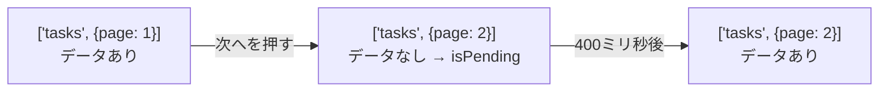
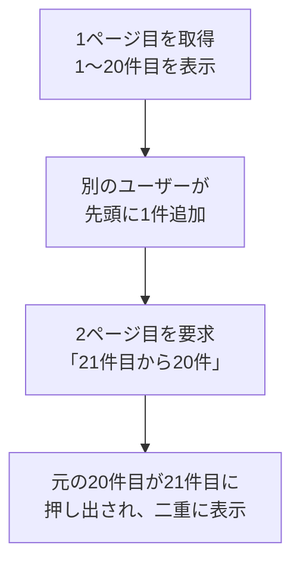

:::message
[この章の完成コード](https://github.com/nagahara-naoki/tanstack-textbook-samples/tree/chapter-10/tanstack-tasks-spa)と[第9章からの差分](https://github.com/nagahara-naoki/tanstack-textbook-samples/compare/chapter-09...chapter-10)を確認できます。`api.ts`を置き換え、ページ番号方式とカーソル方式のコンポーネントを新規作成します。
:::

ここまで、タスク一覧は全件を一度に取得していました。137件ならなんとか動きますが、1万件になれば通信も描画も破綻します。

一覧を分割して取得する方法は、大きく2つあります。ページ番号で区切るページネーションと、下へ読み進めるほど継ぎ足していく無限スクロールです。TanStack Queryは、それぞれに専用の仕組みを持っています。

## APIの関数に引数を持たせる

まず、ページ番号を渡せるように`src/features/tasks/api.ts`の`TaskListParams`、`toSearchParams`、`fetchTasks`を次のコードへ置き換えます。

```ts:src/features/tasks/api.ts
export type TaskListParams = {
  page?: number;
  perPage?: number;
  status?: TaskStatus | 'all';
  q?: string;
  sort?: string;
  order?: 'asc' | 'desc';
};

function toSearchParams(params: Record<string, string | number | null | undefined>) {
  const search = new URLSearchParams();
  for (const [key, value] of Object.entries(params)) {
    if (value !== undefined && value !== null && value !== '') search.set(key, String(value));
  }
  return search.toString();
}

export async function fetchTasks(params: TaskListParams = {}): Promise<TaskListResult> {
  const response = await fetch(`/api/tasks?${toSearchParams(params)}`);
  if (!response.ok) {
    throw new Error('タスクの取得に失敗しました');
  }
  return response.json();
}
```

値が`undefined`か`null`のパラメータは、URLに付けません。「絞り込みなし」を`status=undefined`という文字列として送ってしまう事故を防ぐためです。`null`を含めているのは、このあとの無限スクロールで「先頭から取る」を`null`で表すためです。

:::message alert
この変更で、既存の`queryFn: fetchTasks`が型エラーになります。

```text
Type '(params?: TaskListParams) => Promise<TaskListResult>' is not assignable to
type 'QueryFunction<TaskListResult, string[]>'.
  Type '{ client: QueryClient; queryKey: string[]; signal: AbortSignal; ... }'
  has no properties in common with type 'TaskListParams'.
```

`queryFn`に関数をそのまま渡すと、TanStack Queryはその関数を「コンテキストを受け取る関数」として呼びます。`fetchTasks`は`TaskListParams`を受け取るつもりなので、噛み合いません。

対処は、アロー関数で包むことです。

```tsx
// 変更前
queryFn: fetchTasks,

// 変更後
queryFn: () => fetchTasks(),
```

引数を取るAPI関数は、包んで渡す。この形に統一しておけば、あとから引数が増えても壊れません。
:::

## ページネーションを実装する

ページ番号を`useState`で持ち、`queryKey`に含めます。

```tsx:src/features/tasks/components/PaginatedTaskList.tsx
import { useState } from 'react';
import { useQuery } from '@tanstack/react-query';
import { fetchTasks } from '../api';

export function PaginatedTaskList() {
  const [page, setPage] = useState(1);

  const { data, isPending, isError } = useQuery({
    queryKey: ['tasks', { page }],
    queryFn: () => fetchTasks({ page, perPage: 20 }),
  });

  if (isPending) return <p>読み込み中...</p>;
  if (isError) return <p>エラーが発生しました</p>;

  const totalPages = Math.ceil(data.total / data.perPage);

  return (
    <div>
      <ul>
        {data.items.map((task) => (
          <li key={task.id}>{task.title}</li>
        ))}
      </ul>
      <nav>
        <button type="button" disabled={page === 1} onClick={() => setPage((p) => p - 1)}>
          前へ
        </button>
        <span>{page} / {totalPages}</span>
        <button type="button" disabled={page >= totalPages} onClick={() => setPage((p) => p + 1)}>
          次へ
        </button>
      </nav>
    </div>
  );
}
```

`queryKey`に`{ page }`を入れたので、ページごとに別のキャッシュができます。1ページ目を見て2ページ目へ進み、また1ページ目へ戻ると、キャッシュから即座に表示されます。

総ページ数は、APIが返す`total`と`perPage`から計算します。この値があるおかげで「3 / 7」のような表示や、最終ページでのボタン無効化ができます。カーソル方式のAPIでは総数がわからないので、この表示は作れません。

## ページを切り替えるとちらつく

動かしてみると、気になる挙動があります。「次へ」を押した瞬間、一覧が消えて「読み込み中...」に変わります。

原因は`queryKey`です。`['tasks', { page: 1 }]`から`['tasks', { page: 2 }]`へ変わると、それは**別のQuery**です。別のQueryにはまだデータがないので`isPending`が`true`になり、早期リターンが働きます。



ページを送るたびに画面が空になるのは、体験としてよくありません。表の行数が変わるので、レイアウトも跳ねます。

### placeholderDataで前のページを見せる

`placeholderData`に`keepPreviousData`を指定すると、新しいQueryのデータが届くまで、前のQueryのデータを表示し続けます。先ほど作った`PaginatedTaskList.tsx`の`useQuery`を置き換えます。

```tsx
import { keepPreviousData, useQuery } from '@tanstack/react-query';

const { data, isPending, isPlaceholderData, isFetching } = useQuery({
  queryKey: ['tasks', { page }],
  queryFn: () => fetchTasks({ page, perPage: 20 }),
  placeholderData: keepPreviousData,
});
```

これだけで、ちらつきが消えます。「次へ」を押しても一覧は残ったまま、400ミリ秒後に中身が入れ替わります。

このとき、表示しているのが「前のページのデータ」であることを知る手段が要ります。`isPlaceholderData`がその合図です。

次の表示部分も、同じ`PaginatedTaskList.tsx`の一覧と「次へ」ボタンへ反映します。

```tsx:src/features/tasks/components/PaginatedTaskList.tsx
<ul style={{ opacity: isPlaceholderData ? 0.6 : 1 }}>
  {data.items.map((task) => (
    <li key={task.id}>{task.title}</li>
  ))}
</ul>

<button
  type="button"
  disabled={isPlaceholderData || page >= totalPages}
  onClick={() => setPage((p) => p + 1)}
>
  次へ
</button>
```

薄く表示して、まだ確定していないことを伝えます。そして「次へ」を無効化します。前のページを見せている状態でさらに次へ進むと、ページ番号だけが飛んでいく、ちぐはぐな動きになるためです。

:::message
`keepPreviousData`は、v4では`keepPreviousData: true`という独立したオプションでした。v5で`placeholderData`に統合され、`keepPreviousData`という関数をインポートして渡す形になっています。古い記事のコードをそのまま書くと動かないので、注意してください。
:::

## ページ番号はどこに置くべきか

いま、ページ番号を`useState`で持っています。ここで、状態の分類を思い出してください。

3ページ目を見ている状態でリロードすると、1ページ目に戻ります。「この一覧の3ページ目を見て」とURLで伝えることもできません。ブラウザの戻るボタンを押しても、直前のページ送りは取り消されません。前の画面へ飛んでしまいます。

つまりページ番号は、UI状態ではなくURL状態です。本来はURLに置くべきものです。

この章では`useState`のまま進めますが、「Search ParamsとURL状態」の章で、この`useState`をURLへ引っ越します。絞り込み条件も同じ扱いになります。いまは「あとで引っ越す予定の仮置き」と考えてください。

## 無限スクロール

一覧を下へ読み進めながら継ぎ足していく形は、`useInfiniteQuery`で実装します。

使うのはカーソル方式のエンドポイントなので、先にAPI関数を足します。

```ts:src/features/tasks/api.ts
export type TaskFeedParams = {
  cursor?: string | null;
  limit?: number;
};

export type TaskFeedResult = {
  items: Task[];
  nextCursor: string | null;
};

export async function fetchTaskFeed(params: TaskFeedParams = {}): Promise<TaskFeedResult> {
  const response = await fetch(`/api/tasks/feed?${toSearchParams(params)}`);
  if (!response.ok) {
    throw new Error('タスクの取得に失敗しました');
  }
  return response.json();
}
```

`nextCursor`が`null`なら、そこが最後のページです。この値を次に見る`getNextPageParam`が読みます。

普通の`useQuery`との違いは、1つのキャッシュに**複数ページ分のデータ**を保持するところです。

```tsx:src/features/tasks/components/TaskFeed.tsx
import { useInfiniteQuery } from '@tanstack/react-query';
import { fetchTaskFeed } from '../api';

export function TaskFeed() {
  const { data, fetchNextPage, hasNextPage, isFetchingNextPage, isPending, isError } =
    useInfiniteQuery({
      queryKey: ['tasks', 'feed'],
      queryFn: ({ pageParam }) => fetchTaskFeed({ cursor: pageParam, limit: 20 }),
      initialPageParam: null as string | null,
      getNextPageParam: (lastPage) => lastPage.nextCursor,
    });

  if (isPending) return <p>読み込み中...</p>;
  if (isError) return <p>エラーが発生しました</p>;

  const tasks = data.pages.flatMap((page) => page.items);

  return (
    <div>
      <ul>
        {tasks.map((task) => (
          <li key={task.id}>{task.title}</li>
        ))}
      </ul>
      <button type="button" disabled={!hasNextPage || isFetchingNextPage} onClick={() => fetchNextPage()}>
        {isFetchingNextPage ? '読み込み中...' : hasNextPage ? 'もっと見る' : 'すべて表示しました'}
      </button>
    </div>
  );
}
```

新しく出てきたものを順に見ます。

`initialPageParam`は、1ページ目を取るときのパラメータです。本書のAPIはカーソル方式なので、最初は`null`（先頭から）を渡します。v5からは省略できません。

`getNextPageParam`は、次のページを取るためのパラメータを決める関数です。直前のページを受け取り、次に渡す値を返します。`undefined`か`null`を返すと「次はない」という意味になり、`hasNextPage`が`false`になります。本書のAPIは`nextCursor`を返してくれるので、それをそのまま渡すだけです。

`data`の形も変わります。ページごとの応答が`data.pages`という配列に積まれるので、`flatMap`で平らにしてから描画します。

| 名前 | 意味 |
|---|---|
| `data.pages` | 取得済みのページの配列 |
| `data.pageParams` | 各ページを取るときに使ったパラメータ |
| `fetchNextPage` | 次のページを取る |
| `hasNextPage` | 次のページがあるか |
| `isFetchingNextPage` | 次のページを取得中か |

### スクロールで自動的に読み込む

「もっと見る」ボタンを押させる形でも動きますが、最後の要素が画面に入ったら自動で読み込むほうが自然です。IntersectionObserverを使います。ここからの自動読み込みは任意の拡張で、完成コードはボタン方式です。

```tsx
function useOnScreen(onVisible: () => void) {
  const ref = useRef<HTMLDivElement | null>(null);

  useEffect(() => {
    const element = ref.current;
    if (!element) return;

    const observer = new IntersectionObserver((entries) => {
      if (entries[0].isIntersecting) onVisible();
    });
    observer.observe(element);
    return () => observer.disconnect();
  }, [onVisible]);

  return ref;
}
```

一覧の末尾に、監視用の空要素を置きます。

```tsx
const loadMore = useCallback(() => {
  if (hasNextPage && !isFetchingNextPage) fetchNextPage();
}, [hasNextPage, isFetchingNextPage, fetchNextPage]);

const sentinelRef = useOnScreen(loadMore);

// ...

<div ref={sentinelRef} />
```

`loadMore`を`useCallback`で包んでいるのは、`useOnScreen`の中で依存として使っているからです。毎回新しい関数が渡ると、監視の登録と解除が繰り返されます。

そして`hasNextPage && !isFetchingNextPage`の確認が要ります。この番人がいないと、監視要素が見えている間に何度も`fetchNextPage`が呼ばれます。

:::message
`useInfiniteQuery`のキャッシュは、全ページ分をまとめた1つのエントリです。ここから、注意すべき挙動が生まれます。

このQueryを`invalidateQueries`で無効化すると、読み込んだ**すべてのページ**を順番に取り直します。10ページまでスクロールしていれば、10回の通信が走ります。無限スクロールの一覧を、更新のたびに無効化する設計は重くなりがちです。

対策としては、`maxPages`オプションで保持するページ数に上限を設ける方法があります。また、一覧全体を無効化せず、`setQueryData`で該当のページだけを書き換える手もあります。
:::

## カーソル方式とオフセット方式

無限スクロールでは、ページの指定方法が結果の正しさに関わります。

オフセット方式は「21件目から20件」と位置で指定します。カーソル方式は「このIDの次から20件」と基準で指定します。

一覧が動かない前提なら、どちらでも同じです。ただ、複数人が使うアプリでは、読んでいる最中にデータが増えます。



オフセット方式では、この重複や欠落が起きます。カーソル方式なら「ID:20の次から」という指定なので、前後に何件挿入されても関係ありません。

無限スクロールにはカーソル方式が向いています。一方、ページネーションでは「7ページ目へ飛ぶ」という操作が必要なので、オフセット方式でなければ作れません。APIの設計は、UIの形から決まります。

### 上下どちらにも伸ばす

チャットのように、上へ遡る動きが必要な場合もあります。`getPreviousPageParam`と`fetchPreviousPage`を使うと、双方向に伸ばせます。

```tsx
useInfiniteQuery({
  queryKey: ['messages'],
  queryFn: ({ pageParam }) => fetchMessages(pageParam),
  initialPageParam: null as string | null,
  getNextPageParam: (lastPage) => lastPage.nextCursor,
  getPreviousPageParam: (firstPage) => firstPage.prevCursor,
});
```

## どちらを選ぶか

2つの方式を、性質で比べます。

| | ページネーション | 無限スクロール |
|---|---|---|
| 位置の把握 | できる（3 / 7ページ） | しにくい |
| 特定の位置へ戻る | URLで共有できる | 難しい |
| 総件数の表示 | できる | APIが返さないことが多い |
| 操作の手間 | クリックが必要 | スクロールだけ |
| 実装の複雑さ | 低い | やや高い |
| 向く画面 | 管理画面、検索結果、一覧表 | タイムライン、写真の一覧 |

業務システムの一覧なら、ページネーションが無難です。「昨日見た3ページ目のあの行」に戻れることは、業務では価値があります。

読み流す前提のコンテンツなら無限スクロールが向いています。ただし、フッターに到達できなくなる問題や、位置を共有できない問題は残ります。

## この章の完成コード

`PaginatedTaskList.tsx`と`TaskFeed.tsx`を追加しました。ページ移動中の表示と、複数ページを1つのキャッシュへ積む形は、[`chapter-10`](https://github.com/nagahara-naoki/tanstack-textbook-samples/tree/chapter-10/tanstack-tasks-spa)で動かせます。

## まとめ

一覧を分割して取得するときは、ページ移動と継ぎ足し表示でキャッシュの形を使い分けます。

- API関数に引数を持たせたら、`queryFn`はアロー関数で包みます。そのまま渡すと型が噛み合いません。
- ページ番号は`queryKey`に含めます。ページごとに別のキャッシュができます。
- `queryKey`が変わると別のQueryになるため、既定ではページ送りのたびに画面が空になります。
- `placeholderData: keepPreviousData`で前のページを表示し続けられます。`isPlaceholderData`で仮の表示だと伝えます。
- ページ番号は本来URL状態です。`useState`は仮置きで、あとでURLへ引っ越します。
- 無限スクロールは`useInfiniteQuery`です。`initialPageParam`と`getNextPageParam`が必須で、データは`data.pages`に入ります。
- 全ページ分が1つのキャッシュなので、無効化すると全ページを取り直します。
- 挿入が起きる一覧では、オフセット方式は重複や欠落を起こします。カーソル方式が安全です。
- ページネーションは位置の把握と共有に強く、無限スクロールは読み流しに強いという違いがあります。

次章では、ここまでばらばらに書いてきた`useQuery`の定義を整理します。`queryKey`の設計と、定義を1か所にまとめる方法を扱います。
