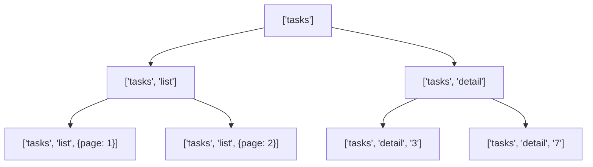
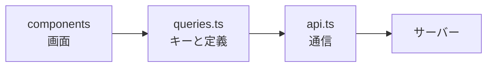

:::message
[この章の完成コード](https://github.com/nagahara-naoki/tanstack-textbook-samples/tree/chapter-11/tanstack-tasks-spa)と[第10章からの差分](https://github.com/nagahara-naoki/tanstack-textbook-samples/compare/chapter-10...chapter-11)を確認できます。`queries.ts`を新規作成し、各コンポーネントのQuery定義を置き換えます。
:::

ここまでの章で、`useQuery`をコンポーネントの中に直接書いてきました。動きはしますが、このまま画面が増えていくと問題が出ます。

同じデータを取るコードが画面ごとに散らばり、`queryKey`の書き方が微妙にずれ、`staleTime`を1か所だけ直し忘れる。よくある崩れ方です。この章では、Queryの定義を1か所にまとめる方法と、キーの設計を扱います。実務のコードとサンプルコードの差が、いちばん大きく出る部分です。

## queryKeyの設計

まず、キーの付け方を決めます。ここまで、こんなキーを使ってきました。

```ts
['tasks']                    // 一覧
['tasks', { page: 2 }]       // 2ページ目の一覧
['tasks', '3']               // ID:3の詳細
```

一見よさそうですが、困った点があります。一覧と詳細が同じ階層に並んでいるため、区別がつかないのです。`['tasks', '3']`と`['tasks', { page: 2 }]`は、2番目の要素の型が違うだけです。

「一覧だけをまとめて無効化したい」という要求が来たとき、この構造では表現できません。`['tasks']`を指定すれば詳細まで巻き込みます。

そこで、種類を表す要素を挟みます。

```ts
['tasks']                          // タスク機能のすべて
['tasks', 'list']                  // 一覧すべて
['tasks', 'list', { page: 2 }]     // 特定の条件の一覧
['tasks', 'detail']                // 詳細すべて
['tasks', 'detail', '3']           // 特定の詳細
```

前方一致の性質と組み合わせると、無効化の範囲を自由に選べます。



`['tasks', 'list']`を無効化すれば、どの条件の一覧もまとめて古くなります。詳細のキャッシュは無傷です。

:::message
`queryKey`にオブジェクトを含めるとき、キーの順番は気にしなくてよいようになっています。`{ page: 2, status: 'todo' }`と`{ status: 'todo', page: 2 }`は同じキーとして扱われます。TanStack Queryが、オブジェクトのキーを並べ替えてから比較しているためです。

一方、配列の順番は意味を持ちます。`['tasks', 'list']`と`['list', 'tasks']`は別物です。
:::

## Query Key Factory

キーの文字列を手で書いていると、必ずどこかで綴りがずれます。`'detail'`と`'details'`が混在した瞬間、キャッシュは静かに二重化します。

キーを作る関数を1か所に集めます。`src/features/tasks/queries.ts`を新規作成してください。この形をQuery Key Factoryと呼びます。

```ts:src/features/tasks/queries.ts
export const taskKeys = {
  all: ['tasks'] as const,
  lists: () => [...taskKeys.all, 'list'] as const,
  list: (params: TaskListParams) => [...taskKeys.lists(), params] as const,
  details: () => [...taskKeys.all, 'detail'] as const,
  detail: (id: string) => [...taskKeys.details(), id] as const,
};
```

上の階層を組み合わせて下の階層を作っているので、`all`を変えれば全部が追随します。`as const`を付けているのは、配列の中身を具体的な値として型に残すためです。

使うときは、こう書きます。

```ts
queryClient.invalidateQueries({ queryKey: taskKeys.lists() });  // 一覧だけ
queryClient.invalidateQueries({ queryKey: taskKeys.all });      // タスク関連すべて
queryClient.removeQueries({ queryKey: taskKeys.detail('3') });  // 特定の詳細を破棄
```

文字列がコードから消えました。綴り間違いは型エラーになります。

## queryOptionsで定義をまとめる

キーが整理できたら、次はQueryの定義そのものです。`queryKey`と`queryFn`と`staleTime`は、いつも同じ組み合わせで使われます。先ほど作った`queries.ts`へ、importと`taskQueries`を追記します。

そのための道具が`queryOptions`です。

```ts:src/features/tasks/queries.ts
import { queryOptions } from '@tanstack/react-query';
import { fetchTask, fetchTasks, type TaskListParams } from './api';

export const taskQueries = {
  list: (params: TaskListParams = {}) =>
    queryOptions({
      queryKey: taskKeys.list(params),
      queryFn: () => fetchTasks(params),
      staleTime: 30_000,
    }),

  detail: (id: string) =>
    queryOptions({
      queryKey: taskKeys.detail(id),
      queryFn: () => fetchTask(id),
      staleTime: 60_000,
    }),
};
```

コンポーネント側では、各`useQuery`のオプションを`taskQueries`へ置き換えます。次は置き換え後の利用例です。

```tsx
export function TaskListWithQueries({ page }: { page: number }) {
  const { data, isPending, isError } = useQuery(taskQueries.list({ page, perPage: 20 }));

  if (isPending) return <p>読み込み中...</p>;
  if (isError) return <p>エラーが発生しました</p>;

  return (
    <ul>
      {data.items.map((task) => (
        <li key={task.id}>{task.title}</li>
      ))}
    </ul>
  );
}
```

`useQuery`に渡すのは1つの式だけになりました。`staleTime`を30秒から1分へ変えたいときは、`queries.ts`の1行を直すだけです。画面をすべて探し回る必要はありません。

### queryOptionsは何をしているのか

`queryOptions`は、実行時にはほぼ何もしません。渡したオブジェクトをそのまま返すだけです。仕事は型の世界にあります。

`queryKey`と`queryFn`の対応を型として記録するので、そのオプションを`useQuery`に渡したとき、`data`の型が正確に決まります。オブジェクトを直接書いて渡すのに比べ、次の関数でも型が効くようになります。

```ts
// どれも data の型が TaskListResult / Task として推論される
useQuery(taskQueries.list());
useSuspenseQuery(taskQueries.detail('3'));
queryClient.prefetchQuery(taskQueries.detail('3'));
queryClient.getQueryData(taskQueries.detail('3').queryKey);
```

とくに最後の`getQueryData`が効きます。キーだけを渡す方式では戻り値が`unknown`になりがちですが、`queryOptions`が持っている型情報のおかげで`Task | undefined`として受け取れます。

:::message
`queryOptions`はv5系の途中で追加された道具です。それ以前は、キーとフェッチ関数をまとめたカスタムフックを書く方法が主流でした。カスタムフックも有効ですが、`queryOptions`にはRouterのLoaderやprefetchでも同じ定義を使い回せる強みがあります。RouterとQueryを連携させる章で、この効果がはっきりします。
:::

## カスタムフックへ切り出すかどうか

`queryOptions`があれば、カスタムフックは必須ではありません。それでも作る価値があるのは、次のような場合です。

```ts
// 引数の変換や、複数のQueryの組み合わせを隠したいとき
export function useTaskDetail(id: string) {
  return useQuery(taskQueries.detail(id));
}
```

判断の目安は、「そのフックが何かを足しているか」です。`queryOptions`をそのまま`useQuery`に渡すだけのフックは、名前を1つ増やしただけで得るものがありません。

一方、次のような場合は切り出す価値があります。

- `select`による加工を、複数の画面で共有したい
- 複数のQueryをまとめて1つの結果として返したい
- コンポーネントが知る必要のない引数（現在のユーザーIDなど）を内部で解決したい

## selectで必要な形に絞る

`select`は、キャッシュのデータをコンポーネントに渡す前に加工するオプションです。

```tsx
const { data } = useQuery({
  ...taskQueries.list({ perPage: 100 }),
  select: (result) => result.items.filter((task) => task.status === 'todo').map((task) => task.title),
});
// data の型は string[] | undefined
```

キャッシュには元のデータがそのまま入ります。加工結果はコンポーネントに渡すときだけ作られます。だから、同じキャッシュから別の画面が別の形を取り出せます。

`select`には、再レンダリングを減らす効果もあります。TanStack Queryは、`select`の結果が前回と変わらなければ再レンダリングを起こしません。

たとえば「タスクの件数だけ」を表示するコンポーネントを考えます。

```tsx
const { data: total } = useQuery({
  ...taskQueries.list(),
  select: (result) => result.total,
});
```

タスクの内容が書き換わっても、件数が同じなら再レンダリングは起きません。一覧の一部が更新されるたびに件数表示まで描き直す、という無駄を避けられます。

:::message
`filter`や`map`は毎回新しい配列を返しますが、それだけでこの最適化が壊れるわけではありません。TanStack Queryは、`select`の**結果に対しても**構造的共有（structural sharing）を働かせます。中身が前回と等しければ前回の参照がそのまま使われるので、配列を返しても再レンダリングは起きません。

ただし条件があります。構造的共有が働くのは、JSONとして表せるデータだけです。`Date`やクラスのインスタンスを返すと、毎回別物として扱われます。また、数万件を超えるような大きなデータでは、比較そのものが負荷になることもあります。

もう1つ、コンポーネントの中にインラインで書いた`select`関数は、毎レンダリング再実行されます。再レンダリングは防げますが、加工の計算自体は走ります。重い加工なら、関数を`useCallback`で包むか、`queryOptions`側に持たせてください。
:::

## 先読みで待ち時間を消す

一覧から詳細へ移るとき、リンクにマウスを乗せた時点で取得を始めておけば、クリックしたときにはデータが揃っています。

```tsx
const queryClient = useQueryClient();

<a
  href={`/tasks/${id}`}
  onMouseEnter={() => {
    queryClient.prefetchQuery(taskQueries.detail(id));
  }}
>
  {title}
</a>
```

`prefetchQuery`は、キャッシュにデータがあって`fresh`なら何もしません。だから、マウスを何度も往復させても通信は増えません。

先読みは、TanStack Routerと組み合わせるとさらに強力になります。Routerには、リンクの近くにマウスが来た時点でルート全体のデータを読み込む仕組みがあります。「Loaderによるデータ取得」の章で扱います。

## initialDataとplaceholderDataの違い

一覧のデータを持っているなら、詳細画面の初期表示にそれを使えます。タイトルと担当者は一覧にも入っているので、詳細を取得する前から表示できます。

これを実現するオプションが2つあり、性質が違います。

| | `initialData` | `placeholderData` |
|---|---|---|
| キャッシュに入るか | 入る | 入らない |
| 本物のデータとして扱われるか | 扱われる | 扱われない |
| `staleTime`の対象か | なる（古くなるまで再取得しない） | 関係ない（常に裏で取得する） |
| 見分ける手段 | なし | `isPlaceholderData` |

`initialData`は「これは本物のデータです」という宣言です。キャッシュに保存され、`staleTime`が効きます。不完全なデータを渡すと、それが本物として居座ります。

`placeholderData`は「本物が来るまでの繕い」です。キャッシュを汚さず、必ず裏で取得が走ります。

一覧から詳細の仮表示を作る場合は、`placeholderData`が適しています。一覧の要素には`description`が入っていない、といった欠けがあるためです。

```tsx
const { data, isPlaceholderData } = useQuery({
  ...taskQueries.detail(id),
  placeholderData: () => {
    const list = queryClient.getQueryData<TaskListResult>(
      taskKeys.list({ page, perPage: 20 }),
    );
    return list?.items.find((task) => task.id === id);
  },
});
```

クリックした瞬間にタイトルが表示され、400ミリ秒後に説明文が埋まります。`isPlaceholderData`が`true`の間は、薄く表示するなどして未確定であることを伝えます。

## 層を分ける

最後に、ファイルの配置を整理します。ここまでで、タスク機能は3つの層に分かれました。

```text
src/features/tasks/
├── types.ts      … 型の定義
├── api.ts        … 通信する関数（TanStack Queryを知らない）
├── queries.ts    … キーとQueryの定義（TanStack Queryを知っている）
└── components/   … 画面（queries.tsだけを使う）
```



この向きを守ることに意味があります。`api.ts`はTanStack Queryをimportしません。純粋な通信の関数なので、テストでも直接呼べますし、将来ライブラリを乗り換えても書き直しが不要です。

コンポーネントは`api.ts`を直接呼びません。`queries.ts`を経由させることで、`staleTime`やキーの設計を1か所に閉じ込められます。

Mutationの定義も、同じ考え方で`mutations.ts`に集められます。ただ、Mutationはキャッシュの無効化という画面側の関心と結びつきやすいので、無理にまとめず、コンポーネントの近くに置く判断もあります。

## この章の完成コード

キーと取得条件を`src/features/tasks/queries.ts`へ集め、コンポーネントからAPI関数への直接参照を外しました。Query編で使うキーの全体像は、[`chapter-11`](https://github.com/nagahara-naoki/tanstack-textbook-samples/tree/chapter-11/tanstack-tasks-spa)で確認できます。

## まとめ

Queryのキーと取得条件を1か所に集めると、画面ごとの定義ずれを防げます。

- `queryKey`には種類を表す要素を挟みます。`['tasks', 'list', 条件]`のような階層にすると、無効化の範囲を選べます。
- キーを作る関数を1か所に集めます（Query Key Factory）。文字列をコードから消せます。
- `queryOptions`でキー・フェッチ関数・オプションをまとめます。実行時の仕事はほぼなく、型を運ぶための道具です。
- カスタムフックは、何かを足すときだけ作ります。渡すだけのフックは名前が増えるだけです。
- `select`で必要な形に絞ると、無駄な再レンダリングを減らせます。結果にも構造的共有が働くため、配列を返しても中身が同じなら再描画されません。
- `prefetchQuery`で先読みできます。`fresh`なキャッシュがあれば通信しません。
- `initialData`は本物として保存され、`placeholderData`は繕いとして扱われます。欠けのあるデータには`placeholderData`を使います。
- `components → queries.ts → api.ts`の向きを守ると、通信の層がライブラリから独立します。

次章では、Query編の締めとしてエラー処理を扱います。再試行の設計、Error Boundaryとの連携、そしてSuspenseによる読み込み表示です。
