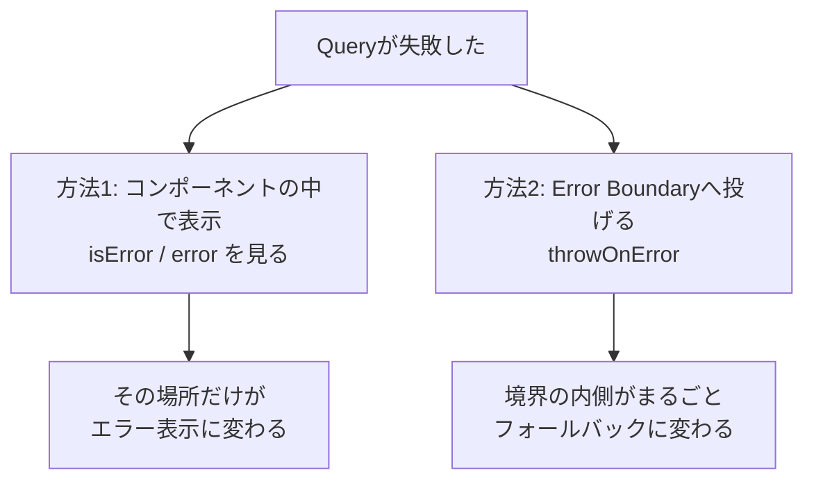

Query編の最後は、うまくいかなかったときの話です。

通信は失敗します。サーバーが落ちる、電波が切れる、権限が足りない、データが消えている。それぞれ違う失敗なので、扱いも変わります。すべてを「エラーが発生しました」で片付けると、ユーザーは次に何をすればよいのかわかりません。

この章では、失敗の種類を見分ける方法、再試行の設計、そしてエラーと読み込み表示をコンポーネントの外に出す方法を扱います。

## エラーの型を作る

まず、失敗の種類を見分けられるようにします。いまの`api.ts`は、失敗をすべて同じ`Error`にしています。

```ts
if (!response.ok) {
  throw new Error('タスクの取得に失敗しました');
}
```

これでは、404（存在しない）と500（サーバーの障害）を区別できません。ステータスコードを持つエラーの型を作ります。

```ts:src/features/tasks/api.ts
export class ApiError extends Error {
  status: number;

  constructor(message: string, status: number) {
    super(message);
    this.name = 'ApiError';
    this.status = status;
  }
}
```

そして、通信の共通処理をひとつにまとめます。

```ts:src/features/tasks/api.ts
export async function request<T>(path: string, init?: RequestInit): Promise<T> {
  const response = await fetch(path, init);

  if (!response.ok) {
    const body = await response.json().catch(() => null);
    throw new ApiError(body?.message ?? '通信に失敗しました', response.status);
  }

  if (response.status === 204) return undefined as T;
  return response.json();
}
```

サーバーが返したメッセージを使い、無ければ既定の文言に倒します。`catch(() => null)`を挟んでいるのは、エラー応答の本文がJSONでない場合（プロキシが返すHTMLなど）に、解析の失敗で例外が変わってしまうのを防ぐためです。

204（本文なし）を特別扱いしているのは、`response.json()`が本文の無い応答で失敗するためです。削除の応答がここに当たります。

これで、各API関数が1行になります。章をまたいで少しずつ増えてきた6本を、ここでまとめて整えます。

```ts:src/features/tasks/api.ts
// import に TaskInput を足す
import type { Task, TaskInput } from './types';

export function fetchTasks(params: TaskListParams = {}): Promise<TaskListResult> {
  return request(`/api/tasks?${toSearchParams(params)}`);
}

export function fetchTaskFeed(params: TaskFeedParams = {}): Promise<TaskFeedResult> {
  return request(`/api/tasks/feed?${toSearchParams(params)}`);
}

export function fetchTask(id: string): Promise<Task> {
  return request(`/api/tasks/${id}`);
}

export function createTask(input: TaskInput): Promise<Task> {
  return request('/api/tasks', {
    method: 'POST',
    headers: { 'Content-Type': 'application/json' },
    body: JSON.stringify(input),
  });
}

export function updateTask(id: string, patch: Partial<TaskInput>): Promise<Task> {
  return request(`/api/tasks/${id}`, {
    method: 'PATCH',
    headers: { 'Content-Type': 'application/json' },
    body: JSON.stringify(patch),
  });
}

export function deleteTask(id: string): Promise<void> {
  return request(`/api/tasks/${id}`, { method: 'DELETE' });
}
```

`response.ok`の確認、JSONの解析、エラーへの変換が`request`の中に1度だけ書かれ、各関数はパスとメソッドだけを持つ形になりました。

`createTask`が`TaskInput`、`updateTask`が`Partial<TaskInput>`を受け取っています。作成では`title`が必須で、更新では触った項目だけを送るからです。モックのハンドラと同じ約束です。

:::message
`ApiError`の書き方に、TypeScriptの制約が関わっています。コンストラクタの引数に`readonly`や`public`を付けて、そのままプロパティにする書き方（パラメータプロパティ）は使えません。「開発環境の準備」の章で触れた`erasableSyntaxOnly`が有効なため、TypeScript固有の実行時コードを生む構文が禁止されているからです。プロパティの宣言と代入を、自分で書く必要があります。
:::

## 再試行を設計する

TanStack Queryは、既定で3回まで再試行します。間隔は少しずつ延びていきます（指数バックオフ）。

この既定は、通信の一時的な不調に対しては有効です。ただ、すべての失敗に再試行が有効なわけではありません。

| 失敗の種類 | 再試行の意味 |
|---|---|
| ネットワークの断絶、タイムアウト | ある。時間が解決する可能性が高い |
| 500、502、503（サーバー側の障害） | ある。復旧するかもしれない |
| 401、403（認証・権限） | ない。何度やっても同じ |
| 404（存在しない） | ない。無いものは無い |
| 422（入力の誤り） | ない。入力を直すまで通らない |

4回叩いて4回同じ404が返ってくる間、ユーザーは待たされます。無駄な待ち時間です。

`retry`に関数を渡して、条件を絞ります。

```tsx
useQuery({
  ...taskQueries.detail(id),
  retry: (failureCount, error) => {
    // 4xxは何度やっても同じなので、すぐ諦める
    if (error instanceof ApiError && error.status >= 400 && error.status < 500) {
      return false;
    }
    return failureCount < 3;
  },
});
```

`failureCount`は、これまでに失敗した回数です。`true`を返せば再試行し、`false`を返せばそこで確定します。

この判定はアプリ全体で共通なので、QueryClientの既定に書くのが実際的です。

```tsx:src/main.tsx
const queryClient = new QueryClient({
  defaultOptions: {
    queries: {
      staleTime: 60_000,
      retry: (failureCount, error) => {
        if (error instanceof ApiError && error.status >= 400 && error.status < 500) return false;
        return failureCount < 3;
      },
    },
  },
});
```

Mutationは既定で再試行しません。同じ処理を2回実行すると副作用が二重になるためです。作成のリクエストは、成功したかどうかがわからない状態で送り直すべきではありません。

### 間隔の既定値

再試行の間隔は、回数に応じて倍々に延びます。既定の計算式は`Math.min(1000 * 2 ** 失敗回数, 30000)`です。1秒、2秒、4秒と延び、上限は30秒です。

障害が起きているサーバーに、一定間隔で叩き続けるのは追い打ちになります。間隔を空けることで、復旧の余地を残す設計です。急いで確認したい場面では`retryDelay`を短くできますが、既定のままで困ることはほとんどありません。

### オフラインのときは失敗しない

ネットワークが切れている状態でQueryが動くと、どうなるでしょうか。失敗して再試行が3回走る、という動きにはなりません。

TanStack Queryは、オフラインを検知すると取得を**保留**します。前章で出てきた`fetchStatus`の`paused`がこの状態です。`status`は`pending`のまま、通信はしていません。そして接続が戻った瞬間に実行されます。

```tsx
const { status, fetchStatus } = useQuery(taskQueries.list());
// オフライン時: status = 'pending' / fetchStatus = 'paused'
```

Mutationも同じように保留され、復帰後に送信されます。オフラインでの操作を、失敗として扱わずに預かってくれます。

エラー画面を出すべきかどうかを判断するときは、`isError`だけでなく`fetchStatus === 'paused'`も見て、「オフラインです」という別の案内を出すと親切です。

## エラーの見せ方は2通り

エラーを画面に出す方法には、性質の違う2つの選択肢があります。



### コンポーネントの中で表示する

ここまで使ってきた方法です。`isError`と`error`を見て、自分で分岐します。

```tsx
const { data, isPending, isError, error } = useQuery(taskQueries.detail(id));

if (isPending) return <p>読み込み中...</p>;
if (isError) {
  if (error instanceof ApiError && error.status === 404) {
    return <p>このタスクは削除されています</p>;
  }
  return <p>読み込みに失敗しました: {error.message}</p>;
}
```

失敗の種類に応じて文言を変えられるのが強みです。404なら「削除されています」、403なら「権限がありません」と伝えられます。

弱点は、書く場所が増えることです。データを取得するすべてのコンポーネントに、同じような分岐が並びます。

### Error Boundaryへ投げる

もう1つは、Reactの仕組みに任せる方法です。`throwOnError`を指定すると、Queryのエラーがレンダリング中の例外として投げられ、上位のError Boundaryが受け取ります。

```tsx
useQuery({
  ...taskQueries.detail(id),
  throwOnError: true,
});
```

条件を付けることもできます。想定内のエラーは自分で処理し、想定外のものだけ上に投げる書き方です。

```tsx
useQuery({
  ...taskQueries.detail(id),
  // サーバー側の障害だけを境界に任せる
  throwOnError: (error) => error instanceof ApiError && error.status >= 500,
});
```

Error Boundaryは自分で書くこともできますが、`react-error-boundary`を使うと短く済みます。

```sh
npm i react-error-boundary
```

```tsx
import { ErrorBoundary, type FallbackProps } from 'react-error-boundary';

function ErrorFallback({ error, resetErrorBoundary }: FallbackProps) {
  return (
    <div role="alert">
      <p>表示できませんでした</p>
      <p>{error instanceof Error ? error.message : '不明なエラー'}</p>
      <button type="button" onClick={resetErrorBoundary}>再試行</button>
    </div>
  );
}
```

### 再試行ボタンを機能させる

ここに、ひとつ落とし穴があります。`resetErrorBoundary`はError Boundaryの状態を戻すだけで、Queryのエラーは消えません。ボタンを押しても、また同じエラーが投げられます。

両方をまとめてリセットするために、`QueryErrorResetBoundary`を使います。

```tsx
import { QueryErrorResetBoundary } from '@tanstack/react-query';

export function TaskDetailPage({ id }: { id: string }) {
  return (
    <QueryErrorResetBoundary>
      {({ reset }) => (
        <ErrorBoundary onReset={reset} FallbackComponent={ErrorFallback}>
          <Suspense fallback={<p>読み込み中...</p>}>
            <SuspenseTaskDetail id={id} />
          </Suspense>
        </ErrorBoundary>
      )}
    </QueryErrorResetBoundary>
  );
}
```

`onReset`に`reset`を渡すと、境界が戻るときにQueryのエラー状態も一緒にクリアされます。これで再試行ボタンが本当に再試行になります。

## Suspenseに読み込みを任せる

`useSuspenseQuery`を使うと、読み込み中の分岐もコンポーネントの外に出せます。

```tsx
import { useSuspenseQuery } from '@tanstack/react-query';

export function SuspenseTaskDetail({ id }: { id: string }) {
  const { data } = useSuspenseQuery(taskQueries.detail(id));
  return <h2>{data.title}</h2>;
}
```

`isPending`の分岐が消えました。`data`は常に存在する型になります。データが無ければコンポーネントは中断（suspend）し、上位の`<Suspense>`のフォールバックが表示されるからです。

読み込みとエラーの表示が、`TaskDetailPage`のような外側に集まります。データを使うコンポーネントは、データがある前提だけを書きます。

### useQueryとの使い分け

便利に見えますが、`useSuspenseQuery`にはできないことがあります。

| | `useQuery` | `useSuspenseQuery` |
|---|---|---|
| `data`の型 | `T \| undefined` | `T`（常に存在） |
| 読み込み中の分岐 | 自分で書く | `<Suspense>`に任せる |
| `enabled` | 使える | **使えない** |
| `placeholderData` | 使える | 使えない |
| エラー | `isError`で受けられる | 必ず投げられる |

`enabled`が使えないのが、いちばん影響します。条件によって取得するかどうかを変える画面では、`useSuspenseQuery`を選べません。「選択されたタスクの詳細」のような画面は`useQuery`のままです。

:::message alert
同じコンポーネントの中で`useSuspenseQuery`を2回呼ぶと、通信が直列になります。1つめが中断した時点でコンポーネントの実行が止まるため、2つめの呼び出しに到達しないからです。

並列にしたい場合は`useSuspenseQueries`を使います。

```tsx
const [first, second] = useSuspenseQueries({
  queries: [taskQueries.detail(idA), taskQueries.detail(idB)],
});
```
:::

## 通知をまとめて設計する

失敗のたびにトーストを出したい、という要件はよくあります。すべての`useQuery`に`onError`を書くのは現実的ではありません。

QueryClientを作るときに、キャッシュ全体のコールバックを設定できます。

```tsx:src/main.tsx
import { MutationCache, QueryCache, QueryClient } from '@tanstack/react-query';

const queryClient = new QueryClient({
  queryCache: new QueryCache({
    onError: (error, query) => {
      // 通知したいQueryだけメタ情報で印を付けておく
      if (query.meta?.errorMessage) {
        showToast(String(query.meta.errorMessage));
      }
    },
  }),
  mutationCache: new MutationCache({
    onError: (error) => {
      showToast(error instanceof ApiError ? error.message : '処理に失敗しました');
    },
  }),
});
```

`showToast`は、自分で用意する通知の関数です。トーストのライブラリでも、自作の小さな仕組みでもかまいません。

Queryの失敗を全部通知すると、画面にエラー表示が出ているのにトーストまで重なって、うるさくなります。`meta`で印を付けたものだけ通知する形が扱いやすいところです。

```tsx
useQuery({
  ...taskQueries.list(),
  meta: { errorMessage: '一覧の更新に失敗しました' },
});
```

一方、Mutationの失敗はほぼ常に通知したいものです。ユーザーが操作した直後なので、結果を伝える責任があります。

エラー処理の全体像を整理すると、こうなります。

| 層 | 担当 |
|---|---|
| `api.ts` | HTTPの失敗を`ApiError`に変換する |
| QueryClientの既定 | 再試行の条件を決める |
| コンポーネント | 想定内のエラー（404、403）の文言を出す |
| Error Boundary | 想定外のエラーの画面を出す |
| キャッシュのコールバック | トーストなどの通知を出す |

## 確かめてみる

モックの`__fail`を使えば、任意のステータスで失敗させられます。`api.ts`の`fetchTask`を一時的に書き換えて、挙動の違いを見てください。

```ts
// 404を返させる
export function fetchTask(id: string): Promise<Task> {
  return request(`/api/tasks/${id}?__fail=404`);
}
```

`retry`の条件を絞る前は、Devtoolsで4回の試行が並びます。絞ったあとは1回で確定します。表示も「読み込みに失敗しました」から「このタスクは削除されています」に変わります。

`__fail=500`に変えると、`throwOnError`の条件に合致してError Boundaryのフォールバックが出ます。同じ失敗でも、種類によって行き先が変わることを目で確認できます。

ブラウザの開発者ツールでネットワークをオフラインにする実験もしてください。エラーにならず、`paused`のまま待つ様子が観察できます。

## まとめ

この章では、エラー処理と読み込み表示の設計を扱いました。

- HTTPの失敗を`ApiError`に変換し、ステータスコードで種類を見分けられるようにします。
- 通信の共通処理を1つの関数にまとめると、各API関数が1行になります。ここで6本のAPI関数がそろいます。
- 再試行は既定で3回です。4xxのように何度やっても同じ失敗は、`retry`に関数を渡して即座に諦めます。
- Mutationは既定で再試行しません。副作用が二重になるためです。
- エラーの見せ方は、コンポーネント内で分岐する方法とError Boundaryへ投げる方法の2つです。
- `resetErrorBoundary`だけではQueryのエラーが残ります。`QueryErrorResetBoundary`と組み合わせます。
- `useSuspenseQuery`は読み込みの分岐を外に出せますが、`enabled`が使えません。
- 同じコンポーネントで`useSuspenseQuery`を並べると直列になります。並列にするなら`useSuspenseQueries`です。
- 通知はキャッシュのコールバックに集約します。Queryは`meta`で選び、Mutationは基本的に通知します。

ここまでで、サーバー状態の扱いはひととおり身につきました。次章から、状態の2つめの置き場所であるURLに移ります。TanStack Routerを導入し、型で守られたルーティングを組み立てます。
