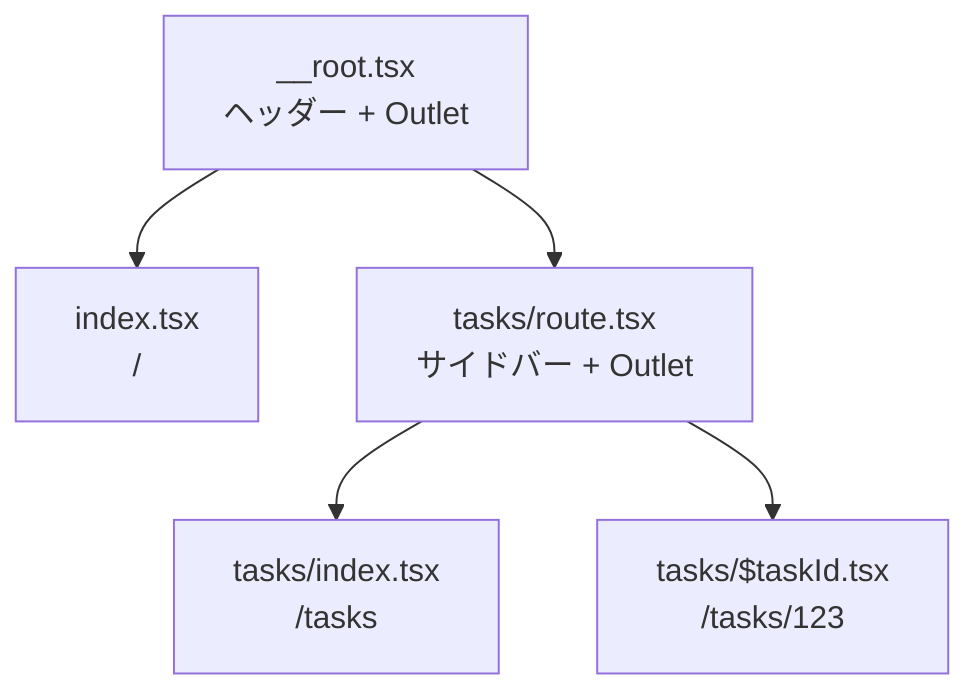

前章で、トップページとタスク一覧のルートを作りました。ここでは、URLに変数を含む詳細画面を追加し、画面のあいだを行き来する方法を扱います。

型がどこまで守ってくれるのかを、実際に間違ったコードを書いて確かめていきます。

## パスに変数を含める

タスクの詳細画面のURLは`/tasks/1`、`/tasks/2`のように変わります。この変わる部分をPath Params（パスパラメータ）と呼びます。

ファイル名の`$`で表します。

```tsx:src/routes/tasks/$taskId.tsx
import { createFileRoute } from '@tanstack/react-router';

export const Route = createFileRoute('/tasks/$taskId')({
  component: TaskDetailPage,
});

function TaskDetailPage() {
  const { taskId } = Route.useParams();
  return <h1>タスク {taskId}</h1>;
}
```

`Route.useParams()`で、パスの変数を受け取ります。返ってくるオブジェクトのキーは、ファイル名で決めた`taskId`です。

ここが型で守られる1つめの箇所です。

```tsx
const { taskID } = Route.useParams();
//      ^^^^^^ 型エラー: 'taskID' は存在しない
```

`useParams`の戻り値の型は、そのルートの定義から作られています。存在しないキーを取り出そうとすると、その場で赤くなります。文字列で`params.get('taskId')`と書いていた時代に比べると、間違える余地がありません。

### Routeオブジェクトから呼ぶ理由

`Route.useParams()`という書き方に注目してください。フックを直接importして呼ぶ形もあります。

```tsx
import { useParams } from '@tanstack/react-router';

// どのルートのパラメータかを指定する
const { taskId } = useParams({ from: '/tasks/$taskId' });
```

同じ結果ですが、`Route.useParams()`のほうが短く、`from`の指定を間違えません。ルートファイルの中では`Route.`から呼ぶのが基本です。

`from`を指定する形が必要になるのは、ルートファイルの外にあるコンポーネントです。詳細画面の中で使う部品を別ファイルに切り出したときは、そこから`Route`を参照できないので、`from`で場所を伝えます。

```tsx
// features/tasks/components/以下の共通部品
export function CurrentTaskId() {
  const { taskId } = useParams({ from: '/tasks/$taskId' });
  return <p>表示中のID: {taskId}</p>;
}
```

どのルートで使われるか決まっていない部品では、`strict: false`を指定します。

```tsx
export function MaybeTaskId() {
  // どのルートでも使える。ただし値の型は「あるかもしれない」になる
  const params = useParams({ strict: false });
  return <p>ID: {params.taskId ?? '（詳細画面ではない）'}</p>;
}
```

`strict: false`は型の保証を緩める指定です。ヘッダーのように、どの画面にも現れる部品でだけ使います。

## リンクの型チェック

一覧から詳細へリンクを張ります。

```tsx
<Link to="/tasks/$taskId" params={{ taskId: task.id }}>
  {task.title}
</Link>
```

`to`にはパスのパターンをそのまま書きます。`/tasks/1`のように組み立てた文字列ではありません。値は`params`で渡します。

この形には利点があります。パスの構造が変わったとき、たとえば`/tasks/$taskId`を`/projects/$projectId/tasks/$taskId`へ変えたとき、`to`と`params`の両方が型エラーになります。組み立てた文字列を渡していたら、何も起きずに壊れたリンクが残ります。

間違いを3つ試してみます。

```tsx
// ①存在しないパス
<Link to="/taks">一覧</Link>
//        ^^^^^ 型エラー

// ②paramsを忘れた
<Link to="/tasks/$taskId">詳細</Link>
//   型エラー: params が必要

// ③paramsのキーが違う
<Link to="/tasks/$taskId" params={{ id: task.id }}>詳細</Link>
//                                  ^^ 型エラー: taskId が必要
```

どれもコンパイル時に止まります。前章で`declare module`を書いたのは、この検査を効かせるためです。

:::message
`<Link>`は最終的に`<a>`を描画します。中クリックで新しいタブに開く、右クリックでURLをコピーする、といったブラウザの標準の振る舞いはそのまま使えます。`onClick`で`navigate`を呼ぶボタンにしてしまうと、これらが失われます。**リンクは`<Link>`、操作の結果として移動する場合だけ`navigate`**と使い分けてください。
:::

## プログラムから遷移する

フォームの送信が終わったあとに移動する、といった場合は`useNavigate`を使います。

```tsx
import { useNavigate } from '@tanstack/react-router';

export function CreateTaskAndGo() {
  const navigate = useNavigate();

  const { mutate, isPending } = useMutation({
    mutationFn: createTask,
    onSuccess: (created) => {
      navigate({ to: '/tasks/$taskId', params: { taskId: created.id } });
    },
  });

  return (
    <button type="button" disabled={isPending} onClick={() => mutate({ title: '新しいタスク' })}>
      作成して詳細へ
    </button>
  );
}
```

`navigate`に渡すオブジェクトは、`<Link>`のpropsと同じ形です。`to`、`params`、そして次章で扱う`search`が使えます。型検査も同じように効きます。

履歴を残したくない場合は`replace: true`を渡します。ログイン後にログイン画面へ戻れないようにする、といった場面で使います。

```tsx
navigate({ to: '/tasks', replace: true });
```

1つ前に戻るだけなら、履歴を直接操作します。

```tsx
import { useRouter } from '@tanstack/react-router';

export function BackButton() {
  const router = useRouter();
  return (
    <button type="button" onClick={() => router.history.back()}>
      戻る
    </button>
  );
}
```

### 現在地からの相対的な遷移

いま開いているルートを基準に移動することもできます。`from`で基準を指定します。

```tsx
// 詳細画面から、同じ階層の一覧へ
navigate({ from: '/tasks/$taskId', to: '../' });
```

ただ、相対指定はコードを読むときに現在地を追う必要があります。絶対パスで書けるなら、そのほうが読みやすくなります。共通部品の中でどのルートから呼ばれるか分からない場合に限って使うのが実際的です。

### Linkに渡せるもの

`<Link>`のpropsを、よく使うものから整理します。

| props | 役割 |
|---|---|
| `to` | 移動先のパスのパターン |
| `params` | パスの変数の値 |
| `search` | 検索条件（次章で扱う） |
| `hash` | URLの`#`以降 |
| `replace` | 履歴を積まずに置き換える |
| `activeProps` | 現在地のときに適用するprops |
| `activeOptions` | 現在地の判定方法 |
| `preload` | 先読みの方式（`'intent'`など） |
| `disabled` | リンクを無効にする |
| `resetScroll` | 遷移時にスクロール位置を先頭へ戻すか |

`resetScroll`は、既定で有効です。画面を移ったら先頭から見せる、という自然な動きになっています。同じ一覧の中でページを送るだけのリンクでは、`resetScroll: false`にしてスクロール位置を保つほうが親切な場合もあります。

## レイアウトを共有する

`/tasks`と`/tasks/123`で、サイドバーを共通にしたいとします。ルートを入れ子にすれば実現できます。

`tasks/route.tsx`というファイルを作ります。ディレクトリと同じ名前の`route.tsx`が、そのディレクトリ配下の共通レイアウトになります。

```tsx:src/routes/tasks/route.tsx
import { createFileRoute, Link, Outlet } from '@tanstack/react-router';

export const Route = createFileRoute('/tasks')({
  component: TasksLayout,
});

function TasksLayout() {
  return (
    <div>
      <aside>
        <h2>タスク</h2>
        <Link to="/tasks" activeOptions={{ exact: true }} activeProps={{ className: 'is-active' }}>
          一覧
        </Link>
      </aside>

      <section>
        <Outlet />
      </section>
    </div>
  );
}
```

これで、ルートの階層はこうなります。



`/tasks/123`を開くと、`__root`のヘッダー、`tasks/route`のサイドバー、`$taskId`の本文が、外側から順に入れ子で描画されます。

大事なのは、共通部分が**再描画されない**ことです。一覧から詳細へ移っても、サイドバーはそのまま残ります。画面全体が作り直されるわけではないので、スクロール位置や入力中の値も保たれます。

### インデックスルートの役割

`tasks/index.tsx`と`tasks/route.tsx`の違いを整理します。

| ファイル | 担当 |
|---|---|
| `tasks/route.tsx` | `/tasks`配下すべての外枠（`/tasks`と`/tasks/123`の両方で描画） |
| `tasks/index.tsx` | `/tasks`ちょうどのときだけ描画される中身 |

`index.tsx`は、そのディレクトリの「ちょうどそのURL」を担当します。`route.tsx`だけを置いて`index.tsx`を作らないと、`/tasks`を開いたとき`Outlet`の中身が空になります。

### URLに出したくないグループ

「ログインが必要な画面」をまとめたいが、URLに`/auth`のような階層は増やしたくない。この要求には、`_`で始まるレイアウトが応えます。

```text
routes/
├── _authenticated.tsx           … 認証チェックとレイアウト
├── _authenticated/
│   ├── settings.tsx             … /settings
│   └── reports.tsx              … /reports
└── login.tsx                    … /login
```

`_authenticated`はURLに現れません。`/settings`と`/reports`が、共通の親を持つだけです。この親に認証の検査を書けば、配下すべてが守られます。実装は「認証とアクセス制御」の章で行います。

## 現在地の表示を正しくする

`activeProps`には、注意すべき挙動があります。

```tsx
<Link to="/tasks" activeProps={{ className: 'is-active' }}>一覧</Link>
```

これだけ書くと、`/tasks/123`を開いているときも「一覧」が現在地として強調されます。`/tasks`は`/tasks/123`の前方部分に一致するためです。

親のリンクを常に強調したい場合はこのままでよく、ちょうど一致したときだけにしたい場合は`activeOptions`を足します。

```tsx
<Link to="/tasks" activeOptions={{ exact: true }} activeProps={{ className: 'is-active' }}>
  一覧
</Link>
```

パンくずリストのように「経路上のすべてを強調したい」場合と、タブのように「1つだけ強調したい」場合で、使い分けます。

## 存在しないURLを扱う

`/foo`のような未定義のURLは、`notFoundComponent`が受け止めます。ルートごとに指定できます。

```tsx
// アプリ全体の受け皿（__root.tsx）
export const Route = createRootRoute({
  component: RootLayout,
  notFoundComponent: () => <p>ページが見つかりません</p>,
});
```

「URLは正しいが、データが存在しない」場合も同じ仕組みで扱えます。`/tasks/9999`のように、パスの形は合っているのにタスクが無いときです。この場合は、データ取得の中から`notFound()`を投げます。

```tsx
import { notFound } from '@tanstack/react-router';

// loaderの中で
if (!task) throw notFound();
```

投げると、そのルートの`notFoundComponent`（無ければ親のもの）が表示されます。詳細は「Loaderによるデータ取得」の章で扱います。

## 型が守れないところ

型検査が働くのは、アプリの内側のルートだけです。境界も知っておきましょう。

外部サイトへのリンクは、`<Link>`の対象ではありません。素直に`<a>`を使います。

```tsx
<a href="https://tanstack.com/" target="_blank" rel="noreferrer">
  公式サイト
</a>
```

サーバーから受け取ったURL文字列へ移動する場合も、型では守れません。文字列がルートに一致するかは実行時にしかわかりません。この場合は、遷移先を限られた候補に変換してから渡すのが安全です。

```tsx
// サーバーから来た文字列を、そのまま to に渡すのは避ける
const target = kind === 'task' ? '/tasks/$taskId' : '/';
```

候補に絞れない場合、つまり任意のパス文字列へ移動する必要がある場合は、`navigate`ではなく履歴を直接操作します。

```tsx
const router = useRouter();
router.history.push(pathFromServer); // 型検査は効かない
```

`to`はルートの一覧から選ぶ型になっているので、`string`をそのまま渡すと型エラーです。`history`を使えば移動できますが、そのぶん値が妥当かどうかは自分で確かめる必要があります。「認証とアクセス制御」の章で、ログイン後の戻り先を扱うときに実例が出てきます。

型が守るのは「書き間違い」です。実行時に決まる値の正しさは、依然として自分で確かめる必要があります。

## まとめ

この章では、型で守られたルーティングを組み立てました。

- パスの変数はファイル名の`$`で表し、`Route.useParams()`で受け取ります。キー名は型で守られます。
- ルートファイルの中では`Route.useParams()`、外の部品では`useParams({ from })`を使います。どこでも使う部品だけ`strict: false`にします。
- `<Link>`の`to`にはパスのパターンを書き、値は`params`で渡します。組み立てた文字列は渡しません。
- 存在しないパス、`params`の忘れ、キー名の誤りは、すべてコンパイルエラーになります。
- リンクは`<Link>`で書きます。`navigate`は操作の結果として移動する場合に使います。
- ディレクトリと同名の`route.tsx`が共通レイアウトになり、`index.tsx`がそのURLちょうどの中身になります。
- 共通レイアウトは遷移しても再描画されません。サイドバーの状態が保たれます。
- `_`で始まるレイアウトは、URLを増やさずに画面をグループ化できます。
- `activeProps`は前方一致で働きます。ちょうど一致に絞るには`activeOptions={{ exact: true }}`を足します。

次章では、いよいよURLに状態を載せます。検索条件やページ番号を`useState`からURLへ引っ越し、型とスキーマで守ります。
