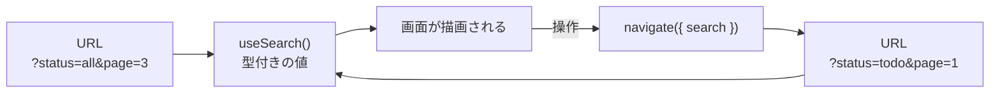

「フロントエンドの状態を分類する」の章で、URL状態という分類を立てました。この章がその回収です。

ページネーションの章で`useState`に置いたページ番号を、URLへ引っ越します。あわせて絞り込み条件も載せます。TanStack Routerの機能の中で、この章で扱うSearch Paramsの扱いが、いちばん他のライブラリと差がつく部分です。

## URLは状態の置き場所である

`/tasks?status=todo&page=2`というURLを考えます。この文字列は、次の3つを同時に果たします。

- **共有できる**: URLを送るだけで、相手に同じ画面を見せられます。
- **リロードに耐える**: 再読み込みしても条件が残ります。
- **戻るが効く**: ブラウザの履歴に残るので、直前の条件に戻れます。

`useState`で持った条件には、この3つがありません。「絞り込んだ結果のスクリーンショットを撮って共有する」という運用が生まれるのは、URLに状態が載っていないアプリです。

一方で、URLに載せるには面倒がついてきます。URLは文字列なので、読み出すときに変換と検証が必要です。

```tsx
// 素朴に読み出すと、こうなる
const params = new URLSearchParams(location.search);
const page = Number(params.get('page') ?? '1'); // NaNになりうる
const status = params.get('status') ?? 'all';    // 想定外の値が入りうる
```

`?page=abc`と手で打たれたらどうするか。`?status=deleted`のような知らない値が来たらどうするか。この処理を画面ごとに書くのが、URL状態が避けられてきた理由です。

TanStack Routerは、ここに検証と型付けの仕組みを用意しています。

## validateSearchで検証する

ルートの定義に`validateSearch`を書きます。スキーマライブラリをそのまま渡せます。本書ではZodを使います。

```sh
npm i zod
```

```tsx:src/routes/tasks/index.tsx
import { createFileRoute } from '@tanstack/react-router';
import { z } from 'zod';

const taskSearchSchema = z.object({
  page: z.number().int().min(1).default(1).catch(1),
  status: z.enum(['all', 'todo', 'doing', 'done']).default('all').catch('all'),
  q: z.string().optional(),
});

export const Route = createFileRoute('/tasks/')({
  validateSearch: taskSearchSchema,
  component: TaskListPage,
});
```

これだけで、URLの検索条件が検証され、型がつきます。

```tsx
function TaskListPage() {
  const { page, status, q } = Route.useSearch();
  // page: number / status: 'all' | 'todo' | 'doing' | 'done' / q: string | undefined
}
```

`page`は`number`です。文字列から自分で変換する必要はありません。`status`は4つのうちどれかに絞られているので、`switch`で漏れがあれば型エラーになります。

### 値はどう変換されるのか

`?page=2`という文字列が、なぜ数値の`2`になるのでしょうか。

TanStack Routerは、検索条件の各値をJSONとして解釈します。実際に変換を試すと、こうなります。

```text
?page=2&status=todo&flag=true&arr=[1,2]

  page   → 2       （number）
  status → 'todo'  （string）
  flag   → true    （boolean）
  arr    → [1, 2]  （array）
```

数値、真偽値、配列、オブジェクトが、そのままの型で受け取れます。逆に書き出すときも、配列やオブジェクトはJSONとしてURLエンコードされます。日本語も透過的に扱われるので、`?q=作成`のような条件が普通に書けます。

だからこそ、Zodのスキーマは`z.number()`で書けます。文字列を数値に変換する`z.coerce.number()`は要りません。

### defaultとcatchを両方書く理由

スキーマの`.default(1).catch(1)`という並びには、それぞれ別の役目があります。

`.catch(1)`は、**壊れた値が来たときの受け皿**です。`?page=abc`のように検証を通らない値が来たら、エラーにせず`1`に倒します。URLはユーザーが自由に書き換えられる場所なので、この防御は必須です。無いと、URLを少しいじっただけでアプリがエラー画面になります。

`.default(1)`は、**そのパラメータを省略できるようにする**指定です。これが無いと、他の画面からこのルートへリンクを張るときに、必ず全部の条件を渡さなければなりません。

実際に`.default()`を外すと、こんなエラーが出ます。

```text
Property 'search' is missing in type '{ children: string; to: "/tasks"; }'
  but required in type 'MakeRequiredSearchParams<...>'
```

```tsx
// .default() が無いと、これが型エラーになる
<Link to="/tasks">タスク一覧</Link>

// 全部の条件を書けと言われる
<Link to="/tasks" search={{ page: 1, status: 'all' }}>タスク一覧</Link>
```

ヘッダーのナビゲーションから一覧へ飛ぶだけで、ページ番号と絞り込み条件を書かされるのは不便です。`.default()`を付けると、`<Link to="/tasks">`と書けるようになり、開いたときは既定値が使われます。

4つの書き方を並べると、違いがはっきりします。

| 書き方 | 省略できるか | 壊れた値への耐性 |
|---|---|---|
| `z.number()` | できない（Linkで必須） | なし（エラーになる） |
| `z.number().catch(1)` | できない | あり |
| `z.number().default(1)` | できる | なし |
| `z.number().default(1).catch(1)` | できる | あり |

URL状態には、いちばん下の形を使ってください。

:::message
`z.string().optional()`のように、そもそも省略可能な条件は`.optional()`で足ります。「未指定」と「既定値」を区別したい場合に使います。本書の`q`（キーワード）は、未指定なら絞り込みをしないので`.optional()`にしています。
:::

## 条件を変更する

条件を変えるには、その条件を持ったURLへ遷移します。`<Link>`でも`navigate`でも同じです。

```tsx
const statusOptions = ['all', 'todo', 'doing', 'done'] as const;
const statusText = { all: 'すべて', todo: '未着手', doing: '進行中', done: '完了' };

function StatusFilter() {
  const { status } = Route.useSearch();
  const navigate = Route.useNavigate();

  return (
    <select
      value={status}
      onChange={(event) => {
        // <select>が返すのは string なので、スキーマと同じ型に絞り直す
        const next = statusOptions.find((option) => option === event.target.value) ?? 'all';
        navigate({ search: (prev) => ({ ...prev, status: next, page: 1 }) });
      }}
    >
      {statusOptions.map((option) => (
        <option key={option} value={option}>
          {statusText[option]}
        </option>
      ))}
    </select>
  );
}
```

`search`に関数を渡すと、現在の条件を受け取って新しい条件を返せます。この形が実務でいちばん多く使われます。

`event.target.value`をそのまま渡していないところに注意してください。DOMのイベントが返すのは`string`です。スキーマでは4つの値に絞ってあるので、`find`で候補から選び直してから渡します。ここを`as`でごまかすと、スキーマを変えたときに気づけません。



状態の流れが一方向になっているのがわかります。URLが唯一の情報源で、画面はそれを読むだけです。`useState`との二重管理が起きません。

絞り込みを変えるときに`page: 1`を足しているのは、意図があります。3ページ目を見ている状態で絞り込みを変えると、結果が1ページ分しかないのに3ページ目を要求してしまい、空の一覧が表示されます。条件を変えたらページを先頭に戻す。この配慮は自分で書く必要があります。

ページ送りは`<Link>`で書けます。

```tsx
<Link to="/tasks" search={(prev) => ({ ...prev, page: page + 1 })}>
  次へ
</Link>
```

`<a>`として描画されるので、中クリックで別のタブに開けます。「2ページ目を新しいタブで開く」という操作が自然に効きます。

## 条件を引き継ぐ

タスク一覧で絞り込んだあと、詳細画面へ移り、また一覧へ戻ってくる場面を考えます。戻ったときに絞り込みが消えていたら、ユーザーは初めからやり直しです。

`search`を毎回手で書き足せば引き継げますが、リンクの数だけ書くことになります。TanStack Routerには、これを宣言でまとめる仕組みがあります。

```tsx
import { retainSearchParams } from '@tanstack/react-router';

export const Route = createFileRoute('/tasks/')({
  validateSearch: taskSearchSchema,
  search: {
    // 遷移しても status と q を引き継ぐ
    middlewares: [retainSearchParams(['status', 'q'])],
  },
  component: TaskListPage,
});
```

指定した条件は、そのルートへの遷移で明示的に上書きしないかぎり、現在の値が保たれます。逆に、既定値と同じ値をURLから消したい場合は`stripSearchParams`を使います。`?status=all`のような、既定値を書いただけの冗長なURLを短くできます。

## URLの条件をQueryへ渡す

URLから型付きの条件が取れるようになると、Queryとの接続はそのまま渡すだけになります。

```tsx
function TaskListPage() {
  const { page, status, q } = Route.useSearch();

  const { data, isPending, isError } = useQuery(
    taskQueries.list({ page, perPage: 20, status, q }),
  );

  // ...
}
```

`taskQueries.list`は、受け取った条件を`queryKey`に含めます。つまり、URLが変わると`queryKey`が変わり、別のキャッシュとして扱われます。3ページ目を見て1ページ目に戻れば、キャッシュから即座に表示されます。

URLがキャッシュの住所を決める、という関係ができました。この2つを本格的に噛み合わせる方法は、「QueryとRouterの連携」の章で扱います。

## 確かめてみる

URLを手で書き換えて、検証が働くところを見てください。

| 入力するURL | 起きること |
|---|---|
| `/tasks?page=3` | 3ページ目が表示される |
| `/tasks?page=abc` | `.catch(1)`が働き、1ページ目になる |
| `/tasks?page=-5` | `min(1)`を満たさないため、1ページ目になる |
| `/tasks?status=deleted` | 知らない値なので`all`になる |
| `/tasks` | 既定値（1ページ目・すべて）で表示される |

どれもエラー画面になりません。壊れた入力を既定値へ倒すことで、URLをいじられても動き続けます。

絞り込みを変えてから戻るボタンを押すと、前の条件に戻ります。そのURLをコピーして別のタブで開けば、同じ画面が再現されます。`useState`では作れなかった振る舞いです。

## useStateからURLへ移す判断

すべての状態をURLに載せるべきではありません。判断の基準を整理します。

| URLに載せる | `useState`のまま |
|---|---|
| 検索キーワード、絞り込み条件 | モーダルの開閉 |
| ページ番号、並び替えの指定 | ホバー中の行 |
| 選択中のタブ | 入力途中のフォームの値 |
| 表示形式（一覧・カード） | トーストの表示 |
| 開いている詳細のID（一覧と並べる画面） | ドロップダウンの開閉 |

問いは1つです。「この状態のままリロードされたい、あるいはURLを共有したいか」。はいなら、URLに載せます。

判断に迷うのはモーダルです。単なる確認ダイアログなら`useState`で足ります。一方、URLで開ける詳細モーダル（`?taskId=3`で開く形）にすると、共有もリロードも効きます。要件次第で、どちらもありえます。

## アンチパターン

URL状態でつまずきやすい形を挙げます。

### URLと`useState`の二重管理

URLから読んだ値を`useState`にコピーし、そのstateを画面で使う形です。どちらが正しいのかが曖昧になり、片方だけ更新される不具合が生まれます。URLを唯一の情報源にしてください。

### 入力欄をURLに直結する

キーワード検索の入力欄を、1文字打つたびに`navigate`する形にすると、履歴が文字数だけ積まれます。戻るボタンが1文字ずつ戻る、という奇妙な動きになります。

入力中の値は`useState`で持ち、確定した時点（デバウンス後や送信時）でURLへ反映します。それでも履歴を残したくない場合は、`navigate`に`replace: true`を渡します。

### 巨大なオブジェクトを載せる

配列やオブジェクトも載せられますが、URLには長さの限界があります。数十件の選択状態のような大きなデータは、載せるべきではありません。

### 秘密の情報を載せる

URLは履歴に残り、ログにも記録され、リファラとして外部へ送られることもあります。トークンや個人情報を検索条件に入れないでください。

## まとめ

この章では、URLに状態を載せる方法を扱いました。

- URLに状態を置くと、共有・リロード・戻るの3つが手に入ります。
- `validateSearch`にZodなどのスキーマを渡すと、検索条件が検証され型がつきます。
- 値はJSONとして解釈されるため、数値・真偽値・配列がそのままの型で受け取れます。`z.coerce`は不要です。
- `.catch()`は壊れた値の受け皿、`.default()`はパラメータの省略を許す指定です。URL状態には両方を書きます。
- `.default()`が無いと、そのルートへのリンクで全条件の指定が必須になります。
- `navigate({ search: (prev) => ... })`で、現在の条件を元に一部だけ変更できます。
- DOMのイベントが返す値は`string`です。スキーマで絞った型に選び直してから渡します。
- 絞り込みを変えたら、ページ番号を1に戻します。
- `retainSearchParams`で条件の引き継ぎを宣言でき、`stripSearchParams`で冗長なURLを短くできます。
- 「リロードされたいか、共有したいか」でURLに載せるかを判断します。
- URLと`useState`の二重管理、1文字ごとの履歴、巨大なデータ、秘密の情報は避けます。

次章では、データ取得のタイミングに踏み込みます。画面が描画される前にデータを取り始めるLoaderを導入し、待ち時間をさらに削ります。
