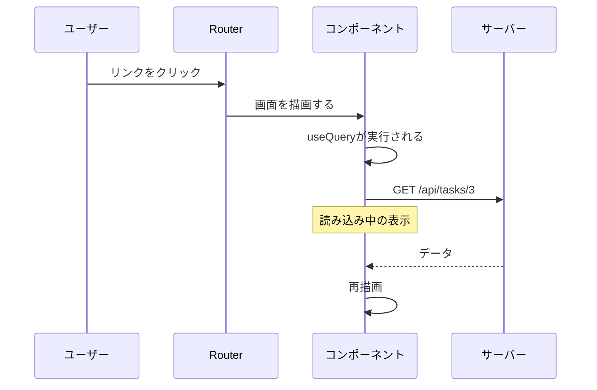
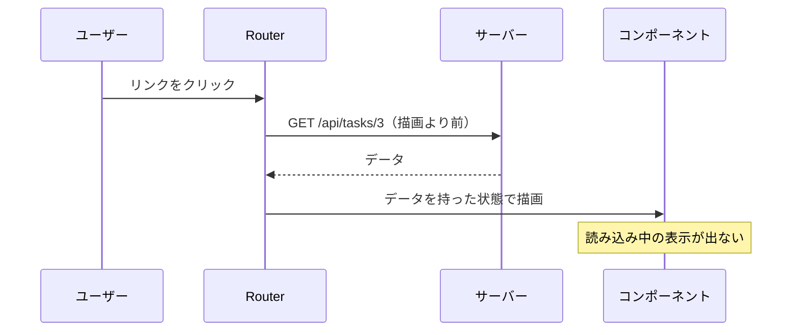

ここまで、データ取得はコンポーネントの中で行ってきました。`useQuery`を呼び、返ってきた状態で表示を分岐する形です。

この章では、取得を始める**タイミング**を前に倒します。コンポーネントが描画される前、遷移が決まった瞬間に取得を始める仕組みが、TanStack RouterのLoaderです。

なお、この章ではLoaderそのものを理解するために、TanStack Queryを使わない形で書きます。2つを噛み合わせる方法は次章で扱います。

## コンポーネント内フェッチの弱点

`useQuery`で取得する場合、処理の順番はこうなります。



取得が始まるのは、コンポーネントが描画されたあとです。つまり、クリックしてから通信が始まるまでに、JavaScriptの読み込みと描画の時間が挟まります。

さらに困るのが、入れ子になったときです。親が取得したデータを使って子が取得する形だと、通信が順番に発生します。

```text
親コンポーネントが描画される
  → 親が取得を開始（400ms）
    → 親が描画される
      → 子が取得を開始（400ms）
        → 子が描画される

合計 800ms
```

この階段状の遅延をウォーターフォールと呼びます。1段ごとに待ち時間が積み上がります。

## Loaderという考え方

Loaderは、ルートの定義に書くデータ取得です。

```tsx:src/routes/tasks/$taskId.tsx
export const Route = createFileRoute('/tasks/$taskId')({
  loader: ({ params }) => fetchTask(params.taskId),
  component: TaskDetailPage,
});

function TaskDetailPage() {
  const task = Route.useLoaderData();
  return <h1>{task.title}</h1>;
}
```

コンポーネントから`useQuery`が消えました。代わりに`Route.useLoaderData()`で、すでに揃っているデータを受け取ります。

順番が変わったところが要点です。



Routerは、遷移先が決まった時点でLoaderを実行します。データが揃うまで画面を切り替えません。だからコンポーネントは、データがある前提で書けます。

`useLoaderData`の戻り値には型がついています。`loader`が返した値の型が、そのまま流れてくるからです。`Task`を返すLoaderなら、`task.title`と書けます。

:::message
Loaderの中で複数のデータを取る場合は、`Promise.all`で並列にします。

```ts
loader: async ({ params }) => {
  const [task, comments] = await Promise.all([
    fetchTask(params.taskId),
    fetchComments(params.taskId),
  ]);
  return { task, comments };
},
```

Loaderは描画の前に走るので、ここで並列化しておけばウォーターフォールが消えます。コンポーネントの入れ子構造に引きずられません。
:::

## 検索条件に依存する場合

一覧のLoaderは、URLの検索条件によって取得内容が変わります。ここで`loaderDeps`が必要になります。

```tsx:src/routes/tasks/index.tsx
export const Route = createFileRoute('/tasks/')({
  validateSearch: taskSearchSchema,

  // Loaderが依存する検索条件を宣言する
  loaderDeps: ({ search }) => ({ page: search.page, status: search.status, q: search.q }),

  loader: ({ deps }) =>
    fetchTasks({ page: deps.page, perPage: 20, status: deps.status, q: deps.q }),

  component: TaskListPage,
});
```

`loaderDeps`で宣言した値は、`loader`の引数`deps`に届きます。そして、この宣言はLoaderを**再実行する条件**にもなります。

`page`が1から2に変わると、`deps`が変わるのでLoaderが走り直します。逆に、`deps`に含めていない条件が変わっても、Loaderは動きません。

ここが、初学者がつまずく箇所です。`loader`の中で`search`を直接読めるようにはなっていません。`loaderDeps`を経由させることで、依存関係を明示させる設計になっています。`useEffect`の依存配列や、`queryKey`と同じ考え方です。

| 宣言 | ページを変えたとき | 絞り込みを変えたとき |
|---|---|---|
| `loaderDeps`に`page`だけ | 再取得される | 再取得されない（バグ） |
| `loaderDeps`に`page`と`status` | 再取得される | 再取得される |

## 読み込みとエラーの表示

Loaderが走っている間、そしてLoaderが失敗したときの表示も、ルートに書きます。

```tsx
export const Route = createFileRoute('/tasks/$taskId')({
  loader: ({ params }) => fetchTask(params.taskId),
  pendingComponent: () => <p>読み込み中...</p>,
  errorComponent: ({ error }) => <ErrorComponent error={error} />,
  component: TaskDetailPage,
});
```

`ErrorComponent`は、Routerが用意している既定の表示です。開発中は例外の内容がそのまま見えます。本番向けには、自分で書いたコンポーネントに差し替えます。

読み込み表示については、細かい制御ができます。

| オプション | 意味 | 既定値 |
|---|---|---|
| `pendingMs` | この時間を超えたら`pendingComponent`を出す | 1000ミリ秒 |
| `pendingMinMs` | 出したら最低これだけ表示し続ける | 500ミリ秒 |

既定では、1秒以内に終わる取得では読み込み表示が出ません。すぐ終わる処理でスピナーが一瞬ちらつくのを避ける配慮です。そして一度出したら最低0.5秒は表示します。出た瞬間に消えるのを防ぐためです。

本書のモックは400ミリ秒の遅延なので、既定のままだと読み込み表示は出ません。動きを確認したいときは、`pendingMs: 0`を指定してください。

### データが無いとき

パスの形は正しいのに、そのデータが存在しない場合があります。`/tasks/9999`のようなURLです。

`notFound()`を投げると、Not Foundの扱いになります。

```tsx
import { notFound } from '@tanstack/react-router';

export const Route = createFileRoute('/tasks/$taskId')({
  loader: async ({ params }) => {
    try {
      return await fetchTask(params.taskId);
    } catch (error) {
      if (error instanceof ApiError && error.status === 404) throw notFound();
      throw error;
    }
  },
  notFoundComponent: () => <p>このタスクは存在しません</p>,
  errorComponent: ({ error }) => <ErrorComponent error={error} />,
  component: TaskDetailPage,
});
```

404を`notFound()`に変換し、それ以外の失敗はそのまま投げ直しています。前者は`notFoundComponent`、後者は`errorComponent`に届きます。「無い」と「壊れた」を別の画面で扱えます。

## 先読みで待ち時間を消す

Loaderには、コンポーネント内フェッチには作れない利点があります。遷移する**前に**実行できることです。

Routerの設定に`defaultPreload: 'intent'`を書いておくと、リンクにマウスを乗せた（あるいはタッチした）時点でLoaderが動きます。

```tsx:src/main.tsx
const router = createRouter({
  routeTree,
  defaultPreload: 'intent',
  defaultPreloadDelay: 50,
});
```

ユーザーがクリックを決めてマウスを動かし、実際に押すまでには、短くても数十ミリ秒かかります。その時間を取得に使ってしまえば、クリックした瞬間に表示できます。

`defaultPreloadDelay`は、ホバーしてから先読みを始めるまでの待ち時間です。一覧の上でマウスを素早く動かすだけで全行の先読みが走るのを防ぎます。


先読みは、リンクの`preload`propsで個別に制御できます。重いルートだけ`preload={false}`にする、といった調整が可能です。

### 途中でやめたときの中断

Loaderには、`abortController`も渡されます。遷移が取り消されたとき（別のリンクをクリックした、戻ったなど）に中断を通知してくれるものです。

受け取った`signal`を`fetch`まで届けるには、API関数側で`RequestInit`を通せるようにしておきます。

```ts:src/features/tasks/api.ts
export function fetchTask(id: string, init?: RequestInit): Promise<Task> {
  return request(`/api/tasks/${id}`, init);
}
```

```ts
loader: ({ params, abortController }) =>
  fetchTask(params.taskId, { signal: abortController.signal }),
```

先読みを有効にすると、この配慮が効いてきます。一覧の上でマウスを動かすと複数の先読みが始まりますが、行き先が決まらなかったものは中断されます。無駄な通信を残しません。

`loader`の引数には、ほかにも`cause`（遷移なのか先読みなのか）や`preload`（先読み中かどうか）が入っています。先読みのときだけ軽い処理に留める、といった調整もできます。

## 確かめてみる

Devtoolsとブラウザのネットワークタブを並べて、次の3つを観察してください。

1つめは先読みの様子です。一覧のリンクにマウスを乗せたまま動かさないでいると、クリックしていないのにリクエストが飛びます。そのあとクリックすると、通信が発生せず即座に表示されます。

2つめは読み込み表示の閾値です。詳細ルートに`pendingMs: 0`を足すと、400ミリ秒の取得でも読み込み表示が出るようになります。外すと出ません。既定値の1秒が何を守っているのかがわかります。

3つめは`loaderDeps`の効き目です。宣言から`status`を外してみてください。ページ送りでは再取得されるのに、絞り込みを変えても一覧が変わらなくなります。宣言し忘れたときの症状を、1度見ておく価値があります。

## RouterのキャッシュとQueryのキャッシュ

Loaderには、実は簡単なキャッシュがあります。

一度訪れたルートのデータは、Routerが保持します。既定では、同じルートに戻ったときは保持していたデータを見せ、裏で取り直します。TanStack Queryのstale-while-revalidateに似た振る舞いです。

制御するオプションもあります。

| オプション | 意味 |
|---|---|
| `staleTime` | Loaderのデータを再利用できる時間 |
| `preloadStaleTime` | 先読みしたデータを再利用できる時間 |
| `gcTime` | 保持しておく時間 |
| `shouldReload` | 再実行するかどうかを自分で決める |

名前が`staleTime`や`gcTime`と、TanStack Queryそのままです。似ているだけで、別の仕組みが2つあることになります。

ここで疑問が出ます。キャッシュを2つ持つ意味があるのか。

答えは、それぞれ得意が違うということです。

| | RouterのLoader | TanStack Query |
|---|---|---|
| 取得の開始 | 遷移が決まった瞬間（描画より前） | コンポーネントの描画後 |
| 先読み | ホバーで可能 | 明示的に`prefetchQuery` |
| キャッシュの共有 | ルート単位 | `queryKey`単位でアプリ全体 |
| 更新後の無効化 | ルート単位で再読み込み | キーの前方一致でまとめて |
| 同じデータの重複排除 | しない | する |

Loaderは開始が早く、Queryはキャッシュの扱いが細かい。どちらか一方を選ぶのではなく、Loaderで取得を早く始めてQueryのキャッシュに入れる、という組み合わせが取れます。それが次章のテーマです。

:::message alert
Loaderだけで組むと、更新のあとの最新化が面倒になります。タスクを更新したあと一覧を最新にするには、ルートの再読み込みを呼ぶことになります。

```ts
router.invalidate(); // 現在のルートのLoaderを再実行する
```

これは画面単位の操作です。「タスクに関わるキャッシュだけをまとめて古くする」といった細かい指定はできません。データの更新が多いアプリでは、キャッシュの管理をTanStack Queryに任せるほうが素直です。
:::

## まとめ

この章では、Loaderによるデータ取得を扱いました。

- コンポーネント内フェッチは、描画のあとに取得が始まります。入れ子ではウォーターフォールになります。
- Loaderはルートの定義に書き、遷移が決まった時点で実行されます。データが揃ってから画面が切り替わります。
- `Route.useLoaderData()`で、型のついたデータを受け取ります。読み込み中の分岐は不要です。
- 複数のデータはLoaderの中で`Promise.all`にすると並列になります。
- 検索条件に依存する場合は`loaderDeps`で宣言します。この宣言が再実行の条件も決めます。
- `pendingComponent`と`errorComponent`をルートに書きます。`pendingMs`の既定が1秒なので、速い取得では読み込み表示が出ません。
- データが無い場合は`notFound()`を投げ、`notFoundComponent`で受けます。
- `defaultPreload: 'intent'`で、ホバー時に先読みできます。クリック前に取得を始められるのはLoaderの強みです。
- Loaderにもキャッシュがありますが、Queryのほうが細かく扱えます。取得の早さとキャッシュ管理は、組み合わせて両方取れます。

次章では、その組み合わせを実装します。LoaderでQueryのキャッシュを温め、コンポーネントでは`useSuspenseQuery`で受け取る形です。
