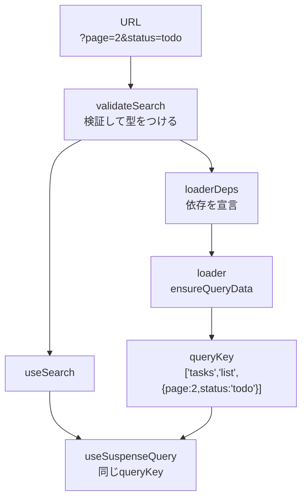
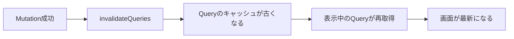

前章の最後で、キャッシュの仕組みが2つあると書きました。RouterのLoaderと、TanStack Queryです。

どちらか選ぶ必要はありません。取得を早く始めるのはLoaderに任せ、キャッシュの管理はQueryに任せる。この章では、その組み合わせを実装します。TanStackの各ライブラリを使う醍醐味が、いちばんはっきり出る部分です。

## 何を両取りするのか

2つの持ち味を並べます。

| | 得意なこと |
|---|---|
| Loader | 描画より前に取得を始める。ホバーで先読みできる |
| TanStack Query | `queryKey`単位のキャッシュ。前方一致の無効化。重複の排除 |

やりたいのは、Loaderで取得を始めて、その結果をQueryのキャッシュに入れることです。そうすれば、遷移は速く、更新後の最新化はキーで指定できます。


鍵になるのは`ensureQueryData`です。「キャッシュにあればそれを使い、無ければ取得してキャッシュに入れる」という操作です。

## Router ContextにQueryClientを渡す

Loaderの中でQueryClientを使うには、Loaderから触れる場所に置く必要があります。Loaderはコンポーネントの外なので、`useQueryClient`は呼べません。

TanStack Routerには、Router Contextという仕組みがあります。ルート全体で共有する値の置き場所です。

まず、ルートの型を宣言します。

```tsx:src/routes/__root.tsx
import { createRootRouteWithContext, Link, Outlet } from '@tanstack/react-router';
import type { QueryClient } from '@tanstack/react-query';

type RouterContext = {
  queryClient: QueryClient;
};

export const Route = createRootRouteWithContext<RouterContext>()({
  component: RootLayout,
  notFoundComponent: () => <p>ページが見つかりません</p>,
});
```

`createRootRoute`が`createRootRouteWithContext`に変わりました。関数を2回呼ぶ形（`<T>()({...})`）になっているのは、型引数だけを先に受け取るためのTypeScriptの書き方です。

次に、実際の値を渡します。

```tsx:src/main.tsx
const queryClient = new QueryClient({
  defaultOptions: {
    queries: { staleTime: 60_000 },
  },
});

const router = createRouter({
  routeTree,
  context: { queryClient },
  defaultPreload: 'intent',
  defaultPreloadStaleTime: 0,
});

declare module '@tanstack/react-router' {
  interface Register {
    router: typeof router;
  }
}

async function enableMocking() {
  if (!import.meta.env.DEV) return;
  const { worker } = await import('./mocks/browser');
  return worker.start({ onUnhandledRequest: 'bypass' });
}

enableMocking().then(() => {
  createRoot(document.getElementById('root')!).render(
    <StrictMode>
      <QueryClientProvider client={queryClient}>
        <RouterProvider router={router} />
        <ReactQueryDevtools initialIsOpen={false} />
      </QueryClientProvider>
    </StrictMode>,
  );
});
```

これが`main.tsx`の完成形です。APIモックの起動、QueryClient、Router、Devtoolsがそろいました。以降の章で`main.tsx`を触るのは、TanStack Startへ移る最終部だけです。

同じ`queryClient`を、`context`とProviderの両方に渡しています。Loaderからは`context`経由で、コンポーネントからはProvider経由で、同じキャッシュを触ることになります。

モックの起動を`enableMocking`で待ってから描画しているのには理由があります。Service Workerの登録が終わる前にRouterが動き出すと、最初のLoaderが本物のネットワークへ抜けてしまいます。

:::message alert
`defaultPreloadStaleTime: 0`を忘れないでください。

Routerには、先読みしたデータを一定時間そのまま使う仕組みがあります（既定は30秒）。この機能が生きていると、Routerの判断でLoaderが省略され、Queryの`staleTime`が効きません。鮮度の判断がRouterとQueryに二重化してしまいます。

`0`にしておくと、Routerは毎回Loaderを実行し、鮮度の判断はすべてQueryに任されます。キャッシュの管理者が1人になります。
:::

## Loaderでキャッシュを温める

詳細画面のLoaderを書き換えます。

```tsx:src/routes/tasks/$taskId.tsx
export const Route = createFileRoute('/tasks/$taskId')({
  loader: async ({ context, params }) => {
    try {
      await context.queryClient.ensureQueryData(taskQueries.detail(params.taskId));
    } catch (error) {
      if (error instanceof ApiError && error.status === 404) throw notFound();
      throw error;
    }
  },
  errorComponent: ({ error }) => <ErrorComponent error={error} />,
  notFoundComponent: () => <p>このタスクは存在しません</p>,
  component: TaskDetailPage,
});

function TaskDetailPage() {
  const { taskId } = Route.useParams();
  const { data: task } = useSuspenseQuery(taskQueries.detail(taskId));

  return (
    <article>
      <h1>{task.title}</h1>
      <p>{task.description}</p>
    </article>
  );
}
```

注目したいのは、Loaderが**値を返していない**ことです。`ensureQueryData`を呼ぶだけで、`useLoaderData`は使いません。

データの受け渡しは、キャッシュを介して行われます。Loaderがキャッシュを温め、コンポーネントが`useSuspenseQuery`で同じキーを読む。`queryKey`が同じなので、そこにはもうデータがあります。通信は発生せず、`useSuspenseQuery`は中断せずに値を返します。

`queryOptions`でまとめた定義が、ここで威力を発揮します。Loaderとコンポーネントが、**同じ1つの定義**を参照しています。キーがずれる余地がありません。

```ts
taskQueries.detail(taskId)  // Loaderでもコンポーネントでも同じ式
```

これを手書きのキーで書いていたら、片方を直してもう片方を忘れる事故が起きます。定義を1か所に集めておく理由が、ここにあります。

## 一覧を連携させる

一覧は検索条件に依存するので、`loaderDeps`と組み合わせます。

```tsx:src/routes/tasks/index.tsx
export const Route = createFileRoute('/tasks/')({
  validateSearch: taskSearchSchema,
  loaderDeps: ({ search }) => ({ page: search.page, status: search.status, q: search.q }),
  loader: ({ context, deps }) =>
    context.queryClient.ensureQueryData(
      taskQueries.list({ page: deps.page, perPage: 20, status: deps.status, q: deps.q }),
    ),
  component: TaskListPage,
});

function TaskListPage() {
  const { page, status, q } = Route.useSearch();
  const { data } = useSuspenseQuery(taskQueries.list({ page, perPage: 20, status, q }));
  // ...
}
```

3つの層が、同じ条件でつながりました。



URLが変われば`queryKey`が変わり、別のキャッシュとして扱われます。2ページ目を見て1ページ目に戻れば、Loaderの`ensureQueryData`はキャッシュを見つけて即座に返します。通信は起きません。

そして、更新後の最新化はキーで指定できます。

```ts
// タスクを作成したあと
queryClient.invalidateQueries({ queryKey: taskKeys.lists() });
```

これで、どのページ・どの絞り込みの一覧も古くなります。表示中の一覧は自動で再取得されます。Loaderだけで組んでいた場合に必要だった`router.invalidate()`は要りません。画面単位ではなく、データ単位で管理できます。

## awaitするかどうか

Loaderで`await`を付けるかどうかは、体験の設計に関わります。

```ts
// ①awaitする: データが揃うまで遷移しない
loader: async ({ context, params }) => {
  await context.queryClient.ensureQueryData(taskQueries.detail(params.taskId));
},

// ②awaitしない: すぐ遷移して、コンポーネントで待つ
loader: ({ context, params }) => {
  context.queryClient.prefetchQuery(taskQueries.detail(params.taskId));
},
```

①では、クリックしてもすぐには画面が変わりません。データが届いてから切り替わります。前の画面が表示され続けるので、白い画面を見せずに済みます。

②では、画面は即座に切り替わります。データがまだ無いので、`useSuspenseQuery`が中断し、`<Suspense>`のフォールバック（またはルートの`pendingComponent`）が表示されます。骨組みだけの画面が先に出て、あとから中身が入ります。

| | ①awaitする | ②awaitしない |
|---|---|---|
| クリック直後 | 前の画面のまま | 新しい画面の枠が出る |
| 待っている場所 | 遷移の中 | Suspenseのフォールバック |
| 向く場面 | 取得が速い、画面全体がデータに依存する | 取得が遅い、部分ごとに出したい |

判断の目安は取得の速さです。数百ミリ秒で終わるなら①のほうが落ち着いて見えます。1秒を超えるなら、②で枠だけでも見せたほうが待たされている感覚が薄まります。

`await`する場合は、`pendingComponent`と`pendingMs`で「遅いときだけ読み込み表示を出す」制御が効きます。前章で見たとおり、既定では1秒を超えたときだけ出ます。

:::message
①と②を混ぜることもできます。画面の主役になるデータは`await`し、補助的なデータは`await`しない。こうすると、主役が揃った時点で遷移し、補助部分はあとから埋まります。

```ts
loader: async ({ context, params }) => {
  // 主役は待つ
  await context.queryClient.ensureQueryData(taskQueries.detail(params.taskId));
  // コメント一覧は待たない（表示後に埋まる）
  context.queryClient.prefetchQuery(commentQueries.list(params.taskId));
},
```
:::

## 更新したあとはどうなるか

ここで疑問が湧きます。Loaderで取得したデータを、Mutationのあとに最新化できるのでしょうか。Loaderは遷移のときにしか走りません。

答えは、Loaderを走らせる必要がない、です。

```tsx
const { mutate } = useMutation({
  mutationFn: createTask,
  onSuccess: () => queryClient.invalidateQueries({ queryKey: taskKeys.lists() }),
});
```

表示しているのは`useSuspenseQuery`です。Loaderが返した値ではなく、キャッシュを見ています。だからキャッシュが更新されれば、画面も更新されます。Loaderが再実行されるかどうかは関係ありません。



Loaderの役目は、最初の1回を早く始めることだけです。以降の更新はQueryが受け持ちます。役割がきれいに分かれています。

`useLoaderData`で受け取る形だと、こうはいきません。Loaderの戻り値は遷移のときに固定されるので、更新するには`router.invalidate()`でルートごと読み直すことになります。連携パターンに寄せる理由の1つです。

## エラーはどこへ届くか

失敗したときの行き先も整理しておきます。`await`するかどうかで変わります。

`await ensureQueryData`の場合、取得の失敗はLoaderの例外になります。行き先はルートの`errorComponent`です。画面は切り替わらず、エラー表示に置き換わります。

`await`しない場合、Loaderは失敗を知りません。画面は切り替わり、`useSuspenseQuery`がエラーを投げます。受け取るのは、いちばん近いError Boundary（ルートの`errorComponent`もこれとして働きます）です。

どちらの経路でも、最終的にはルートに書いた`errorComponent`に届きます。エラー表示の置き場所が1つで済むのは、この形の利点です。

## どこまでLoaderに寄せるか

Loaderに書くべきものと、そうでないものを整理します。

Loaderに置くのは、**その画面を表示するために必要なデータ**です。詳細画面のタスク本体、一覧のリスト。これらが無ければ画面が成立しません。先に取得を始める価値があります。

一方、次のものはコンポーネント側の`useQuery`に残します。

- 条件によって取得するかどうかが変わるデータ（`enabled`が必要なもの）
- ユーザーの操作で初めて必要になるデータ（モーダルを開いたときなど）
- 画面の一部でしか使わない、遅れても困らないデータ

すべてをLoaderに集めると、遷移が遅くなります。「表示に必須か」を基準に選んでください。

## 先読みの効果を確かめる

Devtoolsを2つ開いて観察します。Query Devtoolsでキャッシュの増え方、Router Devtoolsでルートの状態です。

一覧のリンクにマウスを乗せると、Query Devtoolsに`['tasks','detail','3']`が現れます。まだクリックしていません。Loaderが先読みで走り、`ensureQueryData`がキャッシュに入れたからです。

その状態でクリックすると、通信は発生せず、待ち時間なく詳細が表示されます。`useSuspenseQuery`は中断すらしません。

一度見た詳細に戻ったときも同じです。`staleTime`の1分以内なら、キャッシュがそのまま使われます。1分を過ぎていれば、古いデータを見せながら裏で更新されます。

## まとめ

Loaderが取得開始を担い、Queryがキャッシュを担うことで、遷移の速さとデータ共有を両立できます。

- LoaderはRouter Contextを通じてQueryClientを受け取ります。`createRootRouteWithContext`で型を宣言します。
- `defaultPreloadStaleTime: 0`にして、鮮度の判断をQueryに一本化します。
- Loaderでは`ensureQueryData`を呼ぶだけで、値を返しません。データはキャッシュを介して渡ります。
- コンポーネントは`useSuspenseQuery`で同じ`queryKey`を読みます。データはすでにあるので中断しません。
- `queryOptions`の定義をLoaderとコンポーネントで共有するため、キーがずれません。
- URL → `validateSearch` → `loaderDeps` → `queryKey`と条件が流れ、URLがキャッシュの住所を決めます。
- 更新後の最新化は`invalidateQueries`でキーを指定できます。画面単位の再読み込みが不要になります。
- Loaderで`await`すると遷移が待たれ、`await`しないとSuspenseで待ちます。取得の速さで選びます。
- Loaderに置くのは表示に必須のデータだけです。条件つきや遅延可能なデータは`useQuery`に残します。

次章では、この連携の上に認証を載せます。ログインしていないユーザーを遷移前に弾く仕組みを、`beforeLoad`で作ります。
