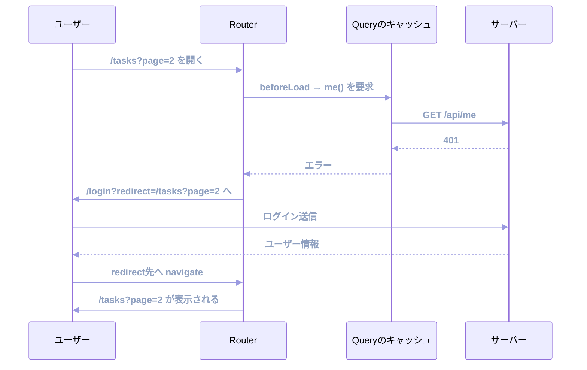
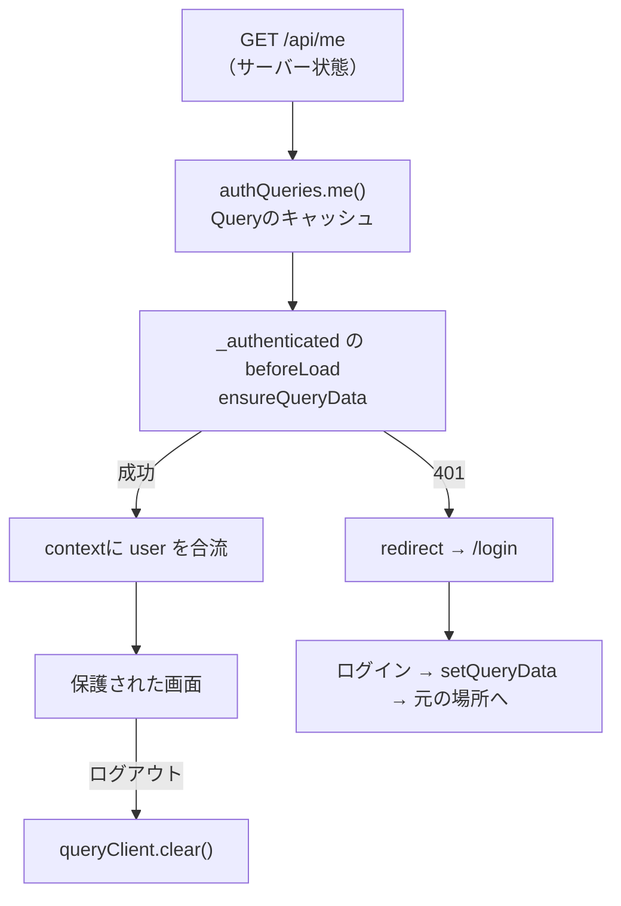

Router編の最後は認証です。

やることは3つあります。ログインしていないユーザーを保護された画面から弾くこと、弾いたあとログイン画面へ送ってから元の場所へ戻すこと、そしてログアウト時に前のユーザーのデータを残さないことです。

TanStack Routerには、遷移が始まる前に割り込める`beforeLoad`があります。これを使うと、画面が一瞬見えてしまう問題を避けられます。

## 認証状態はどこに置くべきか

状態の分類を思い出してください。「ログインしているか」「そのユーザーは誰か」という情報は、どの分類に入るでしょうか。

サーバー状態です。持ち主はサーバーで、手元にあるのは写しです。セッションはサーバー側で切れることがあり、他のタブでログアウトされることもあります。クライアントが勝手に決められる値ではありません。

したがって、置き場所はTanStack Queryです。

```ts:src/features/auth/queries.ts
import { queryOptions } from '@tanstack/react-query';
import { fetchMe } from './api';

export const authKeys = {
  me: ['auth', 'me'] as const,
};

export const authQueries = {
  me: () =>
    queryOptions({
      queryKey: authKeys.me,
      queryFn: fetchMe,
      staleTime: 5 * 60_000,
      // 401は何度試しても同じなので再試行しない
      retry: false,
    }),
};
```

`fetchMe`は`GET /api/me`を呼びます。ログインしていれば200でユーザー情報が返り、していなければ401が返ります。

`retry: false`が要点です。未認証のときに3回リトライしても結果は変わりません。ログイン画面へ送るまでの時間が無駄に伸びるだけです。

### 型とAPI関数

ユーザーの型と、3本のAPI関数を用意します。通信の共通処理は、タスクのために書いた`request`をそのまま使います。

```ts:src/features/auth/types.ts
export type User = {
  id: string;
  name: string;
  role: 'admin' | 'member';
};
```

```ts:src/features/auth/api.ts
import { request } from '../tasks/api';
import type { User } from './types';

export function fetchMe(): Promise<User> {
  return request('/api/me');
}

export function login(input: { email: string; password: string }): Promise<User> {
  return request('/api/login', {
    method: 'POST',
    headers: { 'Content-Type': 'application/json' },
    body: JSON.stringify(input),
  });
}

export function logout(): Promise<void> {
  return request('/api/logout', { method: 'POST' });
}
```

`request`と`ApiError`は機能をまたいで使う道具なので、本来は`src/lib/http.ts`のような共通の置き場所を作るのが素直です。本書はファイル数を抑えるため、`features/tasks/api.ts`に置いたまま参照しています。

### モックを足す

「開発環境の準備」の章で作った`handlers`の配列に、3本を追加します。

```ts:src/mocks/handlers.ts
import type { User } from '../features/auth/types';

// role を 'member' に変えると、権限で弾かれる動きも試せる
const registeredUser: User = { id: 'u1', name: '佐藤', role: 'admin' };

/** タブが生きている間だけ保持するセッション。リロードで消える */
let session: User | null = null;

// handlers 配列の末尾に、次の3本を足す
  http.get('/api/me', async () => {
    await delay(200);
    if (!session) {
      return HttpResponse.json({ message: 'ログインしていません' }, { status: 401 });
    }
    return HttpResponse.json(session);
  }),

  http.post('/api/login', async ({ request }) => {
    await delay(LATENCY_MS);
    const { password } = (await request.json()) as { email: string; password: string };
    if (password !== 'password') {
      return HttpResponse.json(
        { message: 'メールアドレスかパスワードが違います' },
        { status: 401 },
      );
    }
    session = registeredUser;
    return HttpResponse.json(session);
  }),

  http.post('/api/logout', async () => {
    await delay(200);
    session = null;
    return new HttpResponse(null, { status: 204 });
  }),
```

パスワードが`password`のときだけ通す、それだけの仕掛けです。セッションはモジュールの変数なので、リロードすると未ログインに戻ります。

本物の認証はCookieやトークンで状態を持ちますが、ここで確かめたいのは「401が返ったときにRouterがどう動くか」です。その観察には、この単純さで足ります。

### トークンの有無で判断しない

トークンを`localStorage`に入れて「トークンがあればログイン済み」と判断する実装をよく見かけます。手軽ですが、有効期限が切れたトークンでも「ログイン済み」と判断してしまいます。ユーザーは画面を開けるのに、そこから飛ぶAPIがすべて401になる、という状態です。

サーバーに聞くのがもっとも確実です。`/api/me`のようなエンドポイントを1本用意し、その結果を唯一の判断材料にします。`staleTime`を5分に設定しておけば、画面遷移のたびに問い合わせが飛ぶこともありません。

## 保護する画面をまとめる

タスク関連の画面すべてに認証を求めるとします。ルートごとに検査を書くと、新しい画面を追加したときに書き忘れます。

URLに現れないレイアウトを親にして、そこに1度だけ書きます。

```text
src/routes/
├── __root.tsx
├── index.tsx                      … /
├── login.tsx                      … /login
├── _authenticated.tsx             … 認証の検査（URLには出ない）
└── _authenticated/
    └── tasks/
        ├── route.tsx              … /tasks の共通レイアウト
        ├── index.tsx              … /tasks
        └── $taskId.tsx            … /tasks/123
```

ディレクトリは1段深くなりましたが、**URLは変わりません**。`_`で始まる名前はURLに現れないからです。`<Link to="/tasks">`もそのまま動きます。

:::message alert
ファイルを移動したときは、2つ直す必要があります。

1つめは相対importです。`../../features/`が`../../../features/`になります。

2つめは`useParams({ from: ... })`のようにルートを文字列で指定している箇所です。`to`はURLのパスを取りますが、`from`は**ルートID**を取ります。ルートIDにはURLに出ないレイアウトも含まれます。

```tsx
// to はURLのパス
<Link to="/tasks/$taskId" params={{ taskId }}>詳細</Link>

// from はルートID（_authenticated を含む）
const { taskId } = useParams({ from: '/_authenticated/tasks/$taskId' });
```

この違いは、型エラーの文面を読むと気づけます。エラーに出てくる候補が`/_authenticated/...`の形なら、`from`の指定を求められています。
:::

## beforeLoadで検査する

`_authenticated.tsx`に検査を書きます。

```tsx:src/routes/_authenticated.tsx
import { createFileRoute, Outlet, redirect } from '@tanstack/react-router';
import { authQueries } from '../features/auth/queries';
import { ApiError } from '../features/tasks/api';

export const Route = createFileRoute('/_authenticated')({
  beforeLoad: async ({ context, location }) => {
    try {
      const user = await context.queryClient.ensureQueryData(authQueries.me());
      // 返した値は、子ルートのcontextに合流する
      return { user };
    } catch (error) {
      if (error instanceof ApiError && error.status === 401) {
        throw redirect({
          to: '/login',
          search: { redirect: location.href },
        });
      }
      throw error;
    }
  },
  component: AuthenticatedLayout,
});

function AuthenticatedLayout() {
  const { user } = Route.useRouteContext();

  return (
    <div>
      <p>{user.name} さんとしてログイン中</p>
      <Outlet />
    </div>
  );
}
```

3つの仕組みが働いています。

1つめは`beforeLoad`の実行タイミングです。Loaderよりも前、遷移が始まる前に走ります。ここで弾けば、保護された画面のコンポーネントは1度も描画されません。「一瞬中身が見えてから、ログイン画面に飛ばされる」という残念な挙動になりません。

2つめは`redirect`を**投げる**ことです。返すのではなく`throw`します。例外として投げることで、それ以降の処理（子ルートのLoaderなど）が確実に止まります。

3つめは戻り値の扱いです。`beforeLoad`が返したオブジェクトは、そのルートと子ルートのContextに合流します。子ルートでは`Route.useRouteContext()`で`user`が取れます。しかも型がついています。

```tsx
// 子ルートのコンポーネント
const { user, queryClient } = Route.useRouteContext();
// user は認証済みなので undefined になりえない
```

「認証済みの画面ではユーザー情報が必ずある」という前提が、型で表現できました。画面ごとに`user`の`undefined`チェックを書く必要がなくなります。

## 元の場所へ戻す

弾かれたユーザーは、ログイン後に見たかった画面へ戻りたいはずです。行き先をURLに持たせて引き継ぎます。

```ts
throw redirect({
  to: '/login',
  search: { redirect: location.href },
});
```

`location.href`は、いま行こうとしていたURLです。`/tasks?page=2&status=todo`のような検索条件つきのURLも、そのまま文字列として持ち回せます。

ログイン画面では、この値を受け取ります。

```tsx:src/routes/login.tsx
export const Route = createFileRoute('/login')({
  validateSearch: z.object({
    // アプリ内のパスだけ受け付ける。外部URLは無かったことにする
    redirect: z
      .string()
      .refine((value) => value.startsWith('/') && !value.startsWith('//'))
      .optional()
      .catch(undefined),
  }),
  component: LoginPage,
});
```

流れを図で追います。



ログイン処理は、これまで学んだMutationです。

```tsx
const { redirect } = Route.useSearch();
const router = useRouter();
const navigate = Route.useNavigate();
const queryClient = useQueryClient();

const { mutate, isPending, isError, error } = useMutation({
  mutationFn: login,
  onSuccess: async (user) => {
    // 取得済みの認証情報を、ログイン結果で置き換える
    queryClient.setQueryData(authKeys.me, user);

    if (redirect) {
      // 実行時に決まる文字列なので、履歴を直接操作する
      router.history.replace(redirect);
    } else {
      await navigate({ to: '/tasks', replace: true });
    }
  },
});
```

`setQueryData`で認証情報のキャッシュを直接埋めています。ログインの応答にユーザー情報が含まれているので、`/api/me`をもう一度呼ぶ必要はありません。この1回を省くと、ログイン直後の待ち時間が短くなります。

戻り先が2通りに分かれているのには理由があります。`navigate`の`to`は、アプリに定義されたルートのパスだけを受け付ける型です。`redirect`はURLから実行時に届く`string`なので、そのまま`to`へ渡すと型エラーになります。こうした「実行時に決まるパス」へ移動したいときは、`router.history.replace()`で履歴を直接操作します。

どちらの経路も履歴を積まずに置き換えています。ログイン画面を履歴に残さないためです。遷移後に戻るボタンを押しても、ログイン画面には帰りません。

:::message alert
`redirect`の値をそのまま遷移先にするのは、注意が必要な操作です。URLに`?redirect=https://evil.example.com`と書かれていたら、ログイン後に外部サイトへ送ってしまいます。オープンリダイレクトと呼ばれる脆弱性です。

先ほどのスキーマで`refine`を入れているのは、この防御です。「`/`で始まり、`//`で始まらない」ものだけを通し、それ以外は`undefined`に倒します。検証をスキーマに寄せておけば、受け取る場所が増えても守りが漏れません。

`router.history.replace()`には型検査が効きません。渡した文字列がそのまま行き先になります。だからこそ、その手前の`validateSearch`で絞り込んでおくことが防御の要になります。「型安全なルーティングとナビゲーション」の章で触れた、型が守れない境界のひとつです。
:::

## ログアウトでキャッシュを捨てる

ログアウトで見落としやすいのが、キャッシュの後始末です。

セッションを切っただけでは、TanStack Queryのキャッシュにデータが残っています。別のユーザーがログインしたとき、前のユーザーのタスク一覧が一瞬表示される可能性があります。

```tsx
const { mutate: doLogout } = useMutation({
  mutationFn: logout,
  onSuccess: async () => {
    // キャッシュを全部捨てる
    queryClient.clear();
    await navigate({ to: '/login' });
  },
});
```

`queryClient.clear()`は、すべてのキャッシュを破棄します。ログアウトのように「前の状態を1つも残したくない」場面のための操作です。

| 操作 | 効果 | 使う場面 |
|---|---|---|
| `invalidateQueries` | 古い印を付けて再取得 | データを更新したあと |
| `removeQueries` | 指定したキャッシュを破棄 | データが消えたとき |
| `clear` | すべてのキャッシュを破棄 | ログアウト |

## 表示の制御とルートの制御

権限による制御には、2つの層があります。混ぜないことが大切です。

ルートの制御は`beforeLoad`で行います。「管理者しか開けない画面」なら、`beforeLoad`で権限を確かめて弾きます。

```ts
beforeLoad: ({ context }) => {
  if (context.user.role !== 'admin') {
    throw redirect({ to: '/tasks' });
  }
},
```

表示の制御は、コンポーネントの中の分岐です。「同じ画面だが、管理者にだけ削除ボタンを見せる」といった場合です。

```tsx
{user.role === 'admin' && <DeleteTaskButton taskId={task.id} />}
```

判断の基準は、画面ごと見せないのか、画面の一部を隠すのかです。

そして、どちらの制御もクライアント側だけで完結してはいけません。ボタンを隠しても、APIを直接叩けば操作できてしまいます。開発者ツールを開けば、隠したボタンを表示させることもできます。

フロントエンドの権限制御は、あくまで使いやすさのための仕組みです。押せないボタンを見せない、開けない画面へ案内しない。本当の防御はサーバー側で行います。この前提を忘れないでください。

## 確かめてみる

次の順番で試してください。

まず、ログインしていない状態でアドレス欄に`/tasks?page=2`と入力します。一覧は一瞬も表示されず、`/login?redirect=%2Ftasks%3Fpage%3D2`へ飛びます。URLに行き先が入っているのが見えます。

そこでログインすると、`/tasks?page=2`が開きます。トップページではなく、見ようとしていた2ページ目に戻ってきます。

Query Devtoolsを開くと、`['auth','me']`というキャッシュができています。この状態で画面を行き来しても、`/api/me`は呼ばれません。`staleTime`の5分が効いているからです。

最後にログアウトしてください。Devtoolsのキャッシュ一覧が空になります。`queryClient.clear()`が働いた証拠です。この後始末を書き忘れると、一覧のデータが残ったままになります。

## 認証設計の全体像

ここまでの要素を1枚に整理します。



認証情報をサーバー状態として扱い、`beforeLoad`で門を作り、Contextで下流へ流す。これがTanStackでの認証の型です。ライブラリを追加せずに、ここまで組めます。

## まとめ

この章では、認証とアクセス制御を扱いました。

- 認証状態はサーバー状態です。`/api/me`の結果をTanStack Queryで持ち、`retry: false`を指定します。
- トークンの有無で判断せず、サーバーに聞きます。`staleTime`で問い合わせの回数を抑えます。
- 保護したい画面は`_`で始まるレイアウトの下にまとめます。URLは変わりません。
- ファイルを移動したら、相対importと`from`のルートIDを直します。`to`はURLパス、`from`はルートIDです。
- `beforeLoad`は遷移の前に走ります。ここで弾けば、保護された画面は描画されません。
- `redirect`は`throw`します。以降の処理が確実に止まります。
- `beforeLoad`の戻り値は子ルートのContextに合流します。認証済みの画面では`user`が必ずある型になります。
- 行き先は`location.href`をSearch Paramsに載せて引き継ぎます。受け取った値は`validateSearch`の`refine`でアプリ内のパスに絞り、オープンリダイレクトを防ぎます。
- 実行時に決まるパスへの移動は`navigate({ to })`では型が通りません。`router.history.replace()`で履歴を直接操作します。
- ログイン成功時は`setQueryData`でキャッシュを埋め、余分な問い合わせを省きます。
- ログアウト時は`queryClient.clear()`でキャッシュを全部捨てます。
- ルートの制御は`beforeLoad`、表示の制御はコンポーネント内の分岐です。本当の防御はサーバー側で行います。

ここまでで、サーバー状態とURL状態の扱いが身につきました。次章から、大量のデータを見せる話に移ります。TanStack Tableを導入し、Headlessなテーブルを組み立てます。
