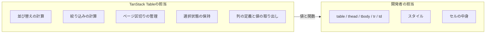
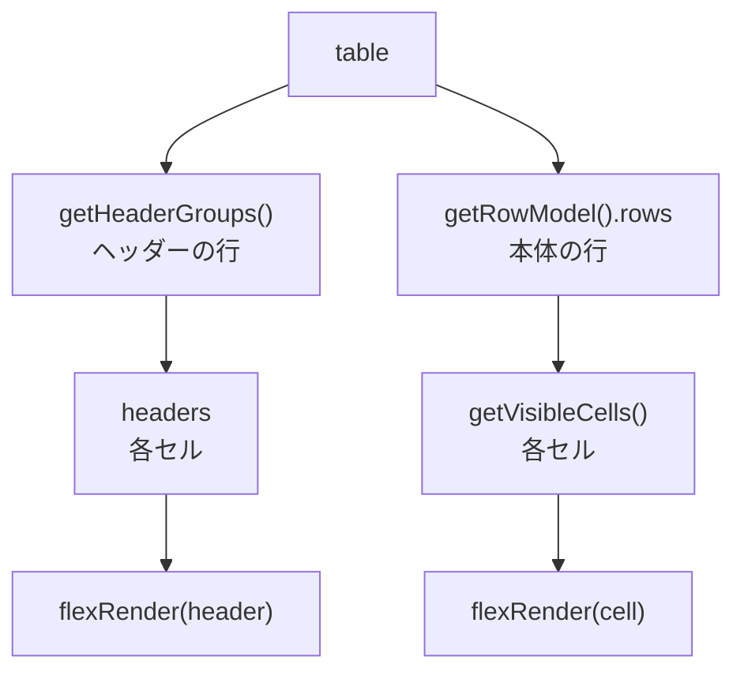

ここから、データの見せ方に移ります。

タスク一覧は`<ul>`で並べてきました。実務の一覧画面は、たいてい表です。列があり、並び替えができ、絞り込みがあり、行を選べる。作り始めると、想像よりずっと大変な部品です。

TanStack Tableは、その大変な部分を引き受けます。ただし、見た目は1つも提供しません。この章では、その割り切りが何を意味するのかを体験します。

## テーブルUIはなぜ大変なのか

表を自作すると、こんな要求が次々に来ます。

- 列見出しをクリックして並び替えたい。3回目のクリックで並び替えを解除したい
- 列ごとに絞り込みたい。全体をキーワードで検索したい
- 1ページ20件で区切りたい。表示件数を選べるようにしたい
- チェックボックスで複数選択したい。「すべて選択」も欲しい
- 列の表示・非表示を切り替えたい。順番を入れ替えたい
- 特定の列を左に固定したい
- 行をグループ化して小計を出したい

どれも「表なら当然ある機能」です。そして、どれも自分で書くと面倒です。並び替え1つとっても、文字列と数値と日付で比較方法が違い、`undefined`の扱いを決め、複数列での並び替えを考えることになります。

さらに厄介なのが、これらが**組み合わさる**ことです。絞り込んだ結果を並び替えて、その結果をページで区切り、選択状態は絞り込みが変わっても保つ。処理の順番を間違えると、意図しない表示になります。

## 完成品コンポーネントとの違い

「なら、できあいのテーブルコンポーネントを使えばよい」と考えるのは自然です。実際、それが正解の場面もあります。

ただ、完成品には限界があります。用意されたテーマの範囲でしか見た目を変えられません。デザイナーから渡された仕様に合わせようとして、CSSの上書きと格闘することになります。「行の中に2段組みで情報を入れたい」「特定の条件の行だけ背景を変えたい」といった要求が、途端に難しくなります。

TanStack Tableの立場は違います。**ロジックだけを提供し、マークアップは開発者が書く**という割り切りです。



`<table>`を`<div>`のグリッドに変えても、カードの一覧に変えても、ロジックはそのまま使えます。表という見た目にも縛られません。

## インストールする

```sh
npm i @tanstack/react-table
```

パッケージ名に`react`が入っています。中核は`@tanstack/table-core`にあり、Vueなど他のフレームワーク向けのアダプタも同じコアを使っています。

## 列を定義する

テーブルを作る作業は、列の定義から始まります。「どんな列があり、各行からどの値を取り出し、どう表示するか」を宣言します。

型安全に書くために、`createColumnHelper`を使います。

```tsx:src/features/tasks/components/TaskTable.tsx
import { createColumnHelper } from '@tanstack/react-table';
import type { Task } from '../types';

const columnHelper = createColumnHelper<Task>();

const columns = [
  columnHelper.accessor('title', {
    header: 'タイトル',
  }),
  columnHelper.accessor('assignee', {
    header: '担当',
  }),
];
```

`createColumnHelper<Task>()`で、扱うデータの型を伝えます。すると`accessor`に渡せる文字列が、`Task`のプロパティ名に限定されます。

```tsx
columnHelper.accessor('titel', { header: 'タイトル' });
//                     ^^^^^^ 型エラー: そんなプロパティはない
```

さらに、セルの描画関数に渡ってくる値の型も決まります。`title`の列なら`string`、`status`の列なら`TaskStatus`です。

### accessorとdisplay

列には2種類あります。

`accessor`は、データから値を取り出す列です。`title`や`assignee`のように、`Task`の中に対応する値があります。取り出した値を使って、並び替えや絞り込みができます。

`display`は、データに対応する値がない列です。操作ボタンやチェックボックスの列がこれです。値がないので、並び替えの対象にはなりません。

```tsx
columnHelper.display({
  id: 'actions',
  header: '操作',
  cell: ({ row }) => (
    <Link to="/tasks/$taskId" params={{ taskId: row.original.id }}>
      詳細
    </Link>
  ),
});
```

`display`には`id`が必須です。`accessor`ならプロパティ名がそのままidになりますが、`display`には元になる名前がないからです。

`row.original`で、その行の元データ（`Task`そのもの）が取れます。IDや複数のプロパティを組み合わせたいときに使います。

### セルの表示を作り込む

`cell`を指定すると、値の表示方法を決められます。

```tsx
const statusLabels: Record<TaskStatus, string> = {
  todo: '未着手',
  doing: '進行中',
  done: '完了',
};

columnHelper.accessor('status', {
  header: '状態',
  cell: (info) => (
    <span className={`badge-${info.getValue()}`}>{statusLabels[info.getValue()]}</span>
  ),
}),
columnHelper.accessor('dueDate', {
  header: '期限',
  cell: (info) => info.getValue().replaceAll('-', '/'),
}),
```

`info.getValue()`で、その行のその列の値が取れます。型がついているので、`status`の列なら`'todo' | 'doing' | 'done'`として扱えます。`statusLabels[info.getValue()]`のような対応表の参照も、型が守ってくれます。

JSXを返せるので、バッジ、リンク、ボタン、アイコンなど何でも置けます。ここが完成品コンポーネントとの決定的な差です。

:::message
`columns`の定義は、コンポーネントの外に置いてください。中で定義すると、再レンダリングのたびに新しい配列が作られ、テーブルの内部状態が作り直されます。

行数が多いと目に見えて重くなります。定義がpropsや状態に依存する場合は、`useMemo`で包んでください。
:::

## テーブルを組み立てる

列の定義とデータを渡して、テーブルのインスタンスを作ります。

```tsx
import { getCoreRowModel, useReactTable } from '@tanstack/react-table';

export function TaskTable({ tasks }: { tasks: Task[] }) {
  const table = useReactTable({
    data: tasks,
    columns,
    getCoreRowModel: getCoreRowModel(),
  });

  // ...
}
```

`getCoreRowModel`は、「行のデータをそのまま並べる」という最小の処理です。並び替えや絞り込みを使うときは、対応する関数を追加していきます。この仕組みをRow Modelと呼び、次章で詳しく扱います。

必要な機能だけを足す形になっているのは、使わない機能のコードを含めないためです。並び替えを使わないテーブルに、並び替えのロジックは同梱されません。

## 描画する

`table`から3つの情報を取り出して、自分でマークアップを組みます。

```tsx
return (
  <table>
    <thead>
      {table.getHeaderGroups().map((headerGroup) => (
        <tr key={headerGroup.id}>
          {headerGroup.headers.map((header) => (
            <th key={header.id}>
              {flexRender(header.column.columnDef.header, header.getContext())}
            </th>
          ))}
        </tr>
      ))}
    </thead>

    <tbody>
      {table.getRowModel().rows.map((row) => (
        <tr key={row.id}>
          {row.getVisibleCells().map((cell) => (
            <td key={cell.id}>{flexRender(cell.column.columnDef.cell, cell.getContext())}</td>
          ))}
        </tr>
      ))}
    </tbody>
  </table>
);
```

初めて見ると長く感じますが、構造は単純です。



`getHeaderGroups()`が配列を返すのは、ヘッダーが複数行になる場合があるからです。列をグループ化して2段の見出しにする機能があるためで、単純な表では要素が1つの配列になります。

`getVisibleCells()`は、表示中の列のセルだけを返します。列の表示・非表示を切り替える機能を使ったとき、隠した列が自動的に除かれます。

### flexRenderの役割

`flexRender`は、`header`や`cell`に指定されたものを描画する関数です。

なぜ必要なのでしょうか。`header`には文字列（`'タイトル'`）を渡せますが、関数やコンポーネントも渡せます。`cell`も同じです。渡されたものが値なのか関数なのかを判定して、適切に処理する必要があります。

```tsx
// どちらも書ける
columnHelper.accessor('title', { header: 'タイトル' });
columnHelper.accessor('title', { header: () => <SortableHeader label="タイトル" /> });
```

この判定を`flexRender`が肩代わりします。`{cell.getValue()}`と書いてしまうと、文字列の列は動きますが、JSXを返す`cell`が機能しません。**セルの描画は必ず`flexRender`を通す**と覚えてください。

## マークアップの責任は自分にある

Headlessであることは、良いことばかりではありません。完成品コンポーネントが面倒を見てくれていた部分も、自分の担当になります。

見落としやすいのがアクセシビリティです。`<table>`を使うなら、支援技術が構造を理解できるように属性を添えます。

```tsx
<th key={header.id} scope="col">
  {flexRender(header.column.columnDef.header, header.getContext())}
</th>
```

`scope="col"`は、その`<th>`が列の見出しであることを示します。並び替えを実装したら、`aria-sort`で現在の並び順を伝えます。表全体に説明が必要なら`<caption>`を置きます。

`<div>`でグリッドを組む場合は、`role="table"`や`role="row"`を自分で付けることになります。`<table>`要素を使えばこれらは不要です。特別な理由がないかぎり、素直に`<table>`を選ぶほうが手間もリスクも少なくなります。

列幅の調整、固定列、行の縞模様といった見た目も、すべてCSSで自分で書きます。TanStack Tableは列幅の**値**を管理する機能は持ちますが、それをどう適用するかは開発者が決めます。

## 完成した表を眺める

一覧画面のルートで、この`TaskTable`に置き換えます。

```tsx
const { data } = useSuspenseQuery(taskQueries.list({ page, perPage: 20, status, q }));

return <TaskTable tasks={data.items} />;
```

`<ul>`が`<table>`になり、列が5つ並びました。ここまでの時点で、並び替えも絞り込みもできません。表として整っただけです。

物足りなく見えるかもしれませんが、これがHeadlessの出発点です。マークアップは完全に手元にあり、ロジックはこれから足していけます。次章で、Row Modelを追加して機能を増やします。

:::message
TanStack Tableには、次のメジャーバージョンであるv9が開発中です（本書の執筆時点ではベータ）。状態管理の仕組みがTanStack Storeに置き換わり、機能ごとにコードを取り込む形（tree-shakable）になります。大きなテーブルでのメモリ使用量が改善され、再描画の制御も細かくなります。

`createColumnHelper`や`flexRender`といった中心の概念は残るため、この章で学ぶ考え方はv9でも通じます。移行が必要になったときは、公式の移行ガイドを参照してください。
:::

## まとめ

この章では、TanStack Tableを導入して最小の表を作りました。

- 表は、並び替え・絞り込み・ページ区切り・選択が組み合わさるため、自作すると大変です。
- 完成品コンポーネントは手軽ですが、見た目の自由度に限界があります。
- TanStack Tableはロジックだけを提供します。マークアップとスタイルは開発者が書きます。
- `createColumnHelper<Task>()`で列を定義すると、プロパティ名と値の型が守られます。
- `accessor`はデータから値を取る列、`display`は操作列などの値を持たない列です。
- `cell`にJSXを返す関数を渡せば、バッジやリンクを自由に置けます。
- `columns`はコンポーネントの外か`useMemo`で定義します。毎回作り直すと重くなります。
- `useReactTable`にデータと列とRow Modelを渡し、`getHeaderGroups`と`getRowModel`で描画します。
- セルの描画は`flexRender`を通します。文字列と関数の両方を扱えるようにするためです。

次章では、この表に機能を足します。Row Modelという仕組みを理解すると、並び替え・絞り込み・ページ区切りが数行で有効になります。
