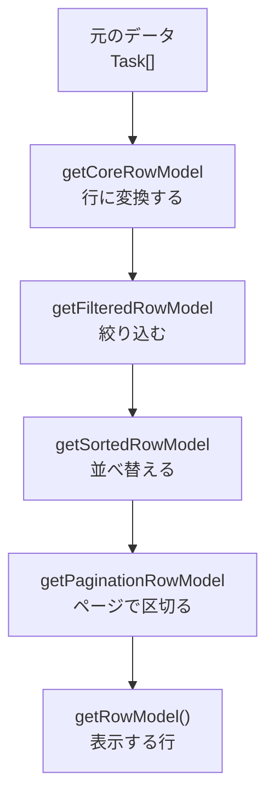

前章で作った表は、まだ何もできません。この章で、並び替え・絞り込み・ページ区切り・行選択を足します。

作業のほとんどは、`useReactTable`に渡すオプションを増やすだけです。ただ、その裏にある仕組みを理解しておかないと、「なぜ動かないのか」で詰まります。まずRow Modelから見ます。

## Row Modelという仕組み

TanStack Tableは、元のデータを段階的に加工して、最終的に表示する行を作ります。この各段階がRow Modelです。



順番に意味があります。絞り込みが先で、並び替えが後です。だから「絞り込んだ結果を並び替える」という自然な結果になります。ページ区切りが最後なので、「絞り込んで並べ替えた結果の2ページ目」が得られます。

この順番はライブラリが決めています。開発者がすることは、必要な段階を渡すことだけです。

```tsx
const table = useReactTable({
  data: tasks,
  columns,
  getCoreRowModel: getCoreRowModel(),
  getSortedRowModel: getSortedRowModel(),
  getFilteredRowModel: getFilteredRowModel(),
  getPaginationRowModel: getPaginationRowModel(),
});
```

渡さなかった段階は、単に飛ばされます。`getSortedRowModel`を渡していないテーブルでヘッダーをクリックしても、何も起きません。「並び替えのコードを書いたのに動かない」という相談の多くは、これが原因です。

:::message
なぜ最初から全部入っていないのでしょうか。使わない機能のコードを、アプリのバンドルに含めないためです。

並び替えのロジックは、文字列・数値・日付それぞれの比較を持ち、複数列の並び替えにも対応しています。決して小さくありません。絞り込みも同様です。並び替えだけを使うテーブルに、絞り込みのコードは要りません。

必要なものを明示的に渡す形は、最初は面倒に見えます。その代わり、シンプルな表はシンプルなサイズで済みます。
:::

## テーブルの状態

並び替えや絞り込みの「いまの状態」は、どこにあるのでしょうか。

TanStack Tableは、内部に状態を持っています。何も指定しなければ、ヘッダーのクリックで内部の並び替え状態が変わり、表が並べ替わります。この形をUncontrolled（非制御）と呼びます。

一方、状態を自分で持つこともできます。

```tsx
const [sorting, setSorting] = useState<SortingState>([]);

const table = useReactTable({
  // ...
  state: { sorting },
  onSortingChange: setSorting,
});
```

`state`で現在の値を渡し、`onSortingChange`で変更を受け取ります。Reactのフォーム部品と同じ、Controlled（制御）の形です。

本書では、Controlledを基本にします。理由は、状態を自分で持っていれば外に出せるからです。

- 選択された行の件数を、テーブルの外に表示したい
- 並び替えの条件をURLに載せたい
- 絞り込み条件をサーバーへ送りたい

どれも、状態が手元にないとできません。次章でサーバーサイド処理に進むとき、この形が前提になります。

| | Uncontrolled | Controlled |
|---|---|---|
| 状態の持ち主 | テーブルの内部 | 自分の`useState` |
| 書く量 | 少ない | 少し増える |
| 外から読める | 読めない | 読める |
| URLに載せる | できない | できる |

初期値だけ決めたい場合は、`initialState`を使います。Controlledにしなくても済むので、ページサイズのような値に向いています。

```tsx
initialState: { pagination: { pageSize: 10 } },
```

## 並び替え

ヘッダーをクリックできるようにします。先に、並び順を支援技術へ伝えるための小さな変換関数を用意します。

```tsx
/** getIsSorted() の戻り値を aria-sort の値に変換する */
function ariaSort(sorted: false | 'asc' | 'desc') {
  if (sorted === 'asc') return 'ascending';
  if (sorted === 'desc') return 'descending';
  return 'none';
}
```

そのうえで、ヘッダーのセルを組みます。

```tsx
{headerGroup.headers.map((header) => {
  const sorted = header.column.getIsSorted();
  return (
    <th key={header.id} scope="col" aria-sort={ariaSort(sorted)}>
      {header.column.getCanSort() ? (
        <button type="button" onClick={header.column.getToggleSortingHandler()}>
          {flexRender(header.column.columnDef.header, header.getContext())}
          {sorted === 'asc' && ' ▲'}
          {sorted === 'desc' && ' ▼'}
        </button>
      ) : (
        flexRender(header.column.columnDef.header, header.getContext())
      )}
    </th>
  );
})}
```

使っているものを整理します。

| API | 役割 |
|---|---|
| `column.getCanSort()` | その列が並び替え可能か |
| `column.getToggleSortingHandler()` | クリックで並び順を切り替える関数 |
| `column.getIsSorted()` | `false` / `'asc'` / `'desc'` |

`getCanSort()`で分岐しているのは、`display`の列（チェックボックスなど）を並び替え対象から外すためです。値を持たない列に並び替えのボタンを出しても意味がありません。

クリックのたびに、昇順 → 降順 → 解除 → 昇順と巡ります。この3段目の「解除」を含めるかどうかは`enableSortingRemoval`で変えられます。

並び替えの実装は、`<button>`で包むのがおすすめです。`<th>`に`onClick`を付けるだけでは、キーボードで操作できません。`aria-sort`を添えると、支援技術に現在の並び順が伝わります。

### 比較方法の指定

TanStack Tableは、値の型を見て比較方法を自動で選びます。文字列なら辞書順、数値なら大小です。

日本語の並び替えには注意が必要です。既定の比較では、ひらがなや漢字の順序が期待と違うことがあります。列ごとに`sortingFn`で指定できます。

```tsx
columnHelper.accessor('assignee', {
  header: '担当',
  sortingFn: (a, b) =>
    a.original.assignee.localeCompare(b.original.assignee, 'ja'),
});
```

そもそも、日本語を含むデータの並び替えはサーバー側に任せるほうが確実です。データベースの照合順序で処理できます。次章のサーバーサイド処理が、その形です。

## 絞り込み

絞り込みには2種類あります。

グローバルフィルタは、表全体を1つのキーワードで絞り込みます。列ごとのフィルタは、その列だけに条件を当てます。

```tsx
const [globalFilter, setGlobalFilter] = useState('');

const table = useReactTable({
  // ...
  state: { globalFilter },
  onGlobalFilterChange: setGlobalFilter,
  getFilteredRowModel: getFilteredRowModel(),
});
```

```tsx
<input
  value={globalFilter}
  onChange={(event) => setGlobalFilter(event.target.value)}
  placeholder="キーワードで絞り込む"
/>
```

これだけで、入力に応じて行が絞られます。既定では、すべての`accessor`列の値を文字列として含むかどうかで判定します。

列ごとのフィルタは、`column.setFilterValue()`で設定します。

```tsx
<input
  value={(table.getColumn('assignee')?.getFilterValue() as string) ?? ''}
  onChange={(event) => table.getColumn('assignee')?.setFilterValue(event.target.value)}
/>
```

判定方法を変えたい場合は、`filterFn`を指定します。完全一致、範囲、複数選択などを自分で書けます。

## ページ区切り

`getPaginationRowModel()`を渡すと、表示が指定件数で区切られます。操作は`table`のメソッドで行います。

```tsx
<button type="button" onClick={() => table.previousPage()} disabled={!table.getCanPreviousPage()}>
  前へ
</button>
<span>
  {table.getState().pagination.pageIndex + 1} / {table.getPageCount()}
</span>
<button type="button" onClick={() => table.nextPage()} disabled={!table.getCanNextPage()}>
  次へ
</button>
<select
  value={table.getState().pagination.pageSize}
  onChange={(event) => table.setPageSize(Number(event.target.value))}
>
  {[10, 20, 50].map((size) => (
    <option key={size} value={size}>{size}件</option>
  ))}
</select>
```

`pageIndex`は0から始まります。表示するときに`+ 1`しているのは、そのためです。ここを忘れると「1ページ目が0と表示される」バグになります。

`getPageCount()`が返すのは、絞り込み後の件数から計算したページ数です。キーワードで絞ると、ページ数も自動で減ります。

## 行の選択

チェックボックスの列を作ります。ヘッダーには全選択、各行には個別の選択を置きます。

```tsx
columnHelper.display({
  id: 'select',
  header: ({ table }) => (
    <input
      type="checkbox"
      aria-label="このページをすべて選択"
      checked={table.getIsAllPageRowsSelected()}
      ref={(element) => {
        if (element) element.indeterminate = table.getIsSomePageRowsSelected();
      }}
      onChange={table.getToggleAllPageRowsSelectedHandler()}
    />
  ),
  cell: ({ row }) => (
    <input
      type="checkbox"
      aria-label={`${row.original.title} を選択`}
      checked={row.getIsSelected()}
      onChange={row.getToggleSelectedHandler()}
    />
  ),
});
```

`header`に渡した関数は`table`を受け取り、`cell`に渡した関数は`row`を受け取ります。どちらも`flexRender`が呼び出してくれます。

ヘッダー側で`Page`の付いたメソッドを使っている点に注目してください。`getToggleAllRowsSelectedHandler()`という似た名前もありますが、こちらは絞り込み後の全行、つまり見えていない他のページの行まで選択します。「すべて選択」を押しただけで50件が選ばれるのは、たいていユーザーの期待とずれます。ページ内に限定する`Page`付きを既定にしてください。

`ref`で`indeterminate`を設定しているのは、一部だけ選ばれている状態を表すためです。HTMLのチェックボックスには「オン」と「オフ」しかなく、中間状態はJSXの属性では書けません。DOMのプロパティに直接代入する必要があります。これが無いと、20件中3件を選んだときにヘッダーが未選択のまま見えます。

選択状態も、他と同じくControlledにできます。

```tsx
const [rowSelection, setRowSelection] = useState<RowSelectionState>({});

const table = useReactTable({
  // ...
  getRowId: (row) => row.id,
  state: { rowSelection },
  onRowSelectionChange: setRowSelection,
});

const selectedCount = Object.keys(rowSelection).length;
```

`RowSelectionState`は`{ '3': true, '7': true }`のような形です。キーは行のIDです。

:::message alert
`getRowId`の指定を強くおすすめします。指定しないと、行のIDは配列の添字（`'0'`、`'1'`…）になります。

添字のままだと、並び替えたり絞り込んだりした瞬間に、選択が別の行へ移ります。「3件選んで並び替えたら、違う行が選ばれていた」という不具合です。

```tsx
getRowId: (row) => row.id,
```

元データのIDを使えば、行の位置が変わっても選択は正しく追随します。
:::

## 機能が絡み合うところ

複数の機能を入れると、状態どうしが干渉します。TanStack Tableが面倒を見てくれる部分と、自分で決める部分があります。

たとえば、3ページ目を見ている状態でキーワードを入力したとします。絞り込んだ結果が1ページ分しかなければ、3ページ目は空です。

これはライブラリが自動で処理します。絞り込みが変わると、ページ番号は先頭に戻されます。`autoResetPageIndex`という設定で、既定で有効です。切りたい場合は`autoResetPageIndex: false`を渡します。

一方、選択状態は絞り込みで消えません。絞り込みで見えなくなった行の選択も残ります。「選択したまま条件を変えて、さらに追加で選ぶ」という操作ができます。逆に、条件を変えたら選択を解除したい場合は、自分で`setRowSelection({})`を呼びます。

列の表示・非表示も、状態として管理されています。

```tsx
{table.getAllLeafColumns().map((column) => (
  <label key={column.id}>
    <input
      type="checkbox"
      checked={column.getIsVisible()}
      onChange={column.getToggleVisibilityHandler()}
    />
    {column.id}
  </label>
))}
```

前章で`getVisibleCells()`を使っていたのが、ここで効いてきます。隠した列のセルは、自動的に描画対象から外れます。

## クライアントサイド処理の限界

ここまでの処理は、すべてブラウザの中で行われています。`data`に渡した配列を、JavaScriptで絞り込み、並べ替え、切り出しています。

つまり、**全件が手元にある前提**です。

タスクが137件なら問題ありません。1万件でも、なんとか動きます。10万件になると、通信量も描画も現実的ではなくなります。

| 件数 | クライアントサイド処理 |
|---|---|
| 〜1,000件 | 快適に動く |
| 〜10,000件 | 動く。初回の通信は重い |
| 10,000件〜 | 通信・メモリ・描画が厳しい |

そして件数以外にも、クライアント側では正しく再現できない処理があります。日本語の並び順、全文検索の関連度順、権限による絞り込み。これらはサーバー側のロジックです。

次章では、絞り込みと並び替えをサーバーに任せる形へ切り替えます。TanStack Tableの状態管理はそのまま使い、計算だけをサーバーに移す構成です。

## まとめ

ソート、フィルタ、ページネーションの状態をTableへ渡すと、表示行の計算を一貫して管理できます。

- 機能はRow Modelの追加で有効になります。絞り込み → 並び替え → ページ区切りの順に処理されます。
- 必要なRow Modelを渡さないと、その機能は動きません。バンドルサイズのための設計です。
- 状態は内部に持たせることも、自分の`useState`で持つこともできます。外へ出したい情報があるならControlledにします。
- 並び替えは`getToggleSortingHandler`と`getIsSorted`で組みます。`<button>`で包み、`aria-sort`を添えます。
- 日本語の並び順は既定の比較で崩れることがあります。`sortingFn`で指定するか、サーバーに任せます。
- 絞り込みは、全体を1つのキーワードで絞るものと、列ごとに条件を当てるものがあります。
- `pageIndex`は0から始まります。表示では`+ 1`します。
- 行選択では`getRowId`を必ず指定します。添字のままだと並び替えで選択がずれます。
- 全選択のチェックボックスは`getToggleAllPageRowsSelectedHandler()`でページ内に限定し、`indeterminate`で中間状態を示します。
- クライアントサイド処理は全件が手元にある前提です。1万件を超えるあたりから成り立たなくなります。

次章では、この表をサーバーサイド処理へ切り替えます。Query・Router・Tableの3つが噛み合う、本書でもっとも実務的な構成です。
