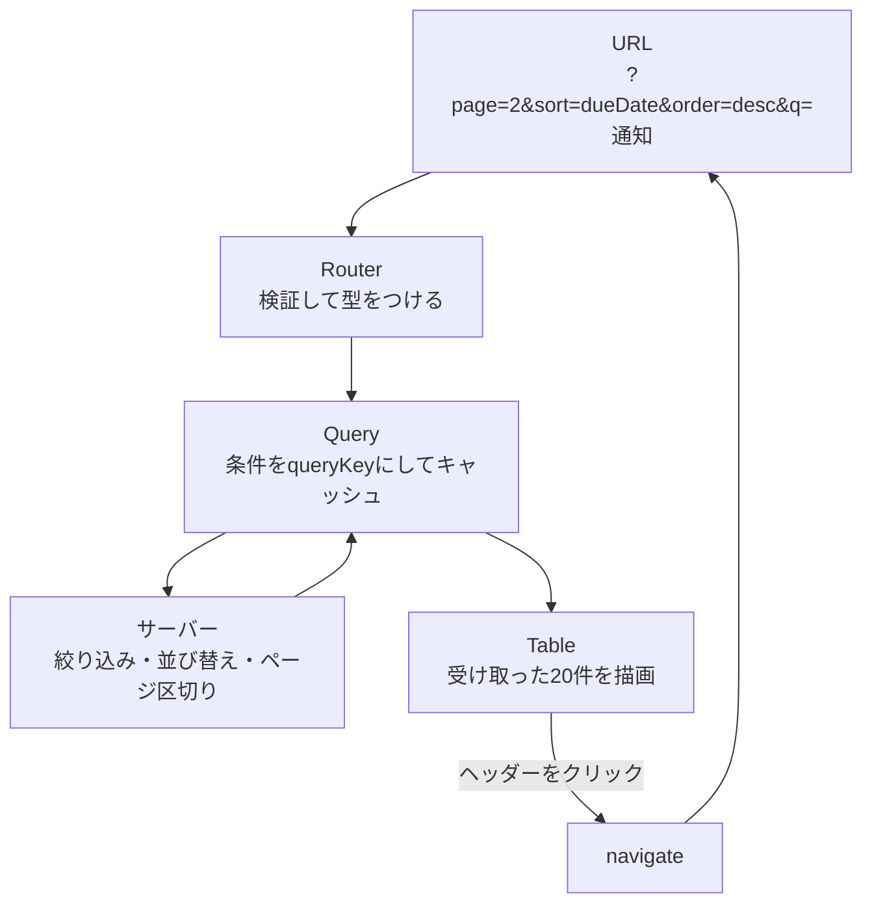

前章の表は、全件を手元に持つ前提でした。この章では、絞り込み・並び替え・ページ区切りの計算をサーバーへ移します。

そのとき、テーブルの状態はどこに置くべきでしょうか。答えはURLです。ここで、Query・Router・Tableの3つが噛み合います。本書でもっとも実務的な構成であり、これが組めれば管理画面の一覧はひととおり作れます。

## 何を誰に任せるか

役割を先に決めます。



| 担当 | 仕事 |
|---|---|
| URL | 表の状態を保持する。唯一の情報源 |
| Router | 条件を検証し、型をつける |
| Query | 条件ごとにキャッシュし、取得を管理する |
| サーバー | 絞り込み・並び替え・ページ区切りを計算する |
| Table | 受け取った行を描画し、操作をURLの変更に変換する |

Tableは計算をやめ、描画と操作の受け付けに専念します。状態も持ちません。URLから受け取るだけです。

## 手動モードに切り替える

`manual`で始まるオプションを渡すと、その処理をライブラリが行わなくなります。

```tsx
const table = useReactTable({
  data: data.items,
  columns,
  getRowId: (row) => row.id,
  getCoreRowModel: getCoreRowModel(),

  // 計算はサーバーに任せる
  manualPagination: true,
  manualSorting: true,
  manualFiltering: true,
  rowCount: data.total,

  state: { sorting, pagination },
  // ...
});
```

Row Modelが`getCoreRowModel`だけになりました。並び替えも絞り込みも、もうライブラリの仕事ではありません。

`rowCount`が重要です。手元にあるのは20件でも、全体は137件あります。この数を伝えないと、ライブラリはページ数を計算できません。`getPageCount()`が正しい値を返すために必要です。

:::message alert
`manualPagination: true`を指定して`rowCount`を渡し忘れると、`getPageCount()`が`-1`になります。「次へ」ボタンが常に押せる、あるいは常に押せない、といった症状が出ます。

APIが総件数を返さない設計の場合は、ページ数を表示できません。「次のページがあるか」だけを返す形にして、`getCanNextPage()`の代わりに自分で判定することになります。この点は、APIの設計段階で決めておくべきことです。
:::

## 状態をURLから受け取る

テーブルの状態を、URLの検索条件から組み立てます。まずスキーマです。

```tsx
const sortKeys = ['title', 'status', 'assignee', 'dueDate'] as const;

const taskSearchSchema = z.object({
  page: z.number().int().min(1).default(1).catch(1),
  perPage: z.number().int().min(1).max(100).default(20).catch(20),
  status: z.enum(['all', 'todo', 'doing', 'done']).default('all').catch('all'),
  q: z.string().optional().catch(undefined),
  sort: z.enum(sortKeys).default('dueDate').catch('dueDate'),
  order: z.enum(['asc', 'desc']).default('asc').catch('asc'),
});
```

`sort`を`z.enum(sortKeys)`で縛っているのは、並び替えできる列を限定するためです。URLに`?sort=password`と書かれても、既定値に倒れます。サーバーへ渡す値を、クライアント側で先に絞っておく防御です。

`perPage`に`max(100)`を付けているのも同じ理由です。`?perPage=99999`で全件取得されるのを防ぎます。

次に、URLの値をテーブルが理解する形へ変換します。

```tsx
const search = Route.useSearch();

const sorting = useMemo<SortingState>(
  () => [{ id: search.sort, desc: search.order === 'desc' }],
  [search.sort, search.order],
);

const pagination = useMemo<PaginationState>(
  () => ({ pageIndex: search.page - 1, pageSize: search.perPage }),
  [search.page, search.perPage],
);

const table = useReactTable({
  // ...
  state: { sorting, pagination },
});
```

`page`は1から、`pageIndex`は0から始まります。境界で`- 1`を入れるのは、この差を吸収するためです。URLは人が読むものなので1始まり、内部は0始まり。両方の都合を、この1行で橋渡ししています。

`useMemo`で包んでいるのは、`state`に渡す値の参照を安定させるためです。包まずに書くと、レンダリングのたびに新しい配列とオブジェクトが生まれます。URLが1文字も変わっていないのに、テーブルから見れば毎回「状態が差し替わった」ことになります。行数が多い画面では、これが目に見える重さになります。

## 操作をURLの変更に変える

ヘッダーをクリックしたら、並び替え条件をURLへ書き込みます。`onSortingChange`で受け取ります。

```tsx
onSortingChange: (updater) => {
  const next = typeof updater === 'function' ? updater(sorting) : updater;
  const first = next[0];
  navigate({
    search: (prev) => ({
      ...prev,
      // 列IDはstringなので、スキーマと同じ候補から選び直す
      sort: sortKeys.find((key) => key === first?.id) ?? 'dueDate',
      order: first?.desc ? 'desc' : 'asc',
      page: 1,
    }),
  });
},
```

`updater`が関数か値のどちらかで来る点に注意してください。Reactの`setState`と同じ形です。関数なら現在の値を渡して呼び出します。この判定を書き忘れると、関数がそのまま状態に入って壊れます。

`sort`に`first.id`をそのまま入れていないのも意図があります。テーブルが返す列IDは`string`で、スキーマで絞った4つとは別の型です。「Search ParamsとURL状態」の章の`<select>`と同じで、`as`でごまかさず`find`で候補から選び直します。こうしておけば、並び替え可能な列を増減したときに、直し忘れた箇所が型エラーとして出ます。

`page: 1`を混ぜているのは、並び順が変わったら先頭ページへ戻すためです。前章では`autoResetPageIndex`が自動でやってくれましたが、状態を自分で持つ形では自分で書きます。

ページ送りも同じ形です。

```tsx
onPaginationChange: (updater) => {
  const next = typeof updater === 'function' ? updater(pagination) : updater;
  navigate({
    search: (prev) => ({
      ...prev,
      page: next.pageIndex + 1,
      perPage: next.pageSize,
    }),
  });
},
```

これで、`table.nextPage()`を呼ぶだけでURLが変わり、Queryが新しい条件で取得します。テーブルのAPIをそのまま使いながら、実際の動きはURL経由になります。

## キーワード入力の扱い

キーワード検索は、少し配慮が必要です。1文字打つたびにURLを変えると、履歴が文字数だけ積まれます。

```tsx
<input
  defaultValue={search.q ?? ''}
  placeholder="キーワードで絞り込む"
  onChange={(event) => {
    navigate({
      search: (prev) => ({ ...prev, q: event.target.value || undefined, page: 1 }),
      replace: true,
    });
  }}
/>
```

`replace: true`で、履歴を積まずに現在のURLを置き換えています。戻るボタンが1文字ずつ戻る問題を避けられます。

`value`ではなく`defaultValue`にしているのも意図があります。`value`にすると、URLの更新が入力に反映されるまでの間、カーソルが飛ぶことがあります。入力欄の値は入力欄自身に持たせ、URLへは一方向に流すほうが素直に動きます。

実務では、ここにデバウンスを入れます。入力が止まってから300ミリ秒後にURLを更新する形です。TanStack Pacerのようなライブラリを使うか、`setTimeout`で自作します。

:::message
`q: event.target.value || undefined`と書いているのは、空文字のときにURLからパラメータを消すためです。`?q=`という無意味なパラメータが残るのを防ぎます。

`undefined`を渡すとURLから消える、という挙動は覚えておくと便利です。「条件をクリアする」操作は、`undefined`を渡すだけで書けます。
:::

## 全体を組み上げる

ルート定義は、こうなります。

```tsx
export const Route = createFileRoute('/_authenticated/tasks/')({
  validateSearch: taskSearchSchema,
  search: {
    middlewares: [retainSearchParams(['status', 'q', 'sort', 'order', 'perPage'])],
  },
  loaderDeps: ({ search }) => search,
  loader: ({ context, deps }) => context.queryClient.ensureQueryData(taskQueries.list(deps)),
  component: TaskTablePage,
});
```

`loaderDeps: ({ search }) => search`で、検索条件をまるごと依存として宣言しています。条件が1つでも変われば、Loaderが走ります。

`taskQueries.list(deps)`に渡す`deps`は、そのまま`queryKey`の一部になります。URLの条件が、キャッシュの住所になりました。

コンポーネント側は`useSuspenseQuery`で読みます。

```tsx
const search = Route.useSearch();
const { data } = useSuspenseQuery(taskQueries.list(search));
```

Loaderとコンポーネントが同じ引数で同じ定義を呼ぶので、キャッシュは1つです。通信も1回です。

### 得られたもの

この構成で、次のことが自然に成立します。

- 絞り込んで並べ替えた3ページ目のURLを、そのまま共有できる
- リロードしても同じ表が出る
- 戻るボタンで前の条件に戻れる
- 同じ条件に戻ったときはキャッシュから即座に表示される
- 一覧のリンクにホバーすると、詳細の取得が始まっている

どれも個別に実装した機能ではありません。状態をURLに置き、キャッシュをQueryに任せた結果として付いてきたものです。

## ページ切り替えを滑らかにする

サーバーサイド処理では、ページを変えるたびに通信が発生します。その待ち時間をどう見せるかは、Loaderの書き方とセットで決まります。

いまの`loader`は`ensureQueryData`の結果を返しているので、Routerがそれを待ちます。「次へ」を押しても画面はすぐには変わらず、前のページが表示されたまま止まります。`pendingMs`の既定は1秒なので、400ミリ秒で返る本書のモックでは読み込み表示すら出ません。この時点で、すでにちらつきは起きていません。

では`placeholderData`は要らないのかというと、そうではありません。`await`をやめて画面を先に切り替える設計にすると、事情が変わります。

```tsx
// 遷移を待たせず、先に画面を出す
loader: ({ context, deps }) => {
  context.queryClient.prefetchQuery(taskQueries.list(deps));
},
```

こうすると画面はすぐ切り替わり、データがまだ無いので`useSuspenseQuery`が中断します。表全体が読み込み表示に置き換わるため、ページを送るたびに枠ごと消えます。ここで`useQuery`へ切り替えて`placeholderData`を使うと、前のページを見せたまま中身だけを差し替えられます。

```tsx
const { data, isPlaceholderData } = useQuery({
  ...taskQueries.list(search),
  placeholderData: keepPreviousData,
});
```

`isPlaceholderData`が`true`の間は表を薄く表示し、「次へ」を無効にします。ページネーションの章で扱った手法が、そのまま使えます。

3つの組み合わせを並べます。

| Loader + フック | クリック直後の見え方 |
|---|---|
| `await ensureQueryData` + `useSuspenseQuery` | 前の画面のまま待つ。遅ければ`pendingComponent` |
| `prefetchQuery` + `useSuspenseQuery` | 画面は切り替わり、表が読み込み表示になる |
| `prefetchQuery` + `useQuery` + `placeholderData` | 画面は切り替わり、前のページが薄く残る |

取得が数百ミリ秒で終わるなら1つめで足ります。1秒を超えるようなら、枠だけ先に見せる2つめか3つめが向きます。表の行数が多い画面では、レイアウトが跳ねない3つめがもっとも落ち着いて見えます。

## サーバー側は何を受け取るか

クライアント側の話に集中してきましたが、サーバー側の契約も確認しておきます。本書のモックは、次のパラメータを解釈します。

| パラメータ | 例 | 役割 |
|---|---|---|
| `page` | `2` | 何ページ目か（1始まり） |
| `perPage` | `20` | 1ページの件数 |
| `status` | `todo` | 状態で絞り込む |
| `q` | `通知` | タイトルと担当者を部分一致で絞り込む |
| `sort` | `dueDate` | 並び替えの列 |
| `order` | `desc` | 並び順 |

そして返すのは、切り出した`items`と、**絞り込み後の総件数**`total`です。

```json
{ "items": [ /* 20件 */ ], "total": 46, "page": 2, "perPage": 20 }
```

`total`が「絞り込み後」であることが重要です。全体の137件を返してしまうと、キーワードで絞ったのにページ数が変わらない、という表示になります。モックの実装も、絞り込みを適用したあとの配列の長さを返しています。

```ts
const items = filterTasks(url); // 絞り込み＋並び替え
const start = (page - 1) * perPage;

return HttpResponse.json({
  items: items.slice(start, start + perPage),
  total: items.length, // 絞り込み後の件数
  page,
  perPage,
});
```

実際のAPIをこれから設計するなら、この形を先に決めておくと、フロントエンド側の実装が素直になります。逆に既存のAPIに合わせる場合は、レスポンスの形に応じて`rowCount`の渡し方を調整します。

## 設計のチェックリスト

サーバーサイドテーブルを組むときに確認したい項目を並べます。

- 状態をURLに置いたか。`useState`との二重管理になっていないか
- 並び替え可能な列を、スキーマで限定したか
- `perPage`に上限を設けたか
- `rowCount`をAPIの総件数から渡しているか
- `pageIndex`と`page`の1つのずれを、境界で吸収しているか
- 条件を変えたときにページを1へ戻しているか
- キーワード入力で履歴を積んでいないか（`replace: true`）
- `getRowId`を指定したか
- 選択状態をURLに載せるか、それとも`useState`に留めるか決めたか

最後の項目は判断が必要です。選択した行のIDをURLに載せると共有できますが、100件選ぶとURLが長くなりすぎます。「選択して一括操作する」までの一時的な状態なら、`useState`で持つのが現実的です。

## まとめ

データ量が増えたら、ソート、絞り込み、ページ区切りをサーバーへ移し、Tableには結果と総件数を渡します。

- 役割を分けます。URLが状態を持ち、Routerが検証し、Queryがキャッシュし、サーバーが計算し、Tableが描画します。
- `manualPagination`・`manualSorting`・`manualFiltering`で、ライブラリの計算を止めます。
- `rowCount`にAPIの総件数を渡します。渡さないとページ数が計算できません。
- 並び替え可能な列と`perPage`の上限を、スキーマで縛ります。URLからの不正な値を防げます。
- `page`は1始まり、`pageIndex`は0始まりです。境界で変換します。
- `onSortingChange`と`onPaginationChange`で操作を受け取り、`navigate`でURLを変えます。`updater`が関数の場合を忘れないでください。
- ページ切り替えの見せ方は、Loaderで`await`するかどうかとセットで決まります。前のページを残したいなら`prefetchQuery`＋`useQuery`＋`placeholderData`です。
- キーワード入力は`replace: true`で履歴を積まないようにし、実務ではデバウンスを入れます。
- `undefined`を渡すと、その条件はURLから消えます。
- 共有・リロード・戻る・キャッシュ・先読みが、設計の結果として付いてきます。

次章では、行数そのものに向き合います。1ページに1000行を表示したいとき、DOMの量が問題になります。TanStack Virtualで仮想化します。
