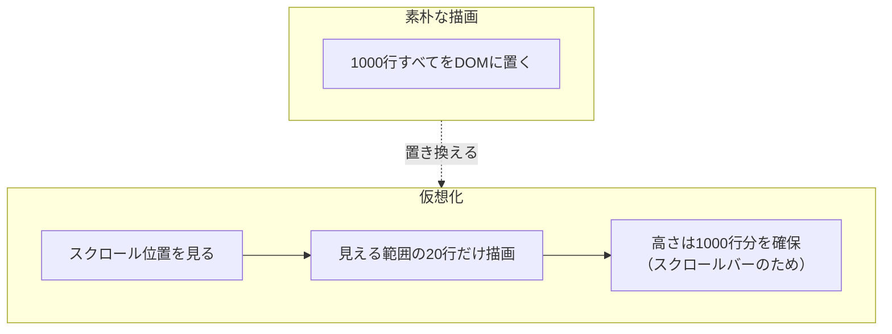

前章で、サーバーサイド処理によって「1万件のうち20件だけ受け取る」形にしました。通信の問題はこれで解決します。

ただ、別の要求もあります。「ページ送りせずに、全部スクロールで見たい」「1画面に500行出したい」。この場合、受け取る件数は減らせません。減らせるのは、描画する要素の数です。

この章では、TanStack Virtualで仮想化を実装します。

## DOMが多いと何が起きるか

1000行の表を素朴に描画すると、`<tr>`が1000個、セルが5000個できます。

ブラウザは、この要素すべてについて、位置とサイズを計算し、スタイルを適用し、画面に描きます。要素が増えれば、その作業量も比例して増えます。

症状は段階的に現れます。

| 行数 | 起きること |
|---|---|
| 〜100行 | 問題なし |
| 〜1,000行 | 初期表示が少し遅い。スクロールは動く |
| 〜5,000行 | 初期表示が明らかに遅い。スクロールがぎこちない |
| 10,000行〜 | 操作が固まる。メモリ使用量も膨らむ |

とくに厄介なのが、行の中に部品が多い場合です。1行にボタン、バッジ、アイコン、リンクが入っていると、行数の何倍もの要素が生まれます。1000行でも1万要素を超えます。

## 仮想化という解決策

考え方は単純です。**見えている範囲だけを描画する**。

500行のうち、画面に映るのは20行程度です。残りの480行は、スクロールされるまで存在する必要がありません。



3つの仕掛けで成り立っています。

1つめは、スクロールする箱の高さを固定することです。この箱の中でスクロールが発生します。

2つめは、中身の高さを全行分にすることです。1000行 × 40ピクセル = 4万ピクセルの高さを持つ空の箱を用意します。これがスクロールバーの長さを決めます。

3つめは、見える範囲の行だけを絶対配置で置くことです。スクロール位置から「いま見えているのは37行目から57行目」と計算し、その行だけを正しい位置に描画します。

## TanStack VirtualもHeadless

TanStack Virtualが提供するのは、計算だけです。

- 全体の高さはいくらか
- いま何番目から何番目を描画すべきか
- 各行をどの位置に置くべきか

これらの数値を返します。実際のマークアップとスタイルは、開発者が書きます。TableやFormと同じ思想です。

```sh
npm i @tanstack/react-virtual
```

## 最初の仮想化

タスクの一覧を仮想化します。

```tsx:src/features/tasks/components/VirtualTaskList.tsx
import { useRef } from 'react';
import { useVirtualizer } from '@tanstack/react-virtual';
import type { Task } from '../types';

export function VirtualTaskList({ tasks }: { tasks: Task[] }) {
  const scrollRef = useRef<HTMLDivElement>(null);

  const virtualizer = useVirtualizer({
    count: tasks.length,
    getScrollElement: () => scrollRef.current,
    estimateSize: () => 40,
    overscan: 8,
  });

  return (
    <div ref={scrollRef} style={{ height: 480, overflowY: 'auto' }}>
      <div style={{ height: virtualizer.getTotalSize(), position: 'relative' }}>
        {virtualizer.getVirtualItems().map((virtualRow) => {
          const task = tasks[virtualRow.index];
          return (
            <div
              key={virtualRow.key}
              style={{
                position: 'absolute',
                top: 0,
                left: 0,
                width: '100%',
                height: virtualRow.size,
                transform: `translateY(${virtualRow.start}px)`,
              }}
            >
              {task.title}（{task.assignee}）
            </div>
          );
        })}
      </div>
    </div>
  );
}
```

要素の入れ子が3層になっています。それぞれ役目が違います。

| 層 | 役目 |
|---|---|
| 外側（`scrollRef`） | スクロールする箱。高さを固定する |
| 内側 | 全行分の高さを持つ器。スクロールバーの長さを決める |
| 各行 | 絶対配置で、計算された位置に置く |

`useVirtualizer`に渡すオプションを見ます。

`count`は全体の件数です。`getScrollElement`は、スクロールする要素を返す関数です。`estimateSize`は各行の高さの見積もりで、固定サイズならその値をそのまま返します。

返ってくる`virtualizer`から、2つを使います。`getTotalSize()`が全体の高さ、`getVirtualItems()`が描画すべき行の情報です。

各行の情報には`index`（何番目か）、`start`（上端の位置）、`size`（高さ）、`key`が入っています。`transform: translateY()`で位置を指定するのは、`top`を直接動かすよりブラウザの負荷が軽いためです。

### overscanの役割

`overscan: 8`は、見えている範囲の前後に余分に描画する行数です。

これが0だと、スクロールした瞬間に新しい行の描画が始まります。速くスクロールすると、描画が追いつかず空白が見えます。

前後に8行ずつ余分に持っておけば、スクロールで現れる行はすでに描画済みです。値を増やせば空白は出にくくなりますが、描画する要素も増えます。10前後から始めて、実際の見え方で調整するのが実際的です。

## 高さが一定でない場合

行の高さがバラバラの場合、見積もりだけでは正しく配置できません。実際の高さを測る必要があります。

```tsx
<div
  key={virtualRow.key}
  data-index={virtualRow.index}
  ref={virtualizer.measureElement}
  style={{
    position: 'absolute',
    top: 0,
    left: 0,
    width: '100%',
    transform: `translateY(${virtualRow.start}px)`,
  }}
>
  <h3>{task.title}</h3>
  <p>{task.description}</p>
</div>
```

3か所変わっています。

`ref={virtualizer.measureElement}`で、その要素の実際の高さを測ります。測った値をもとに、全体の高さと各行の位置が再計算されます。

`data-index`が必須です。`measureElement`は、この属性で「どの行を測っているのか」を知ります。付け忘れると、正しく動きません。

そして、`style`から`height`を外します。高さを固定してしまうと、中身に応じて伸びなくなり、測る意味がなくなります。

`estimateSize`は、測る前の暫定値として使われます。実際の平均に近い値を返すほど、スクロールバーの挙動が自然になります。

## テーブルの行を仮想化する

前章までに作ったテーブルと組み合わせます。TanStack Tableが行の配列を作り、TanStack Virtualがそのうち描画する範囲を決めます。

```tsx
const rows = table.getRowModel().rows;

const virtualizer = useVirtualizer({
  count: rows.length,
  getScrollElement: () => scrollRef.current,
  estimateSize: () => 36,
  overscan: 10,
});
```

```tsx
<div ref={scrollRef} style={{ height: 480, overflowY: 'auto' }}>
  <table style={{ display: 'grid' }}>
    <thead style={{ display: 'grid', position: 'sticky', top: 0, zIndex: 1 }}>
      {table.getHeaderGroups().map((headerGroup) => (
        <tr key={headerGroup.id} style={{ display: 'flex', width: '100%' }}>
          {headerGroup.headers.map((header) => (
            <th key={header.id} scope="col" style={{ flex: 1 }}>
              {flexRender(header.column.columnDef.header, header.getContext())}
            </th>
          ))}
        </tr>
      ))}
    </thead>

    <tbody
      style={{
        display: 'grid',
        height: virtualizer.getTotalSize(),
        position: 'relative',
      }}
    >
      {virtualizer.getVirtualItems().map((virtualRow) => {
        const row = rows[virtualRow.index];
        return (
          <tr
            key={row.id}
            style={{
              display: 'flex',
              position: 'absolute',
              top: 0,
              left: 0,
              width: '100%',
              height: virtualRow.size,
              transform: `translateY(${virtualRow.start}px)`,
            }}
          >
            {row.getVisibleCells().map((cell) => (
              <td key={cell.id} style={{ flex: 1 }}>
                {flexRender(cell.column.columnDef.cell, cell.getContext())}
              </td>
            ))}
          </tr>
        );
      })}
    </tbody>
  </table>
</div>
```

`table.getRowModel().rows`を直接`map`するのをやめ、`getVirtualItems()`の`index`で行を取り出しています。この置き換えが仮想化の本体です。

:::message alert
見慣れない`display: grid`が並んでいるのには、理由があります。

`<tbody>`の既定の表示形式は`table-row-group`です。この状態では、`height`も`position: relative`も効きません。全行分の高さを確保する器として使えないのです。同じように、`<tr>`を絶対配置しても、テーブルのレイアウト計算からは抜けられません。

そこで、`<table>`・`<thead>`・`<tbody>`に`display: grid`、`<tr>`に`display: flex`を指定して、テーブル本来のレイアウトから抜けています。ここを省くと、行がすべて同じ位置に重なるか、スクロールバーが出ない画面になります。仮想化した`<table>`が動かないという相談は、たいていここが原因です。

代償として、列幅の自動調整が働かなくなります。`flex: 1`を使っているのはその埋め合わせで、幅は自分で配分しています。厳密に制御したい場合は、TanStack Tableの`column.getSize()`が返す値を`width`に当てます。

ここまでするなら`<table>`をやめて`<div>`のグリッドで組む、という選択もあります。TanStack Tableは`<table>`要素に依存しないので、そのまま使えます。仮想化と`<table>`の相性は、あらかじめ知っておくと設計を誤りません。
:::

## 無限スクロールと組み合わせる

「ページネーションの章」で作った`useInfiniteQuery`と、仮想化は自然に噛み合います。

`useInfiniteQuery`が取得したページを平坦化して、その配列を仮想化します。そして、末尾に近づいたら次のページを読み込みます。

```tsx
const items = data.pages.flatMap((page) => page.items);

const virtualizer = useVirtualizer({
  count: items.length,
  getScrollElement: () => scrollRef.current,
  estimateSize: () => 40,
  overscan: 10,
});

const virtualItems = virtualizer.getVirtualItems();
const lastItem = virtualItems[virtualItems.length - 1];

useEffect(() => {
  if (!lastItem) return;
  if (lastItem.index >= items.length - 5 && hasNextPage && !isFetchingNextPage) {
    fetchNextPage();
  }
}, [lastItem, items.length, hasNextPage, isFetchingNextPage, fetchNextPage]);
```

描画している最後の行が、全体の末尾5件以内に入ったら次を取得します。IntersectionObserverを使う方法もありますが、仮想化している場合は`getVirtualItems()`の中身を見るほうが素直です。監視用の要素を置く必要がありません。

これで、10万件のデータを、20行のDOMで、待ち時間なくスクロールできる一覧ができます。

## 横方向とグリッド

仮想化は縦だけではありません。

`horizontal: true`を渡すと、横方向の仮想化になります。列が数百ある表で使います。

縦横の両方を仮想化する場合は、`useVirtualizer`を2つ使い、行と列のそれぞれに適用します。表計算のような画面で必要になります。

## 特定の行へ飛ぶ

仮想化すると、目的の行がDOMに存在しないことがあります。`scrollIntoView`は使えません。

`virtualizer`のメソッドで移動します。

```tsx
// 300番目の行を画面の中央に表示する
virtualizer.scrollToIndex(300, { align: 'center' });

// 先頭へ戻る
virtualizer.scrollToOffset(0);
```

「検索結果の行までジャンプする」「編集後にその行へ戻る」といった動きは、この方法で実装します。

## 効果を測ってみる

仮想化の効果は、開発者ツールで確認できます。

Elementsパネルで`<tbody>`を開き、`<tr>`の数を数えてください。1000件のデータを渡していても、20〜40個しかありません。`overscan`の値を変えると、この数が増減します。

Performanceパネルで記録しながらスクロールすると、フレームの落ち方が見えます。仮想化を外した状態と比べると、差がはっきりします。`useVirtualizer`を使う前のコードに一時的に戻して、両方を測ってみてください。数字で見ると、導入すべき規模の感覚がつかめます。

## 導入する基準

仮想化には、失うものもあります。

- ブラウザの「ページ内検索」が、描画されていない行を見つけられません
- 印刷すると、見えている範囲しか出ません
- 実装が複雑になり、CSSの制約も増えます

したがって、必要になってから入れるべき機能です。判断の目安を挙げます。

| 状況 | 判断 |
|---|---|
| 1画面に100行以下 | 不要 |
| 数百行だが、行の中身が単純 | たいてい不要 |
| 数百行で、行に部品が多い | 検討する |
| 1000行以上を一度に表示する | 導入する |
| ページネーションで区切れる | まずそちらを検討する |

順番としては、ページネーションかサーバーサイド処理で件数を減らすのが先です。それでも「一度に全部見せたい」という要件が残ったときに、仮想化を選びます。

## まとめ

仮想化では、全件のデータを保ったまま、画面に見える行だけをDOMへ描画します。

- DOMの要素数が増えると、初期表示とスクロールが重くなります。行の中の部品が多いほど早く限界が来ます。
- 仮想化は、見えている範囲だけを描画し、全体の高さだけを確保する手法です。
- TanStack Virtualは計算だけを提供します。マークアップは開発者が書きます。
- 3層の構造を作ります。スクロールする箱、全行分の高さを持つ器、絶対配置された各行です。
- `getTotalSize()`で全体の高さ、`getVirtualItems()`で描画対象を取得します。位置は`transform`で指定します。
- `overscan`で前後に余分に描画し、スクロール時の空白を防ぎます。
- 高さが一定でない場合は`measureElement`と`data-index`で実測します。`height`の指定は外します。
- テーブルの行を仮想化するときは、`<table>`・`<thead>`・`<tbody>`に`display: grid`、`<tr>`に`display: flex`を指定します。既定の`table-row-group`では`height`が効きません。列幅は自分で配分します。
- `useInfiniteQuery`と組み合わせるときは、描画中の最後の行の位置で次ページを取得します。
- まずページネーションで件数を減らし、それでも足りないときに導入します。

ここまでで、データの取得から表示までがそろいました。次章から、ユーザーからの入力を扱います。TanStack Formでフォームを組み立てます。
