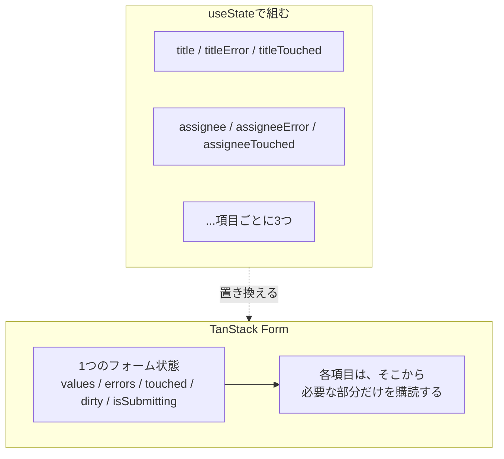

状態の4分類のうち、最後に残ったのがフォーム状態です。

サーバー状態はQueryへ、URL状態はRouterへ預けました。フォームの入力途中の値は、どちらでもありません。送信するまではサーバーのものではなく、URLに載せるものでもありません。この短命な状態を扱うのがTanStack Formです。

## フォームはなぜ複雑になるのか

タスクを作成するフォームを`useState`で書くと、こうなります。

```tsx
const [title, setTitle] = useState('');
const [description, setDescription] = useState('');
const [priority, setPriority] = useState<TaskPriority>('medium');
const [assignee, setAssignee] = useState('');
const [dueDate, setDueDate] = useState('');
```

まだ値だけです。ここに検証を足します。

```tsx
const [titleError, setTitleError] = useState<string | null>(null);
const [assigneeError, setAssigneeError] = useState<string | null>(null);
```

さらに「一度も触っていない項目にエラーを出さない」という配慮を入れます。

```tsx
const [titleTouched, setTitleTouched] = useState(false);
const [assigneeTouched, setAssigneeTouched] = useState(false);
```

そして「変更があったときだけ確認ダイアログを出す」ために、初期値との比較が必要になります。送信中の状態も要ります。

項目が5つのフォームで、状態が15個近くになりました。項目を1つ足すたびに、3つの`useState`と検証のコードが増えます。

問題は数だけではありません。これらが**互いに関係している**ことです。「パスワードと確認用パスワードが一致するか」は2つの値にまたがります。「送信ボタンを押せるか」は全項目の検証結果に依存します。関係を`useEffect`でつなぎ始めると、追いきれなくなります。

## TanStack Formの立場

TanStack Formは、フォーム全体の状態を1つのまとまりとして管理します。



そして、TableやVirtualと同じくHeadlessです。`<Input>`や`<FormField>`のようなコンポーネントは提供されません。提供されるのは、値・エラー・変更を扱う関数だけです。マークアップは自分で書きます。

もう1つの特徴が型安全です。項目名、各項目の値の型、検証エラーの形が、すべて型で守られます。`title`を`titel`と書けばコンパイルエラーです。

```sh
npm i @tanstack/react-form
```

## 最初のフォーム

`useForm`でフォームを作ります。

```tsx
import { useForm } from '@tanstack/react-form';

const form = useForm({
  defaultValues: {
    title: '',
    description: '',
    priority: 'medium',
    assignee: '',
    dueDate: '',
  },
  onSubmit: async ({ value, formApi }) => {
    await mutateAsync(value);
    formApi.reset();
  },
});
```

渡すものは2つです。`defaultValues`が初期値で、`onSubmit`が送信処理です。

`defaultValues`には特別な意味があります。**このオブジェクトの形が、フォームの型になります**。項目名と値の型が、ここから推論されます。別に型を宣言する必要はありません。

`onSubmit`が受け取る`value`には、検証を通った値が入っています。`await`できるので、Mutationをそのまま呼べます。

`formApi`は、いま送信しているフォーム自身です。`form`という変数を使わず`formApi`から`reset()`を呼んでいるのは、意味があります。`const form = useForm({ ... })`の中で`form`を参照すると、自分自身を定義しながら自分を使う形になり、TypeScriptの型推論が循環してしまいます。フォーム自身を触りたいときは`formApi`を使ってください。

### 入力欄をつなぐ

各項目は`form.Field`で扱います。

```tsx
<form.Field name="title">
  {(field) => (
    <div>
      <label htmlFor={field.name}>タイトル</label>
      <input
        id={field.name}
        name={field.name}
        value={field.state.value}
        onBlur={field.handleBlur}
        onChange={(event) => field.handleChange(event.target.value)}
      />
    </div>
  )}
</form.Field>
```

`form.Field`は、子として関数を受け取ります（Render Propsと呼ばれる書き方です）。その関数に`field`が渡され、そこから値と操作を取り出します。

| `field`の中身 | 意味 |
|---|---|
| `field.name` | 項目名（`id`や`htmlFor`に使える） |
| `field.state.value` | 現在の値 |
| `field.handleChange(値)` | 値を変更する |
| `field.handleBlur` | フォーカスが外れたことを伝える |
| `field.state.meta` | 触ったか、変更されたか、エラーなど |

`name`に渡す文字列は、`defaultValues`のキーに限定されます。

```tsx
<form.Field name="titel">  {/* 型エラー: そんな項目はない */}
```

そして、`field.state.value`と`field.handleChange`の型も項目ごとに決まります。`priority`の項目なら、`handleChange`に渡せるのは`'low' | 'medium' | 'high'`だけです。文字列なら何でも通る、ということはありません。

:::message
`field.handleBlur`を`onBlur`に渡すのを忘れないでください。これがないと「その項目に触ったかどうか」が記録されません。

`isTouched`を使ってエラー表示を制御している場合、触っていない扱いのままエラーが出ないままになります。「入力したのにエラーが表示されない」という不具合の原因になります。
:::

### なぜRender Propsなのか

`useField`というフックも用意されていますが、`form.Field`を使う理由があります。

再レンダリングの範囲です。`form.Field`は、その項目に関わる状態だけを購読します。`title`を入力しているとき、再レンダリングされるのは`title`の`Field`の中だけです。他の項目や、フォーム全体は描き直されません。

項目が30個あるフォームでも、1文字打つたびに30個すべてが再描画される、という事態を避けられます。この設計のために、Render Propsという形が選ばれています。

## フィールドのメタ情報

`field.state.meta`には、その項目の状況が入っています。

| プロパティ | 意味 |
|---|---|
| `isTouched` | 一度でも触ったか |
| `isDirty` | 初期値から変わったか |
| `isValidating` | 非同期の検証中か |
| `errors` | 検証エラーの配列 |

エラー表示の定番は、`isTouched`との組み合わせです。

```tsx
{field.state.meta.isTouched &&
  field.state.meta.errors.map((error) => (
    <p key={String(error?.message)} role="alert">
      {error?.message}
    </p>
  ))}
```

画面を開いた直後、すべての項目が空でエラーだらけになるのは不親切です。触った項目にだけエラーを出すことで、自然な体験になります。

:::message alert
`errors`の要素には、`undefined`が混ざりうる型が付いています。そのため`error?.message`のように書く必要があります。`error.message`と書くと「`error` is possibly `undefined`」と怒られます。

エラーの中身が`{ message: string }`という形になるのは、次章で扱うスキーマ検証を使った場合です。自分で書いた検証関数が文字列を返す場合は、その文字列がそのまま入ります。表示側でどちらを扱うのか、意識しておくと混乱しません。
:::

`isDirty`は、離脱の確認に使えます。「入力途中なのにページを離れようとした」ときの警告です。TanStack Routerには`useBlocker`という仕組みがあり、これと組み合わせられます。

## フォーム全体の状態

送信ボタンは、全項目の状況に依存します。「すべての検証を通っているか」「送信中か」を知る必要があります。

`form.Subscribe`を使います。

```tsx
<form.Subscribe selector={(state) => [state.canSubmit, state.isSubmitting] as const}>
  {([canSubmit, isSubmitting]) => (
    <button type="submit" disabled={!canSubmit}>
      {isSubmitting ? '作成中...' : '作成'}
    </button>
  )}
</form.Subscribe>
```

`selector`で必要な値だけを選びます。選んだ値が変わったときだけ、この部分が再レンダリングされます。Queryの`select`と同じ考え方です。

`canSubmit`は、検証を通っていて送信可能な状態を表します。`isSubmitting`は`onSubmit`の実行中です。この2つを見れば、ボタンの制御はほぼ足ります。

フォームの状態には、他にもこうした値があります。

| プロパティ | 意味 |
|---|---|
| `canSubmit` | 送信できる状態か |
| `isSubmitting` | 送信処理の実行中か |
| `isValid` | すべての検証を通っているか |
| `isDirty` | どこか1つでも変更されたか |
| `values` | 現在の全項目の値 |
| `submissionAttempts` | 送信を試した回数 |

`form.Subscribe`を使わず`form.state`を直接読むこともできますが、そうするとフォーム全体が再レンダリングの対象になります。必要な値だけを購読する形を基本にしてください。

## 送信する

`<form>`の`onSubmit`から、`form.handleSubmit()`を呼びます。

```tsx
<form
  onSubmit={(event) => {
    event.preventDefault();
    form.handleSubmit();
  }}
>
```

`event.preventDefault()`が必要です。これを忘れると、ブラウザ本来の送信が動いてページが再読み込みされます。

`handleSubmit`は、まず全項目の検証を実行します。通れば`useForm`に渡した`onSubmit`が呼ばれます。通らなければ、エラーが各項目に設定され、`onSubmit`は呼ばれません。

## 定義を共有する

作成フォームと編集フォームで、項目の構成は同じです。初期値の定義を2か所に書くと、片方だけ直す事故が起きます。

`formOptions`で切り出せます。Queryの`queryOptions`と同じ発想の道具です。

```ts:src/features/tasks/formOptions.ts
import { formOptions } from '@tanstack/react-form';
import type { TaskPriority } from './types';

export type TaskFormValues = {
  title: string;
  description: string;
  priority: TaskPriority;
  assignee: string;
  dueDate: string;
};

export const taskFormOptions = formOptions({
  defaultValues: {
    title: '',
    description: '',
    priority: 'medium',
    assignee: '',
    dueDate: '',
  } as TaskFormValues,
});
```

使うときは展開して、その画面固有の処理を足します。

```tsx
const form = useForm({
  ...taskFormOptions,
  onSubmit: async ({ value }) => {
    await mutateAsync(value);
  },
});
```

:::message alert
`defaultValues`に`as TaskFormValues`と型を明示している点に注意してください。

これを省くと、`priority: 'medium'`から`'medium'`というリテラル型が推論されます。そのままだと「`'high'`を代入できない」という型エラーになり、次章で扱うスキーマ検証とも噛み合いません。

```text
Type '"high" | "low" | "medium"' is not assignable to type '"medium"'.
```

このエラーが出たら、初期値の型が狭く推論されたサインです。値の型を明示するか、スキーマから`z.infer`で導いた型を当ててください。
:::

## ネストした項目

`defaultValues`が入れ子になっていても扱えます。項目名にドットを使います。

```tsx
const form = useForm({
  defaultValues: {
    title: '',
    reminder: { enabled: false, minutesBefore: 30 },
  },
});

<form.Field name="reminder.minutesBefore">
  {(field) => <input type="number" value={field.state.value} /* ... */ />}
</form.Field>
```

`'reminder.minutesBefore'`という文字列も型で検査されます。`'reminder.minutes'`と書けばエラーです。深い入れ子でも、候補が補完されます。

配列の項目については、次章で扱います。

## まとめ

TanStack Formへ入力状態を集めると、値、検証結果、送信状態を同じ単位で扱えます。

- フォームは、値・エラー・触ったか・変更されたか・送信中が絡み合うため、`useState`では項目数の何倍もの状態が生まれます。
- TanStack Formはフォーム全体を1つの状態として持ち、各項目は必要な部分だけを購読します。
- `defaultValues`の形がフォームの型になります。項目名と値の型が推論されます。
- `onSubmit`の中からフォーム自身を触るときは、`form`変数ではなく引数の`formApi`を使います。型推論の循環を避けるためです。
- `form.Field`はRender Propsで`field`を渡します。この形が、項目単位の再レンダリングを可能にしています。
- `field.handleBlur`を`onBlur`に渡さないと、`isTouched`が記録されません。
- `errors`の要素は`undefined`を含む型なので、`error?.message`と書きます。
- `form.Subscribe`で`canSubmit`と`isSubmitting`を購読し、送信ボタンを制御します。
- `<form>`の`onSubmit`では`event.preventDefault()`を忘れないでください。
- 入れ子の項目は`'reminder.minutesBefore'`のようにドットで指定します。文字列も型で検査されます。

次章では、検証を本格的に組みます。Zodのスキーマをそのまま渡す方法、非同期の検証、配列項目、そしてサーバーのエラーをフォームへ反映する方法を扱います。
