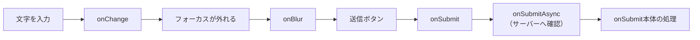
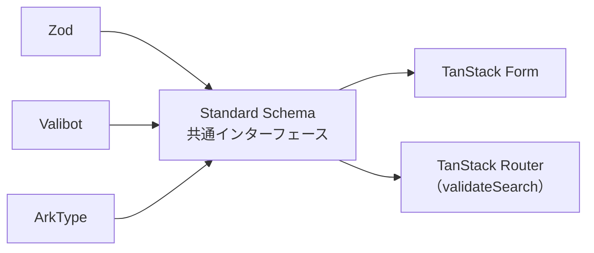

前章でフォームの骨格を作りました。ここでは、入力の検証と送信を仕上げます。

検証は、書く場所とタイミングの組み合わせで整理できます。まずそこを押さえてから、Zodによるスキーマ検証、非同期の確認、配列項目、そしてサーバーからのエラーの扱いへ進みます。

## 検証のタイミング

TanStack Formでは、検証をいつ走らせるかを名前で指定します。

| 名前 | 走るとき |
|---|---|
| `onChange` | 値が変わるたび |
| `onBlur` | フォーカスが外れたとき |
| `onSubmit` | 送信しようとしたとき |
| `onMount` | フォームが表示された直後 |
| `onChangeAsync` | 値が変わったあと（非同期） |
| `onBlurAsync` | フォーカスが外れたあと（非同期） |
| `onSubmitAsync` | 送信時（非同期） |



使い分けの目安があります。

形式の確認（必須、文字数、パターン）は`onChange`が向いています。入力しながら気づけるからです。一方、メールアドレスの形式のように「入力途中は必ず不正になる」ものは`onBlur`にしたほうが親切です。1文字目を打った瞬間に「メールアドレスの形式が違います」と出るのは、うるさく感じられます。

サーバーへの問い合わせを伴う確認は、`onChangeAsync`か`onSubmitAsync`です。

## フィールド単位の検証

`form.Field`に`validators`を渡します。

```tsx
<form.Field
  name="title"
  validators={{
    onChange: ({ value }) => (value.length === 0 ? 'タイトルは必須です' : undefined),
    onBlur: ({ value }) => (value.length > 80 ? '80文字以内で入力してください' : undefined),
  }}
>
```

関数は、問題があればメッセージを返し、問題なければ`undefined`を返します。返した文字列が`field.state.meta.errors`に入ります。

この形は、その項目だけで判断できる検証に向いています。他の項目の値が必要になったら、フォーム単位の検証に移します。

## スキーマで検証する

項目が増えると、検証関数を1つずつ書くのは煩雑です。スキーマをまとめて渡せます。

```tsx
const taskFormSchema = z.object({
  title: z.string().min(1, 'タイトルは必須です').max(80, '80文字以内で入力してください'),
  description: z.string().max(500, '500文字以内で入力してください'),
  priority: z.enum(['low', 'medium', 'high']),
  assignee: z.string().min(1, '担当者を選んでください'),
  dueDate: z.string().regex(/^\d{4}-\d{2}-\d{2}$/, '日付はYYYY-MM-DDの形式で入力してください'),
});

const form = useForm({
  defaultValues: { /* ... */ } as z.infer<typeof taskFormSchema>,
  validators: {
    onChange: taskFormSchema,
  },
  onSubmit: async ({ value }) => {
    await mutateAsync(value);
  },
});
```

スキーマを1つ渡すだけで、全項目の検証が有効になります。エラーは、対応する項目の`errors`に自動で振り分けられます。`form.Field`側に`validators`を書く必要はありません。

初期値の型を`z.infer<typeof taskFormSchema>`から導いているのに注目してください。スキーマとフォームの型が、ここで一致します。片方だけ直して食い違う事故を防げます。

### Standard Schemaという共通規格

なぜZodのスキーマをそのまま渡せるのでしょうか。TanStack FormがZodに依存しているわけではありません。

Standard Schemaという、スキーマライブラリ間で共通のインターフェースがあります。Zod、Valibot、ArkTypeなどがこれに対応しています。TanStack Formは、この共通インターフェースだけを見ています。



RouterのSearch Paramsで使った`validateSearch`も、同じ規格です。だから、フォームでもURLでも同じ書き方が通ります。ライブラリを乗り換えても、渡し方は変わりません。

## 項目をまたぐ検証

「終了日は開始日より後」のような条件は、2つの値を同時に見る必要があります。Zodの`refine`を使い、エラーを出す項目を`path`で指定します。

```tsx
const scheduleSchema = z
  .object({
    startDate: z.string().min(1, '開始日は必須です'),
    endDate: z.string().min(1, '終了日は必須です'),
  })
  .refine((value) => value.startDate <= value.endDate, {
    message: '終了日は開始日より後にしてください',
    path: ['endDate'],
  });
```

`path: ['endDate']`があるおかげで、このエラーは終了日の入力欄の下に表示されます。指定しないとフォーム全体のエラーになり、どの項目を直せばよいのかがユーザーに伝わりません。

パスワードと確認用パスワードの一致確認も、まったく同じ形です。

## 非同期の検証

「同じタイトルのタスクがすでにないか」をサーバーに問い合わせるとします。

```tsx
<form.Field
  name="title"
  validators={{
    onChangeAsyncDebounceMs: 500,
    onChangeAsync: async ({ value }) => {
      if (value === '') return undefined;
      const result = await fetchTasks({ q: value });
      return result.total > 0 ? '同じタイトルのタスクがあります' : undefined;
    },
  }}
>
  {(field) => (
    <div>
      <input
        value={field.state.value}
        onBlur={field.handleBlur}
        onChange={(event) => field.handleChange(event.target.value)}
      />
      {field.state.meta.isValidating && <span>確認中...</span>}
      {field.state.meta.errors.map((error) => (
        <p key={String(error)}>{String(error)}</p>
      ))}
    </div>
  )}
</form.Field>
```

エラーの表示が`String(error)`になっているのは、前章のスキーマ検証と事情が違うからです。スキーマが返すエラーは`{ message: string }`という形ですが、ここで返しているのは文字列そのものです。自分で書いた検証関数のエラーは、返した値がそのまま入ります。同じフォームで両方を使う場合は、表示側を`typeof error === 'string' ? error : error?.message`のように寄せておくと迷いません。

`onChangeAsyncDebounceMs`が要点です。これを指定しないと、1文字打つたびにリクエストが飛びます。500ミリ秒に設定すると、入力が止まってから問い合わせます。

`isValidating`で「確認中」を表示すると、ユーザーは待っていることがわかります。この表示がないと、エラーが出るまでの間、検証を通ったように見えてしまいます。

:::message
非同期の検証は、`onChangeAsync`ではなく`onBlurAsync`にする選択もあります。入力を終えてから1回だけ問い合わせる形で、リクエスト数がもっとも少なくなります。

即座に知らせたいなら`onChangeAsync`とデバウンス、通信を抑えたいなら`onBlurAsync`。項目の性質で選んでください。
:::

## 配列項目

チェックリストのように、項目数が変わるフォームを作ります。`defaultValues`に配列を持たせ、`mode="array"`を指定します。

```tsx
const form = useForm({
  defaultValues: { title: '', items: [] as string[] },
});
```

```tsx
<form.Field name="items" mode="array">
  {(itemsField) => (
    <div>
      {itemsField.state.value.map((_, index) => (
        <form.Field key={index} name={`items[${index}]`}>
          {(field) => (
            <div>
              <input
                value={field.state.value}
                onChange={(event) => field.handleChange(event.target.value)}
              />
              <button type="button" onClick={() => itemsField.removeValue(index)}>
                削除
              </button>
            </div>
          )}
        </form.Field>
      ))}
      <button type="button" onClick={() => itemsField.pushValue('')}>
        項目を追加
      </button>
    </div>
  )}
</form.Field>
```

`form.Field`が入れ子になっています。外側が配列全体、内側が各要素です。

外側の`itemsField`からは、配列を操作するメソッドが使えます。

| メソッド | 動き |
|---|---|
| `pushValue(値)` | 末尾に追加 |
| `removeValue(位置)` | 指定位置を削除 |
| `insertValue(位置, 値)` | 指定位置に挿入 |
| `swapValues(位置A, 位置B)` | 入れ替え |
| `moveValue(元, 先)` | 移動 |

内側の`name`は`` `items[${index}]` `` というテンプレート文字列です。この形も型で検査されます。

## 送信を組み立てる

送信ボタンは、`canSubmit`と`isSubmitting`で制御します。

```tsx
<form.Subscribe selector={(state) => [state.canSubmit, state.isSubmitting] as const}>
  {([canSubmit, isSubmitting]) => (
    <button type="submit" disabled={!canSubmit}>
      {isSubmitting ? '作成中...' : '作成'}
    </button>
  )}
</form.Subscribe>
```

`canSubmit`は、検証を通っていて、かつ送信中でないときに`true`になります。つまり、この1つで二重送信も防げます。

:::message alert
ただし、`canSubmit`は**初期状態では`true`**です。まだ何も入力されていない、必須項目が空のフォームでも、送信ボタンは押せる状態で表示されます。

理由は、`onChange`の検証がまだ1度も走っていないからです。値が変わっていないので、検証する契機がありません。

開いた時点から無効にしたいなら、`onMount`にも同じスキーマを渡します。

```tsx
validators: {
  onMount: taskFormSchema,
  onChange: taskFormSchema,
},
```

これで、表示された瞬間に検証が走り、`canSubmit`が`false`になります。空のフォームでボタンが押せることに気づかないまま公開してしまいがちなので、確認しておいてください。
:::

そして`onSubmit`でMutationを呼びます。

```tsx
const { mutateAsync } = useMutation({
  mutationFn: createTask,
  onSuccess: () => queryClient.invalidateQueries({ queryKey: taskKeys.lists() }),
});

const form = useForm({
  // ...
  onSubmit: async ({ value, formApi }) => {
    await mutateAsync(value);
    formApi.reset();
  },
});
```

役割が分かれています。フォームは入力の検証と状態管理、Mutationは通信とキャッシュの最新化です。`onSubmit`の中で`await`しているので、通信が終わるまで`isSubmitting`が`true`のままになります。

送信後に`formApi.reset()`で初期値に戻しています。同じフォームで続けて登録する画面では、この1行が効きます。前章で触れたとおり、ここで`form`変数を参照すると型推論が循環するので、引数の`formApi`を使います。

## サーバーからのエラー

クライアント側の検証を通っても、サーバーが拒否することがあります。「そのタイトルは他の人が使っている」「期限が営業日ではない」など、サーバーしか知らない条件です。

2つの扱い方があります。

### フォーム全体のエラーとして出す

Mutationはエラーを保持しています。それをそのまま表示するのが、いちばん簡単な方法です。

```tsx
const { mutateAsync, isError, error } = useMutation({ mutationFn: createTask });

// ...
{isError && <p role="alert">{error.message}</p>}
```

「作成に失敗しました」という通知で足りる場合は、これで十分です。

### 特定の項目のエラーとして出す

「タイトルが重複している」のように、直すべき項目がわかっている場合は、その項目にエラーを付けたいところです。

送信そのものを検証として扱う`onSubmitAsync`が使えます。

```tsx
const form = useForm({
  defaultValues: { title: '' },
  validators: {
    onSubmitAsync: async ({ value }) => {
      try {
        await mutateAsync(value);
        return undefined;
      } catch (error) {
        if (error instanceof ApiError && error.status === 422) {
          // 項目名を指定してエラーを返す
          return { fields: { title: error.message } };
        }
        throw error;
      }
    },
  },
});
```

`{ fields: { 項目名: メッセージ } }`という形で返すと、その項目のエラーとして表示されます。ユーザーは、どこを直せばよいかがすぐわかります。

APIが「どの項目が問題か」を返す設計になっていれば、その情報をそのまま`fields`へ渡せます。エラー応答の形は、フロントエンドとサーバーで最初に決めておくべき契約です。

## 編集フォームを作る

作成フォームができたら、編集フォームは初期値を差し替えるだけです。Queryで取得したデータを渡します。

```tsx
function EditTaskForm({ taskId }: { taskId: string }) {
  const queryClient = useQueryClient();
  const { data: task } = useSuspenseQuery(taskQueries.detail(taskId));

  const updateMutation = useMutation({
    mutationFn: (value: TaskInput) => updateTask(taskId, value),
    onSuccess: () => queryClient.invalidateQueries({ queryKey: taskKeys.all }),
  });

  const form = useForm({
    defaultValues: {
      title: task.title,
      description: task.description,
      priority: task.priority,
      assignee: task.assignee,
      dueDate: task.dueDate,
    },
    validators: { onChange: taskFormSchema },
    onSubmit: async ({ value }) => {
      await updateMutation.mutateAsync(value);
    },
  });

  // ... 以下は作成フォームと同じ
}
```

`useSuspenseQuery`を使っているので、`task`は必ず存在します。読み込み中の分岐が要らないため、初期値をそのまま書けます。

:::message alert
`defaultValues`は、フォームが初めて作られたときにだけ使われます。あとから`task`が更新されても、入力中の値は書き換わりません。

これは正しい振る舞いです。ユーザーが編集している最中に、裏で走った再取得で入力が消えたら困ります。フォームは、開いた瞬間の値を土台に、ユーザーの編集を保持し続けます。

ただし、意図的に反映したい場合（別の画面で更新されたことを知らせて、取り込むかどうかを選ばせるなど）は、自分で`form.reset(新しい値)`を呼びます。
:::

## 編集中の離脱を止める

入力途中でページを離れようとしたら、確認したいところです。TanStack Routerの`useBlocker`と、フォームの`isDirty`を組み合わせます。

```tsx
import { useBlocker } from '@tanstack/react-router';

useBlocker({
  shouldBlockFn: () => {
    if (!form.state.isDirty) return false;
    return !window.confirm('入力内容が失われます。移動しますか？');
  },
  enableBeforeUnload: () => form.state.isDirty,
});
```

`shouldBlockFn`が`true`を返すと、遷移が止まります。変更がなければ止めず、変更があるときだけ確認を出しています。

`enableBeforeUnload`は、ブラウザのタブを閉じる操作やリロードに対する警告です。アプリ内の遷移とブラウザ操作の両方を、同じ条件で守れます。

RouterとFormが別のライブラリでありながら、状態を1つ渡すだけでつながります。それぞれが状態を隠さず公開しているからこそできる連携です。

## まとめ

この章では、検証と送信を扱いました。

- 検証のタイミングは`onChange`・`onBlur`・`onSubmit`と、それぞれの非同期版から選びます。
- 形式の確認は`onChange`、入力途中に不正になるものは`onBlur`が向いています。
- 項目単位の検証は関数を返し、全体の検証はスキーマを渡します。エラーは自動で項目に振り分けられます。
- 初期値の型は`z.infer`でスキーマから導くと、両者が食い違いません。
- Standard Schemaという共通規格のおかげで、Zod以外のライブラリも同じ書き方で渡せます。`validateSearch`と同じ仕組みです。
- 項目をまたぐ検証は`refine`で書き、`path`でエラーを出す項目を指定します。
- 非同期の検証には`onChangeAsyncDebounceMs`を必ず添えます。`isValidating`で確認中を表示します。
- 配列項目は`mode="array"`と入れ子の`form.Field`で扱います。`pushValue`や`removeValue`で操作します。
- `canSubmit`は検証と送信中の両方を見ているため、二重送信の防止も兼ねます。
- サーバーのエラーは、全体の通知として出すか、`onSubmitAsync`で`{ fields: { 項目名: メッセージ } }`を返して項目に紐づけます。
- 編集フォームは初期値を差し替えるだけです。`defaultValues`は初回のみ使われ、編集中の値を守ります。

ここまでで、4種類の状態それぞれに置き場所を用意しました。次章では、それらを1つのアプリとして組み上げるときの設計判断を整理します。
