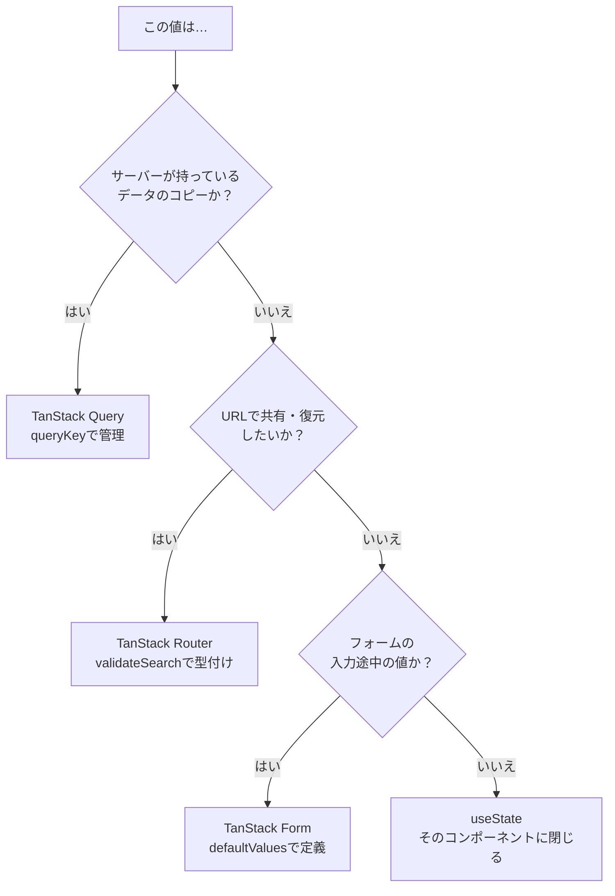
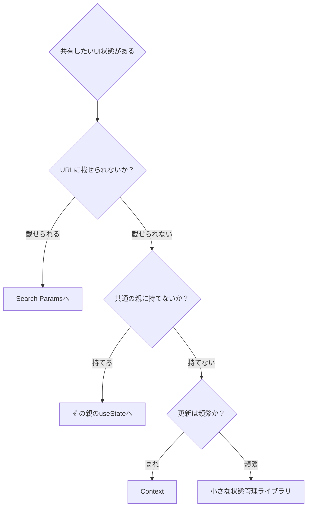
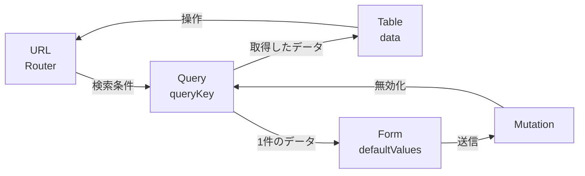
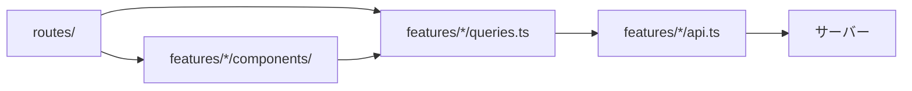

本書の最初に、状態を4種類に分けました。ここまでの章で、それぞれの置き場所を実装してきました。

この章は総括です。分類をもう一度確認し、ライブラリの境界をどう引くか、ディレクトリをどう並べるか、そして避けるべき形を整理します。新しいAPIは出てきません。判断の話です。

## 4分類をもう一度

最初の判断フローを、実装を知った目で見直します。



各分類について、実装で学んだことを1行で言い直します。

| 分類 | 置き場所 | 実装の要点 |
|---|---|---|
| サーバー状態 | TanStack Query | `queryKey`が住所。`staleTime`で鮮度を決める |
| URL状態 | TanStack Router | `validateSearch`で検証。`.default().catch()`を両方書く |
| フォーム状態 | TanStack Form | `defaultValues`が型の源。検証はスキーマで |
| UI状態 | `useState` | 迷ったらここ。ただし共有したくなったら見直す |

## サーバー状態をコピーしない

いちばんよく見かける崩れ方が、サーバー状態の複製です。

```tsx
// アンチパターン
const { data } = useQuery(taskQueries.detail(id));
const [task, setTask] = useState<Task | undefined>();

useEffect(() => {
  setTask(data);
}, [data]);
```

TanStack Queryを入れたのに、`useState`へ写しています。こう書いてしまう理由はわかります。「編集したいから、手元で書き換えられる状態が欲しい」と考えるからです。

けれども、この形は前章までに解決した問題を呼び戻します。キャッシュが更新されても`useState`は追随しません。`useEffect`で同期しようとすると、ユーザーの編集を上書きします。写しの写しができ、どちらが正しいのかが曖昧になります。

用途に応じて、正しい置き場所があります。

| やりたいこと | 正しい方法 |
|---|---|
| 表示するだけ | `data`をそのまま使う |
| 編集する | フォームの`defaultValues`に渡す |
| 加工して表示する | `select`で加工する |
| 一部だけ書き換える | `setQueryData`でキャッシュを更新する |

具体的に何が起きるか見ておきます。詳細画面で`useState`に写しを持ち、別のタブで同じタスクが更新されたとします。画面に戻るとフォーカス再取得が走り、キャッシュの`data`は新しくなります。しかし`useState`の`task`は古いままです。ユーザーは古い内容を見ながら編集し、保存して、他人の変更を上書きします。バグの報告としては「保存したら他の人の修正が消えた」という形で上がってきます。

編集の場合、フォームが写しを持つのは正当です。フォーム状態は「送信するまでの一時的な値」であり、サーバー状態とは別の分類だからです。ただし、その写しはフォームの中に閉じます。`useState`でコンポーネントに持つのとは意味が違います。

境界がはっきりしているかどうかが分かれ目です。フォームは「開いた時点の値を土台に、ユーザーの編集を保持する」という明確な役目があります。`useEffect`で同期する`useState`には、その役目がありません。ただキャッシュを追いかけるだけの、意味のない写しになります。

## 共有したい状態はURLへ

もう1つのよくある崩れ方が、共有したい状態を`useState`に閉じ込めることです。

判断は簡単です。**その状態のままリロードされたいか。そのURLを人に送りたいか**。どちらかが「はい」なら、URLに置きます。

```tsx
// 見直しの候補
const [status, setStatus] = useState('all');
const [page, setPage] = useState(1);
const [sortKey, setSortKey] = useState('dueDate');
const [selectedTab, setSelectedTab] = useState('active');
```

これらは全部URLに載せられます。「Search ParamsとURL状態」の章で見たとおり、スキーマを1つ書けば型も検証も付いてきます。

`useState`のままでよいのは、次のような値です。

- モーダルやメニューの開閉
- ホバー中の要素
- ドラッグ中の位置
- トーストの表示
- 「もっと見る」の展開状態

共通するのは、**次にそのページを開いたときに再現する意味がない**ことです。

## 残ったUI状態をどう共有するか

分類を終えてもUI状態は残ります。そして、そのうちいくつかは複数のコンポーネントで共有したくなります。サイドバーの開閉、ダークモードの設定、通知の一覧といったものです。

TanStackには、この用途のライブラリはありません。TanStack Storeというフレームワーク非依存の状態管理コアはありますが、これは各ライブラリの内部で使われている部品で、アプリの状態管理として前面に出すものではありません。

選択肢は3つあります。

1つめは、Reactの`Context`です。追加のライブラリが要らず、値の数が少なければこれで足ります。ただし、Contextの値が変わると、その配下のコンポーネントがすべて再レンダリングされます。頻繁に変わる値には向きません。

2つめは、小さな状態管理ライブラリです。ZustandやJotaiのようなものを使うと、必要な部分だけを購読できます。UI状態の量が増え、更新も頻繁なら選ぶ価値があります。

3つめは、そもそも共有しないという判断です。「サイドバーの開閉」は本当に共有が必要でしょうか。開閉ボタンとサイドバーが同じ親の下にあるなら、その親が`useState`で持てば済みます。



順番が大切です。まずURL、次に共通の親、それでも足りなければContext、量と頻度が問題ならライブラリ。この順で検討すると、グローバルストアが必要になる場面はかなり減ります。

そして、たとえ導入した場合でも、そこにサーバー状態を入れないでください。本書を通して見てきたとおり、それは同期の仕組みを自作する道です。

## ライブラリ間の境界

4つのライブラリは、それぞれ状態を持っています。境界で値をどう渡すかが、設計の勘所です。



矢印の向きを見てください。輪になっています。ただし、それぞれの向きは一方向です。

境界ごとに、押さえるべき点があります。

### URL → Query

検索条件をそのまま`queryKey`に渡します。URLがキャッシュの住所を決めるので、同じURLに戻ればキャッシュが効きます。

```tsx
const search = Route.useSearch();
const { data } = useSuspenseQuery(taskQueries.list(search));
```

ここで条件を加工しないことが大事です。URLの値と`queryKey`の値がずれると、キャッシュが意図せず分裂します。加工が必要なら、`queryOptions`の中で行います。

### Query → Table

取得したデータを`data`に渡すだけです。テーブルは状態を持たず、計算もしません。

```tsx
const table = useReactTable({
  data: data.items,
  manualPagination: true,
  manualSorting: true,
  rowCount: data.total,
  state: { sorting, pagination }, // URLから組み立てた値
});
```

テーブルの操作は、URLの変更として返します。テーブル自身が状態を持たないので、情報の流れが1本になります。

### Query → Form

1件のデータを`defaultValues`に渡します。ここが唯一「サーバー状態の写しを作ってよい」境界です。

```tsx
const { data: task } = useSuspenseQuery(taskQueries.detail(taskId));

const form = useForm({
  defaultValues: {
    title: task.title,
    // ...
  },
});
```

写しを作ったあとは、フォームが持ち主です。裏で再取得が走っても、入力中の値は守られます。送信するまで、この2つは別の値として並走します。

### Form → Mutation → Query

送信でMutationを呼び、成功したらキャッシュを無効化します。輪が閉じます。

```tsx
onSubmit: async ({ value, formApi }) => {
  await mutateAsync(value); // onSuccessでinvalidateQueries
  formApi.reset();
},
```

この流れがそろうと、「編集して保存したら一覧も最新になる」という当然の動きが、追加のコードなしで成立します。

## ディレクトリの構成

本書のアプリは、最終的にこの形になりました。

```text
src/
├── main.tsx                     … QueryClient・Routerの組み立て
├── routeTree.gen.ts             … 自動生成（触らない）
├── routes/                      … URLの形をそのまま表す
│   ├── __root.tsx
│   ├── index.tsx
│   ├── login.tsx
│   ├── _authenticated.tsx       … 認証の門
│   └── _authenticated/
│       └── tasks/
│           ├── route.tsx
│           ├── index.tsx
│           └── $taskId.tsx
├── features/                    … 機能ごとのまとまり
│   ├── auth/
│   │   ├── api.ts
│   │   └── queries.ts
│   └── tasks/
│       ├── types.ts             … 型
│       ├── api.ts               … 通信（TanStack Queryを知らない）
│       ├── queries.ts           … キーとQueryの定義
│       ├── formOptions.ts       … フォームの共通定義
│       └── components/          … 画面の部品
├── mocks/                       … 開発用のAPIモック
└── test/                        … テストの共通設定（次章で追加）
```

2つの軸で分かれています。`routes/`はURLの形、`features/`は機能の形です。

`routes/`のファイルは薄く保ちます。ルートの定義（`validateSearch`、`loader`、`beforeLoad`）と、画面の組み立てだけです。ロジックは`features/`に置きます。こうしておくと、URL構成を変えたくなったときにファイルを移動するだけで済みます。

依存の向きも決めておきます。



`features/`が`routes/`を参照しないことが大切です。逆向きの参照が生まれると、機能を別のURLへ移すたびに書き換えが必要になります。

ルート専用のコンポーネントを近くに置きたい場合は、`-`で始まるディレクトリが使えます。`routes/_authenticated/tasks/-components/`のような場所は、ルートとして扱われません。

## アンチパターン総点検

ここまでに触れた避けるべき形を、一覧にします。

| アンチパターン | 何が起きるか | 正しい形 |
|---|---|---|
| `useEffect`でデータ取得 | 競合状態・キャッシュ不在・重複 | `useQuery` |
| サーバー状態を`useState`へ複製 | 二重管理でずれる | `data`を直接使う |
| サーバー状態をグローバルストアへ | 同期の仕組みを自作することになる | TanStack Query |
| `queryFn`の依存を`queryKey`に入れない | 条件を変えても再取得されない | すべて`queryKey`へ |
| 通信を減らすために`refetchOnWindowFocus: false` | 復帰時の確認という利点を失う | `staleTime`を延ばす |
| 一覧を`setQueryData`で書き換える | サーバーのロジックを二重実装する | `invalidateQueries` |
| 検索条件を`useState`に閉じる | 共有・リロード・戻るが効かない | Search Params |
| `validateSearch`に`.default()`が無い | リンクで全条件の指定が必須になる | `.default().catch()` |
| `defaultPreloadStaleTime`を既定のまま | 鮮度の判断が二重化する | `0`にしてQueryへ一本化 |
| Tableの`getRowId`を省く | 並び替えで選択がずれる | 元データのIDを指定 |
| `manualPagination`で`rowCount`を渡さない | ページ数が計算できない | APIの総件数を渡す |
| 入力欄を1文字ごとにURLへ反映 | 履歴が文字数分積まれる | デバウンス＋`replace: true` |
| `field.handleBlur`を渡さない | `isTouched`が記録されない | `onBlur`に渡す |

## 設計のチェックリスト

新しい画面を作るときに、順番に確認したい項目です。

1. この画面に出てくる状態を書き出したか
2. それぞれがどの分類か判断したか
3. サーバー状態は`queryOptions`として定義したか。`staleTime`を決めたか
4. URLに載せる条件のスキーマを書いたか。`.default().catch()`を付けたか
5. Loaderで`ensureQueryData`を呼んだか。`await`するか決めたか
6. 更新後にどのキーを無効化するか決めたか
7. 認証や権限が必要なら`beforeLoad`に書いたか
8. エラーと読み込みの表示をどこに置くか決めたか
9. `useState`が残っているなら、それがUI状態だと確認したか

最後の項目が効きます。`useState`が並んでいたら、1つずつ「これは本当にUI状態か」と問い直してください。多くの場合、いくつかはURLかQueryへ引っ越せます。

## まとめ

4つのライブラリを組み合わせても、状態の所有者を1つに決めれば同期処理は増えません。

- 状態は「サーバーのコピーか」「URLで共有したいか」「入力途中か」の3問で分類できます。
- サーバー状態を`useState`へ複製しないでください。編集するならフォームの`defaultValues`へ渡します。
- 「リロードされたいか、共有したいか」が「はい」なら、URLに置きます。
- 境界では値を加工せずに渡します。URL → Query、Query → Table、Query → Form、Form → Mutation → Queryの順に流れ、輪が閉じます。
- `routes/`はURLの形、`features/`は機能の形で分けます。依存は`routes → features`の一方向にします。
- `features/`から`routes/`を参照しないでください。URL構成の変更に弱くなります。
- アンチパターンの多くは「状態を2か所に置いた」ことから生まれます。
- 新しい画面では、状態の書き出しから始めてください。

次章では、ここまで組んだコードをテストします。TanStackを使ったコードの何をテストし、何をテストしないのかを決めます。
