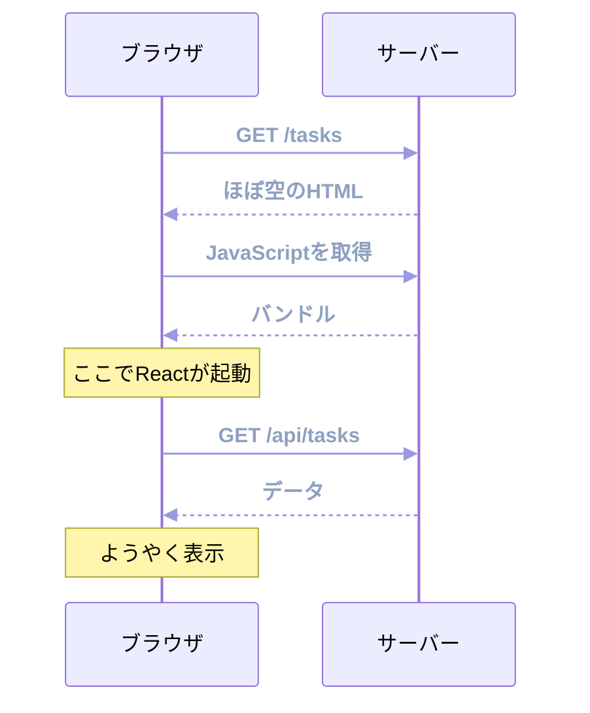
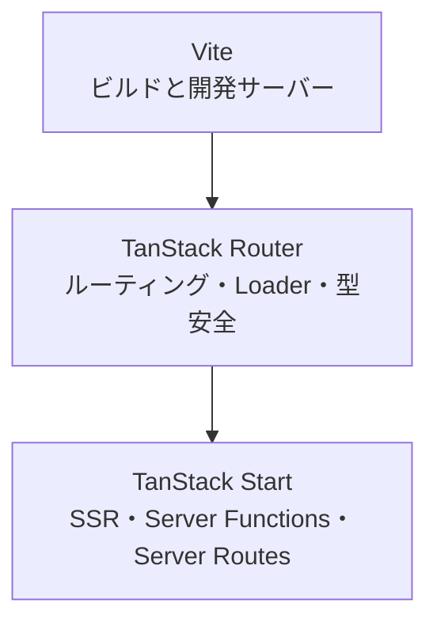
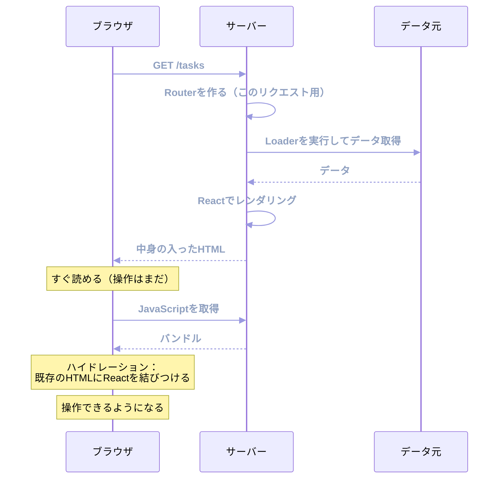

最終部です。ここまでのアプリは、すべてブラウザの中で動いていました。この章から、サーバー側へ広げます。

担当するのはTanStack Startです。TanStack RouterとViteの上に築かれたフルスタックフレームワークで、サーバーサイドレンダリングとサーバー側の処理を扱えるようになります。

:::message alert
TanStack Startは、本書の執筆時点でリリース候補（Release Candidate）の段階です。機能は揃い、APIも固まったと公式にアナウンスされていますが、正式な安定版の宣言はまだ出ていません。

本書のコードは執筆時点の版で動作を確認していますが、細部が変わる可能性があります。実務に投入する前に、公式ドキュメントで現在の状況を確認してください。以前のバージョンでは`app/client.tsx`や`app/ssr.tsx`といったファイルを自分で書く必要がありましたが、現在は不要になっています。ネット上の古い記事と食い違う点に注意してください。
:::

## SPAだけでは足りない場面

ここまで作ったアプリは、SPA（Single Page Application）です。ブラウザがHTMLを受け取り、JavaScriptを読み込み、それからデータを取りにいきます。



3往復しています。それぞれに通信の時間がかかり、最初の1文字が見えるまで待たされます。

さらに2つの問題があります。

検索エンジンやSNSのクローラーは、JavaScriptを実行しないか、実行しても後回しにします。空のHTMLしか見えなければ、内容を理解できません。記事やブログ、商品ページのように検索から来てほしいページでは、これが致命的です。

そして、Cookieやトークンを見て「誰のためのページか」を決める処理も、すべてブラウザ側になります。ログイン済みかどうかの判定を待ってから描画するため、一瞬ログイン前の画面が見える、といった現象が起きます。

サーバー側でHTMLを組み立てて返せば、これらは解決します。

## TanStack Startの立ち位置

Startは、ゼロから作られた別のフレームワークではありません。**Routerの上に、サーバー側の機能を足したもの**です。



この構造には、学習する側にとって大きな意味があります。ここまでの章で学んだRouterの知識が、そのまま使えるのです。ファイル名の規則、`loader`、`validateSearch`、`beforeLoad`、`<Link>`。すべて同じです。

Next.jsとの違いは、設計の出発点です。Next.jsはサーバーを中心に据え、クライアント側の処理を`'use client'`で切り出します。Startは逆で、クライアント側のアプリが土台にあり、サーバー側の処理を明示的に呼び出します。

| | Next.js（App Router） | TanStack Start |
|---|---|---|
| 出発点 | サーバー | クライアント |
| 既定の動作 | サーバーで実行 | クライアントで実行 |
| サーバー処理の書き方 | Server Components / Server Actions | Server Functions |
| ルーティング | 独自 | TanStack Router |
| データ取得 | fetchのキャッシュ拡張など | Loader + TanStack Query |

どちらが優れているという話ではありません。SPAとして作ってきたアプリにサーバー側の機能を足したい場合、Startのほうが移行の段差が小さくなります。

## プロジェクトを作る

Startのプロジェクトは、CLIで作ります。

```sh
npx @tanstack/cli create my-app --framework React
```

対話形式で、デプロイ先やツールチェーンを選べます。最小構成から始めたい場合は`--blank`を付けます。

生成されるのは、こんな構成です。

```text
my-app/
├── package.json
├── vite.config.ts
├── tsr.config.json          … ルート生成の設定
└── src/
    ├── router.tsx           … Routerの組み立て
    ├── routeTree.gen.ts     … 自動生成
    ├── styles.css
    └── routes/
        ├── __root.tsx
        └── index.tsx
```

`index.html`と`main.tsx`がありません。Startが起点を用意するので、自分で書く必要がなくなっています。

### Viteの設定

```ts:vite.config.ts
import { defineConfig } from 'vite';
import { tanstackStart } from '@tanstack/react-start/plugin/vite';
import viteReact from '@vitejs/plugin-react';

export default defineConfig({
  resolve: { tsconfigPaths: true },
  plugins: [tanstackStart(), viteReact()],
});
```

Router単体で使っていた`tanstackRouter`プラグインが、`tanstackStart`に置き換わっています。ルートの生成に加えて、サーバー側のビルドとServer Functionsの変換も担当します。

### Routerの組み立て

```tsx:src/router.tsx
import { createRouter as createTanStackRouter } from '@tanstack/react-router';
import { routeTree } from './routeTree.gen';

export function getRouter() {
  const router = createTanStackRouter({
    routeTree,
    scrollRestoration: true,
    defaultPreload: 'intent',
    defaultPreloadStaleTime: 0,
  });

  return router;
}

declare module '@tanstack/react-router' {
  interface Register {
    router: ReturnType<typeof getRouter>;
  }
}
```

大事な違いが1つあります。Routerを**関数の中で作っている**ことです。SPAではモジュールの直下で1つ作れば足りました。SSRでは、リクエストごとに新しいRouterが必要です。

理由は、状態が混ざるのを防ぐためです。サーバーは複数のユーザーのリクエストを同時に処理します。Routerを共有すると、あるユーザーのために読み込んだデータが別のユーザーに渡ってしまいます。同じ理由で、QueryClientもこの関数の中で作ります。

`declare module`が`ReturnType<typeof getRouter>`になっているのは、この形に合わせたものです。

## ルートの書き方はほぼ同じ

`__root.tsx`だけ、SPAと違う形になります。HTML全体を組み立てる役目を持つからです。

```tsx:src/routes/__root.tsx
import { HeadContent, Scripts, createRootRoute } from '@tanstack/react-router';
import appCss from '../styles.css?url';

export const Route = createRootRoute({
  head: () => ({
    meta: [
      { charSet: 'utf-8' },
      { name: 'viewport', content: 'width=device-width, initial-scale=1' },
      { title: 'タスク管理' },
    ],
    links: [{ rel: 'stylesheet', href: appCss }],
  }),
  shellComponent: RootDocument,
});

function RootDocument({ children }: { children: React.ReactNode }) {
  return (
    <html lang="ja">
      <head>
        <HeadContent />
      </head>
      <body>
        {children}
        <Scripts />
      </body>
    </html>
  );
}
```

`<html>`と`<body>`をReactのコンポーネントとして書いています。`index.html`が要らないのは、ここで組み立てているからです。

3つの部品を確認します。

`head`は、そのルートのメタ情報を返す関数です。`<title>`や`<meta>`、CSSへのリンクを宣言します。子のルートでも`head`を書けて、深いほうが優先されます。タスクの詳細ページなら、`<title>`にそのタスク名を入れられます。

`<HeadContent />`は、`head`で宣言した内容が実際に描画される場所です。

`<Scripts />`は、クライアント側のJavaScriptを読み込むタグが入る場所です。これを忘れると、HTMLは表示されるのに操作できない画面になります。

`shellComponent`という名前は、HTMLの外枠（シェル）を担当することを表しています。子のルートは`{children}`の位置に描画されます。

これ以外のルートファイルは、SPAとまったく同じです。`createFileRoute`、`loader`、`validateSearch`、`beforeLoad`が同じように使えます。

## SSRとハイドレーション

サーバー側で何が起きているのかを追います。



注目したいのは、HTMLに**すでに中身が入っている**ことです。JavaScriptの読み込みを待たずに、ユーザーは内容を読み始められます。

そのあとで、JavaScriptが同じコンポーネントを実行し、サーバーが作ったHTMLに手を結びます。これがハイドレーション（水分を与える）です。乾いたHTMLに、動きを与えるという比喩です。

ハイドレーションが済むまで、クリックしても反応しません。この時間を短くするのが、SSRを使うアプリの主な最適化テーマになります。

:::message
サーバーとクライアントで同じコンポーネントが実行されるため、両方で同じ結果になる必要があります。食い違うとハイドレーションのエラーが出ます。

よくある原因は、`new Date()`や`Math.random()`、`window`への参照です。サーバーとクライアントで値が変わるものは、レンダリング中に使えません。

```tsx
// 危ない: サーバーとクライアントで時刻が違う
<p>{new Date().toLocaleTimeString()}</p>
```

こうした値は、`useEffect`の中で設定するか、サーバー側で確定した値をLoaderから渡します。
:::

## ストリーミング

Startは、HTMLを一度に作り終えてから送るのではなく、できた部分から順に送れます。

`<Suspense>`で囲んだ部分は、中身の準備ができる前に「あとで送る」と決められます。ブラウザは先に届いた部分を表示し、遅れて届いた部分を差し替えます。

```tsx
<Suspense fallback={<TaskListSkeleton />}>
  <TaskList />
</Suspense>
```

「エラー処理とSuspense」の章で学んだ`<Suspense>`が、そのままストリーミングの単位になります。速い部分を待たせず、遅い部分だけあとから届ける設計ができます。

## ページごとにSSRを選ぶ

すべてのページをサーバーでレンダリングする必要はありません。

管理画面の中の重い画面は、SEOも初期表示速度も重視しないかもしれません。むしろ、サーバーの負荷を減らしたいところです。

ルートごとに`ssr`オプションで指定できます。

```tsx
export const Route = createFileRoute('/_authenticated/dashboard')({
  ssr: false, // この画面はクライアントだけで描画する
  component: Dashboard,
});
```

指定できる値は3つです。

| 値 | 動き |
|---|---|
| `true`（既定） | Loaderもレンダリングもサーバーで行う |
| `'data-only'` | Loaderはサーバーで実行し、レンダリングはクライアントで行う |
| `false` | どちらもクライアントで行う |

`'data-only'`が中間の選択肢です。データ取得の往復を減らしつつ、HTMLの生成コストは払わない形になります。

アプリ全体の既定値は、Routerの`defaultSsr`で決められます。「公開ページはSSR、ログイン後の画面はクライアント」という方針なら、既定を`false`にして公開ページだけ`true`にする、といった設計ができます。

## まとめ

TanStack Startを使うと、Routerのルート定義を保ったままSSRへ広げられます。

- SPAは、HTML・JavaScript・データで3往復します。初期表示とクローラーへの対応が弱くなります。
- StartはViteとTanStack Routerの上に築かれています。Routerの知識はそのまま使えます。
- Next.jsはサーバー中心、Startはクライアント中心の設計です。SPAからの移行の段差が小さくなります。
- `index.html`と`main.tsx`はありません。`__root.tsx`が`<html>`から組み立てます。
- Routerは`getRouter()`関数の中で作ります。リクエストごとに新しく作らないと、状態が別のユーザーに混ざります。
- `head`でメタ情報を宣言し、`<HeadContent />`と`<Scripts />`を配置します。`<Scripts />`を忘れると操作できない画面になります。
- サーバーが中身入りのHTMLを返し、そのあとハイドレーションで動きが付きます。
- サーバーとクライアントで結果が変わるコード（時刻、乱数、`window`）は、レンダリング中に使えません。
- `<Suspense>`がストリーミングの単位になります。
- `ssr`オプションで、ルートごとに`true` / `'data-only'` / `false`を選べます。

次章では、サーバー側の処理を書きます。Server Functionsで型安全にサーバーを呼び、TanStack Queryと組み合わせて、本書のアプリをフルスタックに仕上げます。
