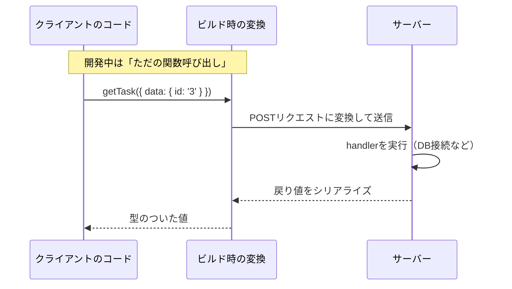
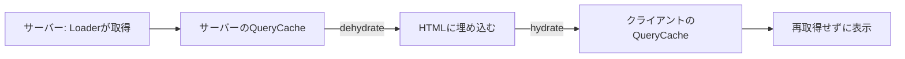

本書の最後の章です。

前章でサーバー側のレンダリングを手に入れました。残っているのは、サーバー側で動く処理そのものです。データベースへの接続、秘密鍵を使った署名、外部APIの呼び出し。どれもクライアントには置けません。

TanStack StartのServer Functionsは、この処理を「型安全な関数呼び出し」として書けるようにします。

## Server Functionsとは

`fetch`でAPIを叩く形を思い出してください。

```ts
// クライアント側
const response = await fetch('/api/tasks/3');
const task = await response.json(); // 型は any
```

URLは文字列で、レスポンスの型は自分で宣言するしかありません。サーバー側の実装を変えても、クライアント側は何も気づきません。

Server Functionsでは、関数を呼ぶだけになります。

```ts
const task = await getTask({ data: { id: '3' } }); // 型は Task
```

引数の型と戻り値の型が、サーバー側の実装から流れてきます。サーバーの型を変えれば、クライアント側がコンパイルエラーになります。

裏側では通信が発生しています。ビルド時に、この関数呼び出しがサーバーへのリクエストに変換されるからです。



この仕組みをRPC（Remote Procedure Call、遠隔手続き呼び出し）と呼びます。通信を関数呼び出しのように見せる考え方です。

## createServerFnの基本

`createServerFn`で作ります。

```ts:src/features/tasks/server.ts
import { createServerFn } from '@tanstack/react-start';

export const getTasks = createServerFn().handler(async () => {
  // ここはサーバーでだけ動く
  return await db.select().from(tasksTable);
});
```

`handler`に渡した関数が、サーバー側で実行される本体です。この中には、データベースへの接続でも、ファイルの読み書きでも、何を書いてもかまいません。クライアントのバンドルには含まれません。

更新を伴う処理では、HTTPメソッドを指定します。

```ts
export const addTask = createServerFn({ method: 'POST' }).handler(async () => {
  // ...
});
```

既定はGETです。取得はGET、変更はPOSTという使い分けになります。GETはブラウザやプロキシにキャッシュされる可能性があるため、更新処理には使いません。

### 入力を検証する

引数を受け取る場合は、必ず検証します。

```ts
import { z } from 'zod';

export const getTask = createServerFn()
  .validator(z.object({ id: z.string() }))
  .handler(async ({ data }) => {
    const task = tasks.find((item) => item.id === data.id);
    if (!task) throw new Error('タスクが見つかりません');
    return task;
  });
```

`validator`にスキーマを渡すと、通った値が`handler`の`data`に入ります。ここでもStandard Schemaが使われているので、Zodをそのまま渡せます。「Search ParamsとURL状態」の章、「バリデーションと送信処理」の章と同じ書き方です。

検証が必須である理由は、**Server Functionsのエンドポイントが外部から叩ける**ことです。ビルド後は普通のHTTPエンドポイントになるので、誰でも任意のデータを送れます。クライアント側のコードを通さない呼び出しを、常に想定してください。

呼び出し側は、`data`というキーで引数を渡します。

```ts
await getTask({ data: { id: '3' } });
```

この`data`という包みがあるおかげで、将来ヘッダーやその他の情報を渡す余地が残されています。

:::message alert
`validator`を書かずに引数を受け取ると、型が付かないだけでなく、危険です。

```ts
// 危ない例
export const deleteTask = createServerFn({ method: 'POST' }).handler(async ({ data }) => {
  await db.delete().where({ id: (data as any).id }); // 何が来るかわからない
});
```

「クライアント側で確認しているから大丈夫」は通りません。エンドポイントを直接叩かれる前提で、サーバー側で検証と権限確認を行ってください。認証情報も、リクエストのCookieからサーバー側で読み直します。
:::

## サーバー専用のコードを分ける

`handler`の中身はクライアントに含まれません。しかし、ファイルの他の部分は含まれる可能性があります。

安全に分けるための道具が用意されています。

| 関数 | 用途 |
|---|---|
| `createServerOnlyFn` | サーバーでだけ実行される関数を作る（クライアントで呼ぶとエラー） |
| `createClientOnlyFn` | クライアント専用の関数を作る |
| `createIsomorphicFn` | 環境ごとに違う実装を切り替える |

環境変数も同じ考え方です。

```ts
// サーバー側だけで読む（秘密にできる）
const apiKey = process.env.EXTERNAL_API_KEY;

// クライアントにも渡る（Viteの規約）
const publicUrl = import.meta.env.VITE_PUBLIC_URL;
```

`VITE_`で始まる環境変数は、ビルド時にクライアントのコードへ埋め込まれます。**秘密の値に`VITE_`を付けないでください**。APIキーが公開されます。この事故は珍しくありません。

秘密の値は`handler`の中だけで読み、必要な結果だけを返す。この形を守れば、クライアントへ漏れません。

## QueryとServer Functionsを組み合わせる

Server Functionsは、単なる非同期関数です。ということは、`queryFn`にそのまま渡せます。

```ts:src/features/tasks/queries.ts
import { queryOptions } from '@tanstack/react-query';
import { getTask, getTasks } from './server';

export const taskQueries = {
  list: () =>
    queryOptions({
      queryKey: ['tasks', 'list'],
      queryFn: () => getTasks(),
      staleTime: 30_000,
    }),

  detail: (id: string) =>
    queryOptions({
      queryKey: ['tasks', 'detail', id],
      queryFn: () => getTask({ data: { id } }),
      staleTime: 60_000,
    }),
};
```

`api.ts`で`fetch`を書いていた部分が、Server Functionsの呼び出しに置き換わりました。それ以外は何も変わりません。`queryKey`の設計、`staleTime`、`invalidateQueries`、Loaderとの連携。すべてこれまでどおりです。

ここが本書の設計が効いてくるところです。通信の詳細を`api.ts`に閉じ込め、その外側は`queryOptions`だけを見る構造にしておいたので、通信方法を差し替えても影響が広がりません。

コンポーネントから直接呼びたい場合は、`useServerFn`を使います。

```tsx
import { useServerFn } from '@tanstack/react-start';

const addTaskFn = useServerFn(addTask);

const { mutate } = useMutation({
  mutationFn: addTaskFn,
  onSuccess: () => queryClient.invalidateQueries({ queryKey: ['tasks'] }),
});
```

## SSRとキャッシュの引き継ぎ

SSRとTanStack Queryを組み合わせるとき、考えることが1つあります。

サーバー側でLoaderが動き、データを取得します。そのデータでHTMLが作られます。では、ブラウザ側でReactが起動したとき、そのデータはどこにあるのでしょうか。

何もしないと、クライアントは空のキャッシュから始まります。同じデータをもう一度取りにいくことになります。せっかくサーバーで取得したのに、二重の通信です。

解決するには、サーバー側のキャッシュを「乾かして（dehydrate）」HTMLに埋め込み、クライアント側で「戻す（hydrate）」必要があります。



この処理を自分で書く必要はありません。専用のパッケージが用意されています。

```sh
npm i @tanstack/react-router-ssr-query
```

```tsx:src/router.tsx
import { createRouter as createTanStackRouter } from '@tanstack/react-router';
import { QueryClient } from '@tanstack/react-query';
import { setupRouterSsrQueryIntegration } from '@tanstack/react-router-ssr-query';
import { routeTree } from './routeTree.gen';

export function getRouter() {
  const queryClient = new QueryClient({
    defaultOptions: { queries: { staleTime: 60_000 } },
  });

  const router = createTanStackRouter({
    routeTree,
    context: { queryClient },
    scrollRestoration: true,
    defaultPreload: 'intent',
    defaultPreloadStaleTime: 0,
  });

  // SSR時のdehydrate/hydrateとProviderの設定をまとめて行う
  setupRouterSsrQueryIntegration({ router, queryClient });

  return router;
}
```

`setupRouterSsrQueryIntegration`が、3つの仕事をまとめて引き受けます。サーバー側でキャッシュを書き出すこと、クライアント側で読み戻すこと、そしてQueryClientProviderでアプリを包むことです。

QueryClientを`getRouter`の中で作っている点に注意してください。前章で述べたとおり、リクエストごとに新しく作らないと、あるユーザーのデータが別のユーザーに渡ります。SSRでもっとも気をつけるべき箇所です。

これで、`ensureQueryData`と`useSuspenseQuery`を組み合わせた連携パターンが、SSRでもそのまま動きます。サーバーで取得したデータが、クライアントで再取得されることなく表示されます。

## Server Routesとの使い分け

Server Functionsは、自分のアプリから呼ぶための仕組みです。外部に公開するAPIが必要な場合は、Server Routesを使います。

```ts:src/routes/api.tasks.ts
import { createFileRoute } from '@tanstack/react-router';
import { getTasks } from '../features/tasks/server';

export const Route = createFileRoute('/api/tasks')({
  server: {
    handlers: {
      GET: async () => Response.json(await getTasks()),
    },
  },
});
```

ルートの定義に`server.handlers`を書くと、そのURLがAPIエンドポイントになります。`Request`を受け取り`Response`を返す、Web標準の形です。

使い分けの基準を整理します。

| | Server Functions | Server Routes |
|---|---|---|
| 呼び出し元 | 自分のアプリ | 誰でも（外部サービス、モバイルアプリ） |
| 型安全 | あり | なし（自分でスキーマを共有する） |
| URLの設計 | 意識しない | 自分で決める |
| 向く用途 | 画面のためのデータ取得・更新 | 公開API、Webhookの受け口、OAuthのコールバック |

Webhookのように「相手がURLを叩いてくる」場合は、Server Routesしか選べません。逆に、自分の画面のためのデータ取得なら、型安全なServer Functionsのほうが得です。

## デプロイ

Startのアプリは、Node.jsのサーバーとしても、エッジ環境としても動かせます。CLIでプロジェクトを作るとき、デプロイ先を選べます。

```sh
npx @tanstack/cli create my-app --deployment cloudflare
```

Cloudflare、Netlify、Nitro、Railwayなどに対応しています。ビルドの出力形式が、選んだ環境に合わせて調整されます。

環境によって使える機能が違う点は、注意が必要です。エッジ環境ではNode.jsのAPI（ファイルシステムなど）が制限されます。データベースへの接続方法も変わります。デプロイ先を先に決めてから、サーバー側の実装を選ぶほうが手戻りが少なくなります。

## 本書を終えて

ここまでで、TanStackの主要なライブラリをひととおり扱いました。最後に、本書を貫いてきた考え方を振り返ります。

出発点は、状態を4つに分けることでした。

| 状態 | 置き場所 | 判断の基準 |
|---|---|---|
| サーバー状態 | TanStack Query | サーバーが持っているデータのコピーか |
| URL状態 | TanStack Router | 共有・リロードに耐えたいか |
| フォーム状態 | TanStack Form | 送信するまでの一時的な値か |
| UI状態 | `useState` | それ以外 |

この分類が決まると、道具は自然に決まりました。そして、それぞれの道具が状態を隠さずに公開しているため、境界で値を渡すだけで連携しました。

URLの検索条件が`queryKey`になり、Loaderがキャッシュを温め、コンポーネントがそれを読む。テーブルの操作がURLの変更になり、また`queryKey`に戻る。フォームの`isDirty`がRouterの離脱防止につながる。どれも、ライブラリ同士が特別に統合されているからではありません。状態が開かれているから組み合わせられるのです。

Headlessという思想も、同じ根から来ています。ロジックだけを提供し、見た目を開発者に委ねる。手間はかかりますが、自分のプロジェクトの要件に合わせる自由が残ります。

TanStackの開発は活発で、これからも変わり続けます。TanStack DBはクライアント側のデータ層を、TanStack AIはAIとの連携を扱おうとしています。Table v9では内部が大きく書き換わります。

そうした変化の中でも、この本で扱った問いは変わりません。**この状態は誰のものか。どこに置くべきか。**新しいライブラリを前にしたときも、この問いから始めてください。

## まとめ

この章では、Server Functionsとフルスタックの構成を扱いました。

- Server Functionsは、サーバー側の処理を型安全な関数呼び出しとして書く仕組みです。裏側では通信に変換されます。
- `createServerFn().handler()`で作ります。更新処理は`{ method: 'POST' }`を指定します。
- 引数を受け取るなら`validator`でスキーマを渡します。エンドポイントは公開されているので、検証は必須です。
- 呼び出し側は`{ data: ... }`という形で引数を渡します。
- `VITE_`で始まる環境変数はクライアントに埋め込まれます。秘密の値に付けないでください。
- Server Functionsは`queryFn`にそのまま渡せます。`fetch`を置き換えるだけで、Queryの設計はそのまま使えます。
- SSRでは、`setupRouterSsrQueryIntegration`でキャッシュの引き継ぎを行います。二重の取得を防げます。
- QueryClientとRouterは、リクエストごとに新しく作ります。共有すると別のユーザーへデータが漏れます。
- 外部に公開するAPIはServer Routesで作ります。`server.handlers`にWeb標準の形で書きます。
- デプロイ先はCLIで選べます。エッジ環境では使えるAPIが変わるため、先に決めておくほうが安全です。

本書はここで終わります。付録に、目的別のAPI早見表、他ライブラリからの移行ガイド、まだ扱っていないTanStackライブラリの紹介、用語集を用意しました。手を動かしながら、必要なときに参照してください。
